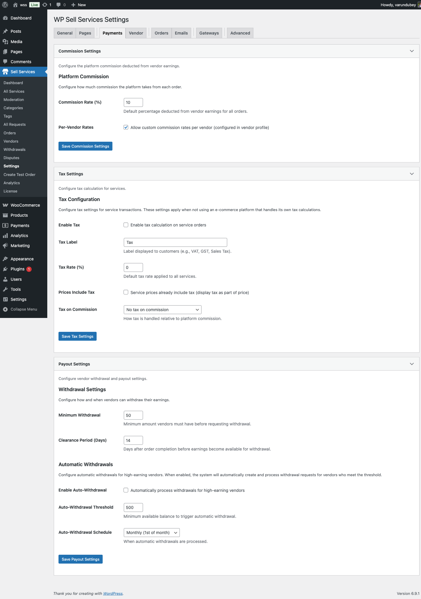

# Payment Settings

Configure commission rates and payment policies that determine how much the platform earns from each transaction.

## Commission Configuration

Control how your marketplace generates revenue through commission on vendor sales.

## Commission Rate

Set the default percentage or flat amount the platform takes from each transaction.

### Commission Type

Choose how commission is calculated:

| Type | Description | Example |
|------|-------------|---------|
| **Percentage** | Take a % of order total | 15% of $100 = $15 commission |
| **Flat Fee** | Fixed amount per order | $5 per order regardless of amount |

### Setting Commission Rate

1. Go to **WP Sell Services → Settings → Commission**
2. Select **Commission Type** (Percentage or Flat)
3. Enter **Commission Rate**:
   - For percentage: Enter number (e.g., "15" for 15%)
   - For flat fee: Enter amount (e.g., "5.00" for $5)
4. Click **Save Changes**

**Common Rates:**
- **Freelance Marketplaces:** 10-20%
- **Digital Products:** 5-15%
- **Premium Services:** 20-30%
- **Flat Fee Models:** $2-10 per order

## Minimum and Maximum Commission

Control commission boundaries to protect both platform and vendors.

### Minimum Commission

Set the lowest commission amount charged, regardless of order value.

**Use Case:** Small orders still generate meaningful revenue.

**Example:**
- Commission rate: 15%
- Minimum commission: $2
- Order of $10 → Would be $1.50, but minimum applies → $2 commission

### Maximum Commission

Cap the commission at a specific amount for large orders.

**Use Case:** Encourage high-value sales without excessive fees.

**Example:**
- Commission rate: 15%
- Maximum commission: $100
- Order of $1,000 → Would be $150, but cap applies → $100 commission

### Configuration

1. Navigate to **Settings → Commission**
2. Enter **Minimum Commission Amount** (optional)
3. Enter **Maximum Commission Amount** (optional)
4. Leave blank for no limit
5. Save changes

## Per-Vendor Commission (Pro)

**[PRO]** Set custom commission rates for individual vendors.

### Why Use Custom Rates

- Reward top-performing vendors with lower rates
- Charge premium rates for new vendors
- Negotiate special terms with high-volume sellers
- Implement tiered vendor programs

### Setting Vendor-Specific Commission

1. Go to **Users → All Users**
2. Click on a vendor username
3. Scroll to **WP Sell Services Commission Settings**
4. Enable **Custom Commission Rate**
5. Select commission type (percentage or flat)
6. Enter custom rate
7. Update user profile

**Vendor Override Example:**

| Vendor | Default Rate | Custom Rate | Reason |
|--------|--------------|-------------|--------|
| John Smith | 15% | 10% | Top seller (1,000+ orders) |
| Jane Doe | 15% | 20% | New vendor (trial period) |
| Expert Corp | 15% | $5 flat | High-volume agreement |

### Priority Order

When multiple rates exist:
1. Vendor-specific rate (if set) **[PRO]**
2. Global commission rate (default)

## Commission Calculation

Understand when and how commission is deducted.

### Calculation Time

Commission is calculated at:
- **Order Creation** - Commission amount is determined when buyer places order
- **Order Completion** - Commission is deducted when vendor marks order as delivered and buyer accepts

### What's Included in Commission Base

Commission applies to:
- ✓ Service base price
- ✓ Package upgrades
- ✓ Add-on purchases
- ✓ Extra revisions charges
- ✗ Buyer tips (vendor keeps 100%)
- ✗ Taxes (if applicable)

### Example Calculation

**Order Details:**
- Service: $100
- Extra Fast Delivery: $20
- Custom Add-on: $30
- Tip: $10
- Commission Rate: 15%

**Calculation:**
- Commission Base: $100 + $20 + $30 = $150
- Commission: $150 × 15% = $22.50
- Vendor Receives: $150 - $22.50 + $10 (tip) = $137.50
- Platform Receives: $22.50

## Vendor Earnings Display

Vendors see commission information transparently in their dashboard.

### Order Details View

Each order displays:
- **Order Total:** Full amount paid by buyer
- **Commission:** Platform fee amount
- **Your Earnings:** Amount vendor receives
- **Status:** Pending, available, or withdrawn

### Earnings Dashboard

Vendors can view:
- Total earnings (lifetime)
- Available balance (completed orders)
- Pending earnings (active orders)
- Commission deducted (per order and total)
- Withdrawal history

**Transparency Note:** Clear commission display builds trust with vendors and reduces disputes.

## Commission Reports

Access detailed commission analytics in the admin area.

### Admin Commission View

1. Go to **WP Sell Services → Reports**
2. View **Commission Analytics** tab
3. See metrics:
   - Total commission earned
   - Commission by time period
   - Top earning services
   - Commission by vendor
   - Average commission per order

### Export Reports

Export commission data for accounting:
- CSV format
- Date range filtering
- Vendor filtering
- Include/exclude taxes

## Refund Handling

When orders are refunded, commission is handled automatically.

### Full Refund

- Buyer receives 100% refund
- Vendor's commission deduction is reversed
- Platform's commission is returned

### Partial Refund

- Commission is recalculated based on new order total
- Difference is adjusted in vendor earnings
- Both parties receive proportional adjustment

See [Order Settings](order-settings.md) for refund policies.

## Payment Gateway Integration

Commission is automatically handled across different payment systems.

### WooCommerce

- Uses WooCommerce's payment gateways
- Commission tracked in plugin's earnings system
- Vendor payouts handled separately

### Pro Payment Gateways

**[PRO]** Direct payment processing with automatic splits:

- **Stripe Connect** - Automatic commission splitting
- **PayPal for Marketplaces** - Direct vendor payments minus commission
- **Razorpay Route** - Instant settlements with commission

See [Payment Gateways](../integrations/payment-gateways.md) for setup.

## Tax Considerations

Commission may have tax implications depending on your location.

### Platform as Merchant of Record

When the platform processes payments:
- Platform collects full payment including commission
- Platform may be responsible for sales tax
- Vendor receives net amount after commission

### Vendor as Merchant

When vendors process payments directly:
- Commission is invoiced to vendor
- Vendor handles their own sales tax
- Platform issues commission invoices

**Consult a tax professional** for your specific situation and jurisdiction.

## Best Practices

### Starting Commission Rates

**New Marketplaces:**
- Start with 10-15% to attract vendors
- Increase gradually as platform grows
- Communicate rate changes 30+ days in advance

**Established Marketplaces:**
- Industry standard: 15-20%
- Premium markets: 20-30%
- Volume discounts: Tiered rates for top sellers **[PRO]**

### Competitive Analysis

Research competitor commission rates:
- Fiverr: 20%
- Upwork: 10-20% sliding scale
- Freelancer: 10%
- Etsy: 6.5% + listing fees

### Communication

Be transparent about commission:
- Display on vendor registration page
- Include in vendor terms of service
- Show in vendor dashboard
- Highlight in order details

## Troubleshooting

### Commission Not Deducting

**Check:**
1. Commission rate is set (not 0%)
2. Order status is "Completed"
3. Order is not marked as "Commission Exempt"
4. No errors in debug log

### Wrong Commission Amount

**Verify:**
1. Correct commission type (percentage vs flat)
2. Minimum/maximum settings
3. Vendor-specific rate not overriding **[PRO]**
4. Order total includes correct items

### Vendor Disputes Commission

**Resolution Steps:**
1. Show commission in vendor terms (agreed on signup)
2. Display commission calculation in order details
3. Review vendor-specific rate if applicable **[PRO]**
4. Adjust manually if platform error occurred

## Related Documentation

- [Vendor Settings](vendor-settings.md) - Registration and approval
- [Order Settings](order-settings.md) - Order policies and refunds
- [Payment Gateways](../integrations/payment-gateways.md) - Payment processing
- [Wallet Systems](../integrations/wallet-systems.md) - Vendor payouts **[PRO]**

## Next Steps

After configuring commission:

1. [Set up vendor registration rules](vendor-settings.md)
2. [Configure order policies](order-settings.md)
3. [Choose payment gateway](../integrations/payment-gateways.md)
4. Test with sample orders to verify calculations
