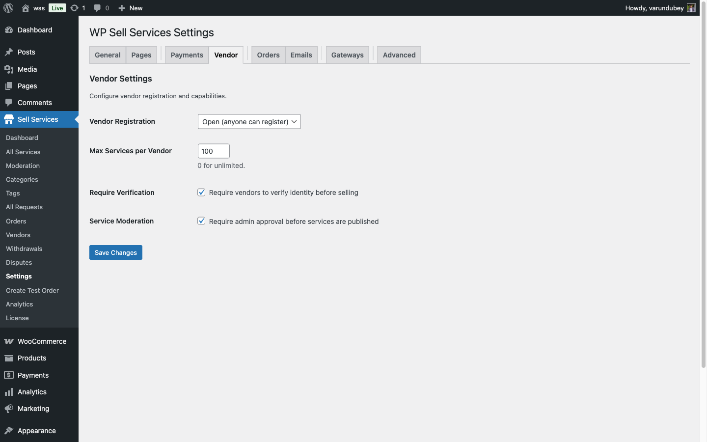
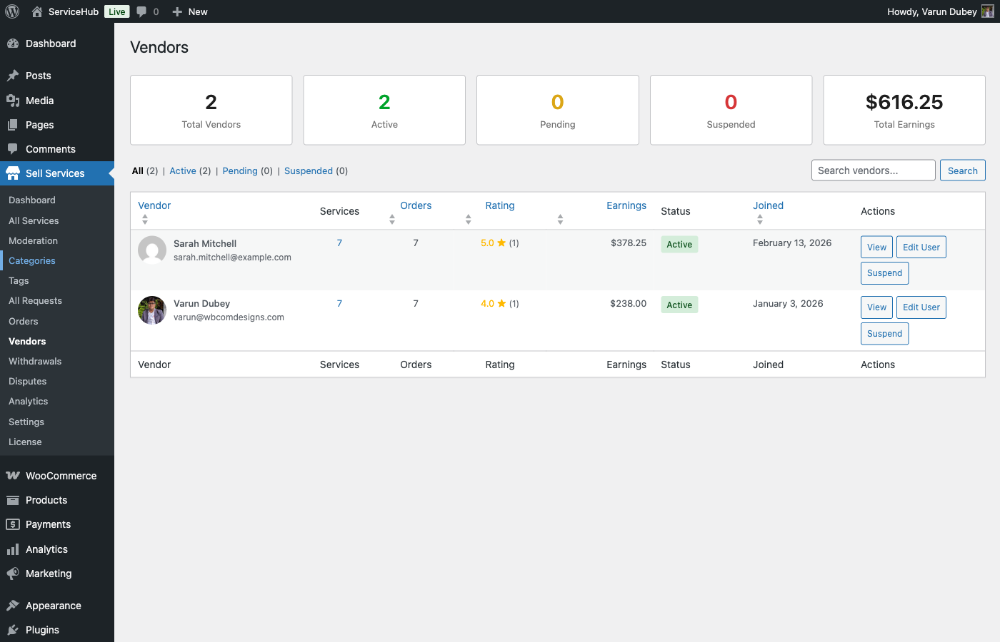

# Vendor Settings

Configure how vendors join your marketplace and what capabilities they have when creating services.

## Vendor Registration

Control who can become a vendor on your marketplace.



## Registration Mode

Choose how new vendors are added to your platform.

### Open Registration

Allow anyone to register as a vendor through the "Become a Vendor" page.

**Best For:**
- Growing marketplaces
- Community-driven platforms
- High-volume service offerings

**Configuration:**
1. Go to **WP Sell Services → Settings → Vendor**
2. Set **Registration Mode** to "Open"
3. Save changes

Users can now visit your "Become a Vendor" page and self-register.

### Closed Registration

Only admins can create vendor accounts manually.

**Best For:**
- Curated marketplaces
- Quality-controlled platforms
- Invite-only communities
- Launch phase (soft opening)

**Configuration:**
1. Set **Registration Mode** to "Closed"
2. Save changes

**Creating Vendors Manually:**
1. Go to **Users → Add New**
2. Create user account
3. Assign **Vendor** role
4. User can now create services

**Note:** The "Become a Vendor" page will show a "Registration is currently closed" message.

## Auto-Approve New Vendors

Determine if new vendor registrations require admin approval.

### Automatic Approval

New vendors can create services immediately after registration.

**Enable:**
1. Navigate to **Settings → Vendor**
2. Check **Auto-Approve New Vendors**
3. Save changes

**Workflow:**
1. User registers as vendor
2. Account is activated instantly
3. Vendor can create services immediately
4. Services follow service moderation rules (see [Advanced Settings](advanced-settings.md))

### Manual Approval

Admin must approve each vendor before they can create services.

**Enable:**
1. Uncheck **Auto-Approve New Vendors**
2. Save changes

**Workflow:**
1. User registers as vendor
2. Account status: "Pending Approval"
3. Admin receives notification
4. Admin reviews and approves/rejects
5. Vendor can create services after approval

**Reviewing Pending Vendors:**
1. Go to **WP Sell Services → Vendors**
2. Filter by **Status: Pending**
3. Review vendor profile
4. Click **Approve** or **Reject**

## Email Verification

Require vendors to verify their email address before activating their account.

### Enable Email Verification

1. Navigate to **Settings → Vendor**
2. Check **Require Email Verification**
3. Save changes

**Verification Process:**
1. Vendor registers
2. System sends verification email
3. Vendor clicks verification link
4. Account is activated (if auto-approve is on) or moves to pending approval
5. Vendor can log in and create services

**Benefits:**
- Reduces spam registrations
- Ensures valid contact information
- Improves email deliverability for order notifications
- Builds vendor database integrity

## Service Limits

Control what vendors can include in their service listings.

### Packages Per Service

Limit how many pricing packages vendors can offer (Basic, Standard, Premium).

**Free Version:**
- Maximum: 3 packages
- Covers most use cases (Basic, Standard, Premium)

**[PRO] Pro Version:**
- Unlimited packages
- Allows complex service tiers

**Configuration:**
1. Go to **Settings → Vendor → Service Limits**
2. Set **Max Packages Per Service**
3. Default: 3 (free), unlimited (Pro)

### Gallery Images

Limit the number of portfolio images vendors can upload to showcase their work.

**Free Version:**
- Maximum: 4 images per service
- Provides basic portfolio display

**[PRO] Pro Version:**
- Unlimited images
- Full gallery capabilities

**Configuration:**
1. Set **Max Gallery Images**
2. Default: 5 (free), unlimited (Pro)

**Image Requirements:**
- Minimum: 800×600 pixels
- Maximum file size: Set in [Advanced Settings](advanced-settings.md)
- Allowed formats: JPG, PNG, GIF

### Videos

Limit embedded videos (YouTube, Vimeo) in service listings.

**Free Version:**
- Maximum: 1 video
- Sufficient for service demonstration

**[PRO] Pro Version:**
- Unlimited videos
- Comprehensive multimedia showcases

**Configuration:**
1. Set **Max Videos Per Service**
2. Default: 1 (free), unlimited (Pro)

**Supported Platforms:**
- YouTube
- Vimeo
- Self-hosted (Pro only)

### FAQs

Limit frequently asked questions vendors can add to services.

**Free Version:**
- Maximum: 5 FAQs
- Covers common questions

**[PRO] Pro Version:**
- Unlimited FAQs
- Detailed Q&A sections

**Configuration:**
1. Set **Max FAQs Per Service**
2. Default: 5 (free), unlimited (Pro)

### Add-ons

Limit optional extras vendors can offer (e.g., "Express Delivery," "Source Files").

**Free Version:**
- Maximum: 3 add-ons
- Basic upsell options

**[PRO] Pro Version:**
- Unlimited add-ons
- Complex service customization

**Configuration:**
1. Set **Max Add-ons Per Service**
2. Default: 3 (free), unlimited (Pro)

**Add-on Features:**
- Custom pricing per add-on
- Delivery time adjustments
- Optional or required flags

## Service Limits Summary Table

| Feature | Free | Pro |
|---------|------|-----|
| Packages | 3 | Unlimited |
| Gallery Images | 5 | Unlimited |
| Videos | 1 | Unlimited |
| FAQs | 5 | Unlimited |
| Add-ons | 3 | Unlimited |

## Vendor Capabilities

Define what vendors can and cannot do on your platform.

### Service Management

**Vendors Can:**
- Create new services
- Edit their own services
- Pause/unpause services
- Delete their own services (if no active orders)
- View service analytics

**Vendors Cannot:**
- Edit other vendors' services
- Access admin settings
- Modify commission rates
- Delete services with active orders

### Order Management

**Vendors Can:**
- View their orders
- Accept/reject orders (if enabled)
- Request requirement clarification
- Upload deliveries
- Approve/reject revisions
- Message buyers
- Request order extensions

**Vendors Cannot:**
- Cancel completed orders
- Modify order prices after purchase
- Access other vendors' orders
- Issue refunds directly (must request admin approval)

### Financial Access

**Vendors Can:**
- View their earnings
- See commission deductions
- Request withdrawals **[PRO]**
- View transaction history
- Download earning reports

**Vendors Cannot:**
- Change commission rates
- Access platform revenue data
- View other vendors' earnings
- Modify completed transaction amounts

## Vendor Verification

Add trust signals to vendor profiles.

### Verification Badges

**[PRO]** Enable vendor verification badges:

1. Navigate to **Settings → Vendor → Verification**
2. Enable **Vendor Verification System**
3. Choose verification methods:
   - Email verified (automatic)
   - Phone verified
   - Identity verified (manual)
   - Business verified (manual)

**Badge Display:**
- Vendor profile page
- Service listings
- Search results
- Order pages

### Verification Process

**Email Verification:**
- Automatic via registration
- Badge awarded immediately

**Phone Verification:** **[PRO]**
- Vendor submits phone number
- SMS verification code sent
- Badge awarded on confirmation

**Identity Verification:** **[PRO]**
- Vendor uploads ID document
- Admin reviews and approves
- Badge awarded manually

**Business Verification:** **[PRO]**
- Vendor submits business documents
- Admin verifies legitimacy
- Premium badge for B2B vendors

## Vendor Dashboard Access

Control what vendors see in their dashboard.

### Dashboard Sections

Enable/disable dashboard sections:

- ☑ Services management
- ☑ Order management
- ☑ Earnings & analytics
- ☑ Buyer requests (respond to requests)
- ☑ Messages
- ☑ Profile settings
- ☐ Advanced analytics **[PRO]**
- ☐ Marketing tools **[PRO]**

**Configuration:**
1. Go to **Settings → Vendor → Dashboard**
2. Check sections to enable
3. Save changes

## Onboarding New Vendors

Create a smooth onboarding experience.

### Welcome Email

Customize the vendor welcome email:

1. Go to **Settings → Emails → Vendor Welcome**
2. Customize subject and message
3. Include helpful links:
   - Creating first service guide
   - Dashboard tour
   - Best practices
   - Support contact

### Onboarding Checklist

**[PRO]** Show vendors a checklist on first login:

- ☐ Complete profile
- ☐ Add profile picture
- ☐ Create first service
- ☐ Set up payment method
- ☐ Read vendor guidelines

Track completion in vendor profile.

## Vendor Tiers (Pro)

**[PRO]** Implement tiered vendor levels with different capabilities.

### Tier Configuration

1. Go to **Settings → Vendor → Tiers** **[PRO]**
2. Create tiers (e.g., Bronze, Silver, Gold)
3. Set criteria for each tier:
   - Minimum orders completed
   - Minimum rating
   - Time as vendor
4. Assign tier benefits:
   - Lower commission rates
   - Higher service limits
   - Priority support
   - Featured placement

**Example Tiers:**

| Tier | Requirements | Benefits |
|------|--------------|----------|
| Bronze | 0-10 orders | 20% commission, 3 add-ons |
| Silver | 11-50 orders, 4.5+ rating | 15% commission, 10 add-ons |
| Gold | 51+ orders, 4.8+ rating | 10% commission, unlimited add-ons |

## Admin Vendor Management

Control and oversee all vendors on your marketplace from a central admin dashboard.

### Accessing the Vendors Dashboard

Navigate to **WP Sell Services → Vendors** in your admin panel.



The dashboard shows at-a-glance statistics:

| Stat | Description |
|------|-------------|
| **Total Vendors** | All registered vendors |
| **Active** | Vendors approved and active |
| **Pending** | Awaiting approval |
| **Suspended** | Suspended vendor accounts |
| **Average Rating** | Overall vendor rating |
| **Total Earnings** | All-time vendor earnings |

### Viewing Vendor List

The vendor list displays all vendors with key information:

**Columns Shown:**
- Vendor name and email
- Status badge (Active, Pending, Suspended)
- Total services published
- Total orders completed
- Average rating
- Total earnings
- Date registered
- Quick actions

**Search and Filter:**

1. **Search vendors** - Type vendor name or email in search box
2. **Filter by status** - Click status tabs (All, Active, Pending, Suspended)
3. **Sort by column** - Click column headers to sort
4. **Pagination** - Navigate through pages (20 vendors per page)

### Viewing Vendor Details

Click any vendor name or **View** to see their complete profile:

1. **Profile Information:**
   - Display name, email, registration date
   - Profile picture and bio
   - Contact information
   - Verification status

2. **Performance Metrics:**
   - Total orders (all-time and last 30 days)
   - Completion rate
   - Average delivery time
   - Average rating
   - Total earnings
   - Commission paid

3. **Services Tab:**
   - All published services
   - Draft services
   - Service performance
   - Quick edit/view links

4. **Orders Tab:**
   - Active orders
   - Completed orders
   - Order history
   - Revenue per order

5. **Earnings Tab:**
   - Available balance
   - Pending earnings
   - Withdrawal history
   - Custom commission rate (if set)

6. **Reviews Tab:**
   - All reviews received
   - Rating breakdown
   - Review responses

### Changing Vendor Status

Control vendor account access with status management.

**Available Statuses:**

| Status | Vendor Can | Use When |
|--------|-----------|----------|
| **Active** | Create services, receive orders | Approved, trusted vendors |
| **Pending** | Login only, no services | New registrations awaiting approval |
| **Suspended** | Login, view orders only | Policy violations, quality issues |

**How to Change Status:**

1. Go to vendor list or vendor detail page
2. Click **Change Status** dropdown
3. Select new status
4. (Optional) Add reason for change
5. Click **Update Status**
6. Vendor receives email notification

**What Happens When You Suspend:**
- Vendor services hidden from marketplace
- Active orders continue (vendor can fulfill)
- No new orders accepted
- Vendor notified with reason
- Can be reactivated later

**What Happens When You Approve:**
- Pending vendor becomes active
- Can create and publish services
- Receives approval confirmation email
- Profile appears in vendor directory

### Setting Custom Commission Rates

Override global commission for individual vendors.

**When to Use Custom Rates:**
- Negotiated rates for high-volume vendors
- Promotional rates for new vendors
- Reward top performers with lower rates
- Different rates by vendor tier

**How to Set Custom Rate:**

1. Open vendor details page
2. Go to **Earnings** tab
3. Click **Edit Commission Rate**
4. Choose commission type:
   - **Percentage** - Enter % (e.g., 15%)
   - **Flat Fee** - Enter fixed amount per order
   - **Hybrid** - Both percentage + flat fee
5. (Optional) Set expiration date
6. Click **Save Changes**

**Example:**
```
Global Rate: 20% commission
Custom Rate for VendorA: 12% commission

VendorA Order: $100
Commission: $12 (instead of $20)
VendorA Earnings: $88 (instead of $80)
```

**View All Custom Rates:**
- Sort vendor list by "Custom Rate" column
- Filter to show only vendors with custom rates
- Export list for reporting

### Bulk Actions

Perform actions on multiple vendors at once.

**Available Bulk Actions:**

1. **Approve Multiple Vendors:**
   - Select pending vendors
   - Choose "Approve" from bulk actions
   - Click Apply
   - All selected vendors activated

2. **Suspend Multiple Vendors:**
   - Select vendors
   - Choose "Suspend"
   - Enter reason (applies to all)
   - Click Apply

3. **Export Vendor Data:**
   - Select vendors (or select all)
   - Choose "Export to CSV"
   - Download spreadsheet with vendor details

4. **Send Email to Vendors:**
   - Select vendors
   - Choose "Send Email"
   - Compose message
   - Send to all selected vendors

### Contacting Vendors

Communicate directly with vendors from the admin panel.

**From Vendor List:**
1. Hover over vendor row
2. Click **Email** quick action
3. Compose message
4. Send

**From Vendor Detail Page:**
1. Click **Contact Vendor** button
2. Choose method:
   - Email (opens your email client)
   - Internal message
   - Phone call (displays phone if provided)

**Email Templates:**
You can use email templates for common scenarios:
- Approval notification
- Suspension notice
- Commission rate update
- General announcements
- Policy reminders

### Monitoring Vendor Activity

Track vendor actions and performance.

**Activity Log (Per Vendor):**
- Service published/updated
- Orders received
- Orders completed
- Withdrawals requested
- Status changes
- Profile updates

**Performance Alerts:**
Set up automatic notifications for:
- Late deliveries
- Low ratings (below threshold)
- High cancellation rate
- Sudden earnings spike/drop
- New vendor milestones

**Vendor Leaderboard:**
View top vendors by:
- Total orders this month
- Total revenue this month
- Highest ratings
- Fastest delivery times
- Most repeat buyers

## Troubleshooting

### Vendors Can't Register

**Check:**
1. Registration mode is "Open"
2. "Become a Vendor" page exists and contains `[wpss_register]`
3. No email delivery issues (check spam folder)
4. PHP mail function working (test with WP Mail Test plugin)

### New Vendors Can't Create Services

**Verify:**
1. Auto-approve is enabled, or admin has approved vendor
2. Email verification completed (if required)
3. Vendor role assigned correctly
4. No service limit restrictions preventing creation

### Service Limits Not Enforcing

**Confirm:**
1. Limits are set in Settings → Vendor
2. Settings saved successfully
3. Cache cleared
4. Test with fresh service creation
5. Check for conflicting plugins

## Related Documentation

- [General Settings](general-settings.md) - Platform configuration
- [Payment Settings](payment-settings.md) - Commission setup
- [Order Settings](order-settings.md) - Order policies
- [Advanced Settings](advanced-settings.md) - Service moderation

## Next Steps

After configuring vendor settings:

1. [Set up order policies](order-settings.md)
2. [Configure email notifications](email-notifications.md)
3. Create vendor documentation/guidelines
4. Test vendor registration flow
5. Monitor first vendor submissions
