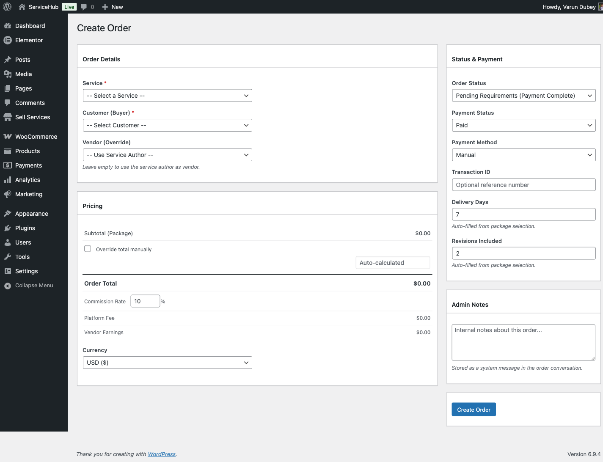

# Creating Orders Manually

Sometimes orders happen outside the normal checkout flow -- a phone call, a special arrangement, or a migration from another system. The manual order tool lets you create orders directly from the admin panel.

## When to Use Manual Orders

- **Phone orders** -- a buyer calls and wants to place an order
- **Offline payments** -- you received a bank transfer or cash payment
- **Special pricing** -- a negotiated deal that does not fit standard packages
- **Data migration** -- importing orders from a previous system
- **VIP arrangements** -- custom terms for specific buyers

Manual orders work exactly like regular orders once created. Vendors and buyers can track them, message each other, and complete delivery through the normal workflow.

## How to Create a Manual Order

Go to **WP Sell Services > Orders** and click **Create Order**. The form walks you through each step:

### 1. Pick the Service and Package

Select a published service from the dropdown. It shows the service title, vendor name, and starting price. After selecting a service, choose a package (Basic, Standard, or Premium). The price, delivery time, and revisions auto-fill from the package details.

If the service has add-ons, they appear automatically. Check the ones you want to include -- prices update in real time.

### 2. Select Buyer and Vendor

**Buyer (required):** Choose any registered user as the buyer.

**Vendor (optional):** Defaults to the service author. You can override this to assign the order to a different vendor if needed. The buyer and vendor cannot be the same person.

### 3. Review and Adjust Pricing

The pricing summary shows:

- **Subtotal** -- base package price
- **Add-ons total** -- sum of selected add-ons
- **Order total** -- subtotal plus add-ons
- **Commission** -- platform fee based on your commission rate
- **Vendor earnings** -- what the vendor receives after commission

**Need custom pricing?** Check "Override total manually" to enter a specific amount. You can also adjust the commission rate for this particular order.

### 4. Set Status and Payment Details

**Order status options:**

| Status | When to Use |
|--------|------------|
| Pending Payment | Payment has not been received yet |
| Pending Requirements | Payment received, waiting for buyer to submit requirements |
| In Progress | Skip requirements, vendor starts right away |
| Delivered | Order with delivery already submitted |
| Completed | Historical order that is already finished |

If you select "Pending Requirements" but the service has no requirements, the order automatically moves to "In Progress" instead.

**Payment details:**

- **Payment status:** Pending, Paid, Failed, or Refunded
- **Payment method:** Manual (default), Bank Transfer, Cash, or Other
- **Transaction ID:** Optional reference number from the external payment

**Delivery settings:**

- **Delivery days:** auto-filled from the package, but you can adjust
- **Revisions included:** auto-filled from the package, adjustable

### 5. Add Admin Notes

Add any internal notes about the order. These are only visible to admins, not to buyers or vendors. Good for recording context like "Phone order from client on April 1" or "Custom pricing approved by management."

### 6. Submit

Click **Create Order**. The system generates an order number, creates the order record, and sets up the conversation thread between buyer and vendor.

After creation, you see:
- The order number and a link to view it
- A **Submit Requirements** button (if the service has requirements and the order is in "Pending Requirements" status)
- A **Create Another Order** button to start a new one

## What Happens After Creation

The order follows the same workflow as any checkout-created order:

- If status is **Pending Requirements**, the buyer (or you) fills in requirements, then the vendor starts work
- If status is **In Progress**, the vendor is notified and the delivery deadline starts
- If status is **Completed**, no further action is needed

## Things to Keep in Mind

- Manual orders are created one at a time (no bulk creation)
- You cannot edit an order after creation from this page -- use the order detail page for changes
- Buyer notifications are not sent automatically for manual orders -- let the buyer know directly if needed
- If the calculated total is zero or negative, it defaults to $10.00 as a minimum

## Related Docs

- [Service Moderation](service-moderation.md) -- Reviewing vendor services
- [Vendor Management](vendor-management.md) -- Managing vendor accounts
- [Withdrawal Approvals](withdrawal-approvals.md) -- Processing vendor payouts
- [Commission System](../earnings-wallet/commission-system.md) -- How platform fees work
