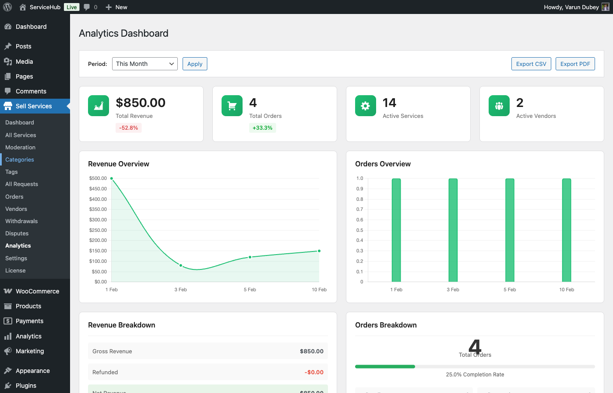

# Admin Analytics Dashboard

**[PRO]** The Admin Analytics Dashboard provides platform-wide insights for marketplace administrators. Monitor revenue, track vendor performance, analyze user growth, and identify trends across your entire marketplace.

## Overview

The admin analytics dashboard displays comprehensive metrics for:

- Platform revenue and commission earnings
- Top-performing vendors and services
- Order volume and status distribution
- User acquisition and growth
- Dispute rates and marketplace health
- Category performance analysis



## Accessing Admin Analytics

1. Log in as an administrator
2. Go to **WordPress Admin → WP Sell Services → Analytics**
3. Select time period from the filter toolbar
4. View metrics across different sections

## Platform Revenue Overview

### Revenue Metrics

Track your marketplace's financial performance:

| Metric | Description |
|--------|-------------|
| Gross Revenue | Total sales before commissions |
| Platform Commission | Your earnings from sales |
| Vendor Payouts | Amount paid to vendors |
| Pending Clearance | Revenue in active orders |
| Total Withdrawals | Amount withdrawn by vendors |
| Pending Withdrawals | Withdrawal requests awaiting approval |

### Revenue Trends

Visual charts display:
- **Daily revenue**: Daily sales and commission trends
- **Monthly revenue**: Month-by-month performance
- **Quarterly revenue**: Seasonal analysis
- **Year-over-year**: Annual growth comparison

### Revenue by Category

See which service categories generate the most revenue:

| Category | Orders | Revenue | Commission | Avg Order Value |
|----------|--------|---------|------------|-----------------|
| Web Development | 234 | $45,680 | $9,136 | $195.20 |
| Graphic Design | 456 | $34,200 | $6,840 | $75.00 |
| Writing & Translation | 189 | $18,900 | $3,780 | $100.00 |

### Payment Method Distribution

Track payment preferences:
- WooCommerce (built-in)
- **[PRO]** Stripe Direct
- **[PRO]** PayPal Direct
- **[PRO]** Razorpay
- **[PRO]** Easy Digital Downloads
- **[PRO]** FluentCRM Cart
- **[PRO]** SureCart

## Top Vendors

### Vendor Performance Rankings

Identify your marketplace's star performers:

**By Revenue (This Month):**

| Rank | Vendor | Orders | Revenue | Rating | Response Time |
|------|--------|--------|---------|--------|---------------|
| 1 | John Doe | 67 | $8,450 | 4.9 | 1.2 hrs |
| 2 | Jane Smith | 54 | $6,750 | 5.0 | 0.8 hrs |
| 3 | Mike Johnson | 48 | $5,920 | 4.8 | 2.1 hrs |

**By Order Volume:**
- Most orders completed
- Highest completion rate
- Fastest delivery times
- Repeat customer rate

**By Rating:**
- Highest average rating (min. 10 reviews)
- Most 5-star reviews
- Best response rate
- Lowest dispute rate

### Vendor Growth Tracking

Monitor vendor base expansion:
- New vendors this period
- Active vendors (with at least 1 order)
- Inactive vendors (no orders in 30 days)
- Vendors in vacation mode
- Average services per vendor

### Vendor Tier Distribution

See vendor levels across your platform:
- New Seller (0-10 orders)
- Level 1 (11-50 orders, 4.5+ rating)
- Level 2 (51-100 orders, 4.7+ rating)
- Top Rated (100+ orders, 4.9+ rating)

## Top Services

### Best-Selling Services

Identify which services drive your marketplace:

| Service | Vendor | Orders | Revenue | Views | Conversion |
|---------|--------|--------|---------|-------|------------|
| WordPress Website | John Doe | 45 | $4,500 | 1,234 | 3.6% |
| Logo Design | Jane Smith | 38 | $2,850 | 987 | 3.8% |
| SEO Audit | Mike Johnson | 32 | $3,200 | 756 | 4.2% |

### Service Performance Metrics

Analyze service-level data:
- Most viewed services
- Highest conversion rates
- Trending services (fastest growth)
- Underperforming services
- Average delivery time by service type

### New Service Approvals

Track the moderation queue:
- Services pending approval
- Services approved this week
- Services rejected this week
- Average approval time
- Rejection reasons breakdown

## Order Status Breakdown

### Order Overview

Monitor order flow across your platform:

**Total Orders (This Month): 879**

Status distribution:
- Pending Acceptance: 23 (2.6%)
- In Progress: 156 (17.7%)
- Delivered (Awaiting Acceptance): 34 (3.9%)
- In Revision: 12 (1.4%)
- Completed: 632 (71.9%)
- Cancelled: 18 (2.0%)
- Disputed: 4 (0.5%)

### Order Lifecycle Metrics

Track average times for order stages:

| Stage | Average Time | Benchmark |
|-------|--------------|-----------|
| Acceptance | 3.2 hours | < 24 hours |
| Delivery | 4.8 days | Varies by service |
| Buyer Review | 1.2 days | < 3 days |
| Total Completion | 6.5 days | Service dependent |

### Order Value Analysis

Understand order economics:
- Average order value across platform
- Order value by category
- Order value by vendor tier
- Package tier distribution (Basic/Standard/Premium)

## Commission Earnings Tracking

### Commission Overview

Monitor your platform's earnings:

**This Month:**
- Commission earned: $12,450
- Commission rate applied: 20%
- Number of transactions: 879
- Average commission per order: $14.16

### Commission by Vendor

See commission distribution:
- Top 10 vendors by commission generated
- Commission trends by vendor tier
- New vendor commission (first 30 days)
- Bulk commission adjustments applied

### Commission Settings Impact

Analyze custom commission rates:
- Vendors with custom rates
- Category-specific commission rates
- Volume-based commission tiers
- Commission revenue forecast

## User Growth Metrics

### Buyer Statistics

Track customer acquisition:

**This Month:**
- New buyers registered: 234
- Buyers who made a purchase: 187 (80% conversion)
- Repeat buyers: 456
- Average orders per buyer: 2.3
- Buyer retention rate: 68%

### Vendor Statistics

Monitor vendor onboarding:

**This Month:**
- New vendor registrations: 45
- Vendors who created a service: 38 (84%)
- Vendors who made first sale: 21 (47%)
- Average time to first sale: 8 days
- Vendor churn rate: 5%

### User Activity Trends

Weekly and monthly trends:
- New registrations (buyers and vendors)
- Active users (logged in this week)
- Daily active users (DAU)
- Monthly active users (MAU)
- DAU/MAU ratio (engagement metric)

## Dispute Rate Monitoring

### Dispute Overview

Track marketplace health through dispute metrics:

| Metric | Value | Trend |
|--------|-------|-------|
| Total Disputes (This Month) | 4 | ↓ -25% |
| Dispute Rate | 0.5% | ↓ -0.2% |
| Average Resolution Time | 3.2 days | ↑ +0.4 |
| Disputes Resolved | 3 | - |
| Disputes Escalated | 1 | - |

### Dispute Reasons

Understand common dispute causes:
- Service not as described: 40%
- Late delivery: 30%
- Poor quality work: 20%
- Communication issues: 10%

### Vendor Dispute Rates

Identify problematic vendors:
- Vendors with multiple disputes
- Vendors with high dispute rates
- Repeat offenders needing review
- Vendors recently restricted

### Resolution Performance

Monitor admin response effectiveness:
- Average time to first response
- Admin resolution rate (vs refund rate)
- Buyer satisfaction after resolution
- Vendor satisfaction after resolution

## Category Performance

### Category Statistics

Analyze performance by service category:

| Category | Services | Vendors | Orders | Revenue | Avg Order | Growth |
|----------|----------|---------|--------|---------|-----------|--------|
| Web Development | 145 | 78 | 234 | $45,680 | $195 | +15% |
| Graphic Design | 289 | 156 | 456 | $34,200 | $75 | +8% |
| Writing | 198 | 102 | 189 | $18,900 | $100 | +12% |
| Marketing | 134 | 67 | 156 | $31,200 | $200 | +22% |

### Category Trends

Identify growing and declining categories:
- Fastest-growing categories (by orders)
- Declining categories (intervention needed)
- Emerging categories (new opportunities)
- Saturated categories (high competition)

### Category Health Metrics

Monitor category vitality:
- Active services in category
- New services added this month
- Average vendor response time
- Category average rating
- Buyer request activity

## Time Period Filters

### Available Date Ranges

Filter all analytics by:

**Preset Ranges:**
- Last 7 days
- Last 30 days
- Last 90 days
- This month
- Last month
- This quarter
- Last quarter
- This year
- Last year
- All time

**Custom Range:**
1. Click **Custom** in the date filter
2. Select start and end dates
3. Click **Apply**
4. All metrics update to selected period

### Period Comparison

Compare periods side-by-side:
- This month vs last month
- This quarter vs last quarter
- This year vs last year
- Custom period A vs custom period B

**Example Comparison:**
```
This Month vs Last Month:
Revenue: $42,500 vs $38,200 (+11.3%)
Orders: 879 vs 756 (+16.3%)
New Vendors: 45 vs 38 (+18.4%)
Dispute Rate: 0.5% vs 0.7% (-28.6%)
```

## Dashboard Widgets

Customize your analytics view:

1. Go to **Analytics → Dashboard Settings**
2. Enable/disable widgets:
   - Revenue Overview
   - Top Vendors
   - Top Services
   - Order Status
   - User Growth
   - Recent Disputes
   - Category Performance
   - Withdrawal Requests
3. Drag widgets to reorder
4. Click **Save Layout**

## Automated Reports

**[PRO]** Schedule recurring reports:

1. Go to **Analytics → Scheduled Reports**
2. Click **Create Report Schedule**
3. Configure:
   - **Report Type**: Platform Overview, Revenue, Vendors, etc.
   - **Frequency**: Daily, Weekly, Monthly
   - **Recipients**: Admin email addresses
   - **Format**: PDF or CSV attachment
4. Click **Save Schedule**

Reports are emailed automatically at the specified interval.

## Real-Time Monitoring

### Live Metrics Dashboard

Monitor current activity:
- Orders placed today
- Revenue today (updating live)
- Active users right now
- Services published today
- Withdrawal requests pending

### Alerts and Notifications

Set up alerts for critical events:
- Revenue milestone reached
- Dispute opened
- High-value order placed
- Vendor tier upgrade
- New vendor approved

Configure in **Analytics → Alert Settings**.

## Exporting Analytics Data

**[PRO]** Export comprehensive reports:

1. Navigate to any analytics section
2. Click **Export Data**
3. Select export format:
   - **CSV**: Raw data for analysis
   - **PDF**: Formatted report with charts
4. Choose data to include:
   - Summary metrics
   - Detailed breakdowns
   - Charts and graphs
5. Select date range
6. Click **Generate Export**

See [Data Export Guide](data-export.md) for complete export options.

## Performance Benchmarks

Compare your marketplace to industry standards:

| Metric | Your Platform | Industry Average |
|--------|---------------|------------------|
| Order Completion Rate | 92% | 85% |
| Dispute Rate | 0.5% | 1.2% |
| Vendor Response Time | 2.3 hrs | 4.5 hrs |
| Buyer Conversion Rate | 3.8% | 2.9% |
| Repeat Buyer Rate | 68% | 55% |

## Using Analytics for Growth

### Identify Opportunities

Use data to find growth areas:
- Underserved categories (few services, high demand)
- High-demand services (recruit specialist vendors)
- Geographic gaps (target marketing campaigns)
- Pricing opportunities (categories with price flexibility)

### Optimize Operations

Improve efficiency using metrics:
- Reduce dispute rates through vendor training
- Speed up order acceptance with nudges
- Improve approval times with more moderators
- Enhance buyer experience based on feedback

### Vendor Retention

Use data to keep top vendors:
- Reward high performers with bonuses
- Provide growth insights to active vendors
- Re-engage inactive vendors
- Offer tier upgrades and incentives

## Related Documentation

- [Vendor Analytics](vendor-analytics.md) - Vendor-specific analytics dashboard
- [Data Export](data-export.md) - Exporting reports and data
- [Commission Management](../settings/commission-settings.md) - Configure commission rates
- [User Management](../settings/user-role-settings.md) - Managing users and roles
