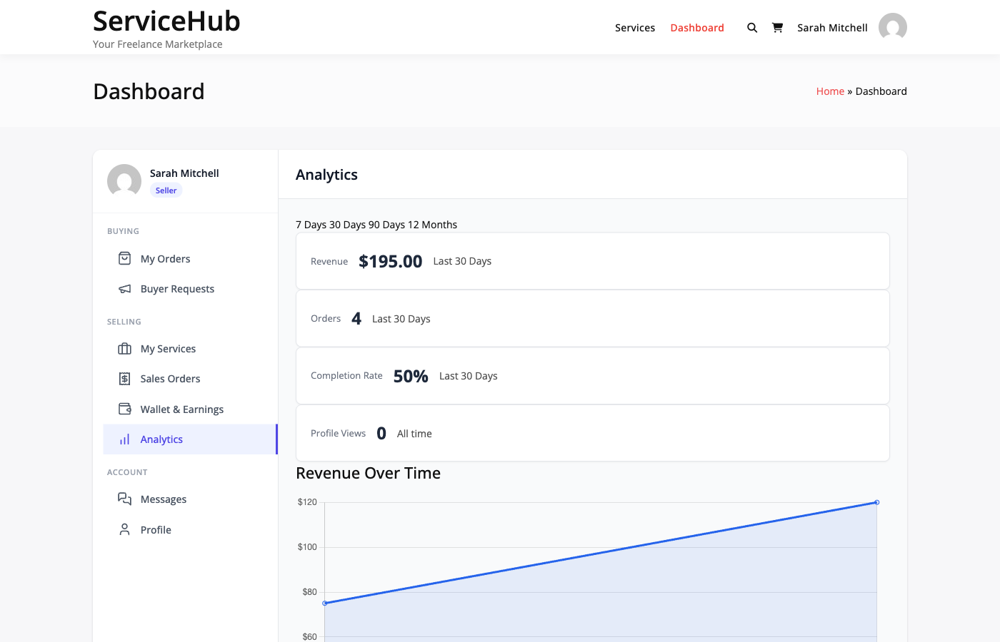

# Vendor Analytics Dashboard

The Vendor Analytics Dashboard gives sellers insights into their performance, earnings, and service statistics. Track your marketplace success with real-time data about orders, revenue, and customer engagement.

## Overview

Analytics are available to all vendors and provide data about:

- Revenue and earnings trends
- Order performance metrics
- Service views and conversions
- Review statistics and ratings
- Response time tracking

## Accessing Analytics

1. Log in as a vendor
2. Go to **Vendor Dashboard → Analytics**
3. Select time period using date filter
4. View metrics across dashboard



## Revenue Tracking

### Earnings Overview

View your earnings over different time periods:

**Available Periods:**
- Day
- Week
- Month
- Year
- All time

### Revenue Data

For selected period, see:

| Metric | Description |
|--------|-------------|
| Order Count | Total orders received |
| Total Revenue | Gross sales (before commission) |
| Total Earnings | Your net earnings (after commission) |
| Total Fees | Platform commission paid |

### Earnings Chart

**Available Charts:**
- Week view: Daily breakdown
- Month view: Daily breakdown
- Year view: Monthly breakdown

**Chart Data:**
- X-axis: Time period labels
- Y-axis: Earnings amount
- Line graph: Earnings trend
- Bar graph: Order count per period

## Order Metrics

### Performance Statistics

Track order activity:

**Dashboard Stats:**
- Total orders (all time or period)
- Completed orders
- Active orders (in progress)
- Response rate percentage
- Active service count

### Order Calculation

Data comes from `get_vendor_dashboard_stats()`:

```php
[
    'orders' => [
        // From OrderRepository->get_vendor_stats()
        'total' => 150,
        'completed' => 120,
        'in_progress' => 10,
        'cancelled' => 5,
    ],
    'reviews' => [
        // From ReviewRepository->get_vendor_rating_summary()
        'average_rating' => 4.8,
        'total_reviews' => 95,
    ],
    'active_services' => 12,
    'response_rate' => 94.5,
    'recent_activity' => [...],
]
```

## Service Performance

### View Tracking

Service views are tracked in post meta:

```php
$views = get_post_meta( $service_id, '_wpss_views', true );
```

Each service displays:
- Total views (all time)
- Orders received
- Conversion rate (orders / views × 100)
- Revenue generated

### Top Services

The `get_vendor_stats()` method returns top 5 services by revenue:

```php
[
    'top_services' => [
        [
            'id' => 123,
            'title' => 'WordPress Development',
            'views' => 1234,
            'orders' => 45,
            'revenue' => 4500.00,
        ],
        // ... up to 5 services
    ]
]
```

Sorted by revenue descending.

## Analytics Metrics Explained

### Profile Views

Tracked in user meta:

```php
$profile_views = get_user_meta( $vendor_id, '_wpss_profile_views', true );
```

Incremented when buyers visit vendor profile page.

### Impressions

Total views across all published services:

```php
$impressions = 0;
foreach ( $services as $service_id ) {
    $impressions += (int) get_post_meta( $service_id, '_wpss_views', true );
}
```

### Clicks

**Note:** Clicks are not directly tracked. The analytics service estimates:

```php
// Estimate: 3 clicks per order
$clicks = $orders_received * 3;
```

For accurate click tracking, implement JavaScript event tracking.

### Click Rate

```php
$click_rate = $impressions > 0 ? ($clicks / $impressions) * 100 : 0;
```

Rounded to 1 decimal place.

### Conversion Rate

```php
$conversion_rate = $clicks > 0 ? ($orders_received / $clicks) * 100 : 0;
```

Rounded to 1 decimal place.

## Response Rate Calculation

Response rate shows how often you respond to customer messages:

**Calculation:**

1. Get conversations where vendor received messages
2. Get conversations where vendor sent messages
3. Calculate: (conversations_responded / total_conversations) × 100

**Default:** 100% if no messages received.

From `get_response_rate()` private method:

```php
// Counts distinct conversations where:
// - Customer sent message (sender_id != vendor_id)
// - Vendor responded (sender_id = vendor_id)
$response_rate = (responded / total) * 100;
```

## Recent Activity

Shows combined timeline of recent:
- Orders received
- Reviews received

**Limit:** 10 most recent items by default.

Returns mix of order and review objects with:
- Type ('order' or 'review')
- ID
- Status or rating
- Timestamp

Sorted by `created_at` descending.

## Time Period Filters

### Period Start Dates

Available period options:

```php
match ( $period ) {
    'day'   => Today 00:00:00
    'week'  => 7 days ago
    'month' => 30 days ago
    'year'  => 365 days ago
    default => All time (no filter)
}
```

### Chart Grouping

Data grouped differently per period:

**Week/Month:** Daily grouping (DATE)
**Year:** Monthly grouping (MONTH)

### Chart Date Format

Labels formatted as:

**Week/Month:** "Feb 12"
**Year:** "Feb 2026"

## Data Export

Export earnings data for accounting:

**Export Formats:**
- CSV (spreadsheet compatible)
- PDF (formatted report) **[PRO]**

**Export Includes:**
- Order ID and date
- Service name
- Order amount
- Commission rate and amount
- Net earnings
- Payment status

See [Data Export Guide](data-export.md) for details.

## Limitations of Free Version

The free version provides basic analytics:

**Available:**
- Revenue totals by period
- Order counts and stats
- Service views (if tracked)
- Top 5 services
- Response rate
- Recent activity

**Not Available (Pro Only):**
- Advanced filtering
- Custom date ranges
- Detailed trend analysis
- Comparison charts
- Automated reports
- Export scheduling
- Real-time dashboards

## Performance Considerations

### Caching Recommendations

Analytics queries can be intensive. Consider caching:

```php
$cache_key = 'wpss_vendor_stats_' . $vendor_id . '_30days';
$stats = get_transient( $cache_key );

if ( false === $stats ) {
    $stats = $analytics_service->get_vendor_stats( $vendor_id, 30 );
    set_transient( $cache_key, $stats, HOUR_IN_SECONDS );
}
```

Clear cache on order completion:

```php
add_action( 'wpss_order_completed', function( $order_id ) {
    $order = get_order( $order_id );
    delete_transient( 'wpss_vendor_stats_' . $order->vendor_id . '_30days' );
} );
```

### Large Service Portfolios

The `get_vendor_stats()` method limits to 100 services:

```php
'posts_per_page' => 100,
```

If you have more than 100 services, only the first 100 are analyzed.

## WordPress Hooks

### Tracking Service Views

Views must be tracked manually. Example implementation:

```php
add_action( 'template_redirect', function() {
    if ( is_singular( 'wpss_service' ) && ! is_admin() ) {
        $service_id = get_the_ID();
        $views = (int) get_post_meta( $service_id, '_wpss_views', true );
        update_post_meta( $service_id, '_wpss_views', $views + 1 );
    }
} );
```

### Tracking Profile Views

Profile views must also be tracked:

```php
add_action( 'wpss_vendor_profile_viewed', function( $vendor_id ) {
    $views = (int) get_user_meta( $vendor_id, '_wpss_profile_views', true );
    update_user_meta( $vendor_id, '_wpss_profile_views', $views + 1 );
} );
```

## Related Documentation

- [Admin Analytics](admin-analytics.md) - Platform-wide analytics
- [Data Export](data-export.md) - Exporting reports
- [Earnings & Withdrawals](../earnings-wallet/vendor-earnings.md) - Managing earnings
- [Vendor Dashboard](../vendor-system/vendor-dashboard.md) - Dashboard overview

---

**Key Points:**
- Basic analytics included in free version
- Revenue and order data from database queries
- Views/clicks require manual tracking implementation
- Top services limited to 5, total services limited to 100
- Response rate calculated from conversation messages
- Consider caching for performance
