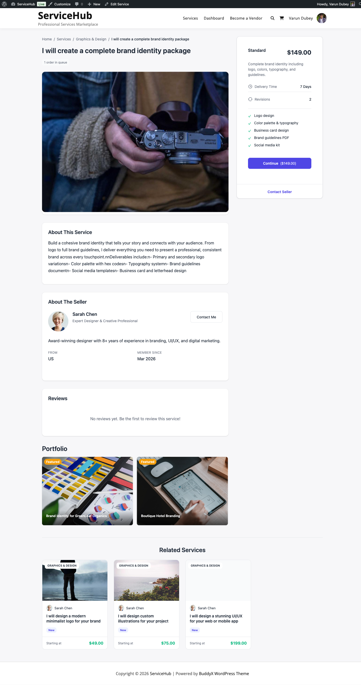

# Browsing Services

Discover and explore services offered by vendors on the marketplace. Learn how to find the perfect service for your needs.

## Accessing the Service Catalog

View all available services using these methods:

### Service Listing Pages

Navigate to the main services page (typically at `/services/` or `/marketplace/`).

You can also use shortcodes to display services:

- `[wpss_services]` - Display all services in a grid
- `[wpss_service_search]` - Show search and filter interface
- `[wpss_featured_services]` - Display featured services only
- `[wpss_service_categories]` - Browse services by category


### Browse by Category

Services are organized into categories:

1. Click **Categories** in the main navigation
2. Select a category (e.g., Graphic Design, Writing, Programming)
3. View all services in that category
4. Subcategories may be available for narrower searches

Use the shortcode `[wpss_service_categories]` to display category navigation.

## Service Display Views

### Grid View

Shows services as cards with:

- Service thumbnail image
- Service title
- Vendor name and photo
- Star rating and review count
- Starting price
- Vendor verification badge


### List View

Shows services in a detailed list format with:

- Larger service image
- Extended description preview
- Package pricing comparison
- Delivery time
- Service features

Toggle between Grid and List views using the view switcher.

## Search and Filter Options

### Basic Search

Use the search bar to find services:

1. Enter keywords (e.g., "logo design", "article writing")
2. Search looks through service titles and descriptions
3. Results update instantly

### Advanced Filters

Narrow your search with filters:

| Filter | Options |
|--------|---------|
| **Category** | Select one or more categories |
| **Price Range** | Minimum and maximum price slider |
| **Delivery Time** | 24 hours, 3 days, 7 days, 14 days, 30+ days |
| **Rating** | 4+ stars, 4.5+ stars, 5 stars only |
| **Vendor Level** | Verified vendors, Pro vendors |
| **Service Tags** | Keyword tags (SEO, WordPress, etc.) |


### Sorting Options

Sort search results by:

- **Recommended**: Algorithm-based relevance
- **Best Selling**: Most popular services
- **Highest Rated**: Best reviews first
- **Price: Low to High**: Cheapest first
- **Price: High to Low**: Most expensive first
- **Newest First**: Recently added services

## Featured Services

Premium placement services highlighted by:

- "Featured" badge
- Top placement in search results
- Display on homepage
- Featured services section

Featured services have been vetted by admins or promoted by vendors.

## Service Detail Page

Click any service to view complete details.



### Service Overview Section

**Header Information**:
- Service title
- Category breadcrumb
- Vendor name with link to profile
- Overall rating (stars and review count)
- Number of orders completed
- Favorite/Save button

**Main Service Image**:
- Large hero image or video
- Image gallery (click to view more)
- Service portfolio examples

**Service Description**:
- What the service includes
- What you'll receive
- How the vendor works
- Unique selling points
- Requirements from buyers

### Package Comparison

Most services offer tiered packages:

| Feature | Basic | Standard | Premium |
|---------|-------|----------|---------|
| **Price** | $50 | $100 | $200 |
| **Delivery** | 5 days | 3 days | 1 day |
| **Revisions** | 1 | 3 | Unlimited |
| **Features** | Logo design | Logo + source files | Logo + brand guide |
| **Add-ons** | Available | Available | All included |


**Package Components**:
- Price (one-time fee)
- Delivery time (business days)
- Number of revisions included
- List of included features
- Available add-ons

Select the package that fits your budget and timeline.

### Add-Ons (Optional Extras)

Additional services you can purchase with any package:

**Common Add-Ons**:
- Extra revisions ($10-$25)
- Faster delivery ($15-$50)
- Commercial license ($50-$100)
- Source files ($20-$40)
- Additional formats ($10-$30)

Add-ons increase the total price but provide extra value.

### Service FAQ

Frequently asked questions answered by the vendor:

**Example FAQs**:
- "Do you provide source files?" → "Yes, included in Premium package"
- "What file formats do you deliver?" → "PNG, JPG, and PDF"
- "Can I request revisions?" → "Yes, based on your selected package"

### Reviews and Ratings

See what other buyers say about the service:

**Review Display**:
- Overall star rating (1-5 stars)
- Total number of reviews
- Rating breakdown by stars (5-star, 4-star, etc.)
- Individual reviews with:
  - Buyer name (may be anonymous)
  - Star rating
  - Written review text
  - Order date
  - Service package purchased


**Sub-Ratings** (if displayed):
- Communication: How responsive the vendor was
- Quality: Work quality rating
- Delivery: On-time delivery rating
- Overall: General satisfaction

Filter reviews by rating or sort by most recent/helpful.

### Vendor Information Sidebar

Right sidebar shows vendor details:

**Vendor Profile Card**:
- Profile photo
- Display name
- Verification badge (Verified/Pro)
- Member since date
- Location (country)

**Vendor Statistics**:
- Orders completed
- Average response time
- On-time delivery rate
- Average rating

**Quick Actions**:
- Contact vendor (send message)
- View full vendor profile
- See all vendor's services


### Related Services

Bottom of page shows similar services:

- Services by same vendor
- Services in same category
- Services with similar tags
- Frequently bought together

## Vendor Profiles from Services

Click vendor name to view their full profile.

**Vendor Profile Page** displays:

- Cover image and bio
- Portfolio gallery
- All services offered
- Reviews received
- Skills and languages
- Social media links
- Contact form

Use shortcode `[wpss_vendor_profile]` to display vendor profiles.


## Top Vendors

Browse marketplace top performers using `[wpss_top_vendors]` shortcode.

**Top Vendors Features**:
- Highest-rated vendors
- Most experienced sellers
- Pro-level vendors only
- Best customer satisfaction

## Service Categories and Tags

### Category Navigation

Browse by organized categories:

**Common Categories**:
- Graphic Design
- Writing & Translation
- Digital Marketing
- Programming & Tech
- Video & Animation
- Business Services
- Music & Audio

Categories may have subcategories (e.g., Graphic Design → Logo Design).

### Tag Filtering

Tags provide additional filtering:

**Example Tags**:
- WordPress
- SEO
- Social Media
- eCommerce
- Mobile Apps

Click tags on service pages to find similar services.

## Saving Favorite Services

Save services you like to review and compare later. Your favorites list is private and only visible to you.

### What Are Favorites?

Favorites let you bookmark services you're interested in without purchasing immediately. Use them to:

- Compare multiple services side-by-side
- Save services while researching vendors
- Build a shortlist for later decision-making
- Keep track of services for future projects

### How to Favorite a Service

**From Service Cards:**

1. Browse the service catalog
2. Hover over any service card
3. Click the **Heart Icon** in the top corner
4. Heart fills with color (service is now saved)

**From Service Detail Page:**

1. Open any service page
2. Look for the **Heart Icon** near the service title
3. Click the heart to save
4. Icon changes to show it's favorited

**Visual Feedback:**
- Empty heart = Not favorited
- Filled heart = Already in your favorites

### Viewing Your Favorites

Access all saved services from your dashboard:

1. Go to **Dashboard → Favorites** tab
2. View all services you've favorited
3. Browse saved services in grid or list view
4. Click any service to view full details

Your favorites list shows:
- Service thumbnail and title
- Vendor name
- Current price
- Rating and reviews
- When you saved it

### Managing Your Favorites

**Remove from Favorites:**

1. Click the **Heart Icon** again on any favorited service
2. Heart becomes empty
3. Service is removed from your favorites list

Or from your Favorites dashboard:

1. Go to **Dashboard → Favorites**
2. Hover over a saved service
3. Click **Remove** or the heart icon
4. Service is removed from your list

**Browse Saved Services:**
- Sort by date saved, price, or rating
- Filter by category
- Search within your favorites
- Export list (if needed for comparison)

### Privacy

Your favorites are completely private:
- Only you can see what you've favorited
- Vendors cannot see who favorited their services
- Other buyers cannot view your list
- No notifications sent when you favorite

### Use Cases

**Before Purchasing:**
1. Browse multiple logo design services
2. Save 5-10 options you like
3. Go to Favorites and compare packages
4. Review portfolios again
5. Make informed purchase decision

**For Future Projects:**
- Save services for upcoming projects
- Build a list of trusted vendors
- Reference pricing for budget planning
- Return when you're ready to order

**Comparing Vendors:**
- Save similar services from different vendors
- Compare delivery times across favorites
- Review ratings side-by-side
- Check pricing differences

## Service Availability

### Active Services

Available for purchase with "Order Now" button visible.

### Unavailable Services

May show as unavailable if:

- Vendor is on [vacation mode](../vendor-guide/vacation-mode.md)
- Service is paused by vendor
- Vendor has reached order capacity
- Service is under review

Unavailable services show "Not Available" status and disabled order buttons.

## Mobile Browsing

Browse services on mobile devices:

- Responsive design adapts to screen size
- Touch-friendly navigation
- Simplified filters for mobile
- Quick-view popups for fast browsing

## Tips for Finding the Right Service

### Research Thoroughly

1. **Read Full Description**: Understand what's included
2. **Check Reviews**: Look for 4+ star ratings
3. **Review Portfolio**: View vendor's previous work
4. **Compare Packages**: Select best value for needs
5. **Check Delivery Time**: Ensure it meets your deadline

### Evaluate Vendors

1. **Verification Badge**: Prefer Verified or Pro vendors
2. **Response Time**: Choose responsive vendors
3. **Completion Rate**: Look for 95%+ rates
4. **Recent Activity**: Check for recent orders
5. **Communication**: Read vendor's FAQ and profile

### Budget Considerations

1. **Compare Similar Services**: Price check competitors
2. **Consider Value**: Don't always choose cheapest
3. **Factor Add-Ons**: Include extras in budget
4. **Package Selection**: Basic may suffice for simple needs
5. **Rush Fees**: Plan ahead to avoid fast delivery charges

### Ask Questions First

Before ordering:

1. Click **Contact Vendor**
2. Ask specific questions about your project
3. Clarify deliverables and timelines
4. Discuss custom requirements
5. Confirm vendor can meet your needs

This prevents misunderstandings and ensures good fit.

## Contacting a Vendor Before Ordering

Reach out to vendors before purchasing to clarify requirements, discuss custom work, and ensure they're the right fit for your project.

### Why Contact a Vendor First?

**Clarify Your Requirements:**
- Explain complex project details
- Confirm the service matches your needs
- Discuss specific deliverables
- Verify file formats and specifications

**Check Availability:**
- Confirm the vendor can meet your deadline
- Ask about current workload
- Check if they're accepting new orders
- Schedule project start date

**Discuss Custom Work:**
- Request modifications to standard packages
- Ask about custom pricing
- Negotiate bulk discounts
- Combine multiple services

**Ask Technical Questions:**
- Verify vendor has specific skills
- Confirm compatibility (software versions, platforms)
- Discuss technical requirements
- Review portfolio examples

### How to Contact a Vendor

**From Service Page:**

1. Open the service you're interested in
2. Scroll to the vendor sidebar
3. Click **Contact Vendor** button
4. Message form appears

**From Vendor Profile:**

1. Click vendor's name anywhere on the site
2. View their full profile page
3. Click **Contact Vendor** button
4. Compose your message

**Message Requirements:**
- You must be logged in to send messages
- Your account must be activated
- Some vendors may limit messages to prevent spam

### What to Include in Your Message

**Project Overview:**
```
Hi [Vendor Name],

I'm looking for a logo design for my coffee shop business.
I'd like to discuss if your Premium package would work for my needs.
```

**Specific Details:**
- Project description and goals
- Target deadline
- Budget range
- Specific deliverable requirements
- Any special requests

**Questions to Ask:**
- "Can you deliver in AI and EPS formats?"
- "Do you have experience with restaurant branding?"
- "Can you work within my $500 budget?"
- "Are you available to start next week?"
- "Can I see similar work you've done?"

**Example Message:**

```
Subject: Logo Design for Coffee Shop

Hi Sarah,

I'm opening a specialty coffee shop and need a modern, minimalist logo.

Project Details:
- Business name: "Bean & Brew"
- Style: Modern, clean, minimalist
- Target audience: 25-40 professionals
- Deliverables needed: Logo in AI, PNG, SVG
- Timeline: Need by March 15th

Questions:
1. Can you include a simple brand guide with color codes?
2. Do you have experience with food/beverage branding?
3. Would your Standard package work, or should I upgrade?

I've reviewed your portfolio and love your work on the "Urban Cafe" project.
Looking forward to working with you!

Best regards,
John
```

### Vendor Response Time

**What to Expect:**

Most vendors reply within:
- **24-48 hours** during business days
- Longer on weekends or holidays
- Vendor profile shows average response time

**If No Response:**
- Wait 2-3 business days
- Check if vendor is in vacation mode
- Try contacting another vendor
- Contact platform support if urgent

**Vendor Availability Status:**
- **Online now**: Usually replies within hours
- **Last seen**: Check vendor's activity status
- **Vacation mode**: May not respond until they return

### Moving from Conversation to Order

**After Discussing:**

1. Vendor confirms they can help
2. You agree on deliverables and timeline
3. Vendor may send a custom offer
4. You place the order through the platform

**Custom Offers:**
Some vendors can create personalized service packages:
- Click the custom offer link in the message
- Review the custom pricing and deliverables
- Accept and proceed to checkout
- Order is created with agreed terms

**Direct Purchase:**
If no custom offer needed:
1. Thank the vendor for clarifying
2. Go to their service page
3. Select the appropriate package
4. Place your order

### Tips for Effective Communication

**Be Professional:**
- Use proper grammar and spelling
- Be polite and courteous
- Provide complete information
- Respond promptly to vendor questions

**Be Specific:**
- Include concrete details, not vague requests
- Share reference examples or inspiration
- Specify exact deliverables needed
- Mention any constraints (budget, timeline, format)

**Be Realistic:**
- Don't expect custom work at Basic package prices
- Give vendors reasonable time to respond
- Understand vendor availability and workload
- Respect their expertise and suggestions

**Don't:**
- Ask for free work or "tests"
- Request work outside the platform
- Share personal contact information immediately
- Pressure vendors to lower prices unreasonably

## Troubleshooting

### No Search Results

- Try different keywords
- Remove some filters
- Check spelling
- Browse by category instead

### Service Won't Load

- Refresh the page
- Clear browser cache
- Check internet connection
- Service may have been removed

### Can't Contact Vendor

- Ensure you're logged in
- Verify your account is activated
- Check if vendor allows messages
- Contact site support

## Related Resources

- [Placing an order](placing-an-order.md)
- [Understanding packages and pricing](../getting-started/pricing-commission.md)
- [Vendor profiles explained](../vendor-guide/vendor-profile-portfolio.md)
- [Using buyer requests](buyer-requests.md)
