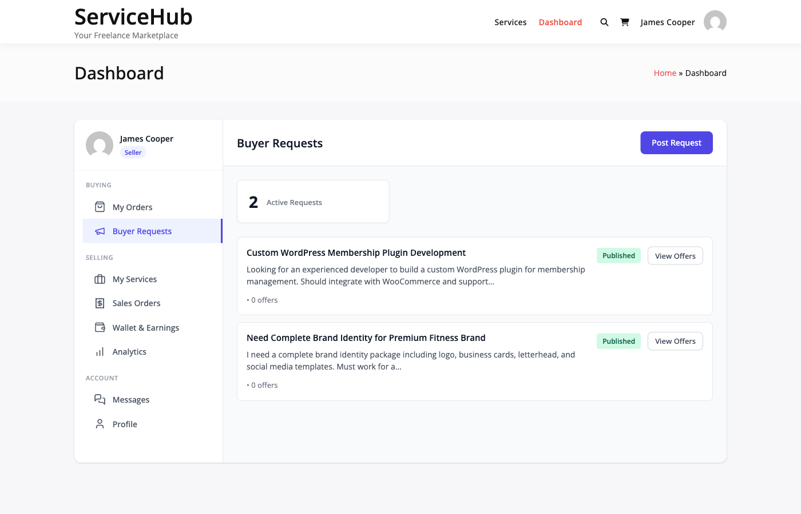
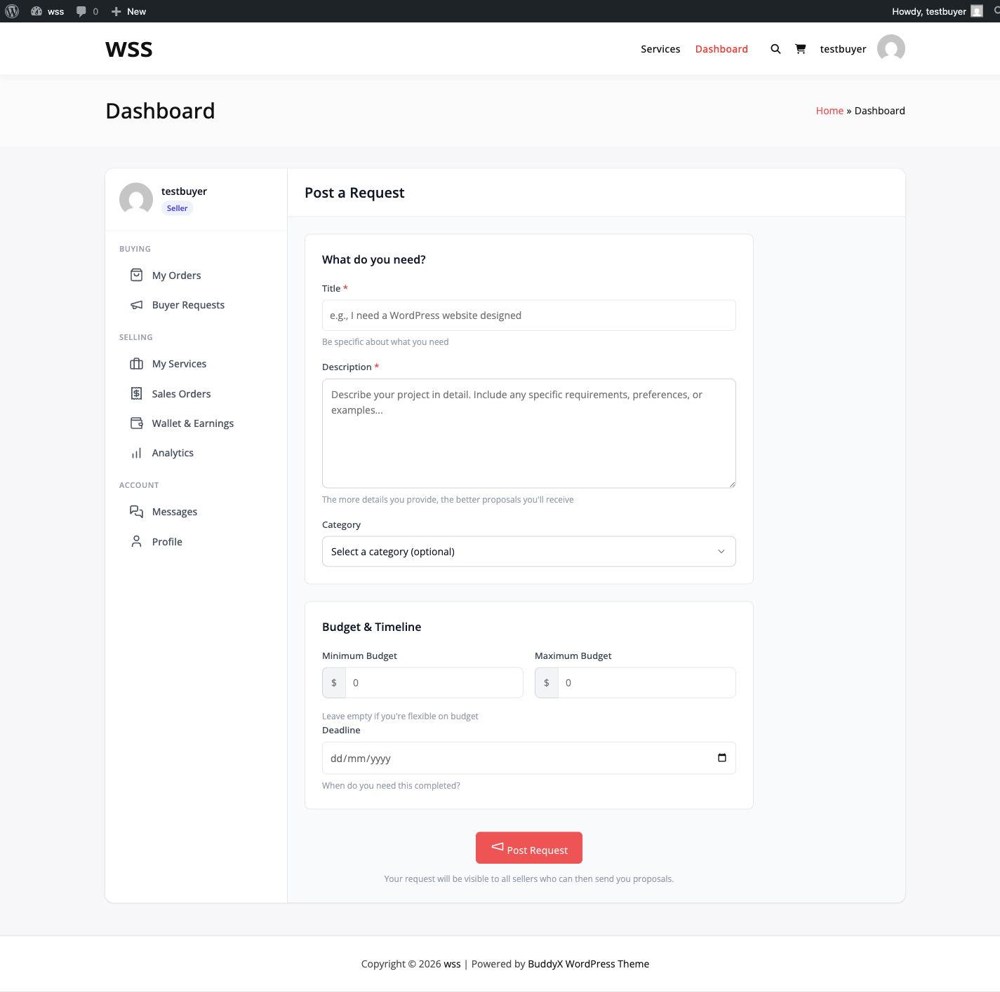
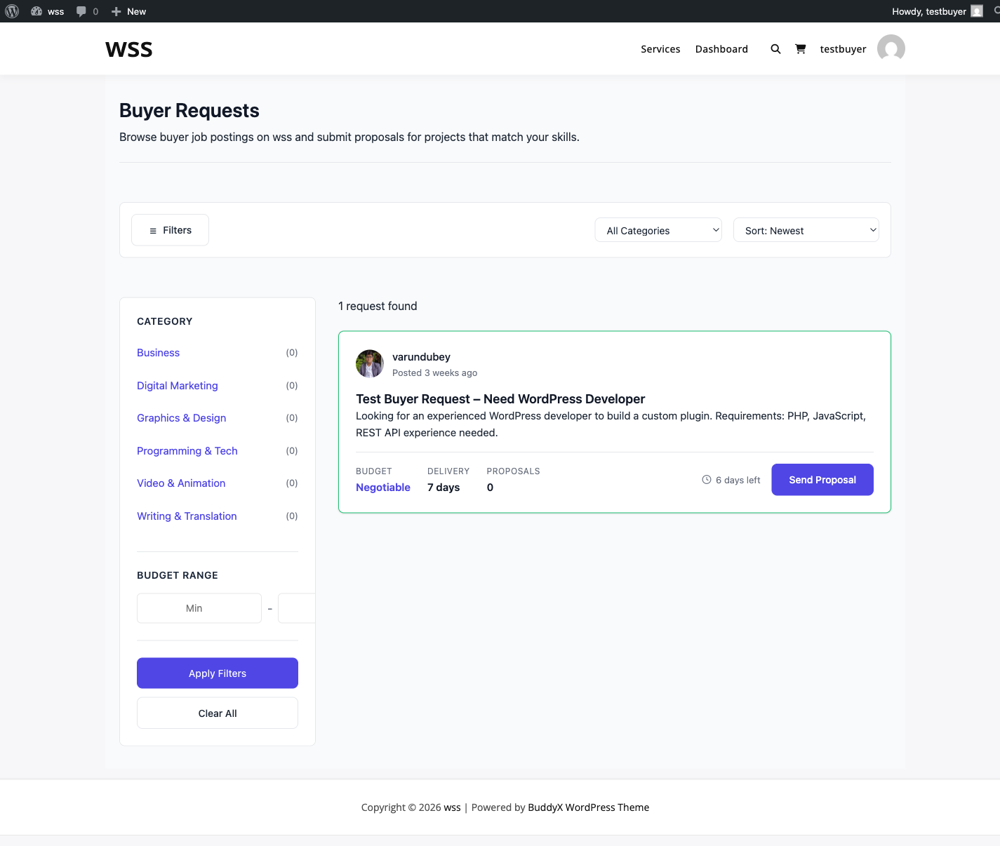
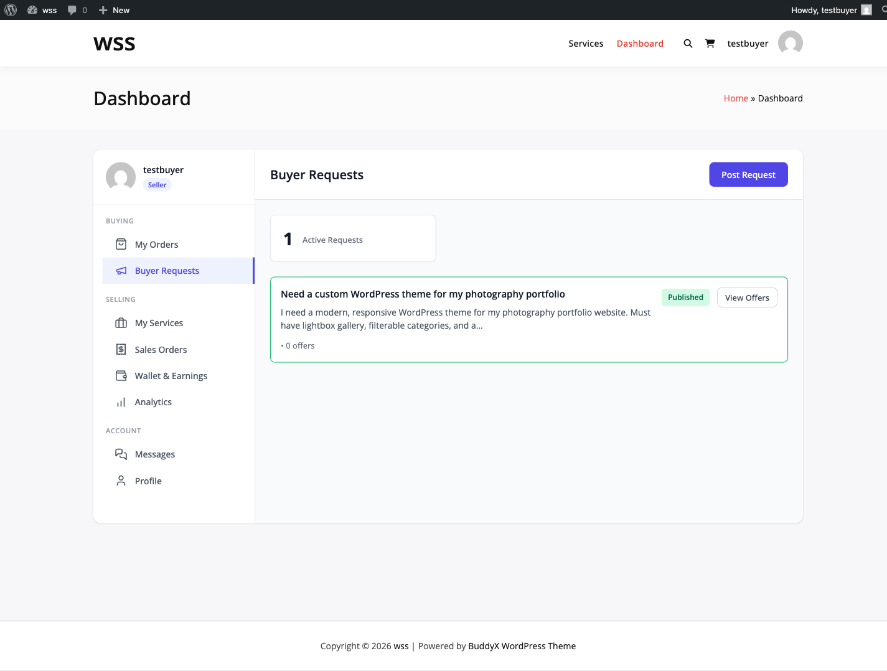

# Buyer Requests

Post your project requirements and receive proposals from interested vendors. A reverse marketplace where vendors come to you.

## What are Buyer Requests?

Buyer Requests flip the traditional marketplace model:

**Traditional**: You browse services and contact vendors
**Buyer Requests**: Vendors browse your project and contact you

### How It Works

1. **You Post**: Describe your project needs
2. **Vendors Browse**: Sellers see your request
3. **Proposals Received**: Vendors submit proposals with pricing
4. **You Review**: Compare proposals and vendor profiles
5. **Accept Proposal**: Choose best vendor and proposal
6. **Order Created**: Automatically converts to a regular order

### Benefits of Buyer Requests

- **Save Time**: Vendors come to you
- **Compare Options**: Multiple proposals in one place
- **Negotiate**: Discuss pricing and deliverables
- **Custom Solutions**: Get tailored proposals for unique projects
- **Competitive Pricing**: Vendors compete for your project



## Creating a Buyer Request

### Accessing Buyer Requests

Post a request using:

- Navigate to **Buyer Requests** page (typically at `/buyer-requests/`)
- Use shortcode `[wpss_post_request]` to display request form
- Click **Post a Request** from your buyer dashboard

### Request Form

Complete these fields when posting a request:



#### Required Fields

| Field | Description | Tips |
|-------|-------------|------|
| **Title** | Project name/summary | Clear, specific (50-100 chars) |
| **Description** | Detailed project requirements | Be thorough (200+ words) |
| **Category** | Service category | Select most relevant |
| **Budget** | Your price range | Realistic budget range |
| **Deadline** | When you need it | Include realistic timeframe |

#### Optional Fields

| Field | Description | Tips |
|-------|-------------|------|
| **Tags** | Keywords | Relevant skills needed |
| **Attachments** | Reference files | Brand guidelines, examples |
| **Special Requirements** | Additional notes | Unique constraints |

### Writing a Great Request

#### Title Best Practices

**Poor Titles**:
- "Need help"
- "Looking for designer"
- "Project"

**Good Titles**:
- "Logo Design for Tech Startup - Modern & Minimalist"
- "SEO-Optimized Blog Articles - Finance Industry"
- "WordPress Plugin Development - Custom Booking System"

Use specific, descriptive titles that attract the right vendors.

#### Description Best Practices

Include these elements:

**1. Project Overview**:
```
I need a professional logo design for my new coffee shop,
"Brew Haven". We're a specialty coffee shop targeting young
professionals in urban areas.
```

**2. Specific Requirements**:
```
Requirements:
- Modern, clean design
- Incorporate coffee elements subtly
- Colors: Brown, cream, green tones
- Must work in black & white
- Deliverables: Color and B&W versions, various file formats
```

**3. What You'll Provide**:
```
I will provide:
- Brand guidelines document
- Reference images of styles I like
- Color preferences
- Target audience information
```

**4. Timeline and Budget**:
```
Budget: $150-$300
Deadline: 14 days from start
Preferred delivery: 10 days
```

**5. Selection Criteria**:
```
I'll choose based on:
- Portfolio quality
- Relevant experience
- Proposed approach
- Price and timeline
```

### Budget Setting

Choose realistic budget ranges:

**Budget Types**:
- **Fixed Budget**: Exact amount (e.g., $200)
- **Budget Range**: Min to max (e.g., $150-$300)
- **Flexible**: Open to proposals

**Tips**:
- Research typical prices for similar services
- Leave room for negotiation
- Consider vendor experience levels
- Factor in project complexity

**Don't**: Set unrealistically low budgets that discourage quality vendors.

### Request Visibility Settings

Control who sees your request:

- **Public**: All vendors can see and propose
- **Category Specific**: Only vendors in selected categories
- **Invited Only**: Specific vendors you invite

Most requests should be public for maximum proposals.

## Browsing Existing Buyer Requests

### Request Listing Page

View all active requests using `[wpss_buyer_requests]` shortcode.



**For Vendors**: Browse requests to find projects to bid on
**For Buyers**: See example requests and current marketplace activity

### Request Details

Each request displays:

- Request title
- Budget range
- Deadline
- Category
- Number of proposals received
- Time posted
- Request status

### Request Statuses

| Status | Meaning |
|--------|---------|
| **Open** | Accepting proposals |
| **In Progress** | Proposal accepted, order active |
| **Completed** | Project finished |
| **Closed** | No longer accepting proposals |
| **Cancelled** | Request withdrawn |

## Receiving Proposals

### Proposal Notifications

When vendors submit proposals:

- Email notification sent
- Dashboard notification appears
- Proposal count updates on request

### Viewing Proposals

Access proposals for your request:

1. Go to **My Account → My Requests**
2. Click on your request
3. View **Proposals** tab
4. See all submitted proposals


### Proposal Information

Each proposal shows:

**Vendor Details**:
- Vendor name and profile photo
- Verification level (Basic/Verified/Pro)
- Average rating and review count
- Orders completed
- Response time

**Proposal Details**:
- Cover letter/pitch
- Proposed price
- Estimated delivery time
- Relevant experience
- Portfolio examples
- Questions or clarifications

**Actions**:
- View vendor profile
- Message vendor
- Accept proposal
- Reject proposal

### Proposal Status

| Status | Meaning |
|--------|---------|
| **Submitted** | Vendor sent proposal, awaiting your review |
| **Accepted** | You accepted, order created |
| **Rejected** | You declined this proposal |
| **Withdrawn** | Vendor withdrew their proposal |

## Evaluating Proposals

### Compare Proposals

Use these criteria to evaluate:

**1. Vendor Reputation**:
- Star rating (aim for 4.5+)
- Number of completed orders
- Verification level
- Review content

**2. Relevant Experience**:
- Portfolio examples matching your needs
- Previous similar projects
- Industry experience
- Specific skills

**3. Proposal Quality**:
- Demonstrates understanding of requirements
- Asks relevant questions
- Provides clear approach
- Professional communication

**4. Price and Timeline**:
- Within your budget
- Realistic delivery time
- Value for money
- Included deliverables

**5. Communication**:
- Response time to your questions
- Clarity of communication
- Professionalism
- Enthusiasm for project

### Asking Questions

Before accepting a proposal:

1. Click **Message Vendor** on proposal
2. Ask clarifying questions
3. Discuss any concerns
4. Confirm deliverables and timeline
5. Negotiate if needed

**Good Questions**:
- "Can you show examples of similar work?"
- "What file formats will I receive?"
- "How many revision rounds are included?"
- "What happens if I need changes after delivery?"
- "Can you meet a deadline of [specific date]?"

## Accepting a Proposal

### How to Accept

When you've chosen the best proposal:

1. Click **Accept Proposal** button
2. Review proposal details one final time
3. Confirm acceptance
4. Proceed to payment


### What Happens After Acceptance

1. **Order Created**: Proposal converts to official order
2. **Payment Required**: You're directed to checkout
3. **Other Proposals Closed**: Remaining proposals auto-rejected
4. **Vendor Notified**: Accepted vendor receives notification
5. **Request Marked**: Status changes to "In Progress"

### Payment Process

After accepting:

- Same checkout process as regular orders
- Pay proposal amount agreed upon
- Submit project requirements
- Vendor begins work

Follow the same process as [placing a regular order](placing-an-order.md).

## Rejecting Proposals

### When to Reject

Reject proposals that:

- Don't meet requirements
- Are outside your budget
- Come from unqualified vendors
- Have poor communication
- Seem unprofessional

### How to Reject

1. Click **Reject Proposal**
2. Optionally provide rejection reason
3. Confirm rejection

**Best Practice**: Provide brief, professional reason for rejection.

**Example Reasons**:
- "Budget doesn't align with our needs"
- "Looking for more experience in X area"
- "Went with another vendor"
- "Project requirements changed"

Vendors appreciate feedback for improvement.

## Managing Your Requests

### My Requests Dashboard

View all your requests at **My Account → My Requests**.



**Dashboard Shows**:
- All requests you've posted
- Request status
- Number of proposals per request
- Days active
- Budget and deadline

### Request Actions

For each request:

- **View Proposals**: See all vendor proposals
- **Edit Request**: Modify details (if no proposals yet)
- **Close Request**: Stop accepting new proposals
- **Cancel Request**: Remove request entirely
- **Repost**: Create similar new request

### Closing a Request

Close request when:

- You've accepted a proposal
- No longer need the service
- Found solution elsewhere
- Project cancelled

Closing prevents new proposals but keeps existing proposals accessible.

### Request Expiration

Requests may automatically close after:

- Deadline passes
- No activity for 30 days
- Maximum proposal limit reached
- Admin-set expiration period

Check your marketplace's request policies.

## Request Limits

Some marketplaces limit buyer requests:

**Common Limits**:
- Maximum active requests: 3-5
- Requests per month: 10-20
- Request duration: 30-60 days

Check your dashboard for applicable limits.

## Buyer Request Tips

### Get More Proposals

1. **Detailed Description**: Clear requirements attract vendors
2. **Realistic Budget**: Fair pricing gets more bids
3. **Professional Tone**: Serious requests get serious proposals
4. **Include Examples**: Visual references help vendors understand
5. **Reasonable Deadline**: Sufficient time attracts quality work
6. **Respond Quickly**: Fast communication keeps vendors interested

### Choose the Best Vendor

1. **Don't Pick Cheapest**: Value over lowest price
2. **Check Portfolio**: Verify quality of past work
3. **Read Reviews**: Learn from other buyers' experiences
4. **Test Communication**: How vendor responds matters
5. **Verify Understanding**: Ensure vendor gets your needs
6. **Trust Your Gut**: If something feels off, keep looking

### Avoid Common Mistakes

1. **Vague Requirements**: Be specific and detailed
2. **Unrealistic Budget**: Research typical pricing
3. **Rushing Selection**: Take time to evaluate
4. **Ignoring Red Flags**: Poor communication early = problems later
5. **Not Asking Questions**: Clarify before committing
6. **Accepting First Proposal**: Wait for multiple options

## Request Shortcodes

Display buyer request features on your site:

### Display All Requests
```
[wpss_buyer_requests]
```
Shows all active buyer requests (vendors can browse).

### Post Request Form
```
[wpss_post_request]
```
Displays form for buyers to post new requests.

### My Requests Dashboard
```
[wpss_dashboard]
```
Shows user's posted requests and proposals received.

## Troubleshooting

### Not Receiving Proposals

- Increase budget if too low
- Clarify requirements (may be unclear)
- Check if request is marked as public
- Extend deadline
- Add more detail to description
- Select broader category

### Proposal Notifications Not Coming

- Check email spam folder
- Verify email settings in account
- Enable dashboard notifications
- Check notification preferences

### Can't Accept Proposal

- Verify payment method is set up
- Ensure sufficient account funds
- Check if proposal was withdrawn
- Contact support if technical issue

### Vendor Stopped Responding

- Allow 24-48 hours for response
- Send polite follow-up message
- Check vendor's response time on profile
- Consider other proposals
- Contact marketplace support

## Related Resources

- [Browsing services](browsing-services.md)
- [Placing orders](placing-an-order.md)
- [Working with vendors](../orders/order-management.md)
- [Leaving reviews](reviews-ratings.md)
