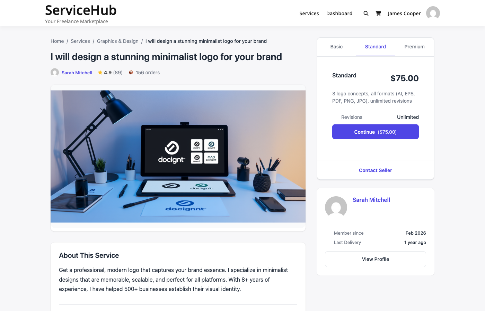

# Choosing the Right Package

Every service on the marketplace offers up to three pricing tiers -- Basic, Standard, and Premium. This guide helps you understand the differences and pick the package that fits your needs and budget.



## How Packages Work

Vendors structure their services into tiers so you can choose the level of service that matches your project. Think of it like ordering a coffee -- small, medium, or large -- each with progressively more included.

| Tier | What to Expect |
|------|----------------|
| **Basic** | The essentials at the lowest price. Good for simple projects or trying a vendor for the first time. |
| **Standard** | The most popular choice. Includes more deliverables, faster delivery, or extra revisions. Usually the best value for money. |
| **Premium** | The full package. Everything included, often with the fastest delivery and unlimited revisions. Best for important or complex projects. |

Not every service has all three tiers. Some vendors only offer Basic, or Basic and Standard. The available packages are shown as tabs on the service page.

---

## What to Compare

When switching between package tabs, pay attention to these four things:

### 1. Price

The price is shown prominently at the top of each package. Consider what you get for the difference in cost. If Standard is only 50% more than Basic but includes twice as many deliverables, that is usually the better deal.

### 2. Delivery Time

Each package has its own delivery timeline. A Basic package might take 7 days while Premium takes 3. If you are on a tight deadline, a higher tier with faster delivery could save you from needing to request an extension later.

### 3. Revisions Included

This is the number of times you can ask the vendor to make changes after delivery. Packages with more revisions give you more flexibility to refine the final result.

| Revisions | What It Means |
|-----------|--------------|
| **0** | The vendor delivers once. No changes included (you can still communicate during the order). |
| **1-2** | One or two rounds of feedback and adjustments. Good for straightforward projects. |
| **3-5** | Multiple revision rounds. Better for design work or projects where preferences are subjective. |
| **Unlimited** | As many revisions as you need. Ideal for brand-critical work. |

### 4. Features Checklist

Each package lists specific deliverables. Features included in the package show a checkmark, and features not included show an X. Scan this list carefully -- the difference between tiers is often a few key features.

**Example (Logo Design):**

| Feature | Basic | Standard | Premium |
|---------|-------|----------|---------|
| Logo concepts | 1 | 3 | 5 |
| Revisions | 1 | 3 | Unlimited |
| Source files | -- | Included | Included |
| Brand guidelines | -- | -- | Included |
| Social media kit | -- | -- | Included |

---

## Add-ons: Extra Options

Some services offer add-ons -- optional extras you can attach to any package. Common add-ons include:

- **Extra-fast delivery** -- Get your order sooner for an additional fee
- **Additional revisions** -- More rounds of changes beyond what the package includes
- **Extra deliverables** -- More concepts, pages, words, or other units of work
- **Source files** -- Raw/editable files (if not included in your chosen package)

Add-ons are listed below the package details. Check the ones you want before clicking "Continue" -- their price is added to the package price to form your total.

---

## How the Total Is Calculated

Your order total is straightforward:

```
Package price + Add-on prices + Tax (if applicable) = Total
```

**Example:**
- Standard package: $150
- Extra-fast delivery add-on: $30
- Tax (10%): $18
- **Total: $198**

The total is shown on the "Continue" button and again at checkout before you confirm.

---

## Which Package Should You Choose?

### Choose Basic if:
- You have a simple, well-defined project
- You want to test a vendor's quality before committing to more
- Budget is your primary concern
- You do not need revisions or premium features

### Choose Standard if:
- You want the best balance of quality and price
- Your project has moderate complexity
- You want a few revision rounds for comfort
- You are looking for the "recommended" option (most vendors optimize Standard for value)

### Choose Premium if:
- Your project is complex or high-stakes
- You need the fastest turnaround
- You want unlimited revisions or the most comprehensive deliverables
- This is a brand-critical project where quality matters more than cost

---

## Still Not Sure?

If you cannot decide between packages, try these approaches:

1. **Message the vendor** -- Use the contact button on their profile to ask which package fits your project. Good vendors will give you honest advice.
2. **Read reviews** -- See what packages other buyers chose and what they thought of the results.
3. **Start with Standard** -- When in doubt, the middle tier is designed to be the best value for most buyers.
4. **Post a buyer request** -- Describe your project and let vendors come to you with proposals. They will recommend the right scope and pricing.

---

## Related Guides

- [How to Find and Purchase a Service](browsing-and-purchasing.md) -- The full buying process
- [Service Add-ons](../service-creation/service-addons.md) -- How add-ons work in detail
- [Buyer Dashboard](buyer-dashboard.md) -- Manage your orders after purchase
- [Tips for Getting Great Results](buyer-tips-best-practices.md) -- Maximize value from your order
