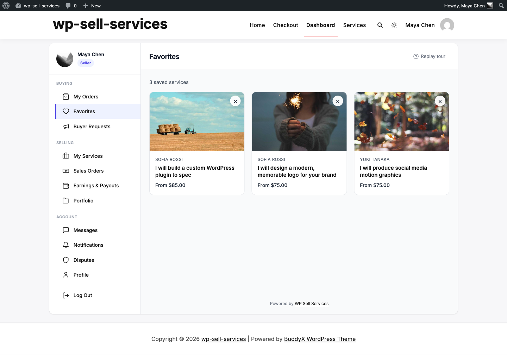

# Favorites: Save Services for Later

Found a service you like but you are not ready to order? Save it to your
favorites and come back when you are.

## Saving a service

Tap the heart on any service card in the marketplace, or use the favorite button
on the service page itself. The heart fills in to confirm the save. Tap again to
remove it.

Saving is instant -- the page does not reload, so you keep your place in the
catalog.

**You need an account to save favorites.** Logged-out visitors get a login prompt
when they tap the heart. Once you log in, favorites are tied to your account
rather than to the browser you happened to use.

## Finding your favorites

Open your dashboard and go to the **Favorites** section. Every saved service is
listed with its current price and availability, so you can compare options before
committing to an order.

From the list you can:

- Open the service page to order it
- Remove services you are no longer considering

## Why favorites beat browser bookmarks

Favorites stay attached to your account, follow you across devices, and always
show the **live** price. A bookmark shows you a page; a favorite shows you the
current state of an offer.

That matters on a marketplace, where things move:

- **Prices change.** Vendors adjust their packages. Your favorites list shows today's price, not the one you saw last month.
- **Vendors go on vacation.** A vendor in [vacation mode](../vendor-system/vacation-mode.md) shows as unavailable, instead of letting you start an order nobody will pick up.
- **Services get paused or removed.** You see the real status rather than a dead link.

## Using favorites well

- **Shortlist before you compare.** Save three or four candidates, then open the Favorites list and compare price, delivery time, and rating side by side.
- **Save across categories** when scoping a bigger project -- a designer, a copywriter, and a developer -- then decide the order of work.
- **Prune as you go.** Removing what you have ruled out keeps the list a decision tool rather than a pile.
- **Re-check before ordering.** Open the service page from your favorites and confirm the package and delivery time before you buy. See [Choosing the Right Package](choosing-the-right-package.md).

## Common questions

**Do vendors know I favorited their service?**
No. Favorites are private to your account.

**Is there a limit?**
No. Save as many as you like.

**What happens if a service is deleted?**
It disappears from your list. Nothing breaks, and nothing else is affected.

**Do favorites carry over if I change my email or username?**
Yes. They are attached to your user account, not your login details.

## For developers

Favorites are stored in the `_wpss_favorite_services` user meta key and exposed
over REST:

| Method | Route |
|--------|-------|
| GET | `/wpss/v1/favorites` |
| POST | `/wpss/v1/favorites/{service_id}` |
| DELETE | `/wpss/v1/favorites/{service_id}` |
| GET | `/wpss/v1/services/{service_id}/favorited` |

All four require an authenticated user. See
[REST API Controllers](../developer-guide/rest-api-controllers.md).

## Related

- [Buyer Dashboard](buyer-dashboard.md)
- [How to Find and Purchase a Service](browsing-and-purchasing.md)
- [Choosing the Right Package](choosing-the-right-package.md)
