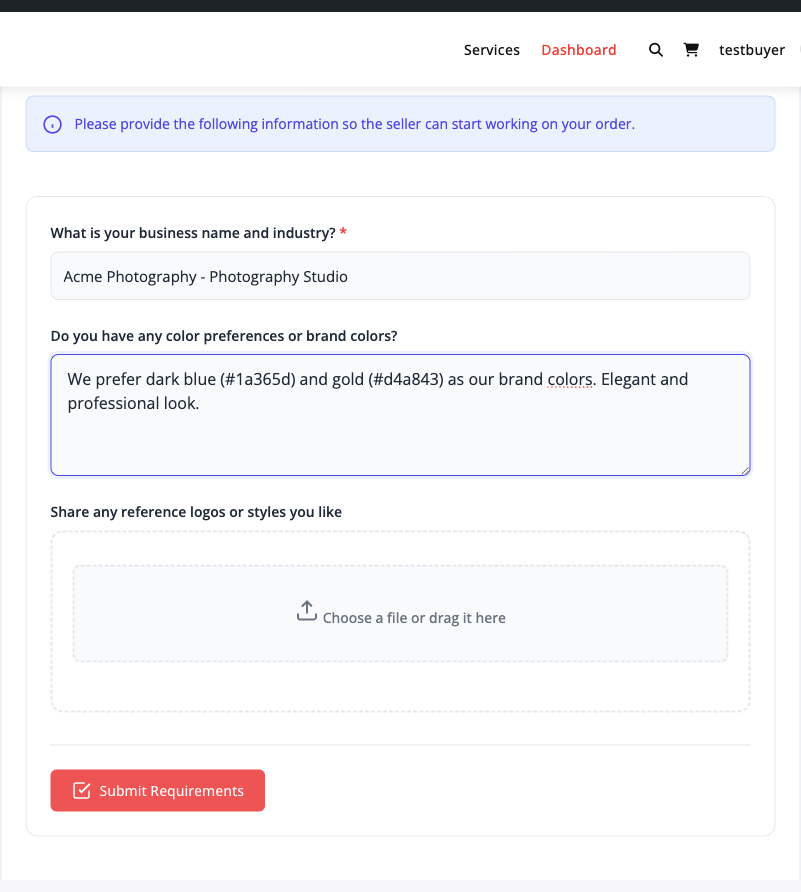
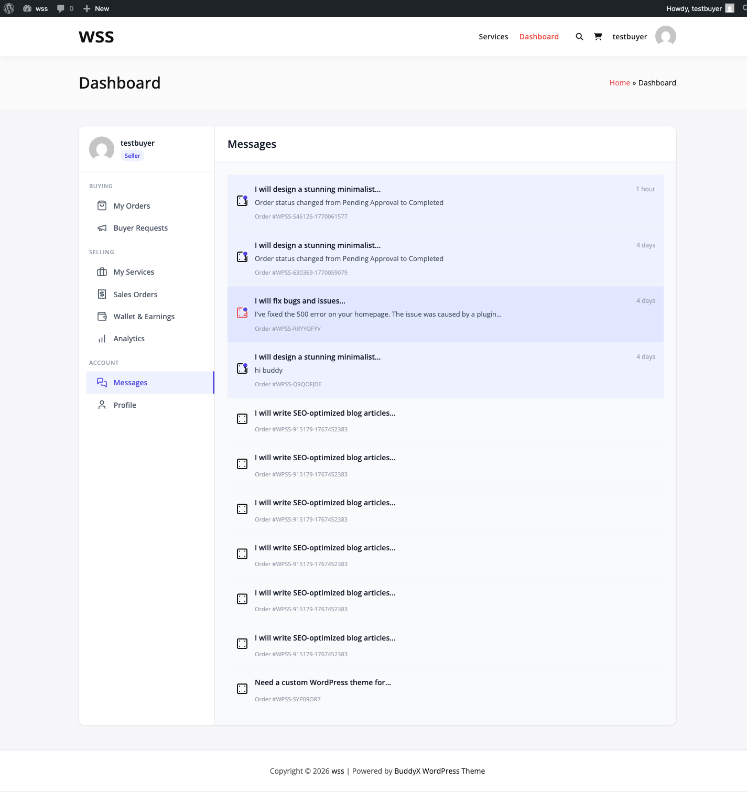

# Placing an Order

Learn how to purchase services, complete checkout, and submit requirements to vendors on the marketplace.

## Order Process Overview

Placing an order involves these steps:

1. Select a service and package
2. Add optional extras (add-ons)
3. Complete checkout and payment
4. Submit service requirements
5. Vendor begins work
6. Track order progress

## Selecting a Service Package

### Choose Your Package

Most services offer three tiers:

**Basic Package**:
- Lowest price point
- Essential features only
- Longer delivery time
- Limited revisions
- Best for: Simple projects, tight budgets

**Standard Package**:
- Mid-range pricing
- More features included
- Moderate delivery time
- More revisions
- Best for: Most projects, balanced value

**Premium Package**:
- Highest price
- All features included
- Fastest delivery
- Unlimited or many revisions
- Priority support
- Best for: Complex projects, urgent needs


### Compare Package Features

Review the comparison table on each service:

| What's Included | Basic | Standard | Premium |
|----------------|-------|----------|---------|
| Main deliverable | ✓ | ✓ | ✓ |
| Source files | ✗ | ✗ | ✓ |
| Commercial license | ✗ | ✓ | ✓ |
| Revisions | 1 | 3 | Unlimited |
| Delivery time | 7 days | 3 days | 1 day |

Select the package that best matches your needs and budget.

## Adding Optional Extras

### Available Add-Ons

Enhance any package with optional add-ons:

**Common Add-Ons**:
- **Extra Fast Delivery**: Reduce delivery time (e.g., 1 day instead of 3)
- **Additional Revisions**: Add more revision rounds
- **Source Files**: Get editable source files (if not included)
- **Commercial License**: Use for commercial purposes
- **Extra Concepts**: Receive multiple design options
- **Priority Support**: Get faster responses


### How Add-Ons Work

- Each add-on has its own price
- Add-ons are added to package price
- Some add-ons may be mutually exclusive
- Check descriptions for what each includes

**Example Total**:
```
Standard Package:        $100
+ Extra Fast Delivery:    $25
+ 2 Extra Revisions:      $20
Total:                   $145
```

## Checkout Process

### Standard Checkout (WooCommerce)

The free version uses WooCommerce for payments:

1. **Review Your Cart**:
   - Service package selected
   - Add-ons included
   - Total price displayed
   - Delivery timeframe shown

2. **Proceed to Checkout**:
   - Click "Add to Cart" or "Order Now"
   - Redirects to WooCommerce checkout

3. **Enter Billing Information**:
   - Full name
   - Email address
   - Billing address
   - Phone number (optional)


4. **Select Payment Method**:
   - Credit/Debit Card
   - PayPal
   - Other gateways configured by admin

5. **Review Order**:
   - Verify service details
   - Check total amount
   - Review delivery time

6. **Complete Payment**:
   - Click "Place Order"
   - Process payment
   - Receive order confirmation

### Direct Checkout **[PRO]**

Pro marketplaces may offer streamlined checkout:

- Skip WooCommerce entirely
- Direct payment processing
- Faster checkout flow
- Integrated with marketplace

**Supported Payment Gateways**:
- **Stripe**: Credit/debit cards, Apple Pay, Google Pay
- **PayPal**: PayPal balance, cards via PayPal
- **Razorpay**: Multiple payment methods (India)


### Alternative Platforms **[PRO]**

Some marketplaces integrate with:

**Easy Digital Downloads (EDD)**:
- Digital product focus
- Simplified checkout
- Extensive payment gateway support

**FluentCart**:
- Modern checkout experience
- One-click upsells
- Conversion-optimized

**SureCart**:
- Fast checkout
- Subscription support
- Tax automation

**Standalone Mode**:
- No external plugin required
- Built-in payment processing
- Custom checkout flow

Check which platform your marketplace uses.

## After Payment

### Order Confirmation

Immediately after payment:

1. **Confirmation Page**: Success message displayed
2. **Email Receipt**: Payment confirmation sent to your email
3. **Order Created**: Order appears in your dashboard
4. **Vendor Notified**: Vendor receives new order alert


### Order Number

You receive a unique order number (e.g., #12345):

- Reference for support inquiries
- Track order status
- Used in all communications

**Save your order number** for future reference.

## Submitting Service Requirements

### Requirements Form

After payment, submit project details to the vendor:

1. Navigate to **My Account → Orders**
2. Find your new order
3. Click **Submit Requirements**
4. Complete the requirements form



### Typical Requirements

Vendors may ask for:

| Requirement Type | Examples |
|------------------|----------|
| **Text Information** | Brand name, tagline, preferences |
| **File Uploads** | Logos, reference images, documents |
| **URLs** | Website links, social profiles |
| **Style Preferences** | Colors, fonts, mood boards |
| **Target Audience** | Demographics, industry |
| **Specific Instructions** | Dos and don'ts, must-haves |

### Tips for Good Requirements

1. **Be Specific**: Clear, detailed instructions
2. **Provide Examples**: Reference images or links
3. **State Preferences**: Colors, styles, tone
4. **Share Assets**: Logos, brand guidelines, content
5. **Set Expectations**: Mention any constraints
6. **Include Context**: Project background, goals

**Poor Example**:
> "Make me a logo. Blue is nice."

**Good Example**:
> "Create a modern, minimalist logo for 'TechFlow Solutions',
> a B2B software company. Prefer blue/gray color scheme.
> Must work well at small sizes. Target audience: enterprise IT
> managers. Attached: brand guidelines, competitor logos to avoid."

### Requirements Deadline

Submit requirements promptly:

- Order timer starts after requirements submitted
- Late requirements may delay delivery
- Some orders have requirement deadlines
- Vendor cannot start without requirements

**Best Practice**: Submit requirements within 24 hours of payment.

## Order Status After Submission

### Status: Pending Requirements

- Waiting for you to submit requirements
- Timer hasn't started
- Vendor hasn't begun work

### Status: In Progress

After requirements submitted:

- Vendor is actively working
- Delivery countdown begins
- You can message vendor for updates
- Track progress in dashboard


## Tracking Your Order

### Order Dashboard

View order details at **My Account → Orders → [Order ID]**

**Order Information**:
- Service name and package
- Vendor name with contact link
- Order status
- Delivery date/time countdown
- Price paid
- Requirements submitted
- Messages with vendor

### Order Timeline

Track order progress:

1. **Order Placed**: Payment completed
2. **Requirements Submitted**: Project details provided
3. **In Progress**: Vendor working
4. **Delivered**: Vendor submitted work
5. **Revisions Requested**: (if needed)
6. **Revision Delivered**: Updated work submitted
7. **Completed**: You approved delivery

### Delivery Countdown

Shows time remaining until delivery:

- Displays days, hours, minutes
- Countdown starts after requirements submitted
- Pauses if revision requested
- Updates in real-time

**Example**: "Delivery in 2 days, 5 hours"

## Communicating with Vendor

### Order Messages

Send messages to vendor about your order:

1. Go to order details page
2. Scroll to **Messages** section
3. Type your message
4. Attach files if needed
5. Click **Send Message**



### Message Best Practices

- **Be Professional**: Courteous and respectful
- **Be Clear**: Specific questions and feedback
- **Be Timely**: Respond to vendor messages quickly
- **Stay On Platform**: Keep all communication in the system
- **Document Agreements**: Confirm changes in messages

### When to Message Vendor

- Questions about requirements
- Request for project updates
- Clarify deliverables
- Discuss revisions needed
- Address any concerns

Avoid excessive messages; vendors need time to work.

## Payment Security

### Secure Transactions

Your payments are protected:

- SSL encryption for all transactions
- PCI-compliant payment processing
- No credit card info stored on marketplace
- Payment held in escrow until delivery

### Refund Protection

Payment isn't released to vendor until:

- Work is delivered
- You approve the delivery
- Or automatic approval after review period

If issues arise, you can [open a dispute](../disputes-resolution/opening-a-dispute.md).

## Order Confirmation Email

Check your email for order confirmation:

**Email Contains**:
- Order number
- Service and package purchased
- Total amount paid
- Vendor information
- Link to submit requirements
- Link to view order

**Didn't receive email?**
- Check spam/junk folder
- Verify email address in account settings
- Check order in dashboard
- Contact support to resend

## Multiple Orders

### Ordering from Same Vendor

You can place multiple orders with one vendor:

- Each order is tracked separately
- Different requirements for each
- Separate delivery dates
- Individual order conversations

### Ordering Multiple Services

Order from different vendors simultaneously:

- Manage all orders in one dashboard
- Each vendor works independently
- Separate payments and deliveries

## Pricing Notes

### Price Display

Prices shown are:

- Per service package (one-time fee)
- Before add-ons
- In marketplace currency
- May exclude local taxes

### Currency

Some marketplaces support multiple currencies:

- Select your preferred currency
- Prices convert automatically
- Payment processed in selected currency

### Taxes

Taxes may apply based on:

- Your location
- Vendor location
- Marketplace configuration
- Local regulations

Final price including taxes shown at checkout.

## Order Modifications

### Before Requirements Submitted

You can request order modifications:

- Contact vendor via message
- Request package change
- Add forgotten add-ons
- Cancel order (subject to policy)

### After Work Begins

Changes become more limited:

- Minor clarifications usually okay
- Major changes may require extra charge
- Discuss with vendor
- Agree on any additional costs

Significant changes may require a new order.

## Order Cancellation

### Early Cancellation

Before vendor starts work:

- Contact vendor to request cancellation
- Refund usually granted (minus fees)
- Processed through platform

### After Work Begins

More complicated:

- Vendor may have started work
- Partial refund possible
- May need to open dispute
- Depends on marketplace policy

Review the [disputes and resolution process](../disputes-resolution/opening-a-dispute.md).

## Troubleshooting

### Payment Failed

- Verify card details are correct
- Check sufficient funds available
- Try different payment method
- Contact your bank if declined
- Reach out to support

### Can't Submit Requirements

- Ensure you're logged in
- Check order status (must be paid)
- Try different browser
- Clear cache and cookies
- Upload smaller files if timing out

### Order Not Showing

- Check "My Orders" in account dashboard
- Verify payment was successful (check email)
- Allow a few minutes for processing
- Contact support with payment confirmation

### Vendor Not Responding

- Allow 24-48 hours for response
- Send a follow-up message
- Check vendor's profile for response time
- Contact marketplace support if extended delay

## Related Resources

- [Browsing and selecting services](browsing-services.md)
- [Requesting revisions and approving delivery](../orders/delivery-revisions.md)
- [Leaving reviews after completion](reviews-ratings.md)
- [Opening disputes if issues arise](../disputes-resolution/opening-a-dispute.md)
