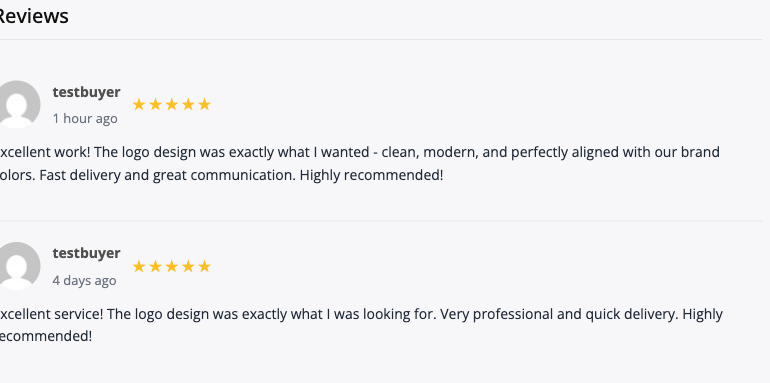

# Reviews & Ratings

Leave feedback for vendors after order completion. Reviews help build trust and guide other buyers in making informed decisions.

## Why Reviews Matter

Reviews serve multiple purposes:

**For Buyers**:
- Help make informed purchasing decisions
- Provide insight into vendor quality
- Show real customer experiences
- Build confidence in marketplace

**For Vendors**:
- Build reputation and credibility
- Improve search ranking
- Attract more buyers
- Receive constructive feedback
- Achieve verification levels

**For Marketplace**:
- Maintain quality standards
- Build trust in platform
- Identify top performers
- Address problematic vendors

## When You Can Leave a Review

### Review Eligibility

You can review an order when:

- Order status is "Completed"
- You've received and approved the final delivery
- Order wasn't cancelled or refunded
- Review window is still open

### Review Window

The review period is time-limited:

- **Default**: 14 days after order completion
- Starts when order marked as completed
- Configurable by marketplace admin (may be shorter/longer)
- After window closes, you cannot submit a review

**Best Practice**: Leave reviews promptly while experience is fresh.


## Accessing the Review Form

### From Order Page

1. Navigate to **My Account → Orders**
2. Find the completed order
3. Click **Leave a Review** button
4. Complete the review form

### From Email Reminder

Marketplaces may send review reminder emails:

- Sent 1-3 days after completion
- Contains direct link to review form
- Click link to access review page

### From Vendor Profile

Some marketplaces allow:

- Reviewing directly from vendor profile
- Only if you have completed orders with vendor

## Review Components

### Overall Rating (Required)

Rate your overall experience with **1 to 5 stars**:

| Stars | Meaning |
|-------|---------|
| ⭐ | Poor - Very dissatisfied |
| ⭐⭐ | Below Average - Disappointed |
| ⭐⭐⭐ | Average - Acceptable |
| ⭐⭐⭐⭐ | Good - Satisfied |
| ⭐⭐⭐⭐⭐ | Excellent - Very satisfied |

Be fair and honest in your rating.

### Sub-Ratings (Optional but Recommended)

Rate specific aspects of the experience:


#### Communication (1-5 stars)

How well did the vendor communicate?

- **5 stars**: Fast responses, clear communication, proactive updates
- **4 stars**: Good communication, timely responses
- **3 stars**: Adequate communication, occasional delays
- **2 stars**: Slow responses, unclear communication
- **1 star**: Poor communication, non-responsive

#### Quality of Work (1-5 stars)

How good was the delivered work?

- **5 stars**: Exceeded expectations, exceptional quality
- **4 stars**: High quality, met expectations
- **3 stars**: Acceptable quality, met basic requirements
- **2 stars**: Below expectations, quality issues
- **1 star**: Poor quality, unusable work

#### Delivery Time (1-5 stars)

Was work delivered on time?

- **5 stars**: Early delivery or right on time
- **4 stars**: Delivered on time
- **3 stars**: Slightly late but acceptable
- **2 stars**: Significantly delayed
- **1 star**: Extremely late, missed deadlines

#### Overall Experience (1-5 stars)

Would you work with this vendor again?

- **5 stars**: Definitely recommend, would hire again
- **4 stars**: Good experience, likely to hire again
- **3 stars**: Okay experience, might consider again
- **2 stars**: Below average, unlikely to hire again
- **1 star**: Poor experience, would not recommend

### Written Review (Required)

Provide detailed written feedback:

**Minimum Length**: Typically 50-100 characters
**Recommended Length**: 200-500 words


#### What to Include

**For Positive Reviews**:
- What you liked most
- Quality of deliverables
- Vendor's strengths
- Specific highlights
- Why you'd recommend them

**Example Positive Review**:
```
Excellent work! [Vendor] delivered a stunning logo that perfectly
captures our brand identity. Communication was outstanding - they
responded within hours and provided regular updates. The initial
design was great, and the two rounds of revisions fine-tuned it
to perfection. Delivered 2 days early! Files were well-organized
and included everything promised. Highly recommend for logo design
work. Will definitely hire again for future projects.
```

**For Critical Reviews**:
- Specific issues encountered
- What didn't meet expectations
- How vendor handled problems
- Constructive feedback
- What could be improved

**Example Critical Review**:
```
The final result was acceptable but the process was challenging.
Communication was slow - responses took 2-3 days. The first
delivery missed some requirements I clearly outlined, requiring
multiple revisions. Quality was decent once revisions were done,
but it took longer than expected. Vendor was professional but
seemed overwhelmed with orders. Would work with them again only
for non-urgent projects.
```

#### Review Writing Tips

**Do**:
- Be specific and detailed
- Provide constructive feedback
- Mention both positives and negatives
- Focus on facts and experience
- Be professional and respectful
- Help other buyers make decisions

**Don't**:
- Use offensive language or personal attacks
- Include private/personal information
- Make false claims or accusations
- Review for unrelated reasons (price complaints)
- Leave reviews for spite or revenge
- Copy/paste generic reviews

### Order Details Included

Reviews automatically display:

- Service purchased
- Package level (Basic/Standard/Premium)
- Date of order
- Your username or "Anonymous Buyer"
- Verified purchase badge

You don't need to manually add these details.

## Review Privacy Settings

### Display Name Options

Choose how your name appears:

- **Your Username**: Full username shown
- **First Name Only**: Only first name (e.g., "John R.")
- **Anonymous**: "Anonymous Buyer"

Some marketplaces enforce verified purchase names to prevent fake reviews.

### Private Feedback

Some marketplaces allow:

- Public review: Visible to everyone
- Private feedback: Only visible to vendor and admin

Use private feedback for sensitive issues or personal notes.

## Review Moderation

### Admin Approval

Many marketplaces use review moderation:

**Review Submission**:
1. You submit review
2. Status: "Pending Approval"
3. Admin reviews for policy compliance
4. Admin approves or rejects
5. If approved, review goes live

**Approval Timeline**: Typically 1-3 business days


### Review Policies

Reviews may be rejected if they:

- Contain offensive language or slurs
- Include personal information (emails, phone numbers)
- Are clearly fake or fraudulent
- Violate marketplace terms of service
- Are entirely off-topic
- Contain spam or promotional content

### Reporting Reviews

If you see inappropriate reviews:

1. Click **Report** button on review
2. Select reason for report
3. Provide additional details
4. Submit report to admin

Admins will investigate reported reviews.

## Two-Way Review System

Many marketplaces use reciprocal reviews:

### Vendor Reviews of Buyers

Vendors can also review you as a buyer:

**Vendors Rate**:
- Communication quality
- Clarity of requirements
- Professionalism
- Payment promptness
- Overall buyer experience

### Your Buyer Reputation

Your profile may display:

- Average rating as a buyer
- Number of orders placed
- Positive feedback percentage
- Buyer level or reputation score

Good buyer reviews help you:

- Build trust with vendors
- Receive priority from popular vendors
- Get better service
- Resolve disputes more favorably

### Maintaining Good Buyer Reputation

Be a great buyer:

1. **Provide Clear Requirements**: Detailed, organized instructions
2. **Communicate Respectfully**: Professional and courteous
3. **Respond Promptly**: Don't delay feedback and approvals
4. **Be Reasonable**: Fair revision requests, realistic expectations
5. **Pay On Time**: Complete checkout promptly
6. **Leave Honest Reviews**: Thoughtful, constructive feedback

## How Reviews Display

### On Vendor Profiles

Reviews appear on vendor profile pages:

- Overall star rating (average of all reviews)
- Total number of reviews
- Rating distribution chart (% of 5-star, 4-star, etc.)
- Individual reviews listed
- Most recent reviews shown first
- Option to filter/sort reviews



### On Service Pages

Each service shows:

- Service-specific rating
- Number of reviews for that service
- Sample recent reviews
- Link to all reviews

### In Search Results

Search listings display:

- Star rating icon with number
- Review count
- Helps buyers filter by rating

## Review Statistics

### Rating Distribution

Review pages show breakdown:

```
5 Stars: ████████░░ 82%
4 Stars: ██░░░░░░░░ 15%
3 Stars: █░░░░░░░░░  2%
2 Stars: ░░░░░░░░░░  1%
1 Star:  ░░░░░░░░░░  0%
```

### Verified Purchase Badge

Reviews from confirmed orders show "Verified Purchase" badge:

- Confirms reviewer actually bought the service
- Increases review credibility
- Helps filter authentic feedback

## Editing Reviews

### Can You Edit Reviews?

**Default**: Most marketplaces **do not allow** editing reviews after submission.

**Reasons**:
- Maintains review integrity
- Prevents manipulation
- Preserves historical record

**Alternative**: Contact marketplace admin to request review removal or edit if there are errors.

### Deleting Reviews

You typically cannot delete your own reviews.

**Request Deletion**:
- Contact marketplace support
- Provide valid reason
- Admin may approve in special circumstances

**Valid Reasons**:
- Review left for wrong vendor/service
- Contains personal information you want removed
- Order was cancelled after review

## Review Reminders

### Automatic Reminders

Marketplaces may send review reminders:

- **1 day** after order completion
- **3 days** after completion
- **7 days** after completion
- **Final reminder** before review window closes

### Opt-Out

You can usually disable review reminder emails:

1. Go to **Account Settings → Notifications**
2. Uncheck "Review Reminders"
3. Save settings

## Review Impact

### For Vendors

Reviews directly affect:

- **Search Ranking**: Higher-rated vendors rank better
- **Conversion Rate**: Better reviews = more sales
- **Verification Level**: Rating requirements for Verified/Pro
- **Featured Status**: Top-rated vendors get featured
- **Buyer Trust**: Social proof influences decisions

### For Your Experience

Leaving reviews helps:

- Improve marketplace quality
- Support great vendors
- Warn others about issues
- Provide valuable feedback
- Build your buyer reputation

## Review FAQs

**Q: Can vendors see who left negative reviews?**
A: Unless you choose anonymous, vendors can see your username. However, vendors cannot retaliate or deny future services based on reviews.

**Q: What if my review is rejected?**
A: You'll receive a notification with the reason. You can revise and resubmit if it was rejected for policy violations.

**Q: Can I review the same vendor multiple times?**
A: Yes, but only one review per order. If you place multiple orders with the same vendor, you can review each order separately.

**Q: Do reviews expire?**
A: Reviews typically remain visible indefinitely, showing the marketplace's historical performance.

**Q: What if the vendor disputes my review?**
A: Vendors can respond to reviews with comments. They cannot remove reviews unless admin finds policy violations.

**Q: Can I change my rating after posting?**
A: Generally no. Contact support if you have a valid reason for changing a review.

## Responding to Vendor Replies

### Vendor Response to Reviews

Vendors may respond to your reviews:

- Thank you for positive feedback
- Explain context for issues
- Offer to make things right
- Provide clarification

### Continuing Conversation

If vendor responds:

- You may be able to reply back (if enabled)
- Keep conversation professional
- Focus on resolution, not argument
- Consider updating review if vendor resolves issue

## Best Practices Summary

### Writing Effective Reviews

1. **Be Honest**: Truthful assessment of experience
2. **Be Fair**: Consider both positives and negatives
3. **Be Specific**: Provide detailed, actionable feedback
4. **Be Timely**: Review while experience is fresh
5. **Be Constructive**: Help vendors improve
6. **Be Professional**: Maintain respectful tone
7. **Be Helpful**: Guide other buyers with your insights

### Rating Guidance

- **5 Stars**: Reserve for truly exceptional experiences
- **4 Stars**: Good work with minor issues
- **3 Stars**: Acceptable but noticeable problems
- **2 Stars**: Below expectations, significant issues
- **1 Star**: Only for serious problems or complete failures

Most good experiences should be 4-5 stars.

## Related Resources

- [Placing orders](placing-an-order.md)
- [Order completion and approval](../orders/delivery-revisions.md)
- [Handling disputes](../disputes-resolution/opening-a-dispute.md)
- [Vendor reputation and verification](../vendor-guide/vendor-verification.md)
