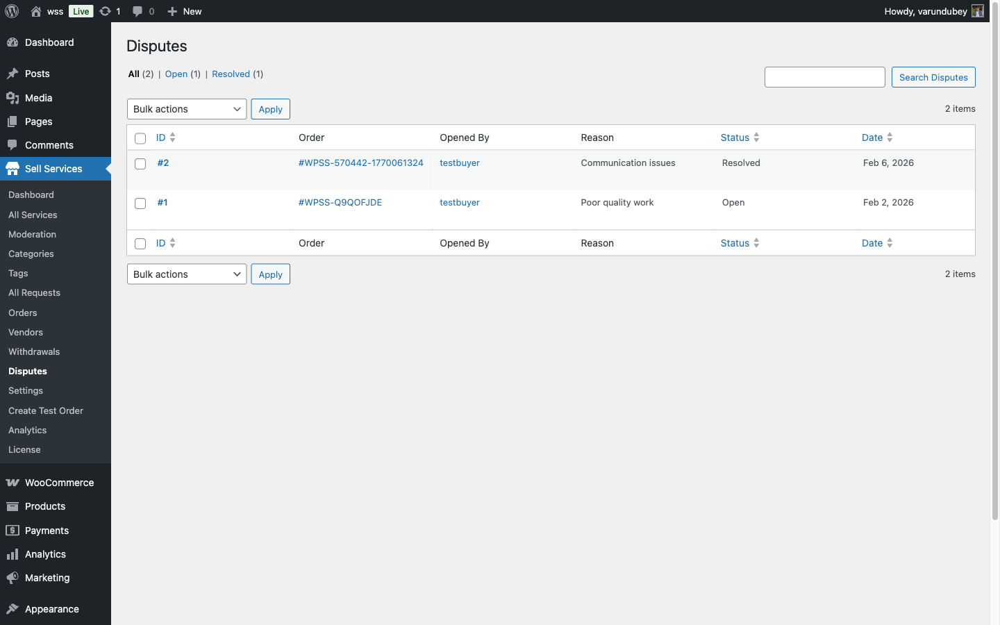
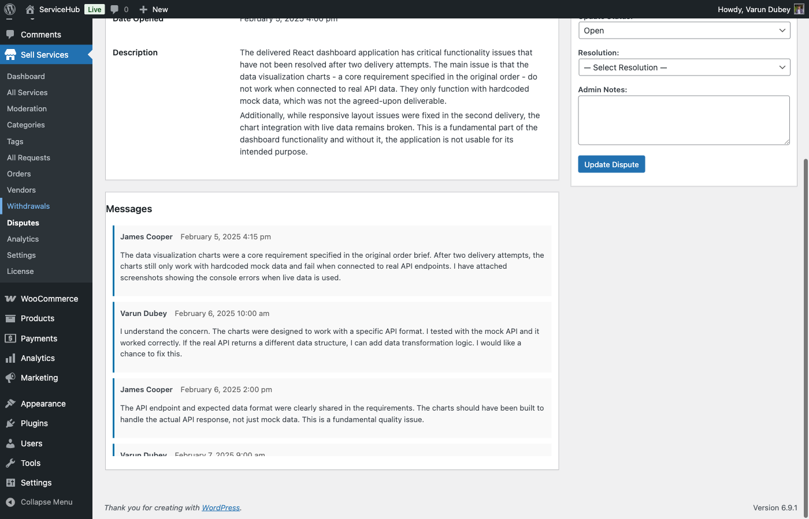

# Admin Dispute Mediation

Admins play a crucial role in resolving disputes fairly and maintaining marketplace integrity. This guide explains how administrators manage, investigate, and resolve disputes using the WP Sell Services dispute system.

## Admin Role in Disputes

### Responsibilities

Marketplace administrators:

- **Review Disputes**: Evaluate submitted disputes objectively
- **Investigate Claims**: Examine evidence from both parties
- **Make Decisions**: Determine fair resolutions
- **Implement Solutions**: Process refunds and apply resolutions
- **Maintain Standards**: Ensure platform policies are followed



### Neutral Mediation

Admins must remain:

- **Impartial**: No bias toward buyers or vendors
- **Objective**: Base decisions on evidence
- **Fair**: Apply policies consistently
- **Professional**: Maintain courteous communication

## Accessing Disputes

### Admin Dispute Dashboard

Navigate to **WordPress Admin → WP Sell Services → Disputes**.

**Dashboard Shows:**
- List of all disputes
- Current status of each
- Order reference numbers
- Parties involved
- Date opened
- Quick action buttons

### Viewing Dispute Details

Click any dispute to view:

**Dispute Information:**
- Dispute ID
- Order ID and details
- Initiating party
- Reason and description
- Current status
- Creation and update timestamps

**Party Information:**
- Buyer details
- Vendor details
- Order history for context

**Evidence:**
- All submitted evidence (JSON stored)
- Evidence type (text, image, file, link)
- Submission timestamps
- Submitter user IDs

## Managing Dispute Status

### Available Status Transitions

Admins can change dispute status using `update_status()`:

```php
// Update status with optional note
$dispute_service->update_status( $dispute_id, 'pending_review', 'Reviewing evidence' );
```

### Status Options

| Status | Use When |
|--------|----------|
| `open` | Initial submission, awaiting responses |
| `pending_review` | Evidence complete, awaiting admin action |
| `escalated` | Needs higher-level review |
| `resolved` | Decision made, being implemented |
| `closed` | Finalized and complete |

### Adding Status Notes

Status notes help track decision process:

```php
// Note is stored in evidence JSON as type 'status_note'
$dispute_service->update_status(
    $dispute_id,
    'escalated',
    'Escalating due to high order value and conflicting evidence'
);
```

Notes are visible to admins and optionally to parties.

## Reviewing Evidence

### Evidence Access

Get all evidence for a dispute:

```php
$evidence = $dispute_service->get_evidence( $dispute_id );
```

Returns array of evidence items with:
- Unique ID
- User ID of submitter
- Evidence type
- Content (text, attachment ID, or URL)
- Description
- Timestamp

### Evidence Types

**text:** Written explanations
- Stored directly in content field
- Searchable

**image:** Image attachment
- Content is WordPress attachment ID
- Use `wp_get_attachment_url()` to display

**file:** Document attachment
- Content is WordPress attachment ID
- Use `wp_get_attachment_url()` to download

**link:** External URL
- Content is sanitized URL
- Opens in new tab



### Evaluating Evidence

Consider:
1. **Relevance**: Does evidence relate to the claim?
2. **Authenticity**: Does evidence appear legitimate?
3. **Timing**: When was evidence created/submitted?
4. **Consistency**: Does evidence align with other facts?

## Resolution Types

Admins select from 5 resolution types when resolving disputes.

### Full Refund

**Constant:** `DisputeService::RESOLUTION_REFUND`
**Value:** `'full_refund'`

**When to Use:**
- Complete non-delivery by vendor
- Work completely unusable
- Severe quality issues
- Vendor violated major terms

**Order Impact:**
- Order status → 'refunded'
- Buyer receives full refund
- Vendor receives nothing

### Partial Refund

**Constant:** `DisputeService::RESOLUTION_PARTIAL_REFUND`
**Value:** `'partial_refund'`

**When to Use:**
- Some work completed but incomplete
- Quality below promised but partially usable
- Both parties share fault

**Order Impact:**
- Order status → 'partially_refunded'
- Buyer receives partial refund
- Vendor receives remaining amount

### Favor Vendor

**Constant:** `DisputeService::RESOLUTION_FAVOR_VENDOR`
**Value:** `'favor_vendor'`

**When to Use:**
- Vendor met all requirements
- Buyer's complaint is unreasonable
- Work matches description
- Evidence supports vendor

**Order Impact:**
- Order status → 'completed'
- Vendor receives full payment
- No refund to buyer

### Favor Buyer

**Constant:** `DisputeService::RESOLUTION_FAVOR_BUYER`
**Value:** `'favor_buyer'`

**When to Use:**
- Vendor clearly at fault
- Requirements not met
- Deliverables substandard

**Order Impact:**
- Order status → 'refunded'
- Similar to full refund

### Mutual Agreement

**Constant:** `DisputeService::RESOLUTION_MUTUAL`
**Value:** `'mutual_agreement'`

**When to Use:**
- Both parties negotiated solution
- Custom arrangement reached
- Standard resolutions don't fit

**Order Impact:**
- Order status → 'completed'
- Custom payment split if needed

## Resolving Disputes

### Resolution Method

Use the `resolve()` method:

```php
$result = $dispute_service->resolve(
    $dispute_id,
    DisputeService::RESOLUTION_PARTIAL_REFUND,
    'Vendor delivered partial work. Splitting payment 50/50.',
    get_current_user_id(), // Admin ID
    50.00 // Refund amount
);
```

### Resolution Parameters

1. **$dispute_id** (int): Dispute to resolve
2. **$resolution** (string): Resolution type constant
3. **$notes** (string): Explanation for decision
4. **$resolved_by** (int): Admin user ID
5. **$refund_amount** (float): Amount to refund (if applicable)

### What Happens Automatically

When you call `resolve()`:

1. ✓ Dispute status → 'resolved'
2. ✓ Resolution type stored
3. ✓ Resolution notes saved
4. ✓ Resolved timestamp recorded
5. ✓ Refund amount stored in evidence
6. ✓ Order status updated via `handle_resolution()`
7. ✓ Parties notified via `wpss_dispute_resolved` action
8. ✓ Returns true on success

## Refund Processing

### Refund Information Storage

Refund amounts are stored in evidence JSON:

```json
{
  "id": "refund_123",
  "type": "refund_info",
  "refund_amount": 75.00,
  "created_at": "2026-02-12 14:30:00"
}
```

### Actual Refund Processing

**Important:** The `resolve()` method does NOT process actual payment refunds. It only:
- Updates dispute status
- Records refund amount
- Updates order status

**You must separately:**
- Process refund through WooCommerce
- Or handle refund via payment gateway
- Or credit buyer's wallet (if using Pro wallet feature)

### Order Status After Resolution

The `handle_resolution()` private method updates order status:

```php
switch ( $resolution ) {
    case RESOLUTION_REFUND:
    case RESOLUTION_FAVOR_BUYER:
        // Order → 'refunded'
        break;

    case RESOLUTION_PARTIAL_REFUND:
        // Order → 'partially_refunded'
        break;

    case RESOLUTION_FAVOR_VENDOR:
    case RESOLUTION_MUTUAL:
        // Order → 'completed'
        break;
}
```

## Adding Evidence as Admin

Admins can add evidence on behalf of parties or from investigation:

```php
$dispute_service->add_evidence(
    $dispute_id,
    get_current_user_id(), // Your admin ID
    'text',
    'Admin note: Verified with buyer via phone call.',
    'Verbal confirmation from buyer'
);
```

### Evidence Parameters

1. **$dispute_id** (int): Dispute ID
2. **$user_id** (int): User ID adding evidence (use your admin ID)
3. **$type** (string): 'text', 'image', 'file', 'link'
4. **$content** (string): Content or attachment ID
5. **$description** (string): Optional description

### Evidence During Closed Status

Evidence cannot be added if dispute status is 'closed':

```php
if ( $dispute->status === DisputeService::STATUS_CLOSED ) {
    // add_evidence() returns false
}
```

## Dispute Queries

### Get All Disputes

```php
$disputes = $dispute_service->get_all( [
    'status'   => 'open', // Optional filter
    'limit'    => 20,
    'offset'   => 0,
    'order_by' => 'created_at',
    'order'    => 'DESC',
] );
```

### Get User's Disputes

```php
$user_disputes = $dispute_service->get_by_user( $user_id, [
    'status' => 'resolved',
    'limit'  => 10,
] );
```

Returns disputes where user is:
- Dispute initiator, OR
- Order customer, OR
- Order vendor

### Count by Status

```php
$counts = $dispute_service->count_by_status();
// Returns:
// [
//     'open' => 5,
//     'pending_review' => 3,
//     'resolved' => 120,
//     'escalated' => 1,
//     'closed' => 98,
// ]
```

## WordPress Hooks

### Action: wpss_dispute_opened

Fires when dispute is created:

```php
add_action( 'wpss_dispute_opened', function( $dispute_id, $order_id, $opened_by, $data ) {
    // Send custom notifications
    // Log to external system
    // Trigger Slack alert
}, 10, 4 );
```

### Action: wpss_dispute_evidence_added

Fires when evidence is submitted:

```php
add_action( 'wpss_dispute_evidence_added', function( $dispute_id, $user_id ) {
    // Notify admin of new evidence
}, 10, 2 );
```

### Action: wpss_dispute_status_changed

Fires on status updates:

```php
add_action( 'wpss_dispute_status_changed', function( $dispute_id, $status, $old_status ) {
    // Track status transitions
    // Update external systems
}, 10, 3 );
```

### Action: wpss_dispute_resolved

Fires when dispute is resolved:

```php
add_action( 'wpss_dispute_resolved', function( $dispute_id, $resolution, $dispute, $refund_amount ) {
    // Process actual refund here
    // Send resolution emails
    // Update analytics
}, 10, 4 );
```

## Best Practices

### Fair Mediation

1. **Review All Evidence**: Don't rush to judgment
2. **Stay Neutral**: No favorites
3. **Document Reasoning**: Always explain decisions
4. **Be Consistent**: Apply same standards to all
5. **Communicate Clearly**: Use professional language

### Investigation Process

1. **Read Order Details**: Understand what was purchased
2. **Review Service Description**: What was promised?
3. **Check Requirements**: What did buyer provide?
4. **Examine Deliverables**: What did vendor deliver?
5. **Read Messages**: Full conversation context
6. **Evaluate Evidence**: Who has stronger case?

### Resolution Writing

**Good Resolution Note:**
```
After reviewing evidence, I'm issuing a 50% partial refund.

Reasoning:
- Logo design delivered matches service description
- However, source files promised in Premium package not provided
- Vendor delivered 2 of 3 included revisions
- Delivery was 3 days late

Resolution:
- Buyer receives $50 refund (50%)
- Vendor receives $50 payment (50%)
- Order marked as completed

This decision is final.
```

**Poor Resolution Note:**
```
50% refund seems fair.
```

Always explain your reasoning clearly.

## Troubleshooting

### Can't Update Status

**Check:**
- Dispute exists: `get( $dispute_id )` returns object?
- Status is valid: Use STATUS_ constants
- User has admin capability

### Resolve Method Returns False

**Common Causes:**
- Dispute ID doesn't exist
- Dispute already resolved
- Invalid resolution type
- Database error (check error logs)

### Evidence Not Showing

**Verify:**
- Evidence stored as JSON in database
- Evidence column is longtext type
- JSON is valid and decodable
- Call `get_evidence()` method, not direct DB query

## Related Documentation

- [Dispute Process](dispute-process.md) - Dispute lifecycle and statuses
- [Opening a Dispute](opening-a-dispute.md) - User perspective
- [Order Management](../order-management/order-lifecycle.md) - Order workflow
- [Developer Guide](../developer-guide/hooks-filters.md) - Extending disputes

---

**Key Takeaway:** Admin dispute resolution requires careful evidence review, fair judgment, and clear communication. Always document your reasoning and apply policies consistently.
