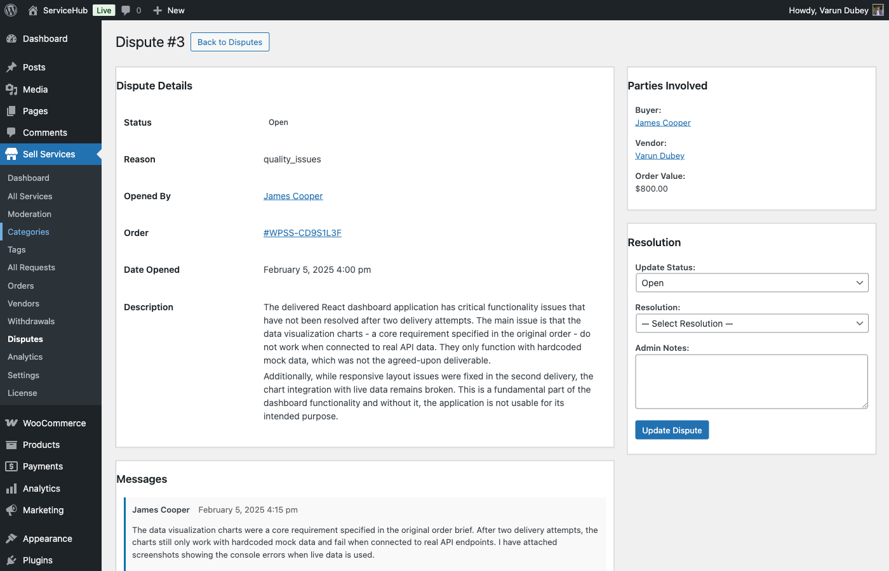

# Admin Dispute Mediation

Admins play a crucial role in resolving disputes fairly and maintaining marketplace integrity. This guide explains how administrators manage, investigate, and resolve disputes.

## Admin Role in Disputes

### Responsibilities

Marketplace administrators:

- **Review Disputes**: Evaluate submitted disputes objectively
- **Investigate Claims**: Examine evidence from both parties
- **Facilitate Communication**: Help parties communicate effectively
- **Make Decisions**: Determine fair resolutions
- **Implement Solutions**: Process refunds and apply resolutions
- **Maintain Standards**: Ensure platform policies are followed
- **Prevent Abuse**: Identify patterns of dispute abuse

### Neutral Mediation

Admins must remain:

- **Impartial**: No bias toward buyers or vendors
- **Objective**: Base decisions on evidence, not assumptions
- **Fair**: Apply policies consistently
- **Professional**: Maintain courteous communication
- **Transparent**: Explain decision rationale

## Accessing the Dispute Panel

### Admin Dispute Dashboard

Navigate to **WordPress Admin → WP Sell Services → Disputes**.


**Dashboard Overview**:
- List of all disputes
- Filter by status (Open, Under Review, Resolved)
- Filter by date range
- Search by order ID or user
- Sort by priority or date
- Quick stats (total disputes, resolution rate)

### Dispute Notifications

Admins receive alerts when:

- New dispute opened
- Party submits evidence
- Response deadline approaching
- Escalation requested
- Resolution implemented

Configure notification preferences in **WP Sell Services → Settings → Notifications**.

## Reviewing Dispute Details

### Dispute Information Panel

Click any dispute to view complete details:

**Dispute Header**:
- Dispute ID
- Order number (linked)
- Date opened
- Current status
- Priority level
- Time in current status

**Party Information**:
- Buyer details (name, email, order history, dispute history)
- Vendor details (name, email, rating, dispute history)
- Link to profiles and other orders

**Order Details**:
- Service purchased
- Package and price
- Add-ons selected
- Delivery date
- Order requirements
- Order messages



**Dispute Content**:
- Initiating party (buyer or vendor)
- Dispute reason category
- Detailed description
- Requested resolution
- Submission date

**Evidence**:
- Files uploaded by buyer
- Files uploaded by vendor
- Message history
- Service description screenshot
- Order timeline

**Communication Log**:
- All messages between parties
- Admin notes
- Status change history
- Actions taken

## Investigation Process

### Step 1: Initial Assessment

When dispute opens:

1. **Verify Legitimacy**:
   - Is this a valid dispute reason?
   - Does it meet platform dispute criteria?
   - Is it within allowable dispute timeframe?

2. **Check Order Status**:
   - Order payment confirmed
   - Requirements submitted
   - Delivery made or deadline passed
   - Previous revision requests

3. **Review Parties**:
   - Buyer's order history
   - Vendor's performance record
   - Previous disputes by either party
   - Account standing

4. **Assign Priority**:
   - High: Large amounts, urgent issues, clear violations
   - Medium: Standard disputes
   - Low: Minor issues, negotiable situations


### Step 2: Evidence Review

Examine all submitted evidence:

**Buyer Evidence**:
- [ ] Order requirements document reviewed
- [ ] Screenshots of issues examined
- [ ] Communication history checked
- [ ] Service description compared to delivery
- [ ] Claims substantiated with proof

**Vendor Evidence**:
- [ ] Deliverables reviewed for quality
- [ ] Vendor's response to buyer concerns
- [ ] Evidence of meeting requirements
- [ ] Communication attempts documented
- [ ] Any extenuating circumstances

**Platform Data**:
- [ ] Service description and packages
- [ ] Original order details
- [ ] Message timestamps
- [ ] Revision history
- [ ] Payment information

### Step 3: Verification

Validate claims independently:

**For Quality Disputes**:
- Compare deliverables to service description
- Assess against industry standards
- Check if requirements were reasonable
- Evaluate completeness
- Consider professional standards

**For Non-Delivery Disputes**:
- Verify delivery deadline
- Check if requirements were submitted
- Review vendor communication
- Confirm no deliverables uploaded
- Check for valid delays or extensions

**For Scope Disputes**:
- Compare original service scope
- Review requirement changes
- Assess additional work requests
- Determine if changes were agreed upon
- Check payment for scope changes

### Step 4: Request Additional Information

If evidence is insufficient:

1. **Message Parties**:
   - Request specific information
   - Ask clarifying questions
   - Set response deadline (48 hours typical)

2. **What to Request**:
   - Missing evidence
   - Explanation of contradictions
   - Technical details
   - Proof of claims
   - Specific file formats or examples


**Sample Admin Message**:
```
Thank you for your patience during this dispute review.

To make a fair decision, I need additional information:

From Buyer:
- Please provide the specific requirements document you mention
- Include screenshot of service description showing "unlimited revisions"

From Vendor:
- Please explain why the mobile responsive feature was not included
- Provide any communication where buyer approved the non-responsive design

Please respond within 48 hours. Thank you.
```

### Step 5: Analysis and Decision

Evaluate all information:

**Decision Factors**:
1. **Service Description Accuracy**: Did vendor deliver what was promised?
2. **Requirement Clarity**: Were buyer's needs clearly stated?
3. **Quality Standards**: Does work meet reasonable quality expectations?
4. **Communication**: Did parties attempt to resolve issues?
5. **Platform Policies**: Were marketplace rules followed?
6. **Reasonableness**: Are complaints objective and valid?

**Decision Framework**:
```
IF vendor delivered per description AND met requirements
  → Favor Vendor

IF vendor failed to deliver or work severely substandard
  → Full Refund to Buyer

IF partial delivery or some issues but work is partially usable
  → Partial Refund (calculate percentage)

IF both parties share fault
  → Mutual Compromise (mediate agreement)

IF issue is subjective preference
  → Usually Favor Vendor (can't please all tastes)
```

## Making Resolution Decisions

### Resolution Options

Select appropriate resolution type:

#### Full Refund

**When to Use**:
- Complete non-delivery by vendor
- Work completely unusable
- Severe quality issues
- Vendor violated major terms
- Fraud confirmed

**How to Implement**:
1. Change dispute status to "Resolved"
2. Select "Full Refund" resolution type
3. Add explanation for decision
4. Click "Process Refund"
5. System processes refund automatically
6. Both parties notified


#### Partial Refund

**When to Use**:
- Some work completed but incomplete
- Quality below promised but partially usable
- Missing some deliverables
- Both parties share fault
- Buyer partially satisfied

**How to Implement**:
1. Select "Partial Refund" resolution type
2. Enter refund amount or percentage
3. Provide calculation explanation
4. Review split (buyer gets X, vendor gets Y)
5. Process refund
6. Release remaining payment to vendor

**Percentage Guidelines**:
- 10-25%: Minor issues, mostly complete
- 25-50%: Moderate issues, half usable
- 50-75%: Major issues, minimally usable
- 75-90%: Severe issues, barely usable

#### Favor Vendor

**When to Use**:
- Vendor met all requirements
- Buyer's complaint is subjective/unreasonable
- Work matches description
- Evidence supports vendor
- Buyer expectations unreasonable

**How to Implement**:
1. Select "Favor Vendor" resolution
2. Release full payment to vendor
3. Mark order as completed
4. Provide explanation to buyer
5. Close dispute

#### Favor Buyer

**When to Use**:
- Vendor clearly at fault
- Requirements not met
- Deliverables substandard
- Vendor unresponsive
- Clear policy violation

**How to Implement**:
1. Select "Favor Buyer" resolution
2. Issue appropriate refund (full or partial)
3. Mark order accordingly
4. Provide explanation to vendor
5. May add vendor warning if severe

#### Require Revisions

**When to Use**:
- Issues are correctable
- Vendor willing to fix
- Buyer agrees to give opportunity
- Minor corrections needed
- Relationship salvageable

**How to Implement**:
1. Select "Require Revisions" resolution
2. List specific corrections needed
3. Set deadline (3-7 days typical)
4. Notify vendor of requirements
5. Monitor compliance
6. Re-evaluate after corrections


#### Facilitate Mutual Agreement

**When to Use**:
- Both parties willing to negotiate
- Custom solution needed
- Standard resolutions don't fit
- Parties close to agreement

**How to Implement**:
1. Facilitate negotiation via messages
2. Help parties reach agreement
3. Document agreed terms
4. Get confirmation from both parties
5. Implement custom solution
6. Mark as "Mutual Agreement" resolution

### Writing Resolution Explanations

Provide clear decision rationale:

**Good Resolution Explanation**:
```
After reviewing all evidence and communications, I'm issuing a 50%
partial refund.

Reasoning:
- The logo design was delivered as promised in terms of concept
- However, the source files and commercial license promised in the
  Premium package were not provided
- Vendor delivered 2 revisions (3 were included in package)
- Communication was adequate but delivery was 3 days late
- The logo itself is usable but buyer didn't receive full package value

Resolution:
- Buyer receives $100 refund (50%)
- Vendor receives $100 payment (50%)
- Order marked as completed
- Both parties can leave reviews

This decision is final. If you believe there was an error in this
decision, you may appeal within 7 days.
```

**Poor Resolution Explanation**:
```
I'm giving you 50% back because it seems fair. Case closed.
```

Always explain the reasoning clearly and professionally.

## Implementing Resolutions

### Processing Refunds

**WooCommerce Orders**:
1. Navigate to **WooCommerce → Orders**
2. Find the order (linked from dispute)
3. Click "Refund" button
4. Enter refund amount
5. Select refund reason: "Dispute Resolution"
6. Add admin note referencing dispute ID
7. Process refund

**Direct Payments (Pro)** **[PRO]**:
1. Use integrated refund system in dispute panel
2. Refund processed through original payment gateway
3. Automatic notification sent

**Wallet Refunds (Pro)** **[PRO]**:
1. Credit buyer's wallet instantly
2. Deduct from vendor's earnings or wallet
3. Transaction recorded in wallet log

### Updating Order Status

After resolution:

1. **Update Order**:
   - If full refund: Change status to "Cancelled"
   - If partial refund: Change status to "Completed"
   - If favor vendor: Change status to "Completed"

2. **Add Order Note**:
   - Reference dispute ID
   - Summarize resolution
   - Note refund amount if applicable

3. **Unlock Review System**:
   - Enable reviews for both parties
   - Set review window (14 days default)

### Notifying Parties

System automatically sends notifications:

**To Buyer**:
- Dispute resolved notification
- Resolution type and amount
- Refund processing timeline
- Review invitation
- Appeal option and deadline

**To Vendor**:
- Dispute resolved notification
- Resolution outcome
- Payment released (if applicable)
- Performance impact
- Appeal option and deadline

**Email Template** (auto-sent):
```
Subject: Dispute Resolved - Order #12345

Your dispute (#DISP-789) has been resolved.

Resolution: Partial Refund
Amount: $50.00 refunded to buyer, $50.00 released to vendor

Admin Decision:
[Resolution explanation here]

Refund Processing: 5-10 business days to original payment method

You may appeal this decision within 7 days if you believe there
was an error. Click here to appeal: [Appeal Link]

Thank you for your patience during this process.
```

## Handling Appeals

### Appeal Review Process

When party appeals:

1. **Review Appeal Request**:
   - Read appeal reasons
   - Check for new evidence
   - Assess validity of appeal

2. **Escalate if Warranted**:
   - Assign to senior admin or owner
   - Flag for fresh review
   - Consider different perspective

3. **Re-Evaluate Evidence**:
   - Review original evidence again
   - Consider new evidence submitted
   - Look for missed details
   - Check for policy misapplication

4. **Make Final Decision**:
   - Uphold original decision, OR
   - Modify resolution
   - Provide detailed explanation
   - Mark as final (no further appeals)


### Appeal Outcomes

| Outcome | Action |
|---------|--------|
| **Appeal Denied** | Original resolution stands, marked final |
| **Appeal Granted** | New resolution implemented |
| **Partial Appeal** | Modified resolution (adjusted refund %) |

## Communication Best Practices

### Messaging Parties

When communicating in disputes:

**Tone**:
- Professional and neutral
- Courteous and respectful
- Clear and direct
- Empathetic but firm

**Content**:
- Explain process and timelines
- Request specific information
- Acknowledge concerns
- Provide updates
- Set clear expectations

**Sample Admin Messages**:

**Initial Response**:
```
Thank you for opening this dispute. I'm [Admin Name] and I'll be
reviewing your case.

I've received your submission and will review all evidence over
the next 2-3 business days. I may reach out with questions for
either party.

Please check this dispute page regularly for updates.
```

**Request for Information**:
```
I'm reviewing your dispute and need clarification on a few points
to make a fair decision:

[Specific questions]

Please respond within 48 hours. If I don't hear back, I'll make
a decision based on available information.

Thank you for your cooperation.
```

**Resolution Notice**:
```
I've completed my review and reached a decision.

Resolution: [Type]
[Detailed explanation]

This decision is based on [summary of evidence considered].

If you believe there was an error, you may appeal within 7 days.

Thank you for your patience.
```

### Managing Difficult Parties

When parties are:

**Aggressive or Threatening**:
- Remain calm and professional
- Do not engage with threats
- Warn about code of conduct
- May suspend account for severe violations
- Focus on facts, not emotions

**Unresponsive**:
- Send multiple reminders (2-3)
- Set clear deadlines
- Proceed with decision if no response
- Note non-cooperation in decision

**Dishonest**:
- Document discrepancies
- Request verification
- Cross-reference evidence
- Factor credibility into decision
- May penalize dishonest party

## Dispute Analytics

### Tracking Metrics

Monitor dispute performance:

**Key Metrics**:
- Total disputes opened
- Disputes by category
- Average resolution time
- Resolution type distribution
- Appeal rate
- Buyer/vendor win rates
- Repeat disputants

**Dashboard View**:
```
This Month:
- Total Disputes: 24
- Resolved: 20
- Pending: 4
- Average Resolution Time: 6.2 days
- Partial Refunds: 45%
- Full Refunds: 25%
- Favor Vendor: 20%
- Mutual Agreement: 10%
```


### Identifying Patterns

Look for:

**Problematic Vendors**:
- High dispute rate
- Pattern of quality issues
- Consistent non-delivery
- Communication problems

**Action**: Warning, suspension, or removal

**Problematic Buyers**:
- Frequent disputes
- Pattern of unreasonable complaints
- Suspected scam attempts
- Abuse of dispute system

**Action**: Warning, order restrictions, or suspension

**Systemic Issues**:
- Common dispute categories
- Platform policy gaps
- Unclear service descriptions
- Need for better buyer education

**Action**: Update policies, improve documentation, enhance training

## Best Practices for Admins

### Fair Mediation

1. **Stay Neutral**: No favorites or biases
2. **Gather Complete Evidence**: Don't rush to judgment
3. **Consider Both Sides**: Each party deserves fair hearing
4. **Apply Policies Consistently**: Same rules for all
5. **Explain Decisions**: Transparency builds trust
6. **Be Timely**: Delays hurt both parties
7. **Learn from Cases**: Improve processes based on patterns

### Preventing Disputes

Proactive measures:

- **Clear Service Guidelines**: Help vendors write accurate descriptions
- **Buyer Education**: Teach buyers how to communicate requirements
- **Vendor Vetting**: Screen vendors during approval
- **Quality Monitoring**: Identify issues before disputes
- **Encourage Communication**: Promote direct resolution
- **Revision System**: Make it easy to request corrections

### Documentation

Maintain thorough records:

- All dispute communications
- Evidence reviewed
- Decision rationale
- Actions taken
- Timestamps of all events
- Admin notes

Essential for appeals and pattern analysis.

## Advanced Dispute Features **[PRO]**

Pro marketplaces may offer:

### Automated Dispute Routing

- AI-powered priority assignment
- Auto-categorization of disputes
- Suggested resolutions based on similar cases
- Predictive resolution likelihood

### Dispute Templates

- Pre-written response templates
- Common resolution scenarios
- Standardized messaging
- Faster processing

### Third-Party Arbitration

- External mediator option
- For high-value or complex disputes
- Professional arbitration service integration
- Legally binding resolutions

### Dispute Prevention Tools

- Pre-order requirement validation
- Automated quality checks
- Communication prompts
- Early warning system for at-risk orders

## Related Resources

- [Opening a dispute (buyer perspective)](opening-a-dispute.md)
- [Dispute process overview](dispute-process.md)
- [Admin order management](../admin/order-management.md)
- [Platform policies and guidelines](../admin/platform-policies.md)
