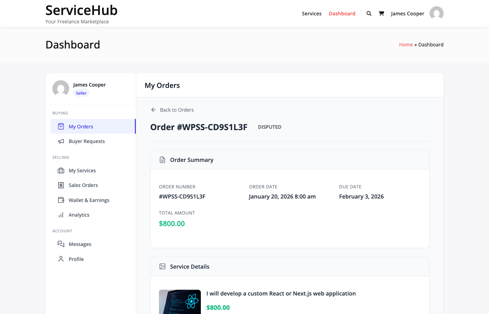

# Opening a Dispute

When issues with an order cannot be resolved through direct communication, you can open a formal dispute. This guide explains when and how to initiate the dispute process.

## What is a Dispute?

A dispute is a formal complaint about an order that requires marketplace intervention.

**Purpose:**
- Resolve conflicts between buyer and vendor
- Protect both parties' interests
- Enable admin mediation
- Document issues formally
- Facilitate fair resolution

**Not a Dispute:** Minor revision requests or communication issues that can be resolved directly with the vendor through the order messaging system.

---

## Valid Reasons for Disputes

The system provides 6 predefined dispute reasons:

| Reason | When to Use |
|--------|-------------|
| **Not Delivered** | Vendor hasn't delivered work and deadline has passed |
| **Not as Described** | Delivered work differs significantly from service description |
| **Poor Quality** | Work quality is far below promised standard |
| **Late Delivery** | Work delivered significantly late without prior agreement |
| **Communication Issues** | Vendor unresponsive or refuses to communicate |
| **Other** | Issues not covered by above categories (explain in description) |

**Note:** These are the ONLY 6 reason options available in the code. Previous documentation listed additional reasons that don't exist.


### When to Dispute

**Open a dispute when:**
- Direct communication has failed
- Vendor is unresponsive for 48+ hours
- Delivered work is unusable or incomplete
- Vendor refuses to provide agreed deliverables
- Major quality issues cannot be resolved
- Order requirements were not met

**When NOT to dispute:**
- Minor revision requests (use revision system)
- Communication delays under 48 hours
- Subjective style preferences
- Misunderstandings that can be clarified
- Vendor is actively working on fixes

**Best Practice:** Always attempt direct communication first. Most issues resolve without disputes.

---

## Before Opening a Dispute

### Step 1: Try Direct Communication

Message the vendor through the order conversation:

1. Clearly explain the specific issue
2. Provide examples or screenshots
3. State what you need to resolve it
4. Give vendor 24-48 hours to respond
5. Document all communication

**Example Message:**
```
Hi [Vendor],

I've reviewed the delivered design but there are several
issues that need addressing:

1. Colors are red, but requirements specified blue
2. Missing the black & white version from Premium package
3. Files are JPG only - need vectors as described

Can you please provide corrected deliverables within 48 hours?
I've attached the original requirements for reference.

Thanks,
[Your Name]
```

### Step 2: Use Revision Request (If Applicable)

If the issue is work quality:

1. Go to the order page
2. Click **Request Revision**
3. Describe what needs to be fixed
4. Submit request
5. Wait for vendor response

**When Revisions Don't Help:**
- Vendor refuses to make revisions
- All revisions used up
- Issue is not fixable through revision
- Vendor is unresponsive

### Step 3: Gather Evidence

Before opening a dispute, collect:

**Required Information:**
- Order requirements (what was agreed)
- Delivery files (what was received)
- Communication screenshots
- Timeline of events
- Specific examples of issues

**Good Evidence:**
- Side-by-side comparisons (expected vs. received)
- Annotated screenshots showing problems
- Relevant portions of service description
- Message history showing non-responsiveness

**Note:** Evidence is stored as JSON data, not as separate file uploads. You'll paste URLs or describe evidence in text form.

---

## Opening a Dispute

### Step 1: Access Dispute Form

**From Order Page:**
1. Go to **Dashboard → My Orders**
2. Click the order with the issue
3. Click **Open Dispute** button
4. Dispute form opens

**From Dashboard:**
1. Go to **Dashboard → Disputes**
2. Click **Open New Dispute**
3. Select the order
4. Form opens

### Step 2: Complete the Form

**Required Fields:**

**Select Dispute Reason:**
- Choose from 6 predefined reasons
- Pick the one that best matches your issue

**Description (Required):**
- Minimum: 50 characters (recommended 200-500)
- Explain the issue clearly and factually
- Include timeline of events
- State what you've tried to resolve it
- Mention attempted communication

**Good Description Example:**
```
I ordered a custom WordPress plugin on January 15th with the following
requirements:
1. User registration form
2. Email verification
3. Admin dashboard

The vendor delivered on January 20th but:
- Registration form doesn't validate email format
- Email verification system is completely missing
- Admin dashboard only shows user count, not full management

I requested revision on January 21st and vendor acknowledged but
hasn't responded since January 23rd (5 days ago). I've sent 3
follow-up messages with no response.

I need the missing features implemented or a refund for incomplete work.
```

**Bad Description Example:**
```
Vendor sucks. Work is terrible. Want refund.
```



### Step 3: Add Evidence (Optional but Recommended)

Evidence is stored as JSON data. You can include:

**Evidence Types:**
- `text` - Describe the issue
- `link` - URL to external screenshots or files
- `image` - Attachment ID from WordPress media library
- `file` - Attachment ID from WordPress media library

**Adding Evidence:**
1. Click **Add Evidence**
2. Select type
3. Enter content (URL, text, or upload file to get ID)
4. Add description
5. Click **Add**

**Multiple Evidence Items:**
- Add as many evidence items as needed
- Each stored separately in JSON array
- Can add more evidence later after dispute is open

**Note:** The old documentation described separate file upload fields. Evidence is actually stored as JSON in the `evidence` column of the disputes table.

### Step 4: Submit Dispute

1. Review all information
2. Click **Submit Dispute**
3. Confirmation message appears

**What Happens Next:**

**Immediate:**
- Dispute status: `open`
- Order status changes to `disputed`
- Dispute number generated (e.g., "DSP-XYZ123")
- Both parties notified

**Notifications Sent:**
- **To Buyer:** "Your dispute has been opened"
- **To Vendor:** "A dispute was opened against order #123"
- **To Admin:** "New dispute requires attention"

---

## After Submitting a Dispute

### Dispute Statuses

Your dispute will move through these statuses:

| Status | Meaning |
|--------|---------|
| **open** | Just submitted, vendor can respond |
| **pending_review** | Under admin review |
| **escalated** | Requires higher-level admin intervention |
| **resolved** | Admin has made a decision |
| **closed** | Completed, no further action |

**Note:** Previous documentation listed 6+ statuses including "under_investigation" and "resolution_proposed". Only these 5 statuses exist in the code.

### Expected Timeline

**Typical Dispute Resolution:**
- Day 0: Dispute opened
- Days 1-3: Vendor response period
- Days 3-7: Admin review
- Days 7-14: Resolution decided
- Total: 7-14 days average

**Expedited Cases:**
- Clear-cut policy violations: 1-3 days
- Simple refund requests: 3-5 days
- Complex disputes: 14-21 days

---

## Vendor Response Period

After you open a dispute, the vendor has an opportunity to respond.

### What Vendors Can Do

**Vendor Options:**
1. Provide missing deliverables
2. Offer revision or correction
3. Propose partial refund
4. Contest the dispute with evidence
5. Accept full refund

**Response Methods:**
- Add messages to dispute thread
- Upload corrected work
- Submit counter-evidence
- Propose resolution

### Your Response to Vendor

If vendor provides corrections or proposes a solution:

**You Can:**
- Accept the solution (dispute closes)
- Request modifications
- Continue with dispute
- Add counter-evidence

**Changing Your Mind:**
- You can close dispute if vendor fixes issues
- Refunds can be processed if agreed
- Admin can reopen if new issues arise

---

## Evidence Management

### Adding More Evidence

After dispute is open, you can continue adding evidence:

**How to Add:**
1. Go to dispute page
2. Click **Add Evidence**
3. Fill in evidence details
4. Submit

**Evidence is appended to the JSON array in the disputes table.**

### Evidence Types

**Text Evidence:**
```json
{
  "type": "text",
  "content": "Description of the issue",
  "description": "Summary"
}
```

**Link Evidence:**
```json
{
  "type": "link",
  "content": "https://example.com/screenshot.png",
  "description": "Screenshot showing the error"
}
```

**File Evidence:**
```json
{
  "type": "file",
  "content": "123",  // WordPress attachment ID
  "description": "Original requirements document"
}
```

**Note:** The code does NOT enforce time windows for evidence submission (unlike previous docs stated). Evidence can be added anytime while dispute is open.

---

## Communication During Disputes

### Dispute Message Thread

Disputes have a dedicated message system separate from order messages.

**To Send Messages:**
1. Go to dispute page
2. Scroll to **Messages** section
3. Type your message
4. Click **Send**

**Messages Are:**
- Visible to buyer, vendor, and admins
- Timestamped
- Stored in `wpss_dispute_messages` table
- Included in email notifications

### Communication Best Practices

**Do:**
- Stay professional and factual
- Respond promptly to admin questions
- Provide requested evidence quickly
- Keep messages focused on the issue

**Don't:**
- Use aggressive or emotional language
- Make personal attacks
- Threaten legal action prematurely
- Spam the message thread

---

## What Admins Can Do

When a dispute reaches admin review, they can:

### Admin Actions

**Information Gathering:**
- Review all evidence from both parties
- Check order history and messages
- Review service description
- Verify requirements

**Possible Resolutions:**
- Full refund to buyer
- Partial refund to buyer
- Require revision from vendor
- Close in favor of buyer
- Close in favor of vendor (seller)
- Mutual agreement mediated

**Resolution Types in Code:**
- `full_refund` - Buyer gets full refund
- `partial_refund` - Buyer gets partial refund
- `favor_vendor` - No refund, order completed
- `favor_buyer` - Buyer wins, refund processed
- `mutual_agreement` - Both parties agreed to terms

**Note:** Previous docs listed "revision" as a resolution type. It exists in the Model but not in the Service. The actual resolutions used are these 5.


---

## Dispute Outcomes

### Possible Resolutions

**Full Refund:**
- Order cancelled
- Full payment returned to buyer
- Vendor's earnings reversed
- Order status: `refunded`

**Partial Refund:**
- Order marked as partially completed
- Agreed percentage refunded
- Remaining payment to vendor
- Order status: `partially_refunded`

**In Favor of Vendor:**
- No refund issued
- Order marked complete
- Vendor receives full payment
- Order status: `completed`

**In Favor of Buyer:**
- Full refund processed
- May include compensation
- Order status: `refunded`

**Mutual Agreement:**
- Custom terms decided
- Both parties agree
- Admin enforces agreement
- Order status: `completed` or `refunded`

### After Resolution

**Notification Sent:**
- Email to both parties
- Resolution details explained
- Action taken (refund, etc.)
- Dispute marked `resolved` then `closed`

**Order Updated:**
- Status reflects resolution
- Payment status updated
- Refund processed if applicable

---

## Dispute Impact

### On Vendors

**Negative Impact:**
- Dispute rate tracked
- Multiple disputes harm reputation
- May affect seller level
- High dispute rate triggers review

**Thresholds:**
- 1-2 disputes: Normal, monitored
- 3-5 disputes: Warning issued
- 5-10 disputes: Account review
- 10+ disputes: Suspension risk

### On Buyers

**Minimal Impact:**
- Legitimate disputes don't harm account
- Abuse of dispute system flagged
- False disputes investigated

**Abuse Indicators:**
- Opening disputes immediately without communication
- Opening disputes on completed, reviewed orders
- Pattern of disputes on multiple vendors
- Demanding work beyond order scope

---

## Escalation Process

### When Disputes Are Escalated

Disputes escalate from `open` or `pending_review` to `escalated` when:

**Escalation Triggers:**
- Complex legal issues
- High dispute value (over $500)
- Requires senior admin review
- Parties cannot agree
- Policy interpretation needed

**Escalated Disputes:**
- Assigned to senior admin
- May take longer (14-21 days)
- More thorough investigation
- Final decision made

---

## Preventing Future Disputes

### For Buyers

**Before Ordering:**
- Read service description carefully
- Clarify requirements with vendor
- Check vendor ratings and reviews
- Understand what's included

**During Order:**
- Provide clear, complete requirements
- Respond to vendor questions promptly
- Check progress updates
- Communicate issues early

### For Vendors

**Best Practices:**
- Deliver as described
- Communicate proactively
- Set realistic expectations
- Provide quality work
- Respond to concerns quickly

---

## REST API Endpoints

### Open Dispute

```
POST /wp-json/wpss/v1/disputes
```

**Required Fields:**
```json
{
  "order_id": 123,
  "reason": "not_as_described",
  "description": "Detailed explanation...",
  "meta": {
    "evidence_links": ["https://..."],
    "attempted_resolution": true
  }
}
```

### Get Dispute Details

```
GET /wp-json/wpss/v1/disputes/{dispute_id}
```

### Add Evidence

```
POST /wp-json/wpss/v1/disputes/{dispute_id}/evidence
```

**Payload:**
```json
{
  "type": "link",
  "content": "https://example.com/proof.png",
  "description": "Screenshot of the issue"
}
```

---

## Related Documentation

- [Dispute Process](./dispute-process.md) - What happens after dispute is opened
- [Admin Mediation](./admin-dispute-mediation.md) - How admins resolve disputes
- [Order Workflow](../order-management/order-workflow.md) - Understanding order statuses
- [Messaging System](../order-management/order-messaging.md) - Communication with vendor

---

## Troubleshooting

**Q: When can I open a dispute?**
- After order is delivered (or deadline passed)
- After attempting direct communication
- Before order is marked completed with your acceptance
- While order is active (not cancelled)

**Q: Can I open multiple disputes on the same order?**
- No, only one dispute per order
- But you can add evidence and messages to existing dispute

**Q: What if the vendor doesn't respond?**
- Admin reviews after 3-5 days of no vendor response
- Buyer usually favored if vendor is unresponsive
- Decision made based on available evidence

**Q: Can I cancel a dispute?**
- Yes, if vendor fixes the issue
- Contact admin to close dispute
- You can mutually agree to close

**Q: How long do I have to open a dispute?**
- No strict time limit in code
- Best within 7 days of delivery
- After order is completed and reviewed, disputes are harder
- Use judgment - sooner is better

**Q: What evidence format is accepted?**
- Text descriptions
- URLs to external files/screenshots
- WordPress media library attachments (by ID)
- All stored as JSON in database

**Q: Can I get a refund without a dispute?**
- Yes, vendor can issue refund directly
- Try requesting refund first
- Dispute is for when vendor refuses or is unresponsive
