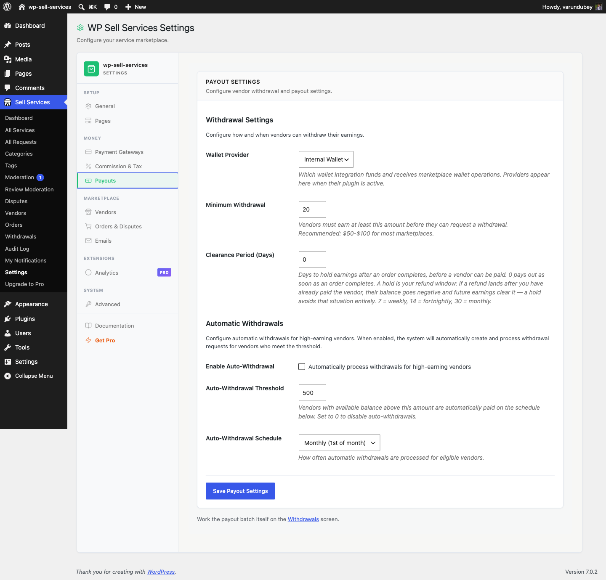

# Automated Payouts

Instead of waiting for vendors to request withdrawals manually, you can set up automatic payouts that run on a schedule -- saving time for both you and your vendors.

**Scheduled auto-withdrawals are included in the free plugin.** Pro adds bulk payment rails on top -- PayPal mass payouts and Stripe Connect -- but you do not need Pro to automate the withdrawal requests themselves.

## How Auto-Payouts Work

Once enabled, the system checks vendor balances on a regular schedule (weekly or monthly). If a vendor's available balance meets the threshold you set, a withdrawal request is created automatically. You then review and process the payment as usual.

Here is the flow:

1. You enable auto-withdrawals and set a threshold (e.g., $500)
2. On the scheduled day, the system checks every vendor's balance
3. Vendors with a balance at or above the threshold get an automatic withdrawal request
4. Both the vendor and you receive email notifications
5. You review and process the payment

## Setting Up Auto-Payouts

1. Go to **Sell Services > Settings > Payouts**
2. Scroll to the **Automatic Withdrawals** section
3. Check **Enable Auto-Withdrawal**
4. Set the **Threshold Amount** -- the minimum balance that triggers an auto-payout (default: $500)
5. Choose the **Schedule**: Weekly (every Monday), Bi-weekly (1st and 15th), or Monthly (1st of the month)
6. Click **Save Payout Settings**

### Threshold Amount

This is the minimum available balance a vendor must have for an auto-payout to trigger. You can set it anywhere from $100 to $10,000, in steps of $50. The default is $500.

**Example:**
- Threshold: $500
- Vendor A has $750 available -- auto-payout created for $750
- Vendor B has $450 available -- skipped (below threshold)

### Schedule Options

| Schedule | First run | Then every |
|----------|-----------|------------|
| **Weekly** | Next Monday | 7 days |
| **Bi-weekly** | Next 1st or 15th | 14 days |
| **Monthly** | Next 1st | 30 days |

**The schedule is an interval, not a calendar date.** Only the first run lands on
the day in the middle column. After that each run is the fixed interval later, so
a monthly schedule that starts on 1 February next runs on 3 March, then 2 April,
and drifts off the 1st permanently. If you need payouts on an exact date, run
them manually from the Withdrawals screen.

Processing runs on **Action Scheduler**, not WP-Cron. To check whether a run is
queued, go to **Tools > Scheduled Actions** and filter by the `wpss` group -- the
WP-Cron viewers will not show it.

## What Vendors Need to Do

For auto-payouts to work, vendors must have their payment method set up in their profile:

- **PayPal:** Their PayPal email address saved
- **Bank Transfer:** Bank name, account number, and routing details saved

If a vendor has not set up a payment method, the auto-payout skips them and moves on to the next vendor.

## What Happens on Payout Day

On the scheduled day, the system:

1. Finds all vendors with a balance at or above the threshold
2. Checks that each vendor has a payment method configured
3. Checks that they do not already have a pending auto-withdrawal
4. Creates withdrawal requests for eligible vendors
5. Sends notifications to both vendors and admin

Auto-withdrawal requests are flagged with an "Auto" badge in the admin panel so you can easily distinguish them from manual requests.

## Processing Auto-Payouts

Auto-payouts still need admin approval and payment processing, just like manual withdrawals:

1. Go to **Sell Services > Withdrawals**
2. You will see new auto-withdrawal requests (marked with "Auto" badge)
3. Review the request and click **Approve**
4. Send the payment via PayPal or bank transfer
5. Return and click **Mark as Completed**

This keeps you in control of when money actually leaves your account while automating the request part.

## Duplicate Prevention

The system prevents duplicate auto-withdrawals. If a vendor already has a pending or approved auto-withdrawal request, they will not get another one until the existing request is processed.

## PayPal Mass Payouts **[PRO]**

With WP Sell Services Pro, you can process PayPal payouts in bulk instead of one by one. This is especially useful if you have many vendors and want to send all approved payments at once.

## Disabling Auto-Payouts

To turn off automatic payouts:

1. Go to **Settings > Payouts**
2. Uncheck **Enable Auto-Withdrawal**
3. Click **Save Payout Settings**

Existing pending requests remain in the queue and still need processing. No new auto-withdrawals will be created.

## When Should You Use Auto-Payouts?

Auto-payouts are a good fit if:

- You have many active vendors and want to reduce manual withdrawal requests
- You want to give vendors a predictable payment schedule
- You prefer batch processing payouts on specific days

If you have just a few vendors or prefer full manual control, you can leave auto-payouts disabled and let vendors request withdrawals on their own.

## Related Docs

- [Withdrawals](withdrawals.md) -- Manual withdrawal process
- [Earnings Dashboard](earnings-dashboard.md) -- How vendors track income
- [Commission System](commission-system.md) -- How earnings are calculated
- [Withdrawal Approvals](../admin-tools/withdrawal-approvals.md) -- Admin processing guide
