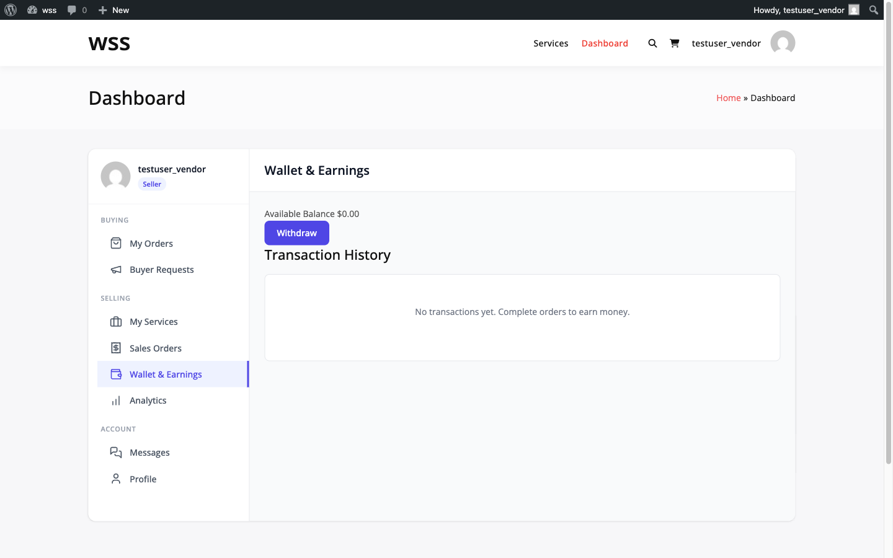
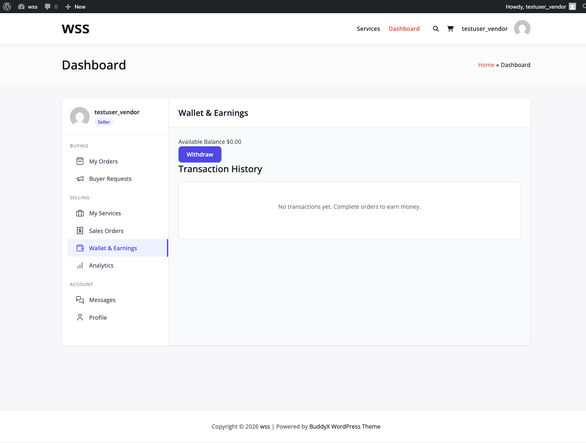

# Vendor Earnings Dashboard

Track your marketplace earnings, view pending payments, and monitor your financial performance through the vendor earnings dashboard.

## Overview

The earnings dashboard provides vendors with a comprehensive view of their financial data, including completed earnings, pending clearance, available balance, and withdrawal history.

## Accessing the Dashboard

Vendors can access their earnings dashboard from the main vendor dashboard.

### Dashboard Location

1. Log in to your vendor account
2. Go to **Dashboard → Earnings**
3. View your earnings overview

Alternatively:
- Navigate from top menu **Earnings** link
- Dashboard widget **Earnings Summary**



## Key Earnings Metrics

The dashboard displays these primary metrics:

### Total Earned

All earnings from completed orders since account creation. This is the net amount after platform commission has been deducted.

**Calculation**: Sum of `vendor_earnings` from all completed orders.

### Available Balance

Amount ready to withdraw. This represents earnings from completed orders that have passed the clearance period and are not already in a withdrawal request.

**Requirements:**
- Order status: completed
- Clearance period: passed (default 14 days)
- Not included in pending withdrawal

### Pending Clearance

Earnings from completed orders still in the clearance period. These funds are not yet available for withdrawal.

**Includes:**
- Orders in progress (status: `in_progress`)
- Orders pending approval (status: `pending_approval`)
- Orders with revision requested (status: `revision_requested`)

### Withdrawn

Total amount successfully withdrawn to your payment method. This is your lifetime withdrawal history.

### Pending Withdrawal

Total amount in pending withdrawal requests awaiting admin approval.

## Earnings Summary Display

```
┌─────────────────────────────────────────────────┐
│  Earnings Summary                               │
├─────────────────────────────────────────────────┤
│  Total Earned:           $12,450.00             │
│  Available Balance:      $ 2,670.00             │
│  Pending Clearance:      $ 1,280.00             │
│  Withdrawn:              $ 8,500.00             │
│  Pending Withdrawal:     $     0.00             │
│  ─────────────────────────────────────────────── │
│  Completed Orders:       124                    │
│                                                  │
│  [Request Withdrawal]  [View History]           │
└─────────────────────────────────────────────────┘
```

## Earnings History

View detailed transaction history for all your completed orders.



### Accessing History

1. Go to **Dashboard → Earnings**
2. Click **View History** or scroll to **Earnings History** section
3. View list of all earnings

### History Table Columns

| Column | Description |
|--------|-------------|
| **Order Number** | Unique order identifier |
| **Service Name** | Which service was purchased |
| **Amount** | Your earnings (after commission) |
| **Order Total** | Full amount buyer paid |
| **Commission Rate** | Percentage deducted |
| **Platform Fee** | Dollar amount of commission |
| **Status** | Order status |
| **Date** | Order completion date |

### Filtering History

Filter earnings by:
- **Date Range**: Custom start and end dates
- **Status**: Completed orders only
- **Service**: Specific service offerings

### Pagination

History displays 20 earnings per page by default. Use pagination controls to view more.

## Earnings by Period

View your earnings grouped by time period to track income trends.

### Available Periods

- **Daily**: Last 30 days
- **Weekly**: Last 12 weeks
- **Monthly**: Last 12 months
- **Yearly**: All years

### Period Breakdown

For each period, you see:
- Total orders completed
- Total earnings for period
- Average per order

**Example Monthly View:**

```
January 2026:   $1,890.00 (24 orders)
December 2025:  $1,540.00 (19 orders)
November 2025:  $2,120.00 (27 orders)
```

## REST API Access

Vendors can access earnings data programmatically via the REST API.

### GET /wpss/v1/earnings/summary

Retrieve your earnings summary.

**Authentication**: Required (current user)
**Permission**: Vendor with approved status

**Response:**
```json
{
  "total_earned": 12450.00,
  "available_balance": 2670.00,
  "pending_clearance": 1280.00,
  "withdrawn": 8500.00,
  "pending_withdrawal": 0.00,
  "completed_orders": 124,
  "currency": "USD"
}
```

### GET /wpss/v1/earnings/history

Get detailed earnings history.

**Parameters:**
- `page` (integer): Page number, default 1
- `per_page` (integer): Results per page, default 20, max 100
- `period` (string): Group by day/week/month/year

**Response:**
```json
{
  "items": [
    {
      "order_id": 1234,
      "order_number": "WPSS-1234",
      "service_title": "Logo Design",
      "total": 100.00,
      "vendor_earnings": 90.00,
      "commission": 10.00,
      "currency": "USD",
      "completed_at": "2026-01-15 14:30:00"
    }
  ],
  "total": 124,
  "pages": 7,
  "page": 1,
  "per_page": 20
}
```

## Clearance Period

The clearance period is the time between order completion and earnings availability.

### Default Clearance Period

**Duration**: 14 days (configurable by admin)

### Purpose

- **Buyer Protection**: Time to identify issues after delivery
- **Dispute Prevention**: Allows disputes to be filed before payout
- **Platform Security**: Reduces fraud risk

### Tracking Clearance

View when pending earnings become available:

```
Order #1234 - $90.00
Completed: January 15, 2026
Available: January 29, 2026 (in 5 days)
```

### Admin Configuration

Admins can adjust the clearance period:

1. Go to **Settings → Payments → Payout Settings**
2. Set **Clearance Period (Days)**: 0-90 days
3. Default: 14 days

## Withdrawal Requests

Track all your withdrawal requests from the earnings dashboard.

### Viewing Withdrawals

1. Go to **Dashboard → Earnings → Withdrawals**
2. View list of all withdrawal requests
3. Filter by status: pending, approved, completed, rejected

### Withdrawal Information

For each withdrawal:
- Request ID
- Amount requested
- Payment method
- Status
- Requested date
- Processing date (if approved)

### Withdrawal Status Meanings

| Status | Description |
|--------|-------------|
| **Pending** | Awaiting admin review |
| **Approved** | Approved, payment processing |
| **Completed** | Payment sent successfully |
| **Rejected** | Request denied, funds returned to balance |

## Tips Tracking

Tips from buyers are displayed separately as they are commission-free.

### Tips Display

```
Tips Received This Month: $120.00
Total Tips (Lifetime): $1,450.00
```

Tips are:
- 100% to vendor (no commission)
- Available immediately (no clearance period)
- Tracked separately in reports

## Currency Display

All amounts are displayed in your marketplace's configured currency.

**Currency Settings**:
- Configured by admin in **Settings → General**
- Default: USD
- Displayed throughout dashboard

## Troubleshooting

### Balance Not Updating

**Check:**
1. Order status is "completed"
2. Commission has been calculated
3. Browser cache cleared
4. No pending disputes on orders

**Solution**: Refresh dashboard or clear browser cache.

### Wrong Amount Showing

**Verify:**
1. Correct commission rate applied
2. All orders counted
3. Withdrawals subtracted correctly
4. No refunded orders included

**Solution**: Review earnings history for discrepancies.

### Pending Earnings Not Clearing

**Check:**
1. Clearance period duration (default 14 days)
2. Order completion date
3. Days since completion
4. Admin clearance settings

**Solution**: Wait for clearance period or contact admin if unreasonable delay.

### Cannot Access Dashboard

**Verify:**
1. Logged in as vendor
2. Vendor account approved (not pending)
3. User role has `wpss_vendor` capability
4. No account restrictions

**Solution**: Contact admin if account issues persist.

## Developer Notes

### Database Tables

Earnings data is stored in:
- `wpss_orders`: Order and earnings records
- `wpss_withdrawals`: Withdrawal requests

### Key Functions

**Get earnings summary:**
```php
$earnings_service = new \WPSellServices\Services\EarningsService();
$summary = $earnings_service->get_summary( $vendor_id );
```

**Get earnings history:**
```php
$history = $earnings_service->get_history( $vendor_id, array(
    'limit' => 20,
    'offset' => 0,
    'status' => 'completed'
) );
```

**Get earnings by period:**
```php
$monthly = $earnings_service->get_by_period( $vendor_id, 'month', 12 );
```

### Hooks

**`wpss_earnings_summary`**

Filter earnings summary data:

```php
add_filter( 'wpss_earnings_summary', function( $summary, $vendor_id ) {
    // Modify summary data
    return $summary;
}, 10, 2 );
```

**`wpss_earnings_history`**

Filter earnings history:

```php
add_filter( 'wpss_earnings_history', function( $history, $vendor_id ) {
    // Modify history data
    return $history;
}, 10, 2 );
```

## Next Steps

- **Request Withdrawal**: Learn how to [request withdrawals](withdrawals.md)
- **Commission System**: Understand [commission calculations](commission-system.md)
- **Automated Payouts**: Set up [automated withdrawals](automated-payouts.md) **[PRO]**
- **Vendor Dashboard**: Explore the full [vendor dashboard](../vendor-system/vendor-dashboard.md)
