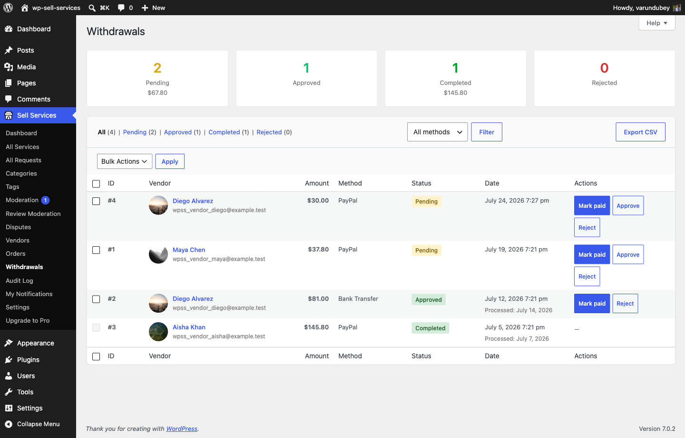

# Paying Your Vendors

This page is the map of how money reaches your vendors: what the platform keeps,
what the vendor is owed, and every route you can use to actually pay them.

## The golden rule: you never need an integration

**You can run a complete marketplace and pay every vendor without connecting any
payment integration at all.**

1. Go to **Sell Services > Withdrawals**.
2. Read each vendor's owed balance, or export what is owed.
3. Pay them however you already do -- bank transfer, Wise, PayPal by hand, cash.
4. Mark the payout **Paid**. The ledger records the debit and the balance clears.

Automated rails are **opt-in and never required**. Payout timing defaults to
owner-triggered: nothing leaves your account until you decide, on every rail.

If you take one thing from this page, take that. Everything below is a
convenience on top of it.

## The payout rails

| Rail | How it works | When to use it | Plugin |
|------|--------------|----------------|--------|
| **Manual / mark-paid** | Read or export owed balances, pay externally, mark paid. | Always available. The zero-integration default. | Free |
| **Scheduled auto-withdrawals** | The plugin raises withdrawal requests on a schedule when a vendor passes a threshold. You still approve and pay. | You want to stop chasing withdrawal requests but keep control of payment. | Free |
| **PayPal mass payouts** | Batch-pay every vendor who has a PayPal payout email, in one request. | You already collect with PayPal and want batch payouts. | **[PRO]** |
| **Stripe Connect** | Vendors onboard to Stripe. The platform fee is taken at charge time and the remainder settles to the vendor automatically. | You want hands-off, per-transaction settlement. | **[PRO]** |

Every rail settles against the **same wallet ledger**, so balances stay correct
no matter how you pay -- and you can mix rails across vendors.

## How the split is decided

The platform fee and the vendor's earnings are calculated **once**, at payment
time, and stored on the order. Every downstream surface -- the earnings
dashboard, withdrawals, analytics, refunds, and the Stripe Connect application
fee -- reads that stored figure rather than recalculating it.

That is deliberate. If each surface re-derived the split, a commission-rate
change would silently rewrite the history of orders already paid. Because the
number is persisted, an order settled at 10% stays settled at 10% forever.

See [Commission System](commission-system.md) for how the rate is chosen, and
[Tiered Commission Rules](tiered-commission.md) **[PRO]** for rules that resolve
by category, seller level, or volume.

## Stripe Connect **[PRO]**

When Stripe Connect is enabled and a vendor has completed Connect onboarding,
each qualifying charge computes the platform application fee from your
commission rules and routes the vendor's share to their connected account.

The settlement is recorded on the order so the wallet ledger can offset it. A
refund reverses the ledger **only when Stripe actually reclaimed the money** --
this is what prevents a vendor being paid twice for the same order.

Vendors who never connect are not blocked. Their orders work normally, earnings
accrue in the standard ledger, and they request withdrawals like any other
vendor.

See [Stripe Connect Split Payments](../payments-checkout/stripe-connect.md).

## PayPal mass payouts **[PRO]**

Vendors set a payout email on their profile. From the payouts screen you select
the owed balances and send a single PayPal Payouts batch. Each payout settles on
the wallet ledger, so a vendor's owed balance is reduced **exactly once**.

A submitted batch can be re-synced against PayPal to reconcile its real status,
so a batch that partially failed does not leave the ledger disagreeing with
reality.

## Refunds and debt netting

A refund reverses the vendor earnings and the platform fee **proportionally**,
to the currency's precision. Refund half an order, and half of both the fee and
the earnings come back.

If a vendor has already been paid out when the refund lands, the reversal becomes
**debt** that nets against their next earnings. Balances never silently go wrong,
and a vendor never ends up owing you money they have no way to see -- the debt is
visible on their earnings dashboard and clears itself from future sales.

## Choosing a setup

- **Just starting, few vendors** -- manual mark-paid. Nothing to configure, nothing to break.
- **Growing, still want control** -- turn on scheduled auto-withdrawals. Requests get raised for you; you approve and pay.
- **Many vendors, PayPal-based** -- add PayPal mass payouts to batch the payments.
- **High volume, want it hands-off** -- Stripe Connect, so each sale settles itself.

You can move between these at any time. Because every rail writes to the same
ledger, switching does not orphan balances.

## Related

- [Withdrawal Requests & Methods](withdrawals.md)
- [Automated Payouts](automated-payouts.md)
- [Vendor Earnings Dashboard](earnings-dashboard.md)
- [Withdrawal Approvals](../admin-tools/withdrawal-approvals.md)
- [Money Flow](https://github.com/vapvarun/wp-sell-services/blob/main/docs/architecture/MONEY-FLOW.md) -- the architecture behind all of this
