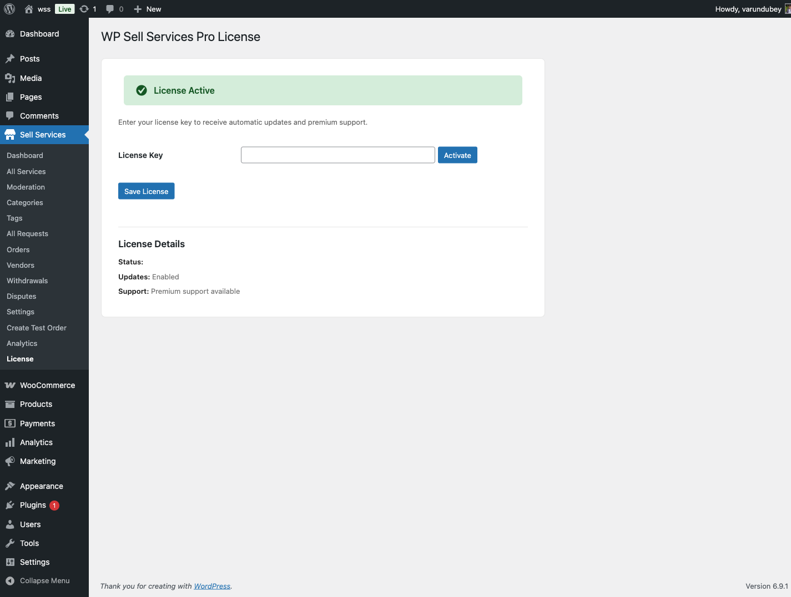

# Free vs Pro Feature Comparison

WP Sell Services Free provides a complete, production-ready marketplace platform. The Pro version extends it with additional e-commerce platform support, direct payment gateways, wallet integrations, analytics dashboards, cloud storage, and removed service creation limits.

## Overview

**Free Version**: A full marketplace solution including service listings, order management, requirements workflow, delivery system, reviews, messaging, disputes, buyer requests, vendor dashboards, buyer dashboards, 4 seller levels, 20 REST API controllers, 6 Gutenberg blocks, WooCommerce integration, and 8 email notification types.

**Pro Version**: Everything in Free, plus unlimited service creation limits, 4 additional e-commerce platforms (EDD, FluentCart, SureCart, Standalone), direct payment gateways (Stripe, PayPal, Razorpay, Offline), 4 wallet provider integrations, advanced analytics with data export, cloud storage providers (S3, GCS, DigitalOcean Spaces), and 4 additional REST API controllers.

### Quick Comparison

| Aspect | Free | Pro |
|--------|------|-----|
| **Core Marketplace** | Complete | Complete |
| **E-commerce Platform** | WooCommerce only | WooCommerce + 4 alternatives |
| **Service Creation Limits** | Conservative limits | Unlimited |
| **Payment Gateways** | Via WooCommerce | Direct Stripe, PayPal, Razorpay |
| **Commission** | Global + per-vendor rates | Same (both versions support per-vendor) |
| **Analytics** | Basic vendor stats | Advanced dashboards + export |
| **File Storage** | Local server | Local + cloud providers |
| **Wallet Providers** | Built-in earnings tracking | 4 wallet integrations |

---

## Service Creation Limits

The free version applies conservative limits to service creation. Pro removes these limits via filters.

| Feature | Free | Pro |
|---------|------|-----|
| **Packages per Service** | 3 (Basic, Standard, Premium) | 3 (same structure) |
| **Gallery Images** | 4 additional images | Unlimited |
| **Videos** | 1 video URL | 3 video URLs |
| **FAQs** | 5 per service | Unlimited |
| **Add-ons/Extras** | 3 per service | Unlimited |
| **Buyer Requirements** | 5 per service | Unlimited |
| **Draft Services** | Unlimited | Unlimited |
| **Active Services per Vendor** | Configurable (default 20) | Configurable (default 20) |

### How Limits Work

Limits are enforced through the service creation wizard and controlled via WordPress filters. The free version sets default limits in `ServiceWizard::init_limits()`, and Pro removes them through the `WizardEnhancer` class.

**Free version defaults:**
- `wpss_service_max_gallery` = 4
- `wpss_service_max_videos` = 1
- `wpss_service_max_extras` = 3
- `wpss_service_max_faq` = 5
- `wpss_service_max_requirements` = 5

**Pro overrides** set gallery, extras, FAQs, and requirements to -1 (unlimited) and videos to 3.

When a limit is reached in the free version, the wizard displays a message suggesting an upgrade to Pro.

### Packages

Both versions support 3 pricing packages (Basic, Standard, Premium) per service. Each package includes a custom name, description, price, delivery time, number of revisions, and a features list. The package count of 3 is the same in both versions.

---

## E-Commerce Platform Support

| Platform | Free | Pro |
|----------|------|-----|
| **WooCommerce** | Supported | Supported |
| **Easy Digital Downloads (EDD)** | -- | **[PRO]** |
| **FluentCart** | -- | **[PRO]** |
| **SureCart** | -- | **[PRO]** |
| **Standalone Mode** | -- | **[PRO]** |

### Free Version: WooCommerce

The free version integrates with WooCommerce for checkout and payments. WP Sell Services creates a virtual carrier product during activation, and service orders are processed through the WooCommerce checkout flow. All WooCommerce-compatible payment gateways work automatically.

### Pro Version: 4 Additional Platforms **[PRO]**

**Easy Digital Downloads (EDD)** -- Lightweight alternative to WooCommerce, designed for digital products. Includes account, checkout, order, and product provider classes.

**FluentCart** -- Modern, conversion-optimized checkout experience with lower overhead than WooCommerce.

**SureCart** -- Cloud-hosted checkout solution with built-in PCI compliance.

**Standalone Mode** -- No external e-commerce plugin required. Includes a built-in checkout system with direct payment gateway integration (Stripe, PayPal, Razorpay, Offline payments).

The e-commerce platform is selected in **Settings → General → E-Commerce Platform**. The recommended "Auto-detect" setting automatically selects the first available active platform.

---

## Payment Gateways

| Gateway | Free | Pro |
|---------|------|-----|
| **WooCommerce Gateways** | All WC gateways | All WC gateways |
| **Stripe Direct** | Via WooCommerce | **[PRO]** Direct integration |
| **PayPal Direct** | Via WooCommerce | **[PRO]** Direct integration |
| **Razorpay Direct** | Via WooCommerce | **[PRO]** Direct integration |
| **Offline Payments** | Via WooCommerce | **[PRO]** Direct with proof upload |

### Free Version

Payments are handled entirely through WooCommerce. Any payment gateway that works with WooCommerce (Stripe, PayPal, Square, bank transfer, etc.) works with WP Sell Services automatically.

### Pro Version **[PRO]**

Pro adds direct payment gateway classes that work independently of WooCommerce, primarily useful in Standalone mode:

- **StripeGateway** -- Direct Stripe API integration
- **PayPalGateway** -- PayPal Commerce Platform
- **RazorpayGateway** -- Razorpay for India and Southeast Asia
- **OfflineGateway** -- Bank transfer, cash, and other offline methods with payment proof upload

Each gateway class manages its own settings tab, configuration, and payment processing.

---

## Earnings and Wallet System

### Commission (Both Versions)

Both the free and Pro versions include the same commission system:

| Feature | Free | Pro |
|---------|------|-----|
| **Global Commission Rate** | 0-50% (default 10%) | 0-50% (default 10%) |
| **Per-Vendor Custom Rates** | Supported (enabled by default) | Supported (enabled by default) |
| **Commission on Tips** | Tips are commission-free | Tips are commission-free |

Per-vendor commission rates are a feature of the free version, not Pro-only. When enabled in settings, administrators can set custom rates for individual vendors through vendor profiles.

### Earnings Tracking

The free version includes a built-in earnings tracking system. Vendor earnings, platform fees, withdrawal requests, and clearance periods are all managed through the core plugin's database tables (`wpss_earnings`, `wpss_withdrawals`).

### Wallet Providers **[PRO]**

| Provider | Free | Pro |
|----------|------|-----|
| **Built-in earnings/withdrawals** | Included | Included |
| **Internal Wallet** | -- | **[PRO]** |
| **TeraWallet** | -- | **[PRO]** |
| **WooWallet** | -- | **[PRO]** |
| **MyCred** | -- | **[PRO]** |

The free version handles earnings and withdrawals through its built-in system. The Pro version adds 4 wallet provider integrations managed through a `WalletManager` class, allowing vendors to use third-party wallet plugins for balance management and payouts.

### Payout Settings (Both Versions)

Both versions support the same payout configuration:

- Minimum withdrawal amount (default $50)
- Clearance period (default 14 days)
- Auto-withdrawal with threshold and schedule (weekly/bi-weekly/monthly)

---

## Analytics and Reporting

| Feature | Free | Pro |
|---------|------|-----|
| **Vendor Basic Stats** | Order counts, earnings, rating | Order counts, earnings, rating |
| **Admin Basic Stats** | Total orders, revenue overview | Total orders, revenue overview |
| **Analytics Dashboard** | -- | **[PRO]** Full dashboard with widgets |
| **Revenue Charts** | -- | **[PRO]** Interactive visualizations |
| **Data Collectors** | -- | **[PRO]** Orders, Services, Vendors, Revenue |
| **Data Export** | -- | **[PRO]** Export reports |
| **Vendor Analytics API** | -- | **[PRO]** REST endpoint |

### Free Version

The free version provides basic statistics through the vendor dashboard (active orders, completed orders, total earnings, current balance, average rating) and the admin panel (total orders, revenue, vendor counts).

### Pro Version **[PRO]**

Pro adds an `AnalyticsManager` with dedicated data collectors (OrdersCollector, ServicesCollector, VendorsCollector, RevenueCollector) and dashboard widgets (OrdersWidget, RevenueWidget, TopServicesWidget, TopVendorsWidget). Reports can be exported through the `DataExporter` class. A dedicated `VendorAnalyticsController` REST API endpoint provides programmatic access to analytics data.

---

## Cloud Storage **[PRO]**

| Provider | Free | Pro |
|----------|------|-----|
| **Local Server** | Default | Default |
| **Amazon S3** | -- | **[PRO]** |
| **Google Cloud Storage** | -- | **[PRO]** |
| **DigitalOcean Spaces** | -- | **[PRO]** |

### Free Version

All files (service images, delivery attachments) are stored on the WordPress server using the standard media library and `/wp-content/uploads/` directory.

### Pro Version **[PRO]**

Pro adds cloud storage provider classes (`S3Storage`, `GCSStorage`, `DigitalOceanStorage`) that implement a `StorageProviderInterface`. These are registered via the `wpss_storage_providers` filter. A `StorageController` REST API endpoint provides upload, download URL, and delete operations.

**Note**: Cloud storage providers exist as code in the Pro plugin, but the integration is still being developed. Check the latest release notes for current availability.

---

## Seller Levels (Both Versions)

Both versions include the same 4-tier seller level system:

| Level | Requirements |
|-------|-------------|
| **New Seller** | Default for new vendors |
| **Level 1 Seller** | 5+ orders, 4.0+ rating, 3+ reviews, 80% response/delivery rate, 30+ days active |
| **Level 2 Seller** | 25+ orders, 4.5+ rating, 10+ reviews, 90% response/delivery rate, 90+ days active |
| **Top Rated Seller** | 100+ orders, 4.8+ rating, 50+ reviews, 95% response/delivery rate, 180+ days active |

Seller levels are calculated automatically based on vendor performance metrics. Level promotions trigger email notifications to vendors. The level system is part of the free version core, not a Pro-only feature.

---

## REST API

| Component | Free | Pro |
|-----------|------|-----|
| **Core Controllers** | 20 controllers | 20 controllers |
| **WalletController** | -- | **[PRO]** Balance, transactions, withdraw |
| **PaymentController** | -- | **[PRO]** Stripe, PayPal, Razorpay, status |
| **VendorAnalyticsController** | -- | **[PRO]** Revenue, orders, services, export |
| **StorageController** | -- | **[PRO]** Upload, download URL, delete |
| **Batch Endpoint** | Up to 25 sub-requests | Up to 25 sub-requests |

The free version provides 20 REST API controllers covering services, orders, reviews, vendors, conversations, disputes, buyer requests, proposals, notifications, portfolio, earnings, extension requests, milestones, tipping, seller levels, moderation, favorites, media, cart, and authentication. Pro adds 4 additional controllers for wallet, payments, vendor analytics, and storage operations.

---

## Wizard Features **[PRO]**

The service creation wizard in Pro enables additional features beyond limit removal:

| Feature | Free | Pro |
|---------|------|-----|
| **AI Title Suggestions** | -- | **[PRO]** Registered in wizard |
| **Service Templates** | -- | **[PRO]** Registered in wizard |
| **Bulk Image Upload** | -- | **[PRO]** Registered in wizard |
| **Direct Video Upload** | -- | **[PRO]** Registered in wizard |
| **Custom Fields in Packages** | -- | **[PRO]** Registered in wizard |
| **Scheduled Publishing** | -- | **[PRO]** Registered in wizard |

These features are registered as flags in the `wpss_service_wizard_features` filter by the Pro `WizardEnhancer` class. They enable additional UI elements and functionality in the service creation wizard.

---

## What Free Includes

The free version is a complete, production-ready marketplace:

- Unlimited service listings per vendor (up to configurable max)
- Complete order workflow with 10+ statuses
- Requirements collection and submission
- Delivery management with revision requests
- Built-in messaging system with file attachments
- 5-star review and rating system
- Dispute resolution with admin mediation
- Buyer request system with vendor proposals
- Unified dashboard for buyers and vendors
- 4-tier seller level system
- Portfolio showcase for vendors
- Vacation mode for vendors
- Deadline extension requests
- Tipping system
- 8 configurable email notification types
- In-app notification system
- 10 supported currencies
- WooCommerce integration for checkout
- 6 Gutenberg blocks
- Template override system for theme customization
- SEO optimization
- 20 REST API controllers with batch endpoint
- WP-CLI commands
- Commission with per-vendor rate support
- Earnings tracking and withdrawal management
- Auto-withdrawal scheduling
- Tax configuration

**Best for**: New marketplaces, WooCommerce-based sites, smaller platforms, and projects where the service creation limits (4 gallery images, 3 extras, 5 FAQs, 1 video) are sufficient.

---

## What Pro Adds

Pro extends Free with premium capabilities:

- **Removed limits**: Unlimited gallery images, extras, FAQs, requirements; 3 videos
- **E-commerce platforms**: EDD, FluentCart, SureCart, Standalone mode
- **Direct payment gateways**: Stripe, PayPal, Razorpay, Offline
- **Wallet providers**: Internal, TeraWallet, WooWallet, MyCred
- **Analytics dashboards**: Revenue, orders, services, and vendors widgets with data export
- **Cloud storage**: Amazon S3, Google Cloud Storage, DigitalOcean Spaces
- **Wizard features**: AI title suggestions, service templates, bulk upload, video upload, custom fields, scheduled publishing
- **4 additional REST API controllers**: Wallet, Payment, Vendor Analytics, Storage
- **License management**: EDD Software Licensing for updates and support

**Best for**: Growing marketplaces that need e-commerce platform flexibility, automated wallet-based payouts, detailed analytics, or vendors who need unlimited service media and add-ons.

---

## Upgrade Path

Upgrading from Free to Pro preserves all existing data. No migration is required.

1. Install and activate the free version (if not already active)
2. Upload and activate `wp-sell-services-pro.zip`
3. Enter your license key in **WP Sell Services → Settings → License**
4. Pro features become available immediately

The Pro plugin extends the free plugin via WordPress hooks. Both plugins remain active simultaneously -- Pro does not replace Free.

---

## Frequently Asked Questions

**Q: Can I upgrade from Free to Pro later?**

A: Yes. Install the Pro plugin alongside the free version at any time. All existing services, orders, vendors, and settings are preserved.

**Q: Do I need WooCommerce with Pro?**

A: No. Pro includes Standalone mode that works without any e-commerce plugin. You can also use EDD, FluentCart, or SureCart instead of WooCommerce.

**Q: Is per-vendor commission a Pro feature?**

A: No. Per-vendor commission rates are available in the free version. The setting is enabled by default and allows administrators to override the global rate for individual vendors.

**Q: What happens if my Pro license expires?**

A: Your site continues working with all Pro features. You will not receive updates or support until you renew.

**Q: What are the actual free version limits?**

A: 4 gallery images, 1 video, 3 add-ons, 5 FAQs, and 5 buyer requirements per service. Packages are limited to 3 in both versions. Active services per vendor are configurable (default 20) in both versions.

---

## Next Steps

- **[Installation Guide](installation.md)** -- Install WP Sell Services
- **[Initial Setup](initial-setup.md)** -- Configure your marketplace
- **[General Settings](../platform-settings/general-settings.md)** -- Platform configuration details
- **[Creating Services](../service-creation/service-wizard.md)** -- Vendor guide to creating services
- **[Order Workflow](../order-management/order-lifecycle.md)** -- Understand how orders work
