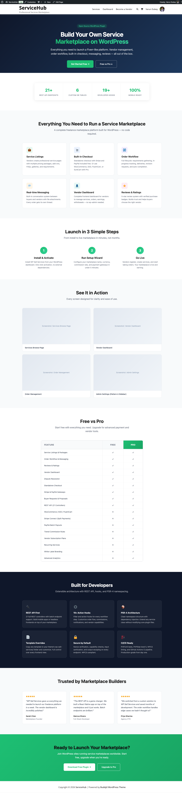

# Free vs Pro: Feature Comparison

The free version of WP Sell Services is a complete, production-ready marketplace. The Pro version removes limits and adds advanced tools for growing platforms. Here is exactly what you get with each.

## At a Glance

| | Free | Pro |
|-|------|-----|
| **Marketplace** | Complete -- services, orders, messaging, reviews, disputes | Everything in Free |
| **Checkout** | Built-in standalone (no other plugins needed) | + WooCommerce, EDD, FluentCart |
| **Payment gateways** | Stripe, PayPal, Offline | + Razorpay |
| **Service creation limits** | Conservative (see below) | Unlimited |
| **Analytics** | Basic stats | Full dashboards; CSV export on the admin screen |
| **File storage** | Your server | Your server. Cloud buckets can be configured but do not yet receive delivery files |
| **Wallet integrations** | Built-in wallet, earnings and withdrawals | Same, plus the option to hold balances in TeraWallet or MyCred instead |

---

## Complete Feature Comparison

### Core Marketplace (Included in Both Free and Pro)

All of these are fully available in both versions -- nothing is held back:

- Service listings with categories, tags, and search
- 3-tier pricing packages (Basic, Standard, Premium)
- Complete order workflow (10+ statuses) with messaging and file attachments
- Delivery management with revisions and deadline extensions
- 5-star reviews, dispute resolution, and buyer requests with proposals
- Vendor and buyer dashboards, 4 seller levels (New Seller, Rising Seller, Top Rated, Pro Seller), portfolios, vacation mode
- Tipping system, in-app notifications, and 24 switchable email notification types
- 6 page-building blocks, mobile-responsive templates, and theme customization

### Service Creation Limits

| Feature | Free | Pro |
|---------|------|-----|
| Pricing packages per service | 3 | 3 |
| Gallery images | 4 | Unlimited **[PRO]** |
| Video embeds | 1 | 1 |
| Add-ons/extras | 3 | Unlimited **[PRO]** |
| FAQs | 5 | Unlimited **[PRO]** |
| Buyer requirements | 5 | Unlimited **[PRO]** |
| Active services per vendor | Configurable (default 20) | Configurable (default 20) |

### Checkout and E-Commerce Platforms

| Platform | Free | Pro |
|----------|------|-----|
| Standalone checkout (built-in, no plugins needed) | Yes | Yes |
| WooCommerce | -- | **[PRO]** |
| Easy Digital Downloads (EDD) | -- | **[PRO]** |
| FluentCart | -- | **[PRO]** |

### Payment Gateways

| Gateway | Free | Pro |
|---------|------|-----|
| Stripe (with 3D Secure) | Yes | Yes |
| PayPal | Yes | Yes |
| Offline payments (bank transfer, cash, with proof upload) | Yes | Yes |
| Razorpay | -- | **[PRO]** |
| All WooCommerce-compatible gateways (via WC adapter) | -- | **[PRO]** |

### Commission and Earnings

Free covers the complete flat-commission and manual-withdrawal path: global commission rates (0-50%), per-vendor custom rates, earnings tracking, withdrawal management, minimum withdrawal amounts, clearance periods, automatic withdrawal scheduling, and a separate commission rate for tips. You can run a marketplace and pay every vendor on Free alone.

An owner can therefore pay every vendor with **zero integrations** using Free alone. Pro adds the commission rules engine and *automated* payout rails on top:

| Feature | Free | Pro |
|---------|------|-----|
| Flat commission rate (global + per-vendor) | Yes | Yes |
| Earnings tracking and wallet ledger | Yes | Yes |
| Manual withdrawal requests and approvals | Yes | Yes |
| Mark a withdrawal paid (wallet-debiting, idempotent) | Yes | Yes |
| Export what is owed as CSV for bank / PayPal bulk upload | Yes | Yes |
| Tiered commission rules | -- | **[PRO]** |
| Subscription-plan commission override | -- | **[PRO]** |
| Stripe Connect automated vendor payouts | -- | **[PRO]** |
| PayPal mass payouts (batch) | -- | **[PRO]** |
| Per-vendor payout profiles and methods | -- | **[PRO]** |

### Wallet Integrations

| Provider | Free | Pro |
|----------|------|-----|
| Built-in earnings and withdrawals | Yes | Yes |
| Built-in wallet (earnings, balances, withdrawals) | Yes | Yes |
| TeraWallet | -- | **[PRO]** |
| WooWallet | -- | **[PRO]** |
| MyCred | -- | **[PRO]** |

### Analytics and Reporting

| Feature | Free | Pro |
|---------|------|-----|
| Vendor stats (orders, earnings, rating) | Yes | Yes |
| Admin stats (total orders, revenue) | Yes | Yes |
| Analytics dashboards with widgets | -- | **[PRO]** |
| Revenue and performance charts | -- | **[PRO]** |
| Data export (CSV/PDF) | -- | **[PRO]** |

### Cloud Storage

> **Not yet connected to deliveries.** These drivers exist and their connection
> test really does reach your bucket, but delivery files are still stored in the
> WordPress media library. The bucket is currently reachable only through the
> REST API. Do not upgrade for this alone.

| Provider | Free | Pro |
|----------|------|-----|
| Local server storage | Yes | Yes |
| Amazon S3 | -- | **[PRO]**, API only |
| Google Cloud Storage | -- | **[PRO]**, API only |
| DigitalOcean Spaces | -- | **[PRO]**, API only |

### Service Wizard

| Feature | Free | Pro |
|---------|------|-----|
| 6-step service creation wizard | Yes | Yes |
| Raised media, add-on, FAQ and requirement limits | -- | **[PRO]** (see the limits table above) |

What Pro changes in the wizard is the **limits**, not the steps. Vendors get the
same six-step flow either way; Pro simply stops capping how much they can add.

> AI title suggestions, service templates, bulk image upload, direct video
> upload, custom package fields and scheduled publishing have been listed as Pro
> wizard features in the past. **None of them exist.** The placeholder flags were
> removed from the plugin in 1.7.0, so there is nothing to enable and no filter
> to look for.

### Advanced Pro Features

| Feature | Free | Pro |
|---------|------|-----|
| Vendor Subscription Plans (paid vendor tiers) | -- | **[PRO]** |
| PayPal Mass Payouts (batch vendor payouts) | -- | **[PRO]** |
| Stripe Connect (direct vendor payments) | -- | **[PRO]** |
| Tiered Commission Rules (category/volume/level-based rates) | -- | **[PRO]** |
| White-Label Branding (rebrand the marketplace) | -- | **[PRO]** |
| Display Currency (show prices in the shopper's currency) | -- | **[PRO]** |
| Push notifications to members' phones (Firebase) | -- | **[PRO]** |
| Recurring Services (subscription billing for services) | -- | Not enabled in 1.6.0 |

**Recurring Services** ships behind a default-off feature flag in 1.6.0 and its
UI is hidden. Do not buy Pro for recurring billing yet -- see
[Recurring Services](../order-management/recurring-services.md).

---

## Who Should Use Free?

The free version is a strong choice if you are:

- Launching a new marketplace and want to test the concept
- Running a smaller platform where 4 gallery images and 3 add-ons per service are enough
- Looking for a standalone solution that works without WooCommerce or any other e-commerce plugin
- On a budget but still need a professional, complete marketplace

## Who Should Upgrade to Pro?

Pro makes sense when you need:

- **Unlimited service media and add-ons** -- Your vendors need more gallery images, videos, FAQs, or extras
- **WooCommerce or other e-commerce integration** -- You already use WooCommerce, EDD or FluentCart
- **Razorpay payments** -- Popular for marketplaces in India and Southeast Asia
- **Wallet-based payouts** -- Integrate with TeraWallet, WooWallet, or MyCred for vendor balances
- **Detailed analytics** -- Revenue charts, performance dashboards, and data export
- **Cloud file storage** -- configurable for S3, Google Cloud or DigitalOcean, but **not yet connected to deliveries**. Do not upgrade for this alone.

## Upgrading from Free to Pro

Upgrading preserves all your existing data. Nothing is lost.

1. Keep the free version active (both plugins run together)
2. Upload and activate the Pro plugin
3. Enter your license key in **Sell Services > License**
4. Pro features are available immediately

---

## Frequently Asked Questions

**Can I start with Free and upgrade later?**
Yes. Install Pro at any time. All existing services, orders, vendors, reviews, and settings stay exactly as they are.

**Do I need WooCommerce?**
No. The free version includes its own checkout with Stripe, PayPal, and offline payment support. WooCommerce is entirely optional and only available as a Pro integration.

**What happens if my Pro license expires?**
Your **marketplace** keeps running -- services, orders, messaging, deliveries, disputes, reviews, commission, earnings, and withdrawals all live in the free plugin and are unaffected. But **Pro features stop loading** until you renew: Stripe Connect, wallets, tiered commission, vendor subscriptions, white label, cloud storage, analytics, display currency, and the raised service limits. No data is deleted, and reactivating restores everything as it was. See [License Activation](pro-license.md).

**Is per-vendor commission a Pro feature?**
No. Per-vendor commission rates are included in the free version. You can set different rates for individual vendors right out of the box. Pro adds *tiered* rules that resolve automatically by category, seller level, or sales volume.

**Are automatic withdrawals a Pro feature?**
No. Scheduled auto-withdrawals ship in the free plugin. Pro adds the bulk payment rails on top -- PayPal mass payouts and Stripe Connect.

---

## Next Steps

- **[Install the plugin](installation.md)** -- Get started in minutes
- **[Run initial setup](initial-setup.md)** -- Configure your marketplace
- **[Create your first service](../service-creation/service-wizard.md)** -- See the vendor experience
