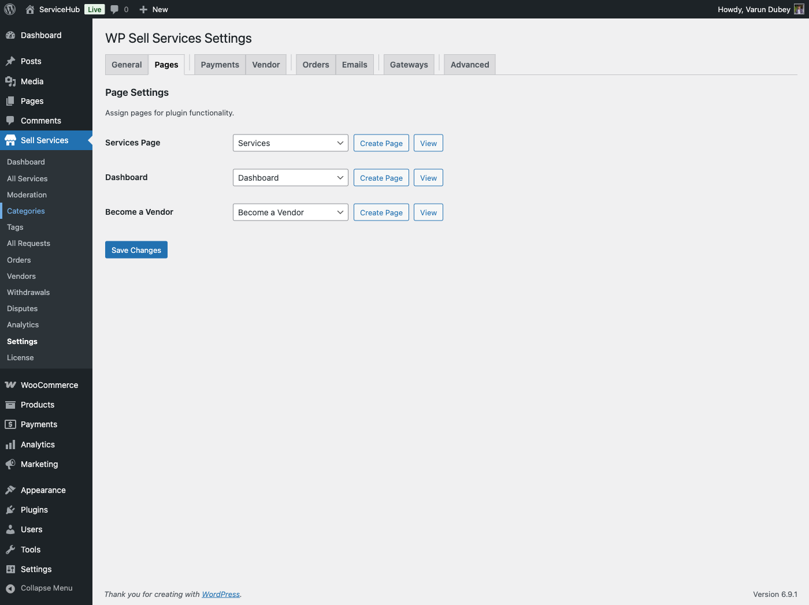
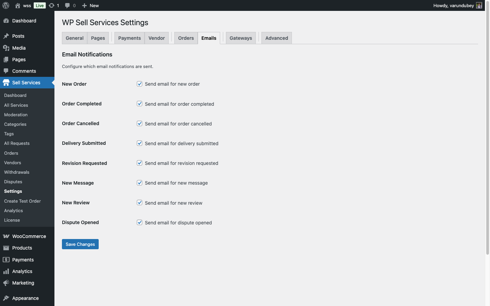
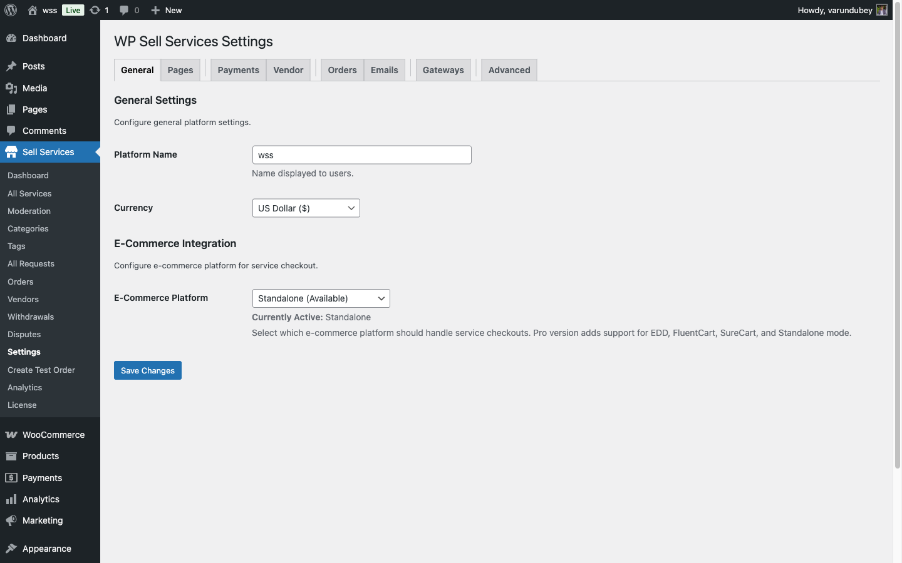

# Initial Setup Guide

After installing WP Sell Services, follow this step-by-step guide to configure your marketplace and get it ready for vendors and buyers.

## Setup Checklist

Use this checklist to track your progress:

- [ ] Configure required pages
- [ ] Set commission rates
- [ ] Enable vendor registration
- [ ] Configure email notifications
- [ ] Test WooCommerce payments
- [ ] Create sample service (test)
- [ ] Customize appearance settings
- [ ] Set up vendor approval workflow

## Step 1: Configure Required Pages

WP Sell Services needs several pages to function. The setup wizard creates these automatically, but you can also create them manually.

### Create Pages

Go to **WP Sell Services → Settings → Pages** and create/select these pages:

| Page | Shortcode | Purpose |
|------|-----------|---------|
| **Services** | `[wpss_services]` | Browse all services |
| **Dashboard** | `[wpss_dashboard]` | Unified dashboard for buyers and vendors |
| **Become a Vendor** | `[wpss_vendor_registration]` | Vendor signup form |
| **Buyer Requests** | `[wpss_buyer_requests]` | Browse buyer requests |
| **Post Request** | `[wpss_post_request]` | Create buyer request |
| **My Orders** | `[wpss_my_orders]` | Order history |
| **Login** | `[wpss_login]` | Custom login page (optional) |
| **Register** | `[wpss_register]` | Custom registration (optional) |

### Automatic Page Creation

Click **Create Default Pages** to automatically generate all required pages with proper shortcodes and titles.

### Add Pages to Navigation Menu

1. Go to **Appearance → Menus**
2. Add these pages to your main menu:
   - Services
   - Become a Vendor
   - Buyer Requests
3. Create a user menu (for logged-in users) with:
   - Dashboard
   - My Orders

## Step 2: Set Commission Rates

Configure how much commission you earn on each sale.

### Global Commission

Go to **WP Sell Services → Settings → Commission**:

1. **Commission Type**: Choose `Percentage` or `Flat Rate`
2. **Commission Rate**: Enter your rate (e.g., `10` for 10% or `5.00` for $5 flat)
3. **Tax on Commission**: Choose whether marketplace owner pays tax on commission
4. **Apply Commission To**: Select `Order Total` or `Service Price Only` (excludes add-ons)

**Example Calculation (10% percentage):**
- Service Price: $100
- Add-ons: $20
- Total: $120
- Commission (10%): $12
- Vendor Earnings: $108

### Per-Vendor Commission **[PRO]**

In Pro, set custom rates per vendor:

1. Go to **Users → All Users**
2. Click **Edit** on a vendor
3. Scroll to **WP Sell Services Vendor Settings**
4. Enable **Custom Commission Rate**
5. Set vendor-specific rate

## Step 3: Configure Vendor Settings

Control how vendors join and operate on your marketplace.

Go to **WP Sell Services → Settings → Vendor**:

### Vendor Registration

| Setting | Options | Recommended |
|---------|---------|-------------|
| **Allow Registration** | Enable/Disable | Enable |
| **Auto Approve Vendors** | Yes/No | No (manual approval for quality) |
| **Require Email Verification** | Yes/No | Yes |
| **Vendor Application Form** | Enable/Disable | Enable (collect vendor info) |

### Service Moderation

| Setting | Purpose |
|---------|---------|
| **Auto Approve Services** | Publish services immediately or require admin review |
| **Max Active Services** | Limit services per vendor (0 = unlimited) |
| **Allow Service Editing** | Let vendors edit published services |
| **Require Featured Image** | Make service images mandatory |

### Vendor Levels

Enable vendor levels (Basic, Verified, Pro):

1. Check **Enable Vendor Levels**
2. Set benefits per level:
   - Max active services
   - Commission rate adjustment
   - Featured badge
   - Priority support

## Step 4: Configure Email Notifications

Set up automated emails for orders, deliveries, and disputes.

Go to **WP Sell Services → Settings → Emails**:

### Sender Settings

1. **From Name**: Your marketplace name (e.g., "ServiceMarket")
2. **From Email**: Your email (e.g., `noreply@yoursite.com`)
3. **Email Footer Text**: Company info, social links, etc.

### Enable/Disable Emails

Check which emails to send:

**Order Emails:**
- [ ] New Order (to vendor)
- [ ] Order Confirmation (to buyer)
- [ ] Order Status Changed
- [ ] Order Completed

**Delivery Emails:**
- [ ] Delivery Submitted (to buyer)
- [ ] Revision Requested (to vendor)

**Other Emails:**
- [ ] New Message Notification
- [ ] Review Reminder
- [ ] Dispute Opened
- [ ] Withdrawal Request

### Customize Email Templates

Click **Customize** next to any email to edit:
- Subject line
- Email body (supports HTML and template tags)
- Available variables: `{buyer_name}`, `{vendor_name}`, `{order_id}`, `{service_title}`, etc.

## Step 5: Configure WooCommerce for Services

Optimize WooCommerce settings for your service marketplace.

### Payment Methods

1. Go to **WooCommerce → Settings → Payments**
2. Enable payment methods:
   - **PayPal** (quick setup)
   - **Stripe** (credit cards)
   - **Bank Transfer** (manual payments)
3. Test each payment method with a sample order

### Product Settings

1. Go to **WooCommerce → Settings → Products**
2. Disable these features (not needed for services):
   - Product reviews (WP Sell Services has its own)
   - Downloadable products
   - Inventory management
3. Enable **Digital downloads** (optional, for file deliveries)

### Tax Configuration

1. Go to **WooCommerce → Settings → Tax**
2. Enable taxes if required in your region
3. Create tax rates
4. WP Sell Services applies tax to both service price and commission

## Step 6: Customize General Settings

Fine-tune marketplace behavior.

Go to **WP Sell Services → Settings → General**:

### Currency & Display

| Setting | Purpose |
|---------|---------|
| **Currency** | Uses WooCommerce currency |
| **Price Display** | Decimal places for prices |
| **Date Format** | How dates display (orders, deadlines) |
| **Timezone** | For deadline calculations |

### Service Defaults

| Setting | Default Value | Purpose |
|---------|---------------|---------|
| **Default Delivery Days** | 7 | When vendors don't specify |
| **Default Revisions** | 2 | Included revisions per package |
| **Max Gallery Images (Free)** | 5 | Free version limit |
| **Max Add-ons (Free)** | 3 | Free version limit |

### Order Settings

| Setting | Purpose |
|---------|---------|
| **Auto Accept Orders** | Vendors must manually accept or auto-accept |
| **Late Order Threshold** | Hours past deadline before marking "Late" |
| **Auto Complete After Delivery** | Days until order auto-completes if buyer doesn't respond |
| **Review Window** | Days after completion to leave review (default: 14) |

## Step 7: Test Your Marketplace

Before launching, test the complete workflow.

### Create a Test Vendor Account

1. Log out of admin
2. Visit your **Become a Vendor** page
3. Fill out the vendor registration form
4. Log back in as admin
5. Go to **Users → Vendor Applications**
6. Approve the test vendor

### Create a Test Service

1. Log in as the test vendor
2. Go to **Vendor Dashboard → Services → Add New**
3. Create a sample service with:
   - Title and description
   - 3 packages (Basic, Standard, Premium)
   - Gallery images
   - Add-ons
   - FAQs
4. Publish the service
5. Verify it appears on the **Services** page

### Place a Test Order

1. Log out and create a buyer account
2. Browse to the test service
3. Select a package and add-ons
4. Complete checkout with a test payment
5. Log in as vendor and accept the order
6. Submit a delivery
7. Log in as buyer and approve delivery
8. Leave a review

This tests the complete order workflow.

## Step 8: Advanced Configuration (Optional)

### Enable Buyer Requests

Allow buyers to post project needs:

1. Go to **WP Sell Services → Settings → General**
2. Enable **Buyer Requests**
3. Set **Max Active Requests** per buyer
4. Set **Request Duration** (days before expiration)

### Configure Dispute Settings

1. Go to **WP Sell Services → Settings → Orders**
2. Set **Dispute Window**: Days after delivery when disputes can be opened
3. Choose **Auto-Close Disputes**: Days of inactivity before auto-closing

### Setup Email SMTP (Recommended)

For reliable email delivery:

1. Install a plugin like **WP Mail SMTP** or **FluentSMTP**
2. Configure with your email service (Gmail, SendGrid, Mailgun)
3. Send a test email from **WP Sell Services → Settings → Emails → Test Email**

## Quick Start Checklist

✅ **Required Setup:**
1. Pages created with shortcodes
2. Commission rate configured
3. Vendor registration enabled
4. Email notifications configured
5. WooCommerce payments working

✅ **Recommended Setup:**
6. Vendor approval workflow enabled
7. Email SMTP configured
8. Test order completed successfully
9. Navigation menus updated
10. Homepage updated with service blocks

## Next Steps

Your marketplace is now configured! Move on to:

1. **[Creating Services](../service-management/creating-a-service.md)** - Learn the vendor workflow
2. **[Order Management](../order-management/order-workflow.md)** - Understand the order lifecycle
3. **[Frontend Display](../frontend/shortcodes.md)** - Customize how services display

Need help? Check the **[Troubleshooting Guide](../support/troubleshooting.md)** for common issues.
