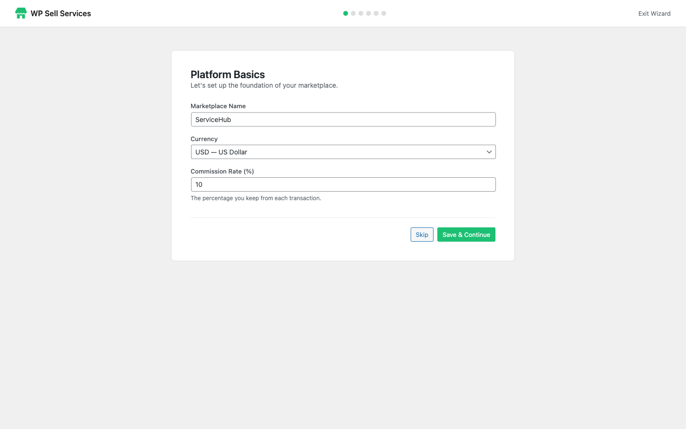

# Initial Setup Guide

After activating WP Sell Services, a quick setup gets your marketplace ready for vendors and buyers. Most of this takes under 10 minutes.

## Setup Wizard

When you first activate the plugin, the Setup Wizard walks you through the essentials:

### Platform Name
This is the name of your marketplace -- it appears in emails, notifications, and on the frontend. It defaults to your WordPress site name, but you can change it to something like "DesignHub" or "FreelanceMarket."

### Currency
Choose the currency for your entire marketplace. All service prices, earnings, and payouts use this currency. Options include USD, EUR, GBP, CAD, AUD, INR, JPY, CNY, BRL, and MXN.

**Tip:** Set your currency before vendors start listing services. Changing it later can cause pricing confusion.

### Commission Rate
This is the percentage you earn on every completed order. The default is 10%, meaning if a vendor sells a $100 service, you keep $10 and the vendor receives $90. You can set this anywhere from 0% to 50%.

### Vendor Registration Mode
Choose how vendors join your marketplace:

| Mode | What Happens |
|------|-------------|
| **Open** | Anyone can sign up as a vendor and start selling immediately |
| **Requires Approval** | People apply to become vendors, and you approve or decline each application |
| **Closed** | Only you (the admin) can create vendor accounts |

## Essential Pages

Your marketplace needs 4 pages to function. The plugin can create them for you automatically:

1. Go to **Sell Services > Settings > Pages**
2. Click the **Create Page** button next to each page

| Page | What It Does |
|------|-------------|
| **Services** | The public browsing page where buyers discover and search for services |
| **Dashboard** | Where both vendors and buyers manage orders, messages, earnings, and services |
| **Become a Vendor** | The registration page for new vendors |
| **Checkout** | Where buyers complete payment in standalone mode |

The **Become a Vendor** page only appears in this list while vendor registration is open. If you have closed registration, the field is hidden and your existing mapping is left untouched.

After creating these pages, add the **Services** and **Become a Vendor** pages to your site's main menu at **Appearance > Menus**.

## Quick Configuration Checklist

Here is everything you should review before inviting your first vendors:

### Commission and Tax
Go to **Sell Services > Settings > Commission & Tax**:

- **Commission rate** -- Your platform's cut on each sale (default: 10%)
- **Per-vendor rates** -- Set different rates for specific vendors (on by default)
- **Tax** -- Off by default. Turn it on to add a tax line at checkout

### Payouts
Go to **Sell Services > Settings > Payouts**:

- **Minimum withdrawal** -- The smallest amount a vendor can cash out (default: $25)
- **Clearance period** -- How many days earnings are held after order completion before they become available (default: 0 days, meaning earnings clear immediately)
- **Wallet provider** -- Where vendor balances are held
- **Automatic withdrawals** -- Off by default. Turn on to pay out on a schedule instead of per request

If you want a buffer against refunds and chargebacks, raise the clearance period. It ships at 0 so a new marketplace does not hold vendor money by surprise.

### Vendor Settings
Go to **Sell Services > Settings > Vendors**:

- **Max services per vendor** -- How many active services each vendor can have (default: 20)
- **Require verification** -- Whether vendors must verify their identity before selling (default: off)
- **Service moderation** -- Whether you review and approve every new service before it goes live (default: off, so a new marketplace is not empty on launch day)

### Order Settings
Go to **Sell Services > Settings > Orders & Disputes**:

- **Auto-complete days** -- If a buyer does not respond after delivery, the order auto-completes after this many days (default: 3)
- **Requirements timeout** -- How long a buyer has to submit order requirements (default: 7 days)
- **Allow disputes** -- Whether buyers can open disputes (default: on)
- **Dispute window** -- How many days after completion a buyer can dispute (default: 14)
- **Auto-dispute late orders** -- Days past the deadline before an order is flagged (default: 3)

Revision limits are not a global setting -- vendors set them per package when they build a service. See [Pricing Packages](../service-creation/pricing-packages.md).

### Email Notifications
Go to **Sell Services > Settings > Emails**. There are **24 notification types**, each with its own on/off switch, and all are enabled by default. The ones you will see most:

- New order placed (sent to vendor)
- Order completed, cancelled (sent to both)
- Delivery submitted (sent to buyer)
- Revision requested (sent to vendor)
- New message (sent to recipient)
- New review (sent to vendor)
- Dispute opened (sent to both parties and admin)

The same screen has a **Email Deliverability** test. Send yourself a test email before launch -- if it does not arrive, no other notification will either. See [Email Notifications](../notifications-emails/email-types.md) for the full list.

### Tax Settings (Optional)
Tax lives with commission, in **Sell Services > Settings > Commission & Tax**:

- Enable tax and set a rate (off by default)
- Choose a label (Tax, VAT, GST, etc.)
- Decide whether your service prices already include tax

## Test Your Marketplace

Before going live, run through a quick test:

1. **Create a test vendor account** -- Visit the "Become a Vendor" page and register (or use your admin account, which is automatically a vendor)
2. **Create a test service** -- Go to the Dashboard and walk through the service creation wizard
3. **Place a test order** -- Log in as a different user, find the test service, and purchase it
4. **Complete the order** -- Submit a delivery as the vendor, accept it as the buyer, and leave a review

This confirms your entire marketplace workflow is functioning.

## Recommended Next Steps

Once your settings are in place:

- **Add service categories** at **Sell Services > Categories** (e.g., Design, Writing, Marketing, Development)
- **Customize your homepage** using the included blocks (Service Grid, Featured Services, Categories) in the block editor
- **Install an SMTP plugin** like WP Mail SMTP or FluentSMTP for reliable email delivery

## What's Next

- **[Create your first service](../service-creation/service-wizard.md)** -- Learn how the vendor experience works
- **[Compare Free vs Pro](free-vs-pro.md)** -- Understand what the Pro version adds
- **[Order management](../order-management/order-lifecycle.md)** -- See how orders flow from purchase to completion
