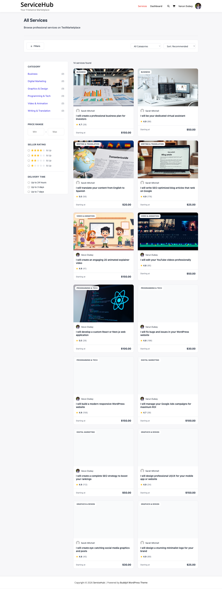

# Search and Filtering

WP Sell Services includes built-in search and filtering so your visitors can quickly find the right service. No extra plugins or configuration needed.

---

## Search Bar

The search bar lets visitors type keywords to find services by title or description. It can be placed on any page and includes an optional category dropdown for more targeted results.

**What it searches:**
- Service titles
- Service descriptions
- Service excerpts

You can customize the placeholder text, button label, and whether the category dropdown appears.

---

## Category Filtering

Visitors can filter services by category using the dropdown in the search bar or by clicking a category on the category grid. Only categories that contain published services are shown.

Category archives have their own pages, so when a visitor selects "Logo Design," they land on a dedicated page showing only logo design services.

---

## Sort Options

On the services catalog page, visitors can sort results by:

| Sort Option | What It Does |
|-------------|--------------|
| Newest | Most recently published services first |
| Price (low to high) | Starting from the most affordable |
| Price (high to low) | Starting from the premium options |
| Top Rated | Highest average rating first |
| Most Popular | Most sales first |

---

## Pagination

When there are more services than fit on one page, pagination appears automatically. Visitors can click through pages of results, and the current search and filter selections are preserved as they navigate.

---

## Where to Place Search

The search bar works well in several locations:

- **Homepage** -- As a prominent hero search so visitors can start browsing immediately
- **Services catalog page** -- At the top, above the service grid
- **Sidebar** -- A compact search in your sidebar widget area
- **Header or navigation** -- Some themes support widget areas in the header

To add search to a sidebar widget area, go to **Appearance > Widgets**, add a Custom HTML or Shortcode widget, and place the search element there.

---

## Tips

- **Put search front and center.** The easier it is to find services, the more likely visitors are to browse and buy.
- **Keep categories organized.** Well-structured categories make filtering more useful. Avoid too many top-level categories -- use subcategories for specificity.
- **Combine search with category grids.** A homepage with a search bar followed by a category grid gives visitors two ways to start browsing.

---

## Troubleshooting

**Search returns no results?**
Make sure services are published (not drafts) and that the search term matches words in the title or description. Clear your site cache if results seem stale.

**Category dropdown is empty?**
Categories only appear if they contain at least one published service. Create categories under **Services > Categories** and assign them to your services.

**Results page looks wrong?**
The search form submits to your services archive page by default. If you changed your permalink structure, go to **Settings > Permalinks** and click Save to refresh.
