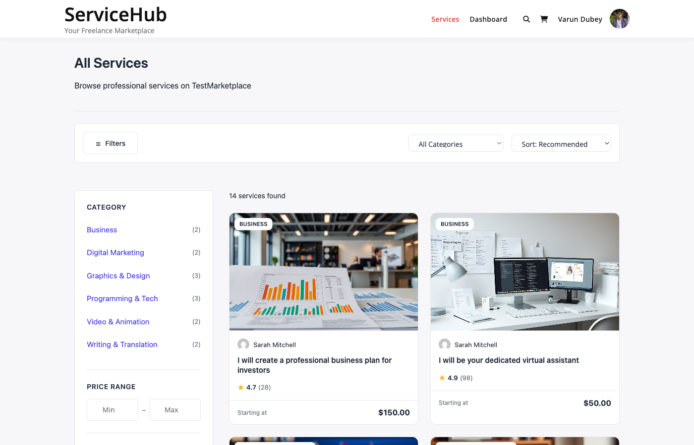

# SEO and Schema Markup

Built-in SEO features and structured data (JSON-LD schema) for better search engine visibility.

## Schema Markup Overview

WP Sell Services automatically generates JSON-LD structured data for all marketplace pages. This helps search engines understand your content and display rich results.



### What is Schema Markup?

Schema markup is code that tells search engines what your content means, not just what it says. This can result in:

- Rich snippets in Google search results
- Star ratings displayed in SERPs
- Price information visible
- Better click-through rates
- Enhanced visibility

---

## Service Schema (Combined Type)

Services use a **combined schema** with both `Service` and `Product` types for maximum compatibility.

### Schema Structure

```json
{
  "@context": "https://schema.org",
  "@type": ["Service", "Product"],
  "@id": "https://example.com/services/logo-design/#service",
  "name": "Professional Logo Design",
  "description": "Custom logo design for your business...",
  "url": "https://example.com/services/logo-design/",
  "image": "https://example.com/uploads/logo-design.jpg",
  "category": "Graphic Design",
  "provider": {
    "@type": "Person",
    "@id": "https://example.com/author/jane-designer/#person",
    "name": "Jane Designer"
  },
  "brand": {
    "@type": "Brand",
    "name": "Jane Designer"
  },
  "offers": {
    "@type": "Offer",
    "price": "150.00",
    "priceCurrency": "USD",
    "availability": "https://schema.org/InStock",
    "priceValidUntil": "2027-02-12",
    "url": "https://example.com/services/logo-design/",
    "seller": {
      "@type": "Person",
      "name": "Jane Designer"
    }
  },
  "aggregateRating": {
    "@type": "AggregateRating",
    "ratingValue": 4.8,
    "bestRating": 5,
    "worstRating": 1,
    "ratingCount": 47,
    "reviewCount": 47
  },
  "serviceType": "Graphic Design",
  "termsOfService": "Delivery within 3 days",
  "areaServed": {
    "@type": "Place",
    "name": "Worldwide"
  }
}
```

### Key Properties

| Property | Source | Description |
|----------|--------|-------------|
| `@type` | Hardcoded | `["Service", "Product"]` array |
| `name` | Post title | Service name |
| `description` | Post excerpt/content | Brief description (50 words) |
| `image` | Featured image | Service thumbnail |
| `category` | First category | Service category name |
| `provider` | Author | Vendor as Person schema |
| `offers.price` | `_wpss_starting_price` meta | Starting price |
| `aggregateRating.ratingValue` | `_wpss_rating_average` meta | Average rating |
| `aggregateRating.reviewCount` | `_wpss_review_count` meta | Number of reviews |
| `termsOfService` | `_wpss_fastest_delivery` meta | Delivery time |

### When It Appears

- **Single service pages** (`is_singular('wpss_service')`)
- Automatically output in `<head>` via `wp_head` action
- Filter: `wpss_service_schema` to modify

---

## Person Schema (Vendors)

Vendor profiles use the `Person` schema type.

### Schema Structure

```json
{
  "@type": "Person",
  "@id": "https://example.com/author/jane-designer/#person",
  "name": "Jane Designer",
  "url": "https://example.com/author/jane-designer/",
  "image": "https://example.com/avatar/jane.jpg",
  "jobTitle": "Graphic Designer",
  "description": "Professional designer with 10 years experience...",
  "aggregateRating": {
    "@type": "AggregateRating",
    "ratingValue": 4.7,
    "bestRating": 5,
    "ratingCount": 89
  }
}
```

### Key Properties

| Property | Source | Description |
|----------|--------|-------------|
| `name` | `display_name` | Vendor display name |
| `url` | Author URL | Vendor profile link |
| `image` | Gravatar | Vendor avatar (256px) |
| `jobTitle` | `wpss_vendor_title` meta | Vendor title/tagline |
| `description` | User bio | Vendor description (50 words) |
| `aggregateRating.ratingValue` | `wpss_vendor_rating` meta | Average vendor rating |
| `aggregateRating.ratingCount` | `wpss_vendor_review_count` meta | Total reviews |

### When It Appears

- **Vendor profile pages** (when `wpss_vendor` query var exists)
- **Service pages** (as the `provider` property)
- Filter: `wpss_person_schema` to modify

**Note:** Person schema does NOT include `AggregateOffer` with price ranges. Only individual service offers include pricing.

---

## Organization Schema

Homepage organization information.

### Schema Structure

```json
{
  "@context": "https://schema.org",
  "@type": "Organization",
  "@id": "https://example.com/#organization",
  "name": "Creative Marketplace",
  "url": "https://example.com/",
  "description": "Find professional services for your business",
  "logo": "https://example.com/logo.png"
}
```

### Key Properties

| Property | Source | Description |
|----------|--------|-------------|
| `name` | `get_bloginfo('name')` | Site name |
| `url` | Home URL | Site homepage |
| `description` | `get_bloginfo('description')` | Site tagline |
| `logo` | Custom logo | Theme logo (if set) |

### When It Appears

- **Homepage only** (`is_front_page()`)
- Filter: `wpss_organization_schema` to modify

---

## BreadcrumbList Schema

Breadcrumb navigation for services and categories.

### Schema Structure

```json
{
  "@context": "https://schema.org",
  "@type": "BreadcrumbList",
  "itemListElement": [
    {
      "@type": "ListItem",
      "position": 1,
      "name": "Home",
      "item": "https://example.com/"
    },
    {
      "@type": "ListItem",
      "position": 2,
      "name": "Services",
      "item": "https://example.com/services/"
    },
    {
      "@type": "ListItem",
      "position": 3,
      "name": "Graphic Design",
      "item": "https://example.com/service-category/graphic-design/"
    },
    {
      "@type": "ListItem",
      "position": 4,
      "name": "Logo Design",
      "item": "https://example.com/services/logo-design/"
    }
  ]
}
```

### When It Appears

- **Single service pages** (`is_singular('wpss_service')`)
- **Category archive pages** (`is_tax('wpss_service_category')`)
- Includes parent categories if hierarchical

---

## CollectionPage Schema (Category Archives)

Category pages use CollectionPage with nested ItemList.

### Schema Structure

```json
{
  "@context": "https://schema.org",
  "@type": "CollectionPage",
  "@id": "https://example.com/service-category/logo-design/#webpage",
  "name": "Logo Design",
  "description": "Browse logo design services",
  "url": "https://example.com/service-category/logo-design/",
  "mainEntity": {
    "@type": "ItemList",
    "itemListElement": [
      {
        "@type": "ListItem",
        "position": 1,
        "item": {
          "@type": "Service",
          "name": "Professional Logo Design",
          "url": "https://example.com/services/logo-design/"
        }
      }
    ]
  }
}
```

### Key Properties

| Property | Source | Description |
|----------|--------|-------------|
| `name` | Term name | Category name |
| `description` | Term description | Category description (or generated) |
| `mainEntity` | First 10 services | ItemList of services in category |

### When It Appears

- **Category archive pages** (`is_tax('wpss_service_category')`)
- Filter: `wpss_category_schema` to modify

---

## ItemList Schema (Service Archives)

Service archive pages list all services.

### Schema Structure

```json
{
  "@context": "https://schema.org",
  "@type": "ItemList",
  "name": "Services",
  "itemListElement": [
    {
      "@type": "ListItem",
      "position": 1,
      "item": {
        "@type": "Service",
        "@id": "https://example.com/services/logo-design/#service",
        "name": "Logo Design",
        "url": "https://example.com/services/logo-design/"
      }
    },
    {
      "@type": "ListItem",
      "position": 2,
      "item": {
        "@type": "Service",
        "@id": "https://example.com/services/web-design/#service",
        "name": "Web Design",
        "url": "https://example.com/services/web-design/"
      }
    }
  ]
}
```

### When It Appears

- **Service archive pages** (`is_post_type_archive('wpss_service')`)
- Lists all services in current query
- Filter: `wpss_service_list_schema` to modify

---

## Review Schema (Not Currently Output)

The `get_reviews_schema()` method exists in `SchemaMarkup.php` but is **never called or output**.

### Schema Structure (if it were used)

```json
{
  "@context": "https://schema.org",
  "@type": "Product",
  "review": [
    {
      "@type": "Review",
      "author": {
        "@type": "Person",
        "name": "John Smith"
      },
      "datePublished": "2026-01-15T00:00:00Z",
      "reviewBody": "Excellent work!",
      "reviewRating": {
        "@type": "Rating",
        "ratingValue": 5,
        "bestRating": 5,
        "worstRating": 1
      }
    }
  ]
}
```

### To Enable Review Schema

You would need to hook into service schema and call the method:

```php
add_filter( 'wpss_service_schema', function( $schema, $service_id ) {
    $seo = new \WPSellServices\SEO\SchemaMarkup();
    $review_schema = $seo->get_reviews_schema( $service_id );

    if ( $review_schema && isset( $review_schema['review'] ) ) {
        $schema['review'] = $review_schema['review'];
    }

    return $schema;
}, 10, 2 );
```

---

## FAQ Schema

FAQ schema can be generated from service FAQs custom field.

### Schema Structure

```json
{
  "@context": "https://schema.org",
  "@type": "FAQPage",
  "mainEntity": [
    {
      "@type": "Question",
      "name": "How long does delivery take?",
      "acceptedAnswer": {
        "@type": "Answer",
        "text": "Standard delivery is 3 business days."
      }
    }
  ]
}
```

### When It Appears

- **Not automatically output** (method exists but not hooked)
- Requires `_wpss_faqs` custom field with array of questions/answers
- Method: `get_faq_schema()` in `SchemaMarkup.php`

---

## Open Graph Meta Tags

Social media sharing tags for services.

### Meta Tags Output

```html
<meta property="og:type" content="product" />
<meta property="og:title" content="Professional Logo Design" />
<meta property="og:description" content="Custom logo design from $150" />
<meta property="og:url" content="https://example.com/services/logo-design/" />
<meta property="og:image" content="https://example.com/logo-design.jpg" />
<meta property="og:site_name" content="Creative Marketplace" />
<meta property="product:price:amount" content="150.00" />
<meta property="product:price:currency" content="USD" />
```

### Twitter Card Tags

```html
<meta name="twitter:card" content="summary_large_image" />
<meta name="twitter:title" content="Professional Logo Design" />
<meta name="twitter:description" content="Custom logo design from $150" />
<meta name="twitter:image" content="https://example.com/logo-design.jpg" />
```

### When They Appear

- **Single service pages only** (`is_singular('wpss_service')`)
- **Only if no SEO plugin active** (Yoast, Rank Math, AIOSEO)
- Filter: `wpss_open_graph_data` to modify

---

## SEO Plugin Integration

WP Sell Services detects and respects popular SEO plugins.

### Yoast SEO Integration

**Features:**
- Service pages in Yoast metabox
- Focus keyphrase analysis
- Schema output handled by Yoast (if Yoast schema is enabled)
- Sitemap integration

**Configuration:**
1. Go to **SEO → Search Appearance → Content Types**
2. Find **Services** section
3. Enable "Show Services in search results"
4. Configure title/description templates

**Custom Variables:**
Service-specific variables can be added via `wpseo_replacements` filter.

### Rank Math Integration

**Features:**
- Service SEO score analysis
- Schema builder integration
- Keyword tracking
- Sitemap integration

**Configuration:**
1. Go to **Rank Math → Titles & Meta → Services**
2. Configure title/description templates
3. Enable schema markup
4. Select schema type (Service or Product)

### Disabling Built-In SEO

If you have an SEO plugin active, WP Sell Services automatically disables:
- Meta description tags
- Open Graph tags
- Twitter Card tags
- Title modifications (except archive pages)

Schema markup remains enabled unless disabled by filters.

---

## Meta Tags and Robots

### Meta Description

Generated from service excerpt or content (25 words).

**Output:**
```html
<meta name="description" content="Custom logo design for your business..." />
```

**Only output if:**
- No SEO plugin active
- Single service page
- Service is published

### Robots Meta

Controls search engine indexing.

**Published Active Services:**
```html
<meta name="robots" content="index,follow" />
```

**Draft/Pending Services:**
```html
<meta name="robots" content="noindex,nofollow" />
```

**Paused Services:**
```html
<meta name="robots" content="noindex,follow" />
```

---

## Canonical URLs

Clean canonical URLs for services.

### Implementation

Query parameters are removed from canonical URLs:

```php
// Clean canonical (no query strings)
https://example.com/services/logo-design/
```

**Filter:** `get_canonical_url` is used to clean service URLs.

---

## XML Sitemap

Services automatically included in WordPress core sitemap.

### Sitemap Configuration

**URL:**
```
https://example.com/wp-sitemap-wpss_service-1.xml
```

**Query Modifications:**
- Only includes published services
- Only includes active services (not paused)
- Excludes services without `_wpss_service_status` meta (defaults to active)

**Filter:** `wpss_sitemap_post_types` to control inclusion.

---

## Customizing Schema

### Filter Service Schema

```php
add_filter( 'wpss_service_schema', function( $schema, $service_id ) {
    // Add custom property
    $schema['customProperty'] = 'Custom Value';

    // Modify existing property
    $schema['offers']['price'] = '200.00';

    return $schema;
}, 10, 2 );
```

### Filter Person Schema

```php
add_filter( 'wpss_person_schema', function( $schema, $user_id ) {
    // Add social profiles
    $schema['sameAs'] = [
        'https://twitter.com/username',
        'https://linkedin.com/in/username'
    ];

    return $schema;
}, 10, 2 );
```

### Filter Organization Schema

```php
add_filter( 'wpss_organization_schema', function( $schema ) {
    // Add contact information
    $schema['contactPoint'] = [
        '@type' => 'ContactPoint',
        'telephone' => '+1-555-123-4567',
        'contactType' => 'customer service'
    ];

    return $schema;
} );
```

### Disable Schema Output

```php
// Disable all schema
remove_action( 'wp_head', [ $schema_instance, 'output_schema' ], 10 );

// Or use filter
add_filter( 'wpss_service_schema', '__return_false' );
```

---

## Testing Schema Markup

### Google Rich Results Test

1. Go to https://search.google.com/test/rich-results
2. Enter service URL
3. Verify schema is detected
4. Fix any errors reported

### Schema.org Validator

1. Go to https://validator.schema.org/
2. Paste service URL
3. Check for warnings/errors
4. Verify all properties display correctly

### Browser Extension

Install **Schema Markup Validator** extension to see schema on any page.

---

## Related Documentation

- [Search Filters](search-filters.md) - Internal search optimization
- [Template Overrides](template-overrides.md) - Custom page structure
- [Yoast Integration](../developer-guide/hooks-reference.md) - Yoast hooks
- [Rank Math Integration](../developer-guide/hooks-reference.md) - Rank Math hooks

---

## Next Steps

1. Verify schema output on service pages
2. Test with Google Rich Results Test
3. Configure SEO plugin templates (if using)
4. Monitor search performance in Google Search Console
5. Add FAQs to services for FAQ schema
