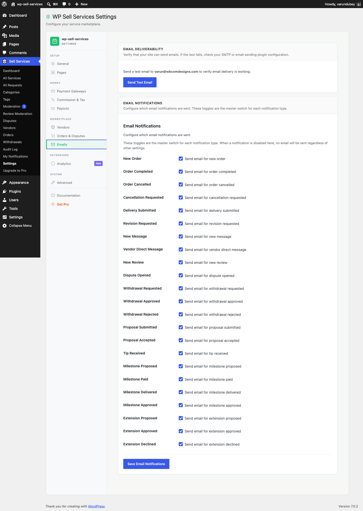

# Email Notifications

WP Sell Services emails buyers, vendors, and admins at every stage of an order. **24 notification types have their own on/off switch** in **Sell Services > Settings > Emails**, and all 23 are on by default. A handful of operational emails (requirement reminders, seller-level promotions, proposal rejections) send automatically and are not individually switchable. Every email has both an HTML and a plain text version.

---

## Emails Vendors Receive

These keep your sellers informed about their business activity.

| Email | When It Is Sent |
|-------|----------------|
| **New Order** | A buyer places an order for the vendor's service |
| **Requirements Submitted** | The buyer submits project requirements for an order |
| **Revision Requested** | The buyer requests changes to a submitted delivery |
| **New Message** | A new message arrives in an order conversation |
| **Cancellation Requested** | The buyer or admin requests to cancel an order |
| **Dispute Opened** | A dispute is filed on one of the vendor's orders |
| **Withdrawal Approved** | The admin approves a payout withdrawal request |
| **Withdrawal Rejected** | The admin declines a payout withdrawal request |
| **Proposal Accepted** | A buyer accepts the vendor's proposal on a request |
| **Vendor Contact** | Someone sends a message through the vendor's contact form |
| **Level Promotion** | The vendor reaches a new seller level |
| **Moderation Approved** | A submitted service passes admin review and goes live |
| **Moderation Rejected** | A submitted service is declined during admin review |
| **Auto-Withdrawal Processed** | An automatic withdrawal runs and processes a payout for the vendor |
| **Service Pending Moderation** | The vendor submits a service for admin review |
| **Moderation Response** | The vendor responds to moderation feedback on a submitted service |

---

## Emails Buyers Receive

These keep your customers updated on their purchases and activity.

| Email | When It Is Sent |
|-------|----------------|
| **Order In Progress** | The vendor starts working on the buyer's order |
| **Delivery Ready** | The vendor submits completed work for review |
| **Order Completed** | The order is marked complete (manual or automatic) |
| **Order Cancelled** | An order is cancelled by any party |
| **Proposal Submitted** | A vendor submits a proposal on the buyer's request |
| **Requirements Reminder** | The buyer has not yet submitted requirements for their order |
| **Cancellation Requested** | A cancellation request has been filed on the buyer's order |

---

## Emails Admins Receive

These alert you to actions that need your attention.

| Email | When It Is Sent |
|-------|----------------|
| **Withdrawal Requested** | A vendor requests a payout from their earnings |
| **Dispute Opened** | A dispute is filed on any order in the marketplace |
| **Dispute Escalated** | A dispute is escalated to admin for further investigation |

---

## Enabling and Disabling Emails

Every email type can be turned on or off individually.

1. Go to **Sell Services > Settings > Emails**
2. You will see a list of all notification types with checkboxes
3. Uncheck any email you do not want sent
4. Click **Save Changes**

When you disable an email type, no emails of that type are sent to anyone. In-app notifications are still created regardless of email settings, so users will still see alerts in their dashboard.

All email types are enabled by default when you first activate the plugin.

### The full list of switchable types

These are the 29 checkboxes on that screen, in the order they appear. The name in
bold is the label you will see.

| Checkbox | Sent when |
|---|---|
| **New Order** | An order is placed. Also gates the requirements-submitted, order-in-progress and requirements-reminder emails -- unticking this silences all four. |
| **Order Completed** | An order is marked complete |
| **Order Cancelled** | An order is cancelled |
| **Cancellation Requested** | A buyer asks to cancel an order in progress |
| **Delivery Submitted** | A vendor delivers work |
| **Revision Requested** | A buyer asks for a revision |
| **New Message** | A message is sent on an order |
| **Vendor Direct Message** | A buyer contacts a vendor outside an order |
| **New Review** | A buyer leaves a review |
| **Dispute Opened** | A dispute is opened on an order |
| **Withdrawal Requested** | A vendor requests a payout |
| **Withdrawal Approved** | You approve a payout request |
| **Withdrawal Rejected** | You reject a payout request |
| **Proposal Submitted** | A vendor proposes on a buyer request |
| **Proposal Accepted** | A buyer accepts a proposal |
| **Tip Received** | A buyer tips a vendor |
| **Milestone Proposed** | A vendor proposes a milestone phase |
| **Milestone Paid** | A buyer pays a phase |
| **Milestone Delivered** | A vendor delivers a phase |
| **Milestone Approved** | A buyer approves a phase |
| **Extension Proposed** | A vendor quotes a paid extension |
| **Extension Approved** | A buyer accepts an extension |
| **Extension Declined** | A buyer declines an extension |
| **Service Moderation** | A service is approved, rejected, or queued for review |
| **Review Reply** | A vendor replies to a buyer's review |
| **Request Expired** | A buyer request reaches its closing date |
| **Dispute Escalated** | A dispute goes to the marketplace team (buyer, vendor and admin) |
| **Dispute Cancelled** | The party who opened a dispute withdraws it |
| **Tip Receipt** | A buyer's tip is paid (sent to the buyer) |

### Emails that are always sent

A few are deliberately not switchable, because turning them off would leave
someone waiting on information nobody else will give them:

- **Seller level promotion** -- a vendor reaching a new level
- **Proposal rejected** -- so the vendor stops waiting
- **Offline payment receipt** submitted, verified and rejected -- the buyer needs
  to know whether their proof was accepted

---

## What Every Email Includes

Each email is professionally designed with:

- Your marketplace name in the header
- A clear subject line describing the event
- The relevant details (order number, service name, vendor/buyer name, amounts)
- A call-to-action button linking to the relevant page (e.g., "View Order")
- Your site footer with branding

Emails are responsive and display well on both desktop and mobile email clients.

---

### Throttling, failures and retries

Only conversational mail (**New Message**, **Vendor Direct Message**) is
throttled to one per recipient per five minutes. Order, payment, moderation,
dispute and withdrawal mail is never throttled: two orders placed a minute
apart send two New Order emails.

A send the mail server refuses is written to the audit log as `email.failed`
(recipient, type and the error) and retried once, ten minutes later, through
Action Scheduler.

## How Emails Are Delivered

Emails are sent through WordPress's built-in email system. This works with any SMTP plugin you may already have installed (WP Mail SMTP, FluentSMTP, Post SMTP, etc.).

If you are not using an SMTP plugin, emails are sent via your server's default mail function. For better deliverability and to avoid spam folders, we recommend installing an SMTP plugin and connecting it to a proper email service.

---

## Email Templates

Every email is rendered from an HTML template file in `templates/emails/`. Each template is theme-overridable -- copy it to `yourtheme/wp-sell-services/emails/` to customize the design.

There are also plain text variants in `templates/emails/plain/` for email clients that do not support HTML.

All emails share a common header (`email-header.php`) and footer (`email-footer.php`) that you can override to match your brand.

---

## Customizing Email Content

For developers who want to modify email content, sender details, or headers without overriding template files, see the [Email Customization Guide](../developer-guide/email-customization.md). It covers:

- Changing the "From" name and email address
- Filtering email content for specific notification types
- Customizing the email header variables and branding
- Using plain text vs HTML variants

---

## Related Guides

- [In-App Notifications](in-app-notifications.md) -- Dashboard notification bell and alerts
- [Email Configuration](email-configuration.md) -- SMTP setup and email settings
- [Email Customization (Developer)](../developer-guide/email-customization.md) -- Template overrides and content filters
