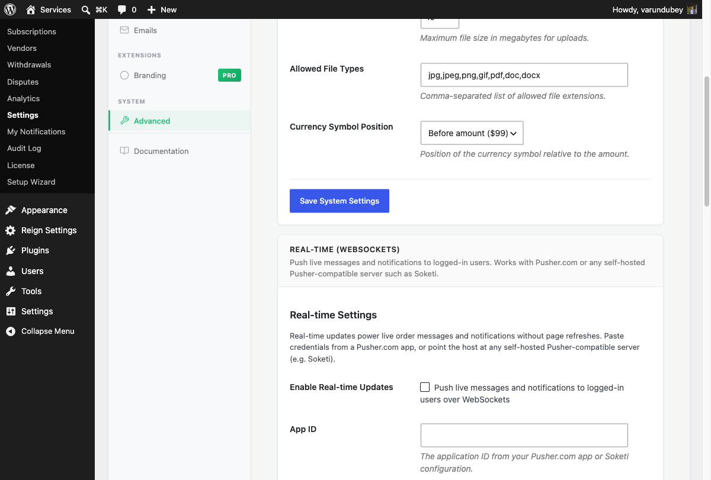

# Real-Time Updates (Live Messages & Notifications)

Real-time updates let order messages and notification badges appear instantly, without a page refresh. This feature is disabled by default and requires a WebSocket connection you configure.

---

## How It Works

When enabled, the plugin opens a private, authenticated WebSocket channel for each logged-in user. Two events are delivered live:

- **`message.created`** -- A new order message appears in the conversation immediately.
- **`notification.created`** -- The notification bell badge increments and the new alert appears without reload.

When disabled, the marketplace behaves exactly as before -- messages and notifications appear on the next page load or navigation. No third-party connection is made in disabled state.

---

## Enabling Real-Time Updates

1. Go to **WP Admin > Sell Services > Settings**
2. Click the **Advanced** tab
3. Find the **Real-time (WebSockets)** card
4. Toggle **Enable** to on
5. Fill in the connection fields (see below)
6. Save settings

---

## Connection Options

The plugin speaks the **Pusher protocol**. You can connect to either a hosted service or your own server -- the settings fields are the same for both.

### Option 1: Pusher.com (Hosted)

1. Create a free account at [pusher.com](https://pusher.com) and create a new **Channels** app
2. Copy your **App ID**, **Key**, **Secret**, and **Cluster** from the Pusher dashboard
3. Paste them into the settings fields
4. Leave the **Host** field blank -- the plugin connects to Pusher.com automatically

### Option 2: Self-Hosted (Soketi or Compatible Server)

[Soketi](https://docs.soketi.app) is a free, open-source, self-hostable Pusher-compatible server.

1. Set up your Soketi instance and note the App ID, Key, and Secret you configured on it
2. Paste those credentials into the settings fields
3. Enter your server's hostname in the **Host** field (e.g., `wss-server.example.com`)
4. Set the **Port** to match your server (default `443`)
5. Ensure **Use TLS** is on if your server uses HTTPS/WSS

---

## Settings Reference

| Field | Default | Description |
|-------|---------|-------------|
| Enable | Off | Activates the WebSocket layer |
| App ID | -- | Your Pusher / Soketi App ID |
| Key | -- | Your Pusher / Soketi Key (sent to browser) |
| Secret | -- | Your Pusher / Soketi Secret (server-only, stored masked) |
| Host | Blank | Leave blank for Pusher.com; enter hostname for self-hosted |
| Cluster | `mt1` | Pusher.com cluster (ignored for self-hosted) |
| Port | `443` | WebSocket port |
| Use TLS | On | Connect over WSS (recommended) |

**Note on the Secret field:** once saved, the secret is displayed as masked dots. Leave the field blank when saving other settings to keep the existing secret value.

---

## Security

- The App Secret never leaves the server and is never sent to the browser.
- WebSocket channels are **private and per-user**. A buyer or vendor only receives events for their own account.
- Order message events are only delivered to participants of that specific order (buyer, vendor, and admins).
- Private channel subscriptions are authorized server-side via `POST /wpss/v1/realtime/auth` after an ownership check.

---

## How It Behaves for Users

Buyers and vendors do not need to configure anything. When real-time is active and they are logged in:

- New messages in an order conversation appear immediately in the thread.
- The notification bell updates its badge count and shows the new notification without requiring a page reload.

Real-time only works for **logged-in users**. Guests are unaffected.

---

## Privacy Note

When real-time is enabled, message and notification metadata transits the configured WebSocket provider.

- **Pusher.com** is a third-party service with its own data processing terms. Review their privacy policy if this matters for your site's compliance.
- **Self-hosted Soketi** keeps all traffic on infrastructure you control. No data leaves your servers.

---

## Troubleshooting

**Live updates are not appearing**

- Confirm the **Enable** toggle is on and all credentials (App ID, Key, Secret) are filled in.
- The user must be logged in -- real-time is not active for guests.
- Open your browser's developer console and look for WebSocket connection errors.

**Pusher.com not connecting**

- Confirm the **Cluster** field matches the cluster shown in your Pusher app dashboard (e.g., `us2`, `eu`, `mt1`).
- Confirm your Pusher app is in **Channels** mode (not Beams).

**Self-hosted server not connecting**

- Confirm the **Host** field contains only the hostname (e.g., `wss-server.example.com`), not the full URL.
- Confirm the **Port** is open and reachable over TLS from the browser.
- Check that your Soketi instance is running and its credentials match what you entered.

---

## Related Guides

- [In-App Notification System](in-app-notifications.md) -- Dashboard bell and notification list
- [Order Messaging & File Sharing](../order-management/order-messaging.md) -- How order conversations work
- [Advanced Settings](../platform-settings/advanced-settings.md) -- Full Advanced tab reference
