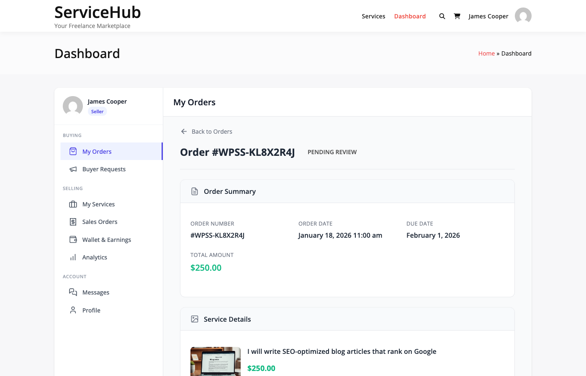
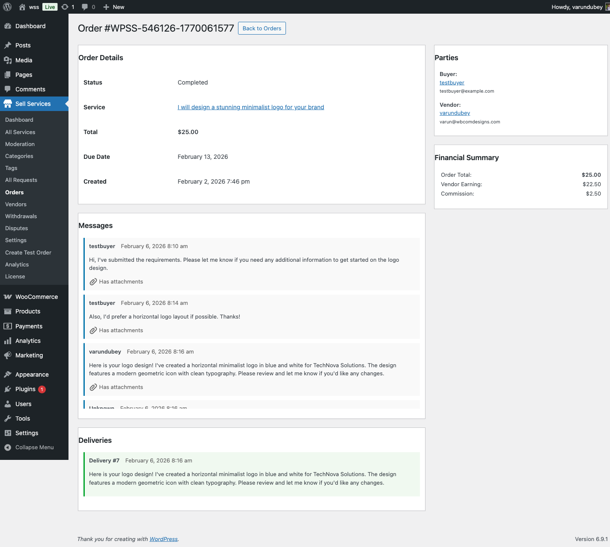

# Deliveries & Revisions

Learn how vendors submit deliveries, buyers request revisions, and both parties manage the approval workflow from initial submission to final acceptance.

## Delivery Workflow

```
Order Active → Vendor Submits → Buyer Reviews → Accept or Revise
                                                        ↓
                                                  Revision?
                                                   ↓     ↓
                                             YES ←┘     └→ NO
                                              ↓            ↓
                                       Resubmit      Completed
```

## When Vendors Can Submit Deliveries

Deliveries can only be submitted when the order is in one of these three statuses:

1. **`in_progress`** - Normal delivery submission
2. **`revision_requested`** - Resubmitting after changes
3. **`late`** - Delivery after deadline has passed

**Cannot deliver from other statuses** like pending requirements, pending approval, completed, or cancelled.

## Submitting Deliveries

### Delivery Submission Process

1. Go to **Vendor Dashboard → Orders**
2. Open order in `in_progress`, `revision_requested`, or `late` status
3. Click **Submit Delivery** button
4. Upload files (see allowed types below)
5. Write delivery message
6. Click **Submit**

Order status immediately changes to `pending_approval`.

### Uploading Deliverable Files

Files are processed through WordPress media library and stored with order reference.

**Allowed File Types:**

```
Images:     jpg, jpeg, png, gif, webp
Documents:  pdf, doc, docx, xls, xlsx, ppt, pptx, txt, csv
Archives:   zip, rar, 7z
Audio:      mp3, wav, ogg
Video:      mp4, mov, avi, webm
Design:     psd, ai, eps, sketch, fig
Data:       json, xml
```

**Explicitly NOT Allowed (Security):**
- `svg` - XSS risk via embedded JavaScript
- `html` - Executable scripts
- `css` - Can contain expressions/imports
- `js` - Executable JavaScript

**Custom File Types:**

Developers can add additional types via filter:

```php
add_filter( 'wpss_delivery_allowed_file_types', function( $types ) {
    $types[] = 'indd';  // Add InDesign files
    return $types;
} );
```

### File Processing

Each uploaded file:
1. Validated against allowed types
2. Processed via `wp_handle_upload()`
3. Created as private WordPress attachment
4. Linked to order via `_wpss_order_id` post meta
5. Added to delivery record in JSON format

**Storage:** `/wp-content/uploads/` (standard WordPress media)

### Delivery Versioning

Each submission creates a new version:

**Database:** `wp_wpss_deliveries` table
- `version` field increments (1, 2, 3...)
- All previous versions retained
- Both parties can download any version

**Status Flow:**
```
Submit → status = 'pending'
Accept → status = 'accepted'
Revise → status = 'revision_requested'
```

## Buyer Review Process

### Receiving Delivery



When vendor submits:
1. Buyer receives email notification
2. Order status → `pending_approval`
3. Buyer downloads files from order page
4. Buyer has 3 options:

**1. Accept Delivery**
- Click "Accept Delivery"
- Order status → `completed`
- Vendor receives payment
- Delivery status → `accepted`


**2. Request Revision**
- Click "Request Revision"
- Provide specific feedback
- Order status → `revision_requested`
- Delivery status → `revision_requested`

**3. Open Dispute**
- Major issues or unresponsive vendor
- See [Dispute Resolution](../disputes-resolution/opening-disputes.md)

### Auto-Completion

If buyer takes no action:

**Timeline (configurable):**
- Default: 3 days after delivery
- Admin setting: 0-30 days
- Setting: `wpss_orders['auto_complete_days']`

**What Happens:**
- Order auto-completes after X days
- Vendor receives payment
- Buyer can still leave review

**Disabled if:** Setting = 0

## Revision System

### How Revisions Work

**Revision Limit:**
- Default: 2 revisions per order
- Configured in **Settings → Orders → Default Revision Limit**
- Range: 0-10 revisions
- Can be overridden per service package

**Checking Remaining Revisions:**

Code checks: `$order->can_request_revision()`
- Returns `true` if revisions remain OR unlimited
- Revisions = -1 means unlimited
- Tracks `revisions_used` vs `revisions_included`

### Requesting Revisions (Buyer)

**Requirements:**
- Order status: `pending_approval`
- Revisions remaining > 0 OR unlimited
- Specific feedback required

**Process:**
1. View delivery files
2. Click "Request Revision"
3. Describe changes needed (required field)
4. Submit request

**What Happens:**
- Delivery status → `revision_requested`
- Order status → `revision_requested`
- Vendor receives notification
- Revision counter increments

### Delivering Revisions (Vendor)

**Process:**
1. Receive revision request notification
2. Review buyer feedback
3. Make requested changes
4. Submit new delivery (same workflow)
5. New version created automatically

**Version Tracking:**
```
Initial Delivery: Version 1
First Revision:   Version 2
Second Revision:  Version 3
```

### Revision Limits Exhausted

When `can_request_revision()` returns `false`:
- Buyer cannot request more revisions
- Vendor can still offer goodwill revisions
- Options:
  - Accept work as-is
  - Negotiate extra paid revision
  - Vendor offers free goodwill revision
  - Open dispute if work doesn't meet requirements

## Delivery Files Access

### Access Control

**Who Can Download:**
- Buyer: Their order deliveries
- Vendor: Deliveries they submitted
- Admin: All deliveries

**Security:**
- Files stored as private attachments
- Order ID verified before download
- No public URLs
- Login required



### File Storage

**Local Storage:**
- WordPress uploads directory
- Private attachment post type
- Order reference in post meta

**[PRO] Cloud Storage:**
See [Cloud Storage](../cloud-storage/overview.md) for S3, GCS, Digital Ocean Spaces integration.

## Notifications

### Email Events

**Vendor Receives:**
- `wpss_revision_requested` - Buyer requested changes
- Delivery accepted confirmation
- Auto-approval reminder (if approaching)

**Buyer Receives:**
- `wpss_delivery_submitted` - Vendor submitted delivery
- Revision delivered confirmation
- Auto-completion countdown

**Admin Receives (optional):**
- Late delivery flags
- Dispute-related deliveries

### Action Hooks

**Developers:**
```php
// When delivery submitted
do_action( 'wpss_delivery_submitted', $delivery_id, $order_id );

// When delivery accepted
do_action( 'wpss_delivery_accepted', $order_id );

// When revision requested
do_action( 'wpss_revision_requested', $order_id, $reason );
```

## Delivery Best Practices

### For Vendors

✅ **Before Submitting:**
- Test all files (open/extract properly)
- Verify work meets requirements
- Include setup/usage instructions
- Use clear file names

✅ **Quality Standards:**
- No corrupt or broken files
- All promised deliverables included
- Professional presentation
- Delivered before deadline when possible

✅ **Revision Handling:**
- Address all feedback points
- Communicate what changed
- Maintain version history
- Be professional and courteous

### For Buyers

✅ **Reviewing Deliveries:**
- Review within 2-3 days
- Test all functionality
- Compare against requirements
- Provide specific feedback

✅ **Revision Requests:**
- Be specific about changes
- Reference original requirements
- Be reasonable (within scope)
- Communicate clearly

## Troubleshooting

### Cannot Submit Delivery

**Check:**
- Order status is `in_progress`, `revision_requested`, or `late`
- Not in `pending_requirements` or `completed`
- You are the vendor on the order

### File Upload Failed

**Common Issues:**
- File type not in allowed list → Use ZIP
- File too large → Split into smaller files
- Upload timeout → Increase PHP limits

**Error: "File type not allowed"**
- Check `DeliveryService::get_allowed_file_types()`
- SVG, HTML, CSS, JS explicitly blocked
- Use allowed archive format (ZIP, RAR, 7Z)

### Revision Counter Not Updating

**Verify:**
- Revision was actually requested (not draft)
- `revisions_used` incremented in database
- Cache cleared
- Page refreshed

## Settings Reference

**Admin: Settings → Orders**

| Setting | Field Name | Default | Range | Description |
|---------|-----------|---------|-------|-------------|
| Auto-Complete Days | `auto_complete_days` | 3 | 0-30 | Days after delivery to auto-complete if no buyer action |
| Default Revision Limit | `revision_limit` | 2 | 0-10 | Default revisions per order (overridable per service) |

**Note:** 0 = disabled for auto-complete; 0 = no revisions for revision limit

## Related Documentation

- [Order Workflow](order-lifecycle.md) - Complete order lifecycle
- [Order Messaging](order-messaging.md) - Communication during orders
- [Tipping & Extensions](tipping-extensions.md) - Deadline extensions
- [Dispute Resolution](../disputes-resolution/opening-disputes.md) - Handling conflicts

Excellent deliveries and professional revision handling lead to 5-star reviews!
