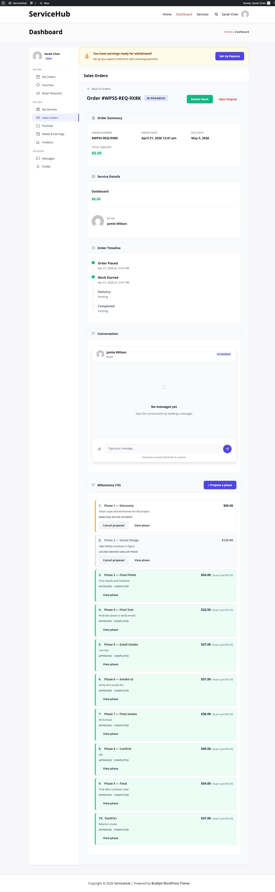

# Milestone Contracts

**Milestone contracts** break a custom project into paid phases. The
vendor proposes the plan, the buyer approves it as a whole, then the
buyer pays and approves each phase one at a time. It's the right fit for
larger, scoped work where neither side wants to commit the full amount
up front.

## When to use a milestone contract

Milestone contracts live on **buyer-request orders only** — projects
that started with a buyer posting a brief and a vendor responding with a
custom proposal. For a fixed-price catalog service, use a
[Paid Extension](extensions-wpss.md) instead. The two features are
mutually exclusive — a single order will only ever show one or the other.

Milestone contracts work well when:

- The project is large or open-ended (website build, editing a book, a
  phased consulting engagement).
- The work divides cleanly into stages that each deliver something the
  buyer can review.
- Both sides want progress payments rather than a lump sum upfront or
  everything at the end.

## The vendor journey

### Proposing a milestone contract at proposal time

When you reply to a buyer request, choose **Milestone** as the contract
type on the proposal form. You'll see a repeater where you enter each
phase:

- **Title** — a clear name the buyer will recognise (e.g. "Homepage
  wireframes").
- **Description** — what's delivered at the end of this phase.
- **Amount** — what the buyer pays for this phase.
- **Days** — how many days this phase takes.

The total of the phases is what the buyer sees as the project total.
There's no separate upfront fee — the parent order's base price is $0,
and all money flows through the phase payments.

Once you submit, the buyer can compare your proposal against others,
expand the phase list, and review the full breakdown before accepting.

### Adding ad-hoc phases later

Custom projects often grow. After the contract is under way you can
still propose additional phases from the order page with the
**+ Propose a phase** button. A later addition is treated
the same way as any predefined phase — the buyer pays, you deliver, the
buyer approves.

> **Ad-hoc phases expire; contract phases do not.** A phase you add
> mid-project is cancelled automatically if the buyer has not paid it
> within **48 hours**. Phases that came from the original accepted
> proposal are exempt and wait indefinitely. See
> [The 48-hour abandon sweep](#the-48-hour-abandon-sweep).

### Delivering a phase

When the buyer pays a phase:

1. You receive an email and in-app notification to start work.
2. The phase moves to **In progress**.
3. When you're done, hit **Submit Delivery** on that phase row. Attach
   files or notes the buyer needs.
4. The phase moves to **Awaiting approval**.
5. On approval, the money is already in your wallet — approval confirms
   delivery, it doesn't trigger the payout (payment happened when the
   buyer paid the phase).

If the buyer wants changes, they ask in the order chat and you
re-submit. Revisions aren't counted against the main order's revision
limit and there's no separate reject button — conversations happen in
chat.

## The buyer journey

### Reviewing a milestone proposal

On the buyer-request page, milestone proposals are tagged with a small
badge (`3 phases · $500`) next to the total. Expanding the proposal
shows the phase list with titles, amounts, and days. You see the whole
plan before accepting, so nothing is a surprise later.

### Accepting a milestone contract

When you accept, the order is created with all phases pre-populated in
the timeline and the project kicks off. You don't pay the base of the
order — it's $0 by design. Money only moves when you pay individual
phases.

### The lock-step rule, and where it actually holds

The **lock-step rule** is the key thing to understand about milestone
contracts:

> Phase N only becomes payable once every earlier phase has **finished** —
> approved, declined, cancelled, or swept away unpaid.

So on a 3-phase contract, phase 1 is payable immediately. Phases 2 and 3
show a disabled "Locked — pay phase 1 first" pill. This keeps both sides
in rhythm — the vendor isn't working on multiple phases in parallel with
no payment history, and you aren't stacking up prepayments on phases you
haven't seen yet.

**Paying a phase does not unlock the next one.** A paid phase is *In
progress*, which still counts as open. Phase 2 unlocks when phase 1 is
approved (or declined, or cancelled) — not when it is paid. Only one
phase is ever in flight at a time, by design.

#### Where the rule is enforced — and where it is not

This matters if you are choosing a payment platform, and it is the part
most easily mis-stated. The lock is enforced at **checkout entry points on
the standalone rail** and on the two REST pay endpoints:

| Entry point | Locked phase refused? |
|---|---|
| The order page pay button (any rail) | Yes — the button is disabled |
| `POST /orders/{id}/pay`, `POST /milestones/{id}/pay` | Yes — HTTP 409 `wpss_milestone_locked` |
| Standalone checkout via `?pay_order=N` | Yes — shows a notice instead of the form |
| Standalone Stripe and Razorpay intents | Yes — `wpss_phase_locked` |
| **WooCommerce order-pay URL** | **No** |
| **`POST /payments/create-intent` / `/payments/confirm` with `pay_order`** | **No** |
| **PayPal's direct create-payment path** | **No** |

On the WooCommerce rail the pay-order URL is generated by a resolver that
checks only "is this unpaid?" — so a determined buyer who has the URL for a
later phase can pay it out of order, and the payment settles normally.
Treat lock-step as **a workflow rail that keeps honest buyers in sequence,
not a security control.** If sequencing must be enforced absolutely, run on
standalone.

(All ownership checks *are* enforced everywhere: only the buyer on the
order can pay it, on every rail.)

### Approving deliveries & requesting revisions

When the vendor submits a phase, you see a **Review & Approve** action
on that row. If the delivery is right, approve it and the next phase
unlocks. If you want changes, click **Request revision in chat** — it
drops you into the order conversation with a reference to that phase so
the vendor knows what you're talking about. There's no separate reject
status; revisions are a conversation.

## Where you actually click

A milestone contract lives in the **WPSS Dashboard**, not in your store's order
screens. The whole run, start to finish:

| # | Who | Where | Action |
|---|---|---|---|
| 1 | Buyer | Buyer Request | Accepts a proposal whose contract type is *Milestone* |
| 2 | Vendor | Dashboard → Sales Orders → the order | **Propose a phase** (title, amount, days) |
| 3 | Buyer | Dashboard → My Orders → the order → timeline | **Pay** on that phase |
| 4 | Vendor | Same order, same phase | Works, then **Submit Delivery** |
| 5 | Buyer | Same phase | **Approve** — which unlocks the next phase |

Repeat 2–5 per phase. Only one phase is payable at a time: the next stays
**Locked** until the current one is approved or cancelled.

**Where it is *not*:** milestone phases never appear in WooCommerce
→ My Account → Orders as something to act on. That screen is a payment receipt.
The work is managed in the Dashboard.

---

## What your site needs for phase payments

Milestone contracts require the site to run **Standalone WPSS payments** or
**WooCommerce**. Those are the two setups phase payment is built and tested
against.

| Site setup | Phase Pay |
|---|---|
| Standalone WPSS payments | Supported |
| WooCommerce | Supported — a real WooCommerce order is created for the phase, so the Pay link keeps working even from an email days later |

If your marketplace runs on another ecommerce platform, use **Extensions** for
extra paid work instead, or ask the site owner about milestone support.

Site owners set this at **WP Sell Services → Settings → General → Ecommerce
Integration**.

---

## Project completion

When the **last open phase reaches a terminal state**, the whole project
flips to **Completed** automatically. Both parties receive the standard
order-completed email, a "Project complete" summary card appears at the
top of the timeline showing total phases paid and total spent, and the
Rate Your Experience CTA goes out to the buyer. The same completion hooks
run as for any other order type — vendor stats update, seller-level
progress ticks up, and the order moves to completed archives.

**"Terminal" includes declined, not only approved.** If the buyer
*declines* the final phase, the project still completes. That is
deliberate: with every other phase settled, a buyer refusing to fund one
more phase means the engagement is over, and leaving the order open
forever would strand both parties. But it does mean "Completed" on a
milestone project reads as **"nothing left outstanding"**, not
necessarily "everything was delivered". Check the phase list, not just the
order status.

Two ways a project does **not** auto-complete, worth knowing:

- **The vendor deletes the last unpaid phase.** The phase is cancelled, but
  the completion check does not re-run, so the parent stays open until
  something else is approved or declined.
- **The last phase is swept by the 48-hour abandon job.** Same reason.

In both cases the order can still be completed by hand from the order page.

## The 48-hour abandon sweep

A daily background job cancels **ad-hoc** phases that have sat unpaid for
more than **48 hours**.

| | |
|---|---|
| What it targets | Phases in *Awaiting payment*, created more than 48 hours ago |
| What it does | Sets them to **Cancelled**. The row is kept, not deleted |
| What it skips | **Contract phases** — anything that came from the original accepted proposal. Those wait indefinitely |
| How often | Once a day |
| Who is told | **Nobody.** No email, no in-app notification, no timeline entry |

This is the behaviour most likely to surprise you, so state it plainly:

- **Vendors** — a phase you add mid-project is a 48-hour offer. If the buyer
  hasn't paid by then it disappears from their list without either of you
  being told. If the buyer still wants it, propose it again.
- **Buyers** — if a phase you meant to pay has vanished, it most likely
  expired. Ask the vendor to re-propose it; nothing was charged.

Because a cancelled phase counts as finished, an abandoned phase also
**unlocks the phase after it**.

## Cancelling a milestone contract

Cancellation rules follow what's actually fair for split-phase work:

- **Paid and approved phases stand.** Those payments are earned and
  stay with the vendor.
- **Unpaid phases are auto-cancelled** when the parent is cancelled —
  no money has moved so there's nothing to unwind.
- **Paid but still open phases** (the vendor is mid-work or the
  delivery is awaiting your approval) don't cancel automatically.
  They route through the dispute flow so both parties can agree on
  what's fair (full or partial refund, extra revision, or mutual
  agreement that the work delivered was complete).

This matches how phased contracts work in the real world — completed
phases are settled, in-flight phases need to be talked through.

## When something is refused

Milestone actions are guarded on the server, and the guards are strict.
Most "why can't I click this?" reports are one of the rows below rather
than a fault. Developers: the `code` column is the machine-readable
`code` in the REST error body — branch on it, never on the message.

### Proposing a phase

| Refused when | Code | HTTP |
|---|---|---|
| Title is empty | `wpss_milestone_propose_failed` | 400 |
| Amount is missing, zero, or negative | `rest_invalid_param` / `wpss_milestone_propose_failed` | 400 |
| The parent order does not exist | `wpss_milestone_propose_failed` | 400 |
| You are not the vendor on the parent order | `wpss_milestone_propose_failed` / `wpss_forbidden` | 400 / 403 |
| **The order is not a custom project.** Milestones exist on buyer-request orders only | `wpss_milestone_propose_failed` | 400 |
| The parent order is finished, cancelled or still awaiting payment | `wpss_milestone_propose_failed` | 400 |
| The database write failed | `wpss_milestone_propose_failed` | 400 |

### Paying a phase

| Refused when | Code | HTTP |
|---|---|---|
| No such phase, or the id is not a milestone | `wpss_milestone_not_found` | 404 |
| The phase is not awaiting payment (already paid, declined, cancelled) | `wpss_milestone_not_payable` | 409 |
| An earlier phase is still open | `wpss_milestone_locked` | 409 |
| Same, on the standalone Stripe/Razorpay path | `wpss_phase_locked` | 400 |
| You are not the buyer on the order | `wpss_forbidden` | 403 |

### Submitting a delivery

| Refused when | Code | HTTP |
|---|---|---|
| Not a milestone row | `wpss_milestone_not_found` | 404 |
| You are not the vendor | `wpss_forbidden` / `wpss_milestone_submit_failed` | 403 / 400 |
| The phase is not paid yet, or is already complete | `wpss_milestone_submit_failed` | 400 |

### Approving a delivery

| Refused when | Code | HTTP |
|---|---|---|
| Not a milestone row | `wpss_milestone_not_found` | 404 |
| You are not the buyer | `wpss_forbidden` / `wpss_milestone_approve_failed` | 403 / 400 |
| The phase is not awaiting your approval | `wpss_milestone_approve_failed` | 400 |

### Declining or cancelling a phase

| Refused when | Code | HTTP |
|---|---|---|
| Not a milestone row | `wpss_milestone_not_found` | 404 |
| **Already paid.** A paid phase cannot be declined — open a dispute instead | `wpss_milestone_not_declinable` | 409 |
| Already paid, on the vendor's cancel action | `wpss_milestone_not_cancellable` | 409 |
| You are neither the buyer nor the vendor | `wpss_forbidden` | 403 |
| The underlying write failed | `wpss_milestone_decline_failed` / `wpss_milestone_cancel_failed` | 400 |

### Refusals on every milestone route

| Refused when | Code | HTTP |
|---|---|---|
| Not signed in | `rest_not_logged_in` | 401 |
| Too many write requests in a short window | `rate_limited` | 429 |
| The parent order does not exist | `wpss_order_not_found` | 404 |
| You are not a party to the order | `wpss_forbidden` | 403 |

**Things that fail silently, by design.** Paying a phase twice does not
double-credit the vendor: the crediting step recognises the existing
wallet entry and does nothing. A zero-value phase, or one whose commission
leaves nothing for the vendor, records no wallet entry either. None of
these surface an error, because in each case the correct outcome already
holds.

## Differences from catalog extensions

| | Milestone contract | Paid extension |
|---|---|---|
| Where it lives | Buyer-request orders only | Catalog (fixed-price) orders only |
| Who sets it up | Vendor at proposal time (+ ad-hoc later) | Vendor, on an already-paid order |
| What it charges for | The whole project, split into phases | Extra work on top of the already-paid scope |
| Payment order | Lock-step (phase N must finish before N+1 unlocks) | Single quote, accept or decline |
| Terminal state | Every phase terminal — approved, declined or cancelled | Quote paid or declined |

## Tips

**For vendors:**

- Keep phases deliverable — each one should produce something the
  buyer can look at and sign off. Three to five phases works well for
  most projects.
- Price phases independently. Don't save a "big" phase for the end —
  you want steady payments, not a back-loaded risk.
- Communicate in the order chat as you work. The timeline shows state;
  the chat shows context.

**For buyers:**

- Read the full phase breakdown on the proposal before accepting.
  What looks clear at proposal time is what you're committing to for
  the whole project.
- Approve promptly once you're satisfied with a phase. Approval
  unlocks the next phase — stalling one holds the whole contract.
- Use the chat for revision requests. It keeps a record and avoids a
  separate reject status.

## Related documentation

- [Paid Extensions](extensions-wpss.md)
- [WooCommerce Checkout — paying a milestone, tip or extension](../payments-checkout/woocommerce-checkout.md#paying-a-milestone-tip-or-extension) — which platforms can take a phase payment at all
- [Proposal Contracts (Fixed vs Milestone)](../buyer-requests/proposal-contracts-wpss.md)
- [Order Lifecycle & 11 Statuses](order-lifecycle.md)
- [Deliveries & Revisions](deliveries-revisions.md)
