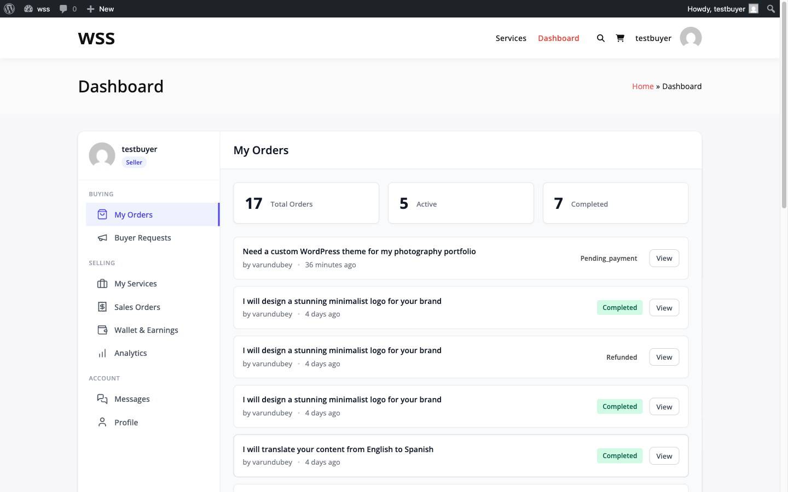
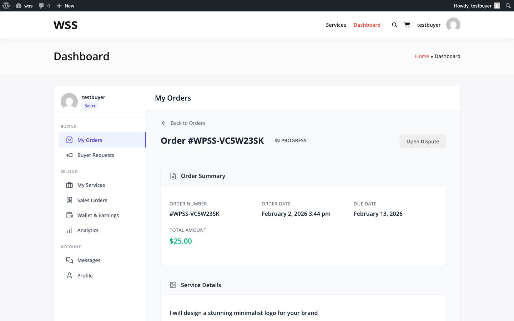
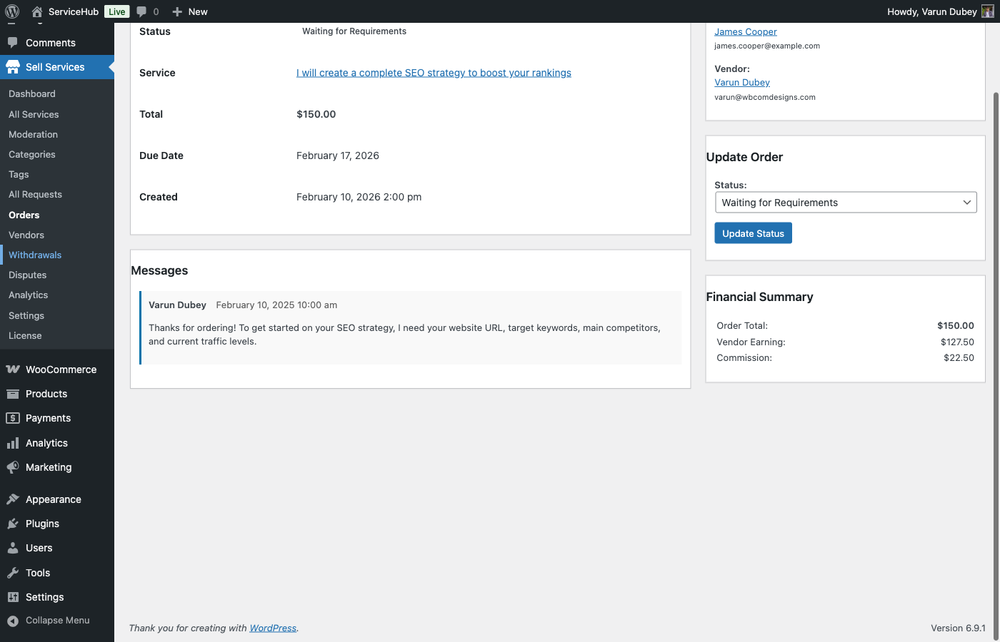
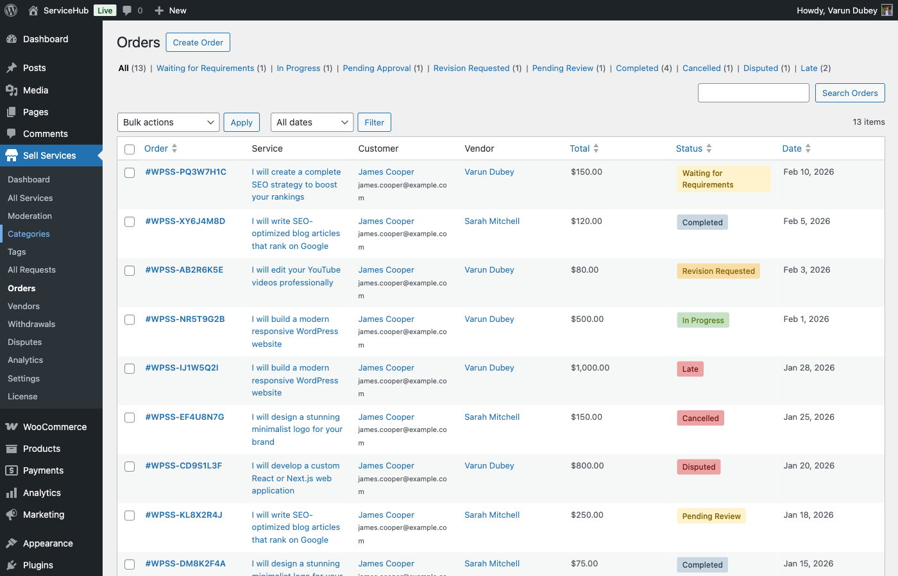

# Order Lifecycle & 11 Statuses

Learn how orders flow through WP Sell Services from payment to completion. This guide covers all 11 order statuses, automated transitions, and the complete order lifecycle.

## Order Lifecycle Overview

Every order in WP Sell Services follows a structured lifecycle with 11 distinct statuses. Understanding this flow helps vendors manage work efficiently and helps buyers know what to expect at each stage.



### The 11 Order Statuses

| Status | Description | Who Acts | Duration |
|--------|-------------|----------|----------|
| `pending_payment` | Payment not yet completed | Buyer | 24 hours |
| `pending_requirements` | Waiting for project requirements | Buyer | Configurable |
| `in_progress` | Vendor actively working | Vendor | Until delivery |
| `pending_approval` | Delivery submitted, awaiting review | Buyer | 3 days default |
| `revision_requested` | Buyer requested changes | Vendor | Until redelivery |
| `pending_review` | Order complete, buyer can review | Buyer | Indefinite |
| `completed` | Order finished and approved | System | Final |
| `cancelled` | Order terminated | Any | Final |
| `disputed` | Formal dispute opened | Admin | Until resolved |
| `on_hold` | Admin paused order | Admin | Until resumed |
| `late` | Deadline exceeded | System | Until delivered |

## Order Number Format

Each order receives a unique identifier:

**Format:** `WPSS-{RANDOM6}-{TIMESTAMP}`

**Example:** `WPSS-847261-1709834567`

- **WPSS-** = Prefix (filterable via `wpss_order_number_prefix` hook)
- **847261** = Random 6-digit number (100000-999999)
- **1709834567** = Unix timestamp when order was created

This format ensures uniqueness even across multiple sites or database migrations.

## Status Transitions Map

### Allowed Transitions

```
pending_payment → pending_requirements, cancelled
pending_requirements → in_progress, cancelled, on_hold
in_progress → pending_approval, on_hold, cancelled, late
pending_approval → completed, revision_requested, disputed
revision_requested → in_progress, pending_approval, cancelled, disputed
late → pending_approval, cancelled, disputed
on_hold → in_progress, cancelled
disputed → completed, cancelled
```

**Important:** Direct transitions not listed above are blocked by `OrderService::can_transition()`.

## Detailed Status Workflow



### 1. Pending Payment

**Trigger:** Buyer clicks "Order Now" and checkout begins

**Actions:**
- Order record created in database
- Payment gateway processes transaction
- Order visible only to buyer and admin
- Vendor not notified yet

**Next Steps:**
- Payment succeeds → `pending_requirements`
- Payment fails → `cancelled`
- 24 hours pass → auto-cancelled (if configured)

**Hooks:**
- `wpss_order_created` fires when order record created
- `wpss_order_payment_complete` fires on successful payment

---

### 2. Pending Requirements

**Trigger:** Payment successfully completed

**Actions:**
- Buyer receives email: "Submit your requirements"
- Requirements form unlocked for submission
- Vendor notified of new order
- Vendor cannot start work yet

**Reminders:**
- **Day 1:** First reminder email sent
- **Day 3:** Second reminder email sent
- **Day 5:** Final warning email sent

**Timeout Behavior (Configurable):**
- If `requirements_timeout_days` > 0 and `auto_start_on_timeout` = true:
  - Order auto-transitions to `in_progress` without requirements
- If `requirements_timeout_days` > 0 and `auto_start_on_timeout` = false:
  - Order auto-cancelled with refund

**Next Steps:**
- Buyer submits requirements → `in_progress` (with deadline set)
- Timeout reached → `in_progress` or `cancelled` (based on settings)
- Admin cancels → `cancelled`

**Hooks:**
- `wpss_requirements_submitted` fires when buyer submits form
- `wpss_requirements_timeout` fires when timeout action taken

---

### 3. In Progress

**Trigger:** Requirements submitted or order auto-started

**Actions:**
- Deadline calculated: `delivery_days` from package + addon modifiers
- `original_deadline` and `delivery_deadline` set
- `started_at` timestamp recorded
- Vendor can now upload deliveries
- Hourly cron checks for late orders

**Deadline Calculation:**
```php
$delivery_days = $package['delivery_days'];
foreach ($addons as $addon) {
    $delivery_days += $addon['delivery_days_extra']; // Can be negative for rush
}
$delivery_days = max(1, $delivery_days); // Minimum 1 day
```

**Deadline Reminder:**
- Sent 24 hours before deadline expires
- Notification type: `deadline_reminder`

**Next Steps:**
- Vendor submits delivery → `pending_approval`
- Deadline passes → `late`
- Admin or vendor pauses → `on_hold`
- Order cancelled → `cancelled`

**Hooks:**
- `wpss_order_status_in_progress` fires when status changes to in_progress
- `wpss_deadline_reminder` fires when reminder sent

---

### 4. Late

**Trigger:** `delivery_deadline` exceeded while `in_progress`

**Actions:**
- Cron `wpss_check_late_orders` runs hourly
- Vendor notified: "Order overdue"
- Buyer notified: "Order delayed"
- Vendor can still submit delivery

**Important:** Extensions are allowed on late orders (unlike many platforms).

**Next Steps:**
- Vendor submits delivery → `pending_approval`
- Extension approved → back to `in_progress` with new deadline
- Dispute opened → `disputed`
- Order cancelled → `cancelled`

**Hooks:**
- `wpss_order_status_late` fires when marked late

---

### 5. Pending Approval

**Trigger:** Vendor submits delivery

**Actions:**
- Delivery files uploaded and stored
- Buyer notified: "Delivery received"
- Buyer has 3 review options: Accept, Request Revision, or Dispute
- Auto-complete timer starts (default: 3 days)

**Auto-Complete Logic:**
- Cron `wpss_auto_complete_orders` runs twice daily
- Checks for deliveries older than `auto_complete_days` setting
- If buyer hasn't responded → auto-transitions to `completed`
- Buyer and vendor both notified of auto-completion

**Next Steps:**
- Buyer accepts → `completed`
- Buyer requests revision (if revisions remaining) → `revision_requested`
- Buyer opens dispute → `disputed`
- 3 days pass (default) → auto-`completed`

**Hooks:**
- `wpss_delivery_submitted` fires when vendor uploads delivery
- `wpss_order_auto_completed` fires on auto-completion

---

### 6. Revision Requested

**Trigger:** Buyer requests changes on pending_approval delivery

**Actions:**
- `revisions_used` incremented
- Vendor notified with revision feedback
- Order returns to vendor's active queue
- Delivery deadline unchanged (unless extension granted)

**Revision Limits:**
- Default: 2 revisions (configurable in Settings → Orders)
- Set per-package in service configuration
- Value `-1` = unlimited revisions
- Request blocked if no revisions remaining

**Next Steps:**
- Vendor resubmits delivery → `pending_approval`
- Dispute opened → `disputed`
- Order cancelled → `cancelled`

**Hooks:**
- `wpss_revision_requested` fires with reason text

---

### 7. Pending Review

**Status Note:** This status exists in code but is rarely used. Orders typically go from `completed` directly without passing through `pending_review`.

**Trigger:** Alternative completion flow (edge case)

**Actions:**
- Order work finished
- Awaiting buyer to leave review
- Payment released to vendor

**Next Steps:**
- Buyer leaves review → still `pending_review` (reviews don't change order status)
- Dispute window expires → remains in this status

---

### 8. Completed

**Trigger:** Buyer accepts delivery or auto-complete timer expires

**Actions:**
- `completed_at` timestamp recorded
- Commission calculated and recorded via `CommissionService::record()`
- Vendor's `completed_orders` count updated
- Platform earnings and vendor earnings split
- Both parties receive completion notification
- Review invitation sent to buyer

**Commission Flow:**
- Commission rate fetched from settings or vendor-specific rate
- `platform_fee` = `total * commission_rate`
- `vendor_earnings` = `total - platform_fee`
- Earnings added to vendor's wallet (if wallet system active)

**Dispute Window:**
- Default: 14 days after completion (configurable)
- Buyer can open dispute within this window
- After window expires, order is fully closed

**Next Steps:**
- Buyer opens dispute (within window) → `disputed`
- Buyer leaves review → no status change
- Dispute window expires → final

**Hooks:**
- `wpss_order_completed` fires with order object
- `wpss_order_status_completed` fires with previous status

---

### 9. Cancelled

**Trigger:** Multiple entry points (payment failure, timeout, manual cancellation, dispute resolution)

**Actions:**
- Order work stopped
- Refund processed (if payment was received)
- Both parties notified
- Cannot be reopened

**Cancellation Reasons:**
- Payment never completed (`pending_payment` timeout)
- Requirements never submitted (`pending_requirements` timeout with auto-start disabled)
- Buyer/vendor mutual agreement
- Dispute resolved in favor of cancellation
- Admin intervention

**Refund Logic:**
- If paid and work not started → full refund
- If work in progress → partial refund (negotiated)
- If completed → no refund (use dispute system)

**Next Steps:** None (final status)

**Hooks:**
- `wpss_order_cancelled` fires with order object and reason

---

### 10. Disputed

**Trigger:** Buyer or vendor opens formal dispute

**Actions:**
- Order work paused
- Admin/moderator notified
- Dispute case created with ID
- Both parties submit evidence
- Platform mediates resolution

**Allowed Entry Points:**
- From `pending_approval`
- From `revision_requested`
- From `completed` (within dispute window)
- From `late`

**Resolution Paths:**
- Resolved in buyer's favor → `cancelled` + full refund
- Resolved in vendor's favor → `completed` + payment released
- Partial refund agreed → `completed` with adjusted payment

**Next Steps:**
- Admin resolves → `completed` or `cancelled`

**Hooks:**
- `wpss_dispute_opened` fires when dispute created
- `wpss_dispute_resolved` fires when admin closes dispute

---

### 11. On Hold

**Trigger:** Admin manually pauses order (investigation, fraud check, etc.)

**Actions:**
- All automated workflows paused
- Deadline countdown frozen
- No reminders or notifications sent
- Admin note required for hold reason

**Common Use Cases:**
- Investigating fraud or policy violation
- Payment verification required
- Waiting for external information
- Cooling-off period during disputes

**Next Steps:**
- Admin resumes → `in_progress` (or previous status)
- Admin cancels → `cancelled`

**Hooks:**
- `wpss_order_put_on_hold` fires when order paused

## Automated Workflows

### Cron Jobs

| Cron Hook | Schedule | Action |
|-----------|----------|--------|
| `wpss_check_late_orders` | Hourly | Marks overdue in_progress orders as `late` |
| `wpss_auto_complete_orders` | Twice daily | Auto-completes pending_approval orders after 3 days |
| `wpss_send_deadline_reminders` | Daily | Sends 24h deadline warnings to vendors |
| `wpss_send_requirements_reminders` | Daily | Sends day 1/3/5 reminders to buyers |
| `wpss_check_requirements_timeout` | Daily | Auto-starts or cancels pending_requirements orders |

### Status Change Notifications

All status changes trigger:
1. `wpss_order_status_changed` action with old/new status
2. `wpss_order_status_{new_status}` action for specific status
3. System message in order conversation
4. Email notifications (if enabled in settings)

## Admin Order Management

Administrators can view and manage all orders from the WP Admin panel.






## Configuration Settings

**Location:** WP Admin → WP Sell Services → Settings → Orders

| Setting | Default | Description |
|---------|---------|-------------|
| Auto-Complete Days | 3 | Days after delivery before auto-completing |
| Default Revision Limit | 2 | Revisions per order (overridable per service) |
| Allow Disputes | Enabled | Whether buyers can open disputes |
| Dispute Window Days | 14 | Days after completion to allow disputes |
| Allow Late Requirements | Disabled | Allow requirement submission after work started |
| Requirements Timeout Days | 0 (disabled) | Days before taking timeout action |
| Auto-Start on Timeout | Enabled | Start order vs cancel when timeout reached |

## Order Timeline Example

**Typical Order Flow:**

```
Day 0, 10:00 AM → Order created (pending_payment)
Day 0, 10:05 AM → Payment confirmed (pending_requirements)
Day 0, 10:30 AM → Requirements submitted (in_progress)
                  Deadline set: Day 5, 10:30 AM
Day 4, 10:30 AM → Deadline reminder sent (24h warning)
Day 5, 09:00 AM → Delivery submitted (pending_approval)
Day 8, 09:00 AM → Auto-completed (3 days passed)
Day 8, 09:01 AM → Commission recorded, earnings split
```

**With Revision:**

```
Day 0 → Order created and paid
Day 0 → Requirements submitted (in_progress)
Day 5 → First delivery submitted (pending_approval)
Day 6 → Revision requested (revision_requested)
Day 8 → Second delivery submitted (pending_approval)
Day 9 → Buyer accepts (completed)
```

**Late Delivery:**

```
Day 0 → Requirements submitted (in_progress, deadline: Day 5)
Day 5 → Deadline passes, marked as late
Day 7 → Buyer requests extension (+3 days)
Day 7 → Vendor approves extension (in_progress, new deadline: Day 8)
Day 8 → Delivery submitted (pending_approval)
Day 8 → Buyer accepts (completed)
```

## Developer Hooks

### Filters

```php
// Modify allowed status transitions
apply_filters('wpss_order_status_transitions', $transitions, $from, $to);

// Change order number prefix
apply_filters('wpss_order_number_prefix', 'WPSS-');

// Customize auto-complete days (per order)
apply_filters('wpss_order_auto_complete_days', 3, $order_id);
```

### Actions

```php
// Fires when order status changes
do_action('wpss_order_status_changed', $order_id, $new_status, $old_status);

// Fires for specific status (e.g., in_progress)
do_action('wpss_order_status_in_progress', $order_id, $old_status);

// Fires when order is completed
do_action('wpss_order_completed', $order_id, $order);

// Fires when order is cancelled
do_action('wpss_order_cancelled', $order_id, $order);

// Fires when order marked as late
do_action('wpss_order_late', $order_id);

// Fires when payment completes
do_action('wpss_order_payment_complete', $order_id);
```

## Troubleshooting

### Order Stuck in Pending Requirements

**Symptoms:** Order stays in pending_requirements for days

**Causes:**
- Buyer hasn't submitted requirements
- Email notifications not reaching buyer
- Requirements timeout disabled

**Solutions:**
1. Check if requirements were submitted (database table `wpss_order_requirements`)
2. Verify email notifications are enabled
3. Manually transition to in_progress if vendor wants to proceed
4. Enable requirements timeout in settings

### Auto-Complete Not Working

**Symptoms:** Orders stay in pending_approval beyond configured days

**Causes:**
- Cron not running (hosting issue)
- Auto-complete days set to 0 (disabled)
- Delivery not recorded properly

**Solutions:**
1. Test cron: `wp cron event run wpss_auto_complete_orders`
2. Check auto_complete_days setting (must be > 0)
3. Verify delivery exists in `wpss_deliveries` table
4. Check cron schedule: `wp cron event list`

### Late Orders Not Being Marked

**Symptoms:** Orders past deadline still show in_progress

**Causes:**
- Hourly cron not running
- Deadline not set properly
- Server timezone misconfigured

**Solutions:**
1. Test cron: `wp cron event run wpss_check_late_orders`
2. Verify `delivery_deadline` field is set in database
3. Check WordPress timezone: Settings → General
4. Manually mark as late if needed

## Best Practices

### For Vendors

1. **Respond quickly** to pending_requirements orders - buyers are waiting
2. **Set realistic delivery times** - late orders hurt your metrics
3. **Communicate proactively** - send progress updates in messages
4. **Deliver before deadline** - don't wait until the last minute
5. **Request extensions early** - if you need more time, ask before it's late

### For Buyers

1. **Submit requirements promptly** - vendors can't start without them
2. **Review deliveries within 3 days** - auto-completion happens if you don't
3. **Use revision requests wisely** - be specific about what needs changing
4. **Open disputes as last resort** - try messaging first
5. **Leave reviews** - helps vendors improve and guides other buyers

### For Admins

1. **Monitor late orders** - reach out to vendors falling behind
2. **Review disputes promptly** - don't let them linger
3. **Check cron health** - automated workflows depend on it
4. **Adjust timeouts carefully** - balance buyer protection and vendor fairness
5. **Use on_hold sparingly** - only for genuine investigations

## Related Documentation

- [Requirements Collection](requirements-collection.md)
- [Order Messaging](order-messaging.md)
- [Deliveries & Revisions](deliveries-revisions.md)
- [Milestones](milestones.md) **[PRO]**
- [Tipping & Extensions](tipping-extensions.md)
- [Order Settings](order-settings.md)
