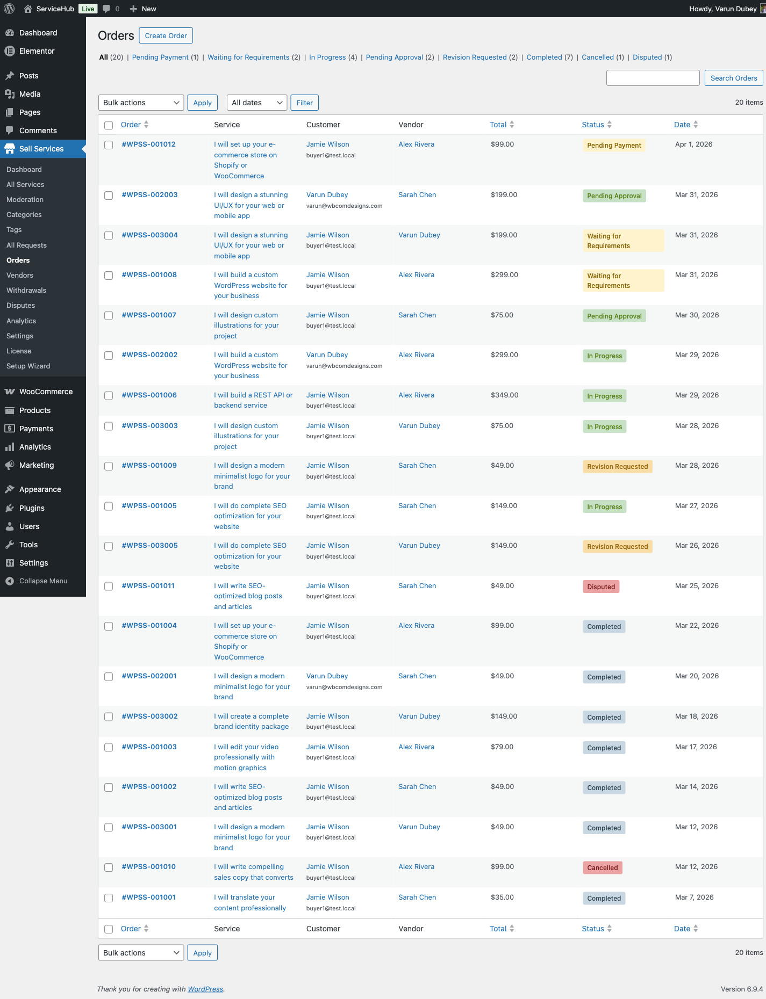
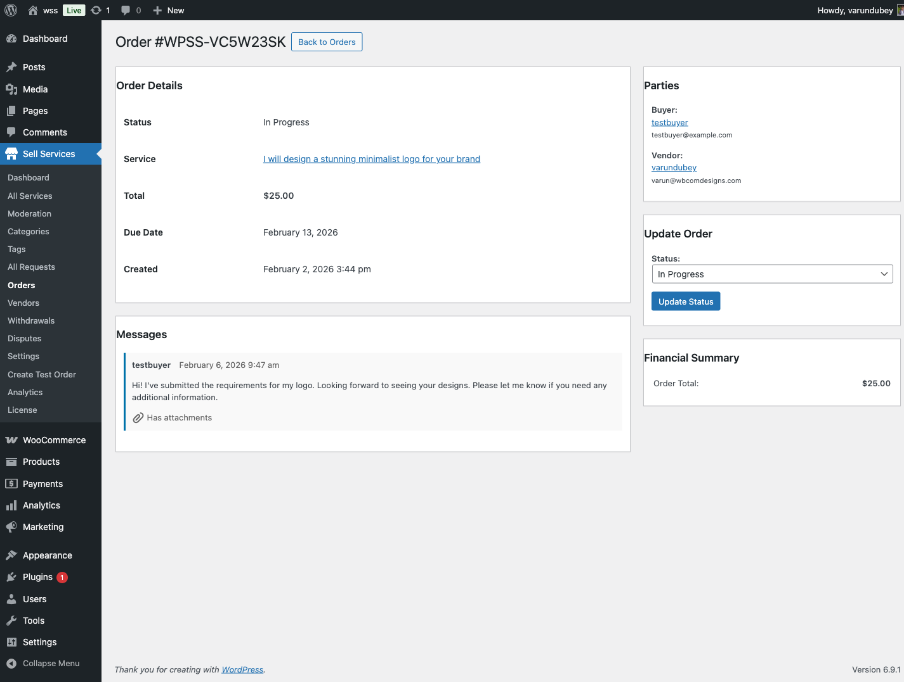

# How Orders Work

Every order on your marketplace follows a clear path from purchase to completion. Here is what happens at each stage and who needs to do what.

## The Order Flow at a Glance

```
Payment > Requirements > In Progress > Delivery > Approval > Complete
```

Each order moves through these stages automatically. Both buyers and vendors get email notifications at every step, so nobody is left guessing.

## What Each Status Means

### Pending Payment

The buyer has started checkout but payment has not gone through yet. Nothing happens on anyone's end until the payment is confirmed. If the buyer does not complete payment within 24 hours, the order is automatically cancelled.

### Pending Requirements

Payment is confirmed. Now the buyer needs to fill in the project details the vendor needs before starting work. The system sends automatic reminders on day 1, day 3, and day 5 if the buyer has not submitted yet.

If you have set a requirements timeout (in **Settings > Orders**), one of two things happens when time runs out:
- **Auto-start enabled** -- The order moves forward without requirements, and the vendor starts work.
- **Auto-start disabled** -- The order is cancelled and the buyer gets a refund.

### In Progress

The vendor is actively working. A delivery deadline is set based on the service package the buyer chose. The system sends the vendor a reminder 24 hours before the deadline.

### Late

The deadline has passed and the vendor has not delivered yet. Both the buyer and vendor are notified. The vendor can still submit their work, and they can also request a deadline extension.

### Pending Approval

The vendor has submitted their delivery. The buyer now has three choices:
1. **Accept** the delivery -- the order is complete.
2. **Request a revision** -- the vendor makes changes and resubmits.
3. **Open a dispute** -- if something is seriously wrong.

If the buyer does not respond within the auto-complete window (default: 3 days), the order completes automatically and the vendor gets paid.

### Revision Requested

The buyer has asked for changes. The vendor receives the feedback, makes updates, and submits a new delivery. The number of revisions allowed depends on the service package or your global settings.

### Completed

The order is finished. The platform commission is calculated, the vendor's earnings are recorded, and both parties can leave reviews. The buyer has a dispute window (default: 14 days) to raise issues after completion.

### Cancelled

The order has been stopped. This can happen for several reasons -- payment failure, requirement timeout, mutual agreement, or an admin decision. If payment was received, a refund is processed. Cancelled orders cannot be reopened.

### Disputed

A formal dispute has been opened. The order is paused while both parties submit evidence and the admin mediates. See [Opening a Dispute](../disputes-resolution/opening-a-dispute.md) for details.

### On Hold

An admin has manually paused the order, usually for investigation or fraud checks. All deadlines and automated workflows are frozen until the admin resumes or cancels the order.

## Automatic Workflows

Your marketplace runs several background tasks to keep orders moving:

- **Late order checks** run every hour, marking overdue orders as late.
- **Auto-complete** runs twice daily, completing orders where the buyer has not responded to a delivery.
- **Deadline reminders** go out daily, warning vendors about upcoming deadlines.
- **Requirement reminders** go out daily on day 1, 3, and 5 to buyers who have not submitted project details.
- **Requirement timeout** runs daily, auto-starting or cancelling orders when the waiting period expires.

## Admin Order Management

Admins can view and manage all marketplace orders from **WP Admin > WP Sell Services > Orders**. From there you can:

- See every order with its current status
- Filter and search orders
- View full order details, conversations, and deliveries
- Manually change order status when needed





## A Typical Order Timeline

Here is what a smooth order looks like:

- **Day 0** -- Buyer places order, payment confirmed, requirements submitted. Vendor starts work with a 5-day deadline.
- **Day 4** -- Vendor gets a deadline reminder (24 hours left).
- **Day 5** -- Vendor delivers the work.
- **Day 8** -- Buyer has not responded, so the order auto-completes. Commission is recorded and earnings are split.

And here is one with a revision:

- **Day 0** -- Order placed, requirements submitted, work begins.
- **Day 5** -- First delivery submitted.
- **Day 6** -- Buyer requests revision with feedback.
- **Day 8** -- Vendor submits updated delivery.
- **Day 9** -- Buyer accepts. Order complete.

## Key Settings

You can adjust how orders behave at **WP Admin > WP Sell Services > Settings > Orders**:

| Setting | Default | What It Does |
|---------|---------|--------------|
| Auto-Complete Days | 3 | Days after delivery before auto-completing |
| Default Revision Limit | 2 | Revisions per order (vendors can override per service) |
| Allow Disputes | Enabled | Whether buyers can open disputes |
| Dispute Window | 14 days | Days after completion to allow disputes |
| Requirements Timeout | 0 (disabled) | Days before taking action on missing requirements |
| Auto-Start on Timeout | Enabled | Start order vs cancel when requirements timeout |

## Tips for Success

**For Vendors:** Set realistic delivery times, communicate proactively, and deliver before your deadline whenever possible.

**For Buyers:** Submit your requirements promptly, review deliveries within a few days, and use the messaging system to clarify anything before opening a dispute.

**For Admins:** Monitor late orders regularly, respond to disputes quickly, and make sure your auto-complete and timeout settings match the pace of your marketplace.

## Related Documentation

- [Requirements Collection](requirements-collection.md)
- [Order Messaging](order-messaging.md)
- [Deliveries & Revisions](deliveries-revisions.md)
- [Milestones](milestones.md) **[PRO]**
- [Tipping & Extensions](tipping-extensions.md)
- [Order Settings](order-settings.md)
