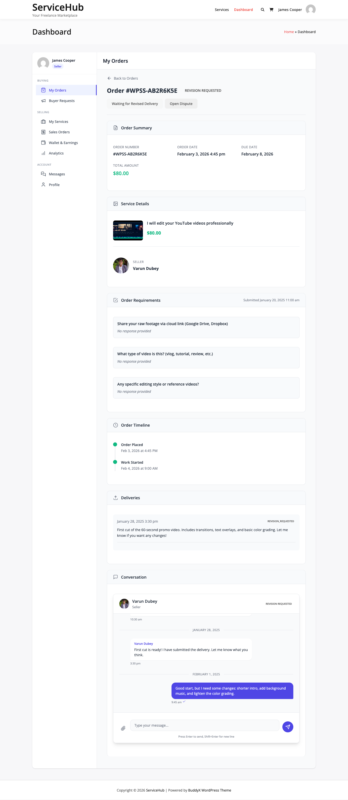

# Order Messaging

Effective communication is essential for successful orders. This guide covers the built-in messaging system that keeps vendors and buyers connected throughout the order lifecycle.

## Messaging System Overview

WP Sell Services includes an order-based messaging system that allows:
- Direct communication between buyer and vendor
- File attachments in messages
- Real-time message notifications
- Message history preservation
- Admin message monitoring

**Key Features:**
- Threaded conversations per order
- Email notifications for new messages
- File sharing (documents, images, references)
- Message read status
- Automatic polling for new messages
- Mobile-responsive interface



## Accessing Order Messages

### Vendor Access

**From Vendor Dashboard:**
1. Go to **Vendor Dashboard → Orders**
2. Click on order
3. Click **Messages** tab
4. View conversation history
5. Type and send messages

**Quick Message:**
- Some themes show **Message** button on order card
- Click to open messaging modal
- Send quick message without opening full order


### Buyer Access

**From Buyer Dashboard:**
1. Go to **Buyer Dashboard → My Orders**
2. Click on order
3. Click **Messages** tab
4. View and reply to messages

**Message Notifications:**
- Notification badge on dashboard
- Unread message count
- Email notifications

### Admin Access

**From Admin Panel:**
1. Go to **WP Sell Services → Orders**
2. Open any order
3. View **Messages** tab
4. See all buyer-vendor communication
5. Participate in conversation if needed

**Admin Monitoring:**
- View all messages (for quality assurance)
- Intervene in disputes
- Ensure professional communication
- Provide support when needed


## Sending Messages

### Composing a Message

1. Open order messages tab
2. Type message in text area
3. (Optional) Format message:
   - Line breaks for paragraphs
   - Bullet points with dashes
   - Bold for emphasis (if supported)
4. (Optional) Attach files
5. Click **Send Message**


### Message Best Practices

**Professional Communication:**

✅ **Do:**
- Use proper grammar and spelling
- Be polite and courteous
- Respond within 24 hours
- Stay on-topic (order-related)
- Use paragraphs for readability
- Thank the other party

❌ **Don't:**
- Use all caps (LOOKS LIKE SHOUTING)
- Be rude or confrontational
- Share personal contact info (phone, email) to bypass platform
- Discuss off-platform payments
- Use offensive language
- Ignore messages

**Message Templates:**

**Vendor: Order Accepted**
```
Hi [Buyer Name],

Thank you for your order! I'm excited to work on [service description].

I've reviewed your requirements and have everything I need to get started.
I'll deliver your completed [deliverable] by [deadline date].

I'll keep you updated on progress. Feel free to reach out if you have
any questions!

Best regards,
[Your Name]
```

**Vendor: Progress Update**
```
Hi [Buyer Name],

Quick update on your order:

✅ Completed: [Task 1]
✅ Completed: [Task 2]
🔄 In Progress: [Task 3]
📋 Next: [Task 4]

Everything is on track for delivery by [deadline]. I'll send another
update in 2 days.

Let me know if you have any questions!

Best regards,
[Your Name]
```

**Buyer: Question**
```
Hi [Vendor Name],

I have a quick question about [specific aspect]:

[Your question here]

Thanks for your help!

Best regards,
[Your Name]
```

**Buyer: Clarification on Requirements**
```
Hi [Vendor Name],

I wanted to clarify something about my requirements:

Original: [What you said]
Clarification: [What you meant]

Sorry for any confusion! Let me know if you need anything else.

Best regards,
[Your Name]
```

### Message Length

**Recommended:**
- Keep messages concise (under 500 words)
- Break long messages into multiple paragraphs
- Use bullet points for lists
- Highlight important information

**Too Short:**
```
"ok"
"sure"
"done"
```
(Not helpful, lacks context)

**Too Long:**
```
[10 paragraphs of rambling]
```
(Overwhelming, key points lost)

**Just Right:**
```
2-4 paragraphs
Clear subject
Specific questions/updates
Call to action if needed
```

## File Attachments

### Attaching Files to Messages

1. Compose message
2. Click **Attach File** button
3. Select file(s) from computer
4. Wait for upload confirmation
5. Send message with attachment


### Attachment Limits

**Default Settings:**

| Setting | Default | Configurable |
|---------|---------|--------------|
| **Max Files per Message** | 3 | Yes |
| **Max File Size** | 10MB | Yes |
| **Total Message Size** | 25MB | Yes |
| **Allowed File Types** | PDF, JPG, PNG, ZIP, DOC, DOCX, XLS, XLSX | Yes |

**Configuration:**
WP Sell Services → Settings → Advanced → Message Attachments

### Allowed File Types

**Default Allowed:**
- Documents: PDF, DOC, DOCX, TXT
- Images: JPG, PNG, GIF
- Archives: ZIP, RAR
- Spreadsheets: XLS, XLSX, CSV

**Blocked for Security:**
- Executables: EXE, BAT, CMD
- Scripts: JS, PHP, SH
- Potentially dangerous: VBS, WSF

**Custom File Types:**

Developers can modify allowed types:

```php
add_filter( 'wpss_message_allowed_file_types', function( $types ) {
    $types[] = 'psd';  // Add Photoshop files
    $types[] = 'ai';   // Add Illustrator files
    return $types;
}, 10 );
```

### Downloading Attachments

**To Download:**
1. View message with attachment
2. Click file name or download icon
3. File downloads to your computer

**Security:**
- Files scanned for viruses (if scanner enabled)
- Only order participants can download
- Download links expire after 48 hours (regenerated on access)
- File access logged for security


### When to Use Attachments

**Appropriate Uses:**

**Vendor Sending:**
- Work-in-progress screenshots
- Design mockups for feedback
- Reference materials
- Clarification documents
- Sample files

**Buyer Sending:**
- Additional requirements
- Brand assets (logos, fonts)
- Reference designs
- Content documents
- Credentials (encrypted)

**Deliverables:**
Don't use messages for final deliverables. Use the proper **Delivery Submission** feature for trackability and revision management.

## Message Notifications

### Email Notifications

**When Sent:**
- New message received
- File attached to message
- Admin message sent

**Email Content:**
```
Subject: New Message for Order #WPSS-202501-1234

Hi [Recipient],

You have a new message from [Sender] regarding your order:

Order: [Service Name]
From: [Sender Name]

Message Preview:
"[First 100 characters of message...]"

[View Full Message and Reply]

Best regards,
[Marketplace Name]
```

**Email Frequency:**
- Immediate: Individual email per message (default)
- Digest: Bundled emails every X hours (configurable)
- Disabled: No email notifications (not recommended)

**Configuration:**
WP Sell Services → Settings → Emails → Message Notifications


### Dashboard Notifications

**Notification Badge:**
- Unread message count displayed
- Updates in real-time (if polling enabled)
- Red badge on navigation menu
- Number indicates unread count

**Notification Bell:**
- Shows recent notifications
- Click to view message preview
- Direct link to order messages

### Browser Notifications

**[PRO]** Enable browser push notifications:

**Setup:**
1. Buyer/Vendor enables in dashboard settings
2. Browser requests notification permission
3. Grant permission
4. Receive notifications even when dashboard closed

**Notification Content:**
- New message alert
- Sender name
- Message preview
- Click to open order


## Message Features

### Real-Time Polling

Messages refresh automatically:

**How It Works:**
- Dashboard polls for new messages every 30 seconds (default)
- New messages appear without page refresh
- Typing indicator shows when other party is typing (Pro)
- Read receipts update automatically

**Configuration:**
WP Sell Services → Settings → Advanced → Message Polling Interval

### Read Status

Track message read status:

**Indicators:**
- **Sent** (✓): Message sent successfully
- **Delivered** (✓✓): Message received by server
- **Read** (Blue ✓✓): Recipient opened message

**Benefits:**
- Know when messages are seen
- Reduce follow-up messages
- Transparency in communication


### Message History

All messages preserved:

**Full Conversation:**
- Chronological message list
- Timestamps on each message
- Sender identification
- Attachment history
- Never deleted (even after order completion)

**Search Messages:**
- Search within conversation
- Find specific information quickly
- Filter by date or sender

**Export Conversation:**
- Export messages to PDF/TXT
- Useful for records or disputes
- Admin can export any conversation

### Typing Indicator [PRO]

**[PRO]** See when other party is typing:

**Display:**
- "[Vendor Name] is typing..."
- Updates in real-time
- Shows user is actively responding
- Reduces anxiety from waiting


## Message Guidelines

### Communication Policies

**Platform Rules:**

✅ **Allowed:**
- Order-related discussions
- Requirements clarification
- Progress updates
- Professional questions
- Constructive feedback

❌ **Prohibited:**
- Sharing external contact info (to bypass platform)
- Requesting off-platform payment
- Spam or solicitations
- Harassment or abuse
- Inappropriate content
- Sharing other buyers' info

**Consequences:**
- Warning for first violation
- Account suspension for repeated violations
- Permanent ban for severe violations

### Professional Standards

**Response Times:**

**Expected Response Times:**
- Vendors: Within 24 hours (business days)
- Buyers: Within 48 hours
- Admins: Within 24 hours (support requests)

**Setting Expectations:**
- Communicate your availability
- Set away messages if unavailable
- Provide ETA for detailed responses

**Example:**
```
"I'm traveling this weekend. I'll respond to messages on Monday.
If urgent, please open a support ticket."
```

### Dispute Prevention

Messages are evidence:

**Document Everything:**
- Agree to scope changes in messages
- Confirm requirements in writing
- Acknowledge deadline changes
- Note any agreements

**Example Dispute Scenario:**

**Without Messages:**
- Buyer says vendor agreed to add pages
- Vendor says no agreement was made
- No evidence, hard to resolve

**With Messages:**
- Messages show buyer requested extra pages
- Vendor agreed or quoted price
- Clear evidence for dispute resolution

**Best Practice:** Always document important agreements in the messaging system.


## Admin Message Management

### Monitoring Conversations

Admins can view all messages:

**Review for:**
- Terms of service violations
- Professional conduct
- Dispute evidence
- Quality assurance

**Privacy Notice:**
- Inform users that admin can view messages
- Include in terms of service
- Display notice in messaging interface

### Participating in Conversations

**When to Intervene:**
- Dispute mediation
- Policy violation
- Technical support needed
- Misunderstanding clarification

**Admin Message:**
1. Open order messages
2. Toggle **Send as Admin**
3. Compose message
4. Message clearly labeled "Admin Message"
5. Both parties notified


### Message Moderation

**Automatic Moderation:**
- Spam detection (links, repetitive content)
- Profanity filter (configurable)
- Contact info detection (phone, email)
- Warning before blocking/removing

**Manual Moderation:**
- Review flagged messages
- Delete inappropriate messages
- Warn or suspend users
- Document violations

**Configuration:**
WP Sell Services → Settings → Advanced → Message Moderation

## Messaging Analytics

### Vendor Metrics

Track communication quality:

**Metrics:**
- Average response time
- Messages per order
- Response rate (% of messages answered)
- Customer satisfaction (based on reviews)

**Impact on Reputation:**
- Fast response time boosts visibility
- High response rate increases trust
- Poor communication hurts reviews


### Order Communication Stats

**Per-Order Tracking:**
- Total messages exchanged
- Average response time (both parties)
- Attachments shared
- Communication quality indicator

**Red Flags:**
- Very high message count (confusion/scope issues)
- Very low message count (lack of communication)
- Slow response times
- One-sided communication

## Mobile Messaging

### Responsive Design

Messages work on all devices:

**Mobile Features:**
- Touch-friendly interface
- Optimized for small screens
- Easy file upload from camera
- Voice typing support (device dependent)

**Mobile Tips:**
- Keep messages brief on mobile
- Use shorter paragraphs
- Minimize scrolling
- Use voice-to-text for longer messages


## Troubleshooting

### Messages Not Sending

**Common Issues:**

**Error: "Message too long"**
- Reduce message length
- Break into multiple messages

**Error: "File too large"**
- Compress files
- Split into multiple messages
- Use delivery submission for large files

**Error: "Connection lost"**
- Check internet connection
- Refresh page
- Try again

### Notifications Not Received

**Email Notifications:**
- Check spam folder
- Verify email address in profile
- Enable in notification settings
- Check email delivery logs (admin)

**Dashboard Notifications:**
- Clear browser cache
- Disable ad blockers
- Check notification permissions
- Verify real-time polling enabled

### Can't View Messages

**Permission Issues:**
- Verify you're logged in
- Confirm you're order participant
- Check account status (not suspended)
- Contact admin if persists

## Integration & API

### REST API Endpoints

**[PRO]** Access messages via REST API:

**Endpoints:**
```
GET /wp-json/wpss/v1/orders/{order_id}/messages
POST /wp-json/wpss/v1/orders/{order_id}/messages
GET /wp-json/wpss/v1/messages/{message_id}
```

**Use Cases:**
- Mobile app integration
- Custom dashboard
- External notification systems
- Third-party integrations

### Webhooks

**[PRO]** Trigger webhooks on message events:

**Events:**
- `message.sent`
- `message.received`
- `message.read`

**Webhook Payload:**
```json
{
  "event": "message.sent",
  "order_id": 1234,
  "message_id": 5678,
  "sender": "vendor",
  "content": "Message text...",
  "timestamp": "2025-01-01T10:00:00Z"
}
```

## Best Practices Summary

### For Vendors

✅ **Responsiveness:**
- Reply within 24 hours
- Set expectations if delayed
- Use auto-responder if away

✅ **Clarity:**
- Be clear and specific
- Use formatting for readability
- Summarize key points
- Confirm understanding

✅ **Professionalism:**
- Polite and courteous
- Professional language
- Patient with questions
- Solution-oriented

### For Buyers

✅ **Clarity:**
- Ask specific questions
- Provide context
- Reference requirements
- Be patient for responses

✅ **Respect:**
- Don't demand instant replies
- Be understanding of delays
- Provide constructive feedback
- Thank vendor for updates

### For Admins

✅ **Monitoring:**
- Regular message review
- Identify problematic patterns
- Support when needed
- Maintain neutrality

✅ **Policies:**
- Clear communication guidelines
- Enforce consistently
- Document violations
- Educate users

## Next Steps

- **[Order Workflow](order-workflow.md)** - Complete order lifecycle
- **[Managing Orders](managing-orders.md)** - Order management guide
- **[Deliveries & Revisions](deliveries-revisions.md)** - Submitting work
- **[Dispute Resolution](dispute-resolution.md)** - Handling conflicts

Effective communication is the foundation of successful orders!
