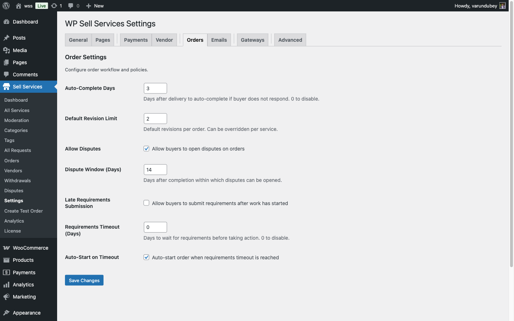

# Order Settings

Control how orders behave on your marketplace -- from auto-completion timing to revision limits and dispute windows. All of these settings are found at **WP Admin > WP Sell Services > Settings > Orders**.

## Auto-Complete Days

**Default: 3 days**

After a vendor delivers their work, the buyer has this many days to review it. If the buyer does not respond (no accept, no revision request, no dispute), the order auto-completes and the vendor gets paid.

- Set to **1-2 days** for fast-paced marketplaces with quick turnaround services.
- Set to **5-7 days** for high-value services where buyers need more review time.
- Set to **0** to disable auto-completion entirely -- buyers must manually accept every delivery.

## Default Revision Limit

**Default: 2 revisions**

This is how many times a buyer can request changes on a delivery. Vendors can override this number per service package (for example, Basic gets 1 revision, Premium gets unlimited).

- Set to **0** for no revisions at all.
- Set to **1-3** for most marketplaces.
- Set higher for services where iteration is expected (design, content writing).
- Vendors can offer unlimited revisions on specific packages regardless of this default.

## Allow Disputes

**Default: Enabled**

When enabled, buyers can open formal disputes on orders. When disabled, the dispute button is hidden and buyers must resolve issues through messaging or by contacting you directly.

Keeping disputes enabled is recommended -- it protects both buyers and vendors and gives you a structured way to mediate problems.

## Dispute Window

**Default: 14 days**

After an order is completed, the buyer has this many days to open a dispute. Once the window closes, the order is fully finalized and cannot be disputed.

- Set to **7 days** if you want faster finalization.
- Set to **30-60 days** for high-value services where issues might surface later.
- Set to **90 days** for maximum buyer protection.

## Requirements Timeout

**Default: 0 (disabled)**

After payment, the buyer needs to submit project requirements before work can begin. This setting controls how long to wait before taking action if the buyer never submits them.

When set to 0, the order waits indefinitely.

When set to a number of days (e.g., 7), the system takes action when the timeout expires. What action it takes depends on the next setting.

## Auto-Start on Timeout

**Default: Enabled**

This controls what happens when the requirements timeout expires:

- **Enabled** -- The order starts without requirements. The vendor begins work and can request details through messaging. This is useful for flexible services.
- **Disabled** -- The order is cancelled and the buyer receives a refund. This is better for services that truly cannot begin without project details.

## Allow Late Requirements

**Default: Disabled**

When enabled, buyers can submit their project requirements even after the order has already started (useful if auto-start on timeout moved the order forward). When disabled, requirements can only be submitted while the order is in "Pending Requirements" status.

## All Settings at a Glance

| Setting | Default | Range | What It Does |
|---------|---------|-------|--------------|
| Auto-Complete Days | 3 | 0-30 | Days after delivery to auto-complete |
| Default Revision Limit | 2 | 0-10 | Default revisions per order |
| Allow Disputes | Enabled | On/Off | Enable the dispute system |
| Dispute Window | 14 days | 1-90 | Days after completion to allow disputes |
| Allow Late Requirements | Disabled | On/Off | Submit requirements after work started |
| Requirements Timeout | 0 | 0-30 | Days to wait for requirements |
| Auto-Start on Timeout | Enabled | On/Off | Start order or cancel when timeout expires |

## Recommended Configurations

### Standard Marketplace

For most service marketplaces, the defaults work well:
- Auto-Complete: 3 days
- Revisions: 2
- Dispute Window: 14 days
- Requirements Timeout: 3 days, auto-start enabled

### High-Value Services

For expensive, complex services like web development or consulting:
- Auto-Complete: 7 days (more review time)
- Revisions: 3-5 or unlimited
- Dispute Window: 30-60 days
- Requirements Timeout: 7 days, auto-start disabled (require requirements)

### Quick Turnaround

For fast services like logo tweaks, quick edits, or social media graphics:
- Auto-Complete: 1 day
- Revisions: 1-2
- Dispute Window: 7 days
- Requirements Timeout: 1 day, auto-start enabled

## Related Documentation

- [Order Lifecycle](order-lifecycle.md)
- [Deliveries & Revisions](deliveries-revisions.md)
- [Requirements Collection](requirements-collection.md)
- [Opening a Dispute](../disputes-resolution/opening-a-dispute.md)
