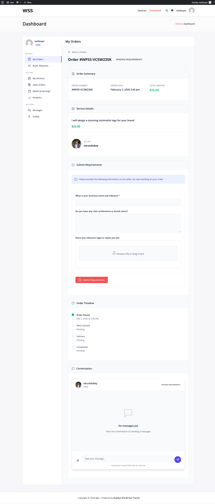
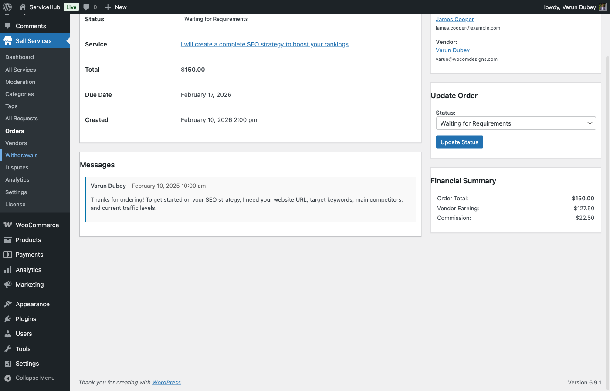

# Order Workflow

Understanding the complete order lifecycle is essential for vendors and marketplace admins. This guide explains every order status, transitions, and the automated processes that move orders through the workflow.

## Order Lifecycle Diagram

```
Purchase → Pending Payment → Pending Requirements → Pending Acceptance
    ↓                                                        ↓
Paid & Requirements Submitted                          In Progress
                                                            ↓
                                                    Pending Approval
                                                            ↓
                                            Revision Requested ←→ In Progress
                                                            ↓
                                                    Pending Review
                                                            ↓
                                                       Completed

Alternative Paths: Cancelled, Disputed, On Hold, Late
```

## All Order Statuses

WP Sell Services uses 11 order statuses to track the complete lifecycle:

### 1. Pending Payment

**When:** Order created, awaiting payment

**Triggers:**
- Buyer adds service to cart
- Proceeds to checkout
- WooCommerce order created

**Automatic Actions:**
- Order entry created in database
- Vendor notified of potential order
- Payment reminder emails sent

**Next Status:**
- Payment completed → `pending_requirements` (if requirements exist)
- Payment completed → `pending_acceptance` (if no requirements)
- Payment failed after 24 hours → `cancelled`

**Duration:** Usually seconds to minutes (instant payments) or hours (bank transfers)


### 2. Pending Requirements

**When:** Payment completed, buyer must submit service requirements

**Triggers:**
- Payment successful
- Service has requirement fields configured

**Buyer Actions:**
- Redirected to requirements form
- Fills out custom questions
- Uploads required files
- Submits requirements

**Automatic Actions:**
- Email to buyer with requirements link
- Reminder emails if not submitted (24h, 48h)
- Auto-cancel if not submitted after 7 days

**Next Status:**
- Requirements submitted → `pending_acceptance` (if manual approval)
- Requirements submitted → `in_progress` (if auto-accept enabled)

**Duration:** Hours to days (average: 1-2 days)



### 3. Pending Acceptance

**When:** Awaiting vendor acceptance of order

**Triggers:**
- Requirements submitted (if manual approval enabled)
- Payment completed (if no requirements)

**Vendor Actions:**
- Review order details
- Review buyer requirements
- Accept or decline order

**Automatic Actions:**
- Email to vendor with order details
- Auto-accept after 24 hours (if configured)
- Return to queue if declined

**Accept Reasons:**
- Requirements are clear
- Within service scope
- Able to deliver on time

**Decline Reasons:**
- Out of scope
- Insufficient information
- Unavailable during timeframe

**Next Status:**
- Vendor accepts → `in_progress`
- Vendor declines → `cancelled` (buyer refunded)
- Auto-accept → `in_progress`

**Duration:** Hours to 1 day


### 4. In Progress

**When:** Active work phase, vendor is working on deliverable

**Triggers:**
- Order accepted by vendor
- Work started

**Actions:**
- Vendor creates deliverables
- Buyer and vendor communicate via messaging
- Deadline countdown active
- Progress updates sent

**Automatic Actions:**
- Email notifications on status updates
- Late order warnings (approaching deadline)
- Deadline extension requests processed

**Next Status:**
- Vendor submits delivery → `pending_approval`
- Deadline missed → `late` (status flag added)
- Buyer cancels (with reason) → `cancelled`
- Dispute opened → `disputed`

**Duration:** 3-30 days (based on package delivery time)


### 5. Pending Approval

**When:** Vendor submitted delivery, awaiting buyer review

**Triggers:**
- Vendor uploads deliverable files
- Vendor marks work as complete
- Delivery submitted notification sent

**Buyer Actions:**
- Downloads and reviews deliverable
- Approves delivery → order completed
- Requests revision → back to in_progress

**Automatic Actions:**
- Email to buyer with delivery notification
- Reminder to review (after 48 hours)
- Auto-approve after X days (configurable, default: 7 days)

**Next Status:**
- Buyer approves → `pending_review` or `completed`
- Buyer requests revision → `revision_requested`
- Auto-approve → `pending_review`

**Duration:** 1-7 days (average: 2-3 days)


### 6. Revision Requested

**When:** Buyer requested changes to delivered work

**Triggers:**
- Buyer clicks "Request Revision" on delivery
- Buyer provides revision feedback

**Vendor Actions:**
- Review revision request
- Make requested changes
- Resubmit delivery

**Revision Limits:**
- Based on package (Basic: 1, Standard: 3, Premium: unlimited)
- Counter tracks revisions used
- Additional revisions can be purchased (via add-ons)

**Automatic Actions:**
- Email to vendor with revision details
- Revision counter incremented
- Deadline may be extended (configurable)

**Next Status:**
- Vendor resubmits → `pending_approval`
- Revisions exceeded → `pending_approval` (with notice)
- Dispute opened → `disputed`

**Duration:** 1-5 days per revision cycle


### 7. Pending Review

**When:** Delivery approved, awaiting buyer review/rating

**Triggers:**
- Buyer approves final delivery
- Auto-approval after inactivity
- Work accepted as complete

**Actions:**
- Buyer can leave review (rating + comment)
- 14-day review window (configurable)
- Funds released to vendor (minus commission)

**Automatic Actions:**
- Email reminder to leave review
- Auto-complete after review period expires

**Next Status:**
- Review submitted → `completed`
- 14 days pass → `completed` (without review)

**Duration:** Up to 14 days


### 8. Completed

**When:** Order successfully finished

**Triggers:**
- Buyer leaves review
- Review window expires
- All deliverables accepted

**Final Actions:**
- Funds released to vendor
- Commission deducted and logged
- Order marked as complete
- Statistics updated

**Available Actions:**
- View order history
- Download deliverables (for both parties)
- Continue messaging (optional)
- Open dispute (within dispute window, if configured)

**This is a terminal status** (order lifecycle ends here)


### 9. Cancelled

**When:** Order cancelled before completion

**Triggers:**
- Buyer cancels during pending stages
- Vendor declines order
- Payment fails
- Requirements not submitted (auto-cancel)
- Admin cancels order

**Automatic Actions:**
- Refund processed (if payment collected)
- Email notifications to both parties
- Order statistics updated
- Inventory returned (if applicable)

**Refund Rules:**
- Before work starts: 100% refund
- After work starts: Determined by admin/dispute
- After delivery: Dispute required

**This is a terminal status**


### 10. Disputed

**When:** Dispute opened by buyer or vendor

**Triggers:**
- Buyer unhappy with delivery
- Vendor disputes cancellation request
- Disagreement on scope or quality

**Actions:**
- Dispute details submitted
- Admin reviews dispute
- Evidence provided by both parties
- Resolution proposed

**Resolution Options:**
- Full refund to buyer
- Partial refund
- Favor vendor (no refund)
- Mutual agreement (custom)

**Next Status:**
- Dispute resolved → `completed` (if favoring vendor)
- Dispute resolved → `cancelled` (if refunded)
- Escalated to platform support

**Duration:** 3-14 days (varies by complexity)

See **[Dispute Resolution Guide](dispute-resolution.md)** for details.


### 11. On Hold

**When:** Order temporarily paused

**Triggers:**
- Admin places order on hold
- Payment issue (chargeback investigation)
- Account verification needed
- Suspicious activity flagged

**Actions:**
- Work stops
- Deadlines paused
- Investigation/resolution pending

**Next Status:**
- Issue resolved → `in_progress` (resume)
- Issue unresolved → `cancelled`

**Duration:** Varies (1-30 days)


### Late Orders

**Not a separate status, but a flag applied to orders**

**When:** Deadline passed without delivery

**Triggers:**
- Current time > deadline
- Order still in `in_progress` status

**Visual Indicators:**
- Red "LATE" badge on order
- Deadline shown in red
- Late notification emails sent

**Automatic Actions:**
- Email to vendor (deadline missed)
- Email to buyer (delay notification)
- Option to request extension or cancel

**Resolution:**
- Vendor submits delivery → badge removed, normal flow continues
- Vendor requests extension → buyer approves/denies
- Buyer cancels → refund processed


## Status Transition Rules

### Allowed Transitions

Each status can only transition to specific next statuses:

| From Status | To Status | Trigger |
|-------------|-----------|---------|
| pending_payment | pending_requirements, cancelled | Payment success/failure |
| pending_requirements | pending_acceptance, cancelled | Submit/timeout |
| pending_acceptance | in_progress, cancelled | Accept/decline |
| in_progress | pending_approval, disputed, cancelled | Delivery/dispute/cancel |
| pending_approval | revision_requested, pending_review | Revision/approval |
| revision_requested | pending_approval, disputed | Resubmit/dispute |
| pending_review | completed | Review/timeout |
| completed | - | Terminal |
| cancelled | - | Terminal |
| disputed | completed, cancelled | Resolution |
| on_hold | in_progress, cancelled | Resume/cancel |

### Manual Status Changes (Admin)

Admins can override status transitions:

1. Go to **WP Sell Services → Orders**
2. Open order
3. Click **Change Status** dropdown
4. Select new status
5. Add reason (optional but recommended)
6. Save changes

**Use Cases:**
- Resolve stuck orders
- Correct errors
- Handle special circumstances
- Mediate disputes

**Warning:** Manual status changes bypass normal workflows. Use carefully.


## Commission Calculation

Commission is calculated and deducted at specific points:

### When Commission is Calculated

**At Order Creation:**
- Total order price determined
- Commission calculated based on settings
- Commission amount stored with order

**Formula:**
```
Order Total = Package Price + Add-ons
Commission = Order Total × Commission Rate (percentage) OR Flat Rate
Vendor Earnings = Order Total - Commission
```

**Example (10% commission):**
```
Package: $100
Add-ons: $30
Order Total: $130
Commission (10%): $13
Vendor Earnings: $117
```

### When Commission is Deducted

**On Order Completion:**
- Order marked as `completed`
- Commission deducted from vendor earnings
- Commission logged in separate table
- Vendor balance updated

### Commission Settings

**Global Commission (all vendors):**
- Set at: WP Sell Services → Settings → Commission
- Applies to all vendors by default

**Per-Vendor Commission [PRO]:**
- Set custom rate per vendor
- Overrides global commission
- Useful for premium/verified vendors

**Commission on Add-ons:**
- Configurable: Include or exclude add-ons from commission base
- Setting: WP Sell Services → Settings → Commission



## Automatic Actions & Triggers

WP Sell Services automates many workflow actions:

### Email Notifications

| Event | Recipient | Email |
|-------|-----------|-------|
| Order placed | Vendor | "New Order Received" |
| Payment confirmed | Buyer | "Order Confirmation" |
| Requirements needed | Buyer | "Submit Requirements" |
| Requirements submitted | Vendor | "Requirements Received" |
| Order accepted | Buyer | "Vendor Accepted Order" |
| Delivery submitted | Buyer | "Delivery Ready for Review" |
| Revision requested | Vendor | "Revision Requested" |
| Order completed | Both | "Order Completed" |
| Deadline approaching | Vendor | "Deadline in 24 Hours" |
| Order late | Both | "Order Past Deadline" |

### Automated Transitions

| Trigger | Action | Timing |
|---------|--------|--------|
| Requirements not submitted | Cancel order | 7 days |
| Order not accepted | Auto-accept | 24 hours (if enabled) |
| Delivery not reviewed | Auto-approve | 7 days (configurable) |
| Review not left | Complete order | 14 days |
| Extension not responded | Deny extension | 48 hours |

### Hooks for Developers

```php
// Order status changed
do_action( 'wpss_order_status_changed', $order_id, $old_status, $new_status );

// Order completed
do_action( 'wpss_order_completed', $order_id );

// Delivery submitted
do_action( 'wpss_delivery_submitted', $order_id, $delivery_id );

// Revision requested
do_action( 'wpss_revision_requested', $order_id, $revision_count );
```

## Deadline Management

### How Deadlines are Calculated

**Formula:**
```
Deadline = Order Accepted Date + Package Delivery Days + Extension Days
```

**Example:**
- Order accepted: January 1, 2025
- Package delivery: 7 days
- Deadline: January 8, 2025 (11:59 PM)

### Deadline Extensions

See **[Deadline Extensions Guide](deadline-extensions.md)** for complete details.

**Quick Summary:**
- Vendor requests extension
- Buyer approves or denies
- Deadline updated if approved
- Logged in order history

### Late Order Handling

**Automatic Handling:**
1. Order marked "Late" (visual flag)
2. Notifications sent to both parties
3. Buyer can:
   - Wait for delivery
   - Request extension
   - Cancel order (with refund)

**Vendor Options:**
- Submit delivery ASAP
- Request extension (explain delay)
- Accept cancellation

## Order Numbering System

Each order has a unique identifier:

**Format:** `WPSS-{YEAR}{MONTH}-{ID}`

**Examples:**
- `WPSS-202501-1234` (January 2025, order ID 1234)
- `WPSS-202512-5678` (December 2025, order ID 5678)

**Custom Prefix (Pro):**
- Change "WPSS" to your brand
- Example: "MKT-202501-1234" for "MyMarketplace"

## Next Steps

- **[Managing Orders](managing-orders.md)** - Vendor and admin order management
- **[Deliveries & Revisions](deliveries-revisions.md)** - Submitting and reviewing work
- **[Deadline Extensions](deadline-extensions.md)** - Extending delivery dates
- **[Order Messaging](order-messaging.md)** - Communication during orders

Understanding the workflow ensures smooth order execution!
