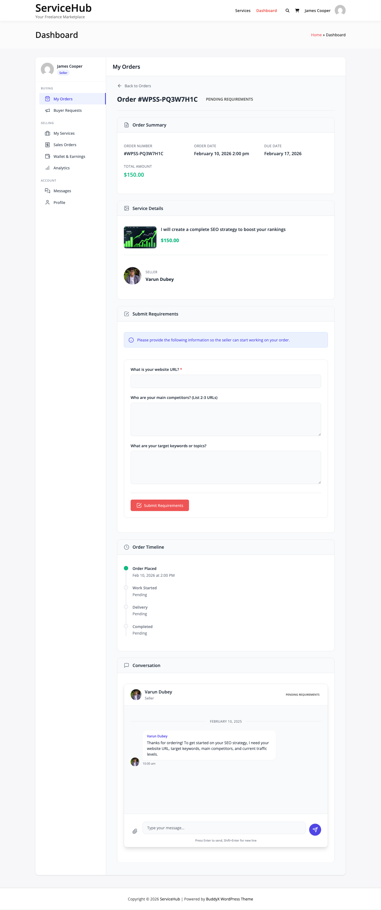
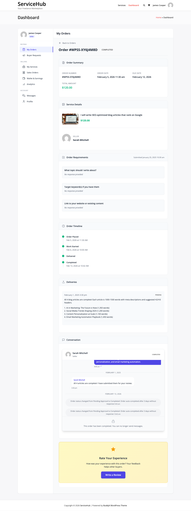

# Buyer Requirements

After a buyer places an order, the vendor often needs specific project details before they can start working. That is what requirements collection is for.

## What Are Requirements?

Requirements are the questions a vendor sets up on their service so buyers can provide project details after checkout. Think of it like a brief or intake form -- the vendor defines the questions, and the buyer fills them in.

For example, a logo design vendor might ask:
- What is your company name?
- Upload your brand guidelines
- What colors do you prefer?

## How Buyers Fill Them In

After payment is confirmed, the order moves to "Pending Requirements" status and the buyer gets an email asking them to submit their details.

1. The buyer clicks the link in the email (or navigates to the order page).
2. They fill out the form the vendor created.
3. They upload any requested files.
4. They click **Submit Requirements**.

Once submitted, the order moves to "In Progress" and the vendor's delivery deadline starts.

## Automatic Reminders

If the buyer does not submit right away, the system sends automatic email reminders:

| Day | What the buyer receives |
|-----|------------------------|
| Day 1 | First reminder: "Please submit your requirements" |
| Day 3 | Second reminder: "Your vendor is waiting" |
| Day 5 | Final warning: "Submit requirements or your order may be affected" |

## What Vendors Can Ask For

Vendors build their requirements form when creating or editing a service. Four question types are available:

- **Text** -- Short answers like a website URL, company name, or social media handle.
- **Textarea** -- Longer descriptions like project overview, design preferences, or feature requirements.
- **File Upload** -- Reference materials, brand logos, content documents, or design mockups. Supports images, documents, archives, media files, and design files up to 50MB per file.
- **Dropdown** -- A single choice from predefined options, like preferred style or package type.

Each question can be marked as required or optional, and vendors can add helpful placeholder text and instructions.

## Skipping Requirements

Some services do not need upfront details from the buyer. If a vendor does not add any requirement questions to their service, the order skips straight from payment to "In Progress."

## Requirement Timeout Settings

You can control what happens if a buyer never submits their requirements. Go to **Settings > Orders** and adjust these:

**Requirements Timeout Days** -- How many days to wait before taking action. Set to 0 to disable (the order waits indefinitely).

**Auto-Start on Timeout** -- What happens when the timeout expires:
- **Enabled** -- The order starts without requirements. The vendor begins work and can ask the buyer for details through messaging.
- **Disabled** -- The order is cancelled and the buyer gets a refund.

**Allow Late Requirements** -- When enabled, buyers can still submit requirements even after work has already started. Useful for flexible services.

## Viewing Submitted Requirements

**Vendors** see the submitted requirements in the order detail page under the Requirements tab. Each answer is displayed with its question, and file uploads include download links.

**Admins** can view requirements from the order detail page in **WP Admin > WP Sell Services > Orders**.

## Tips

**For Vendors:** Keep your requirements form focused -- only ask for what you truly need. Use clear questions, add helpful placeholder text, and only mark fields as required if you genuinely cannot work without them.

**For Buyers:** Submit your requirements as soon as possible. The vendor cannot start work without them. Be thorough -- more detail means better results and fewer revisions.

**For Admins:** If you notice orders getting stuck in "Pending Requirements," consider enabling a timeout. Monitor email deliverability to make sure reminder emails actually reach buyers.

## Related Documentation

- [Order Lifecycle](order-lifecycle.md)
- [Order Messaging](order-messaging.md)
- [Order Settings](order-settings.md)
