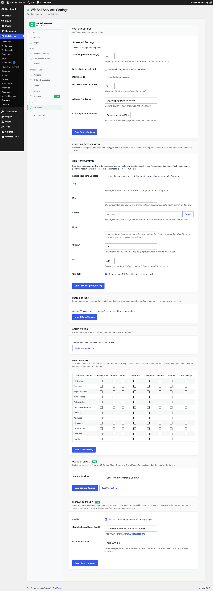

# Display Currency [PRO]

Show shoppers an approximate price in their own currency while your marketplace
keeps **one authoritative base currency** for everything it stores and settles.

This is a **display-only hint**. Orders, earnings, commission, refunds, and
payouts are always calculated and recorded in your base currency. Nothing about
the stored price changes -- only what a visitor sees while browsing.



## Why display-only

A marketplace that genuinely stored prices in many currencies would have to
reconcile exchange-rate movement on every order, refund, and payout: a vendor
could be paid at one rate and refunded at another, and the ledger would drift.

Keeping one base currency and treating other currencies as a browsing hint keeps
the money math correct and auditable, while still meeting shoppers in their own
currency. Because the base amount is the amount charged, there is **no rounding
drift** between the price a shopper sees at checkout and the amount they pay.

## Setup

1. Sign up at [openexchangerates.org](https://openexchangerates.org/signup) and copy your App ID. The free tier is enough for a typical marketplace.
2. Go to **Sell Services > Settings > Advanced** and find the **Display Currency** card.
3. Tick **Enable**, paste your App ID, and list the currencies you want to offer.
4. Save.

The converted hint then appears on catalog price displays automatically, through
the free plugin's `wpss_catalog_price_html` seam. **No template edits are
required** -- if your theme renders prices through the plugin's price helper, it
picks this up for free.

## What the shopper sees

- Catalog and service pages show the converted price alongside the real base price.
- Their choice is remembered in a `wpss_display_currency` cookie, so it persists across pages.
- Checkout always shows and charges the base-currency amount.

Add a currency picker anywhere with the shortcode:

```
[wpss_currency_switcher]
```

Drop it in a header, sidebar, or the top of your services page.

## Exchange rates

Rates come from openexchangerates.org and are cached for **12 hours**. If a
fetch fails (bad key, API down, network error), the failure is cached for only
**15 minutes** so a temporary outage does not leave you with stale rates for
half a day, and a broken key does not hammer the API on every page load.

If rates cannot be fetched at all, the hint simply does not render -- shoppers
still see correct base-currency prices. The feature degrades quietly rather than
showing a wrong number.

## Things to know

- Changing the currency list or App ID flushes the rate cache immediately.
- The hint is frontend-only. Admin screens, invoices, and exports stay in base currency.
- This is not multi-currency **pricing**. Vendors set one price, in your base currency. If you need genuinely separate per-currency price points, that is not what this feature does.

## Related

- [Currency, Tax & Gateway Configuration](currency-tax-config.md) -- setting your base currency
- [Commission System](../earnings-wallet/commission-system.md) -- how the split is calculated
- [Shortcodes Reference](../marketplace-display/shortcodes-reference.md)
