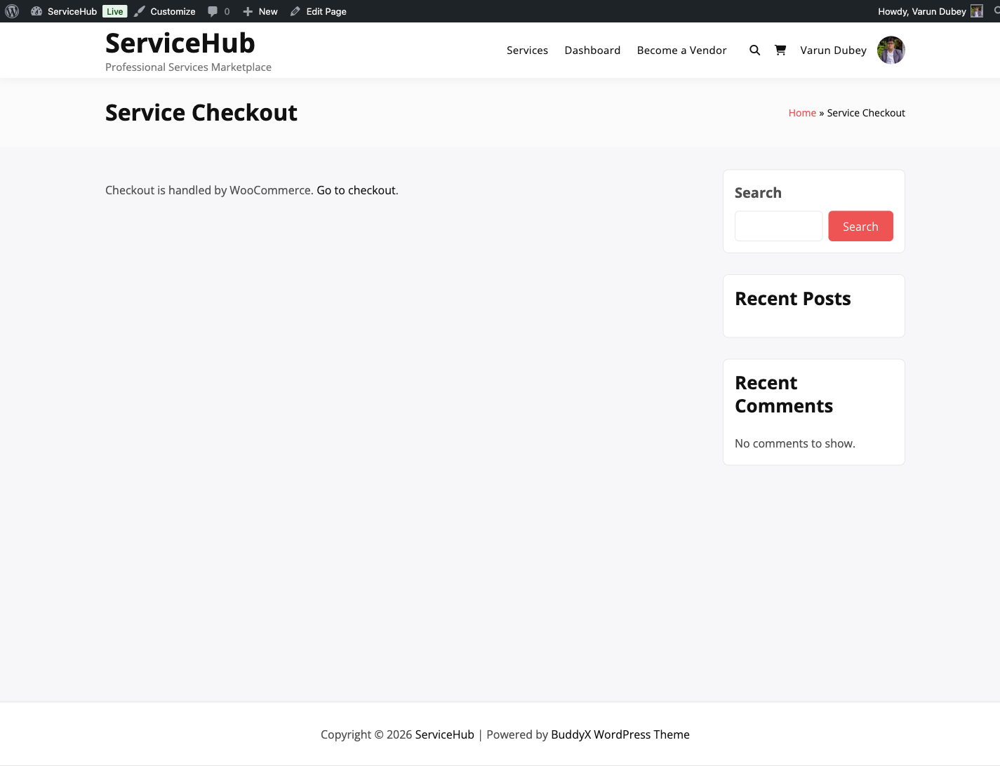

# Standalone Checkout Mode

WP Sell Services includes its own built-in checkout system, so you can run a fully independent marketplace without WooCommerce or any other e-commerce plugin.

## What Is Standalone Mode?

Standalone mode means your marketplace handles everything on its own -- cart, checkout, payments, and orders. No extra plugins needed. It is the default for the free version and the fastest way to get started.

## When Should You Use Standalone Mode?

Choose standalone mode if:

- You only sell services (no physical products)
- You want a lightweight, fast checkout experience
- You do not need WooCommerce extensions
- You want fewer plugins on your site

Choose WooCommerce mode if you need access to 100+ payment gateways, WooCommerce extensions like Subscriptions or Bookings, or already run a WooCommerce store.

## How It Works for Buyers

1. Buyer browses services and clicks **Add to Cart**
2. Cart page shows selected services, packages, and add-ons
3. Buyer proceeds to checkout and enters billing details
4. Buyer picks a payment method (Stripe, PayPal, bank transfer, etc.)
5. Buyer clicks **Place Order** and receives an order confirmation
6. Vendor is notified and work begins

Buyers can purchase services from multiple vendors in a single checkout. Each service becomes its own separate order with independent delivery tracking.

## Letting Buyers Create an Account at Checkout

By default a buyer must sign in before paying. On a marketplace selling to people
who have never visited before, that sign-in wall is where a good number of them
leave.

Turn on **Sell Services > Settings > General > Account at checkout** and
the wall goes away: the buyer fills in the billing details they were going to
fill in anyway, and their account is created from those when they pay. They are
signed in immediately afterwards.

**There is no guest order.** After paying, a buyer has to submit requirements,
message the seller, review the delivery, possibly request a revision or open a
dispute -- every one of those needs an identity. An order with no owner could not
be fulfilled, and could be read by any logged-out visitor. So the account is
created rather than skipped.

No new fields appear at checkout. Name and email are already required billing
fields, which is exactly what an account needs.

**Off by default.** Turning it on means anyone who completes a checkout gets a
WordPress user account, which is a decision for the site owner rather than
something to inherit silently.

## Choosing Which Billing Fields Checkout Asks For

**Sell Services > Settings > Orders & Disputes > Checkout Billing Fields**

Address fields make sense when something is being shipped. For a marketplace
selling design work or code, asking a buyer for a street address before they can
pay is friction with nothing behind it, and every extra field costs you some
buyers.

Turn off the ones you do not need. Three stay on and cannot be removed:

- **First name**
- **Last name**
- **Email**

Those are locked because an order has to be attributable to somebody you can
contact. They are also exactly what an account needs, which is why creating
accounts at checkout adds no new fields to the form.

## Setting Up Standalone Mode

1. Go to **Sell Services > Settings > General**
2. Under **E-commerce Platform**, select **Standalone Mode**
3. Click **Save Changes**
4. Go to **Settings > Payment Gateways** and enable at least one payment gateway
5. Test the full checkout with a sample service

## Available Payment Gateways

The free plugin ships with Stripe, PayPal, and Offline (bank transfer) built in. Razorpay is available with Pro.

| Gateway | Included In | What It Supports |
|---------|-------------|-----------------|
| **Stripe** | Free | Credit/debit cards, Apple Pay, Google Pay |
| **PayPal** | Free | PayPal balance, cards, Venmo |
| **Offline/Bank Transfer** | Free | Manual payments you confirm yourself |
| **Razorpay** **[PRO]** | Pro | UPI, cards, net banking, wallets (India) |

See [Stripe Payments](stripe-payments.md) and [Other Payment Gateways](other-gateways.md) for setup details, including sandbox and test mode instructions for each gateway.

### Test Gateway (Development Only)

When `WP_DEBUG` is enabled in `wp-config.php`, a **Test Gateway** option appears at checkout. It completes payments instantly with no external credentials -- useful for testing the full order lifecycle during development or QA. It is automatically hidden on production sites where `WP_DEBUG` is `false`.

See [Other Payment Gateways](other-gateways.md#test-gateway-development-only) for full details.

## What the Checkout Page Includes

- **Billing details** -- name, email, address
- **Order review** -- services, prices, and totals
- **Payment method selector** -- choose from your enabled gateways
- **Terms and conditions** checkbox (optional)
- **Place Order** button

## Standalone vs WooCommerce: Quick Comparison

| | Standalone | WooCommerce **[PRO]** |
|--|-----------|----------------------|
| Extra plugins needed | None | WooCommerce required |
| Payment gateways | 3 built-in + Razorpay **[PRO]** | 100+ via WooCommerce extensions |
| Checkout speed | Fastest | Good |
| Physical products | No | Yes |
| Best for | Pure service marketplaces | Stores that also sell products |

## Switching Between Modes

You can switch at any time from **Settings > General**. A few things to keep in mind:

- **Finish active orders first.** Existing orders stay in the system they were created in.
- **Reconfigure payment gateways** after switching, since each mode uses its own gateways.
- **Test checkout** thoroughly after any switch.

## What Buyers and Vendors See

**Vendors get a dashboard with:**
- Incoming orders and delivery management
- Service listings and editing
- Earnings tracking and withdrawal requests
- Messaging with buyers

**Buyers get:**
- Order history and active order tracking
- Messaging with vendors
- Profile and account settings

## Related Docs

- [Stripe Payments](stripe-payments.md) -- Card payments setup
- [Other Payment Gateways](other-gateways.md) -- PayPal, Razorpay, offline
- [WooCommerce Checkout](woocommerce-checkout.md) **[PRO]** -- WooCommerce integration
- [Currency and Tax](currency-tax-config.md) -- Financial settings
