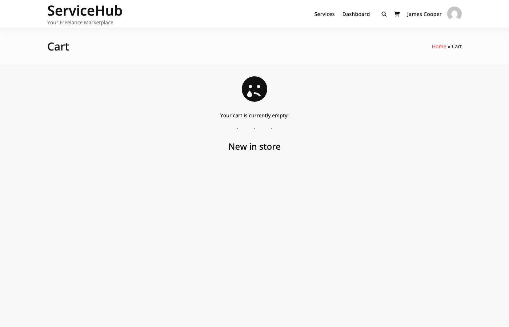

# WooCommerce Checkout Integration

WP Sell Services uses WooCommerce as its default checkout platform, providing seamless integration that leverages WooCommerce's robust payment ecosystem while maintaining service marketplace functionality.

## How It Works

When buyers purchase a service:

1. Service details are stored in WooCommerce cart using a hidden virtual carrier product named "Service Order"
2. Service data (ID, package, add-ons, vendor) is stored in cart item meta
3. Buyer completes standard WooCommerce checkout
4. Plugin creates linked service orders for each vendor
5. Order statuses sync between WooCommerce and the marketplace

### Key Benefits

| Feature | Benefit |
|---------|---------|
| Payment Gateways | Access 100+ WooCommerce payment gateways |
| Mature Platform | Leverage battle-tested WooCommerce infrastructure |
| Extension Ecosystem | Compatible with thousands of WooCommerce extensions |
| Account Integration | Service orders appear in WooCommerce My Account |
| Admin Familiarity | Use familiar WooCommerce order management |

## Setup

### Prerequisites

- WordPress 6.0+
- WooCommerce 7.0+
- PHP 8.0+



### Installation

1. Install and activate WooCommerce from Plugins → Add New
2. Complete WooCommerce setup wizard
3. Go to **WP Sell Services → Settings → General**
4. E-Commerce Platform defaults to "Auto-detect" (finds WooCommerce automatically)
5. Plugin creates the "Service Order" carrier product (published but hidden from shop)


### Verify Carrier Product

Go to **Products → All Products** and look for "Service Order" product. This is a virtual, hidden product that powers service checkout.

**Do not delete this product.** If accidentally deleted:

1. Go to **WP Sell Services → Settings → General**
2. Save settings to trigger carrier product recreation

## Cart Integration

### Cart Item Data Structure

When a service is added to cart, these meta keys are stored:

```php
array(
    'wpss_service_id' => 123,        // Service CPT ID
    'wpss_package_id' => 0,          // Package index (0, 1, or 2)
    'wpss_addons'     => [10, 15],   // Array of addon IDs
    'wpss_vendor_id'  => 5,          // Vendor user ID
    'unique_key'      => 'md5_hash', // Prevents duplicate cart items
)
```

### Cart Display

The cart shows:

- Service title (replaces carrier product name)
- Package name (Basic, Standard, Premium)
- Vendor name
- Add-ons as meta data
- Dynamic pricing calculated from service data

### Multiple Vendors

Buyers can purchase services from multiple vendors in one order. WooCommerce creates a single order, which the plugin splits into separate marketplace orders — one per service (gig). Each service order has its own vendor, delivery deadline, requirements, conversation, and dispute lifecycle, ensuring independent fulfillment regardless of how many services were purchased together.

## Order Synchronization

### Order Creation Flow

1. Buyer completes WooCommerce checkout
2. WooCommerce creates order (WC #1001)
3. Plugin creates marketplace orders split by vendor:
   - WPSS Order #234 → Vendor A → linked to WC #1001
   - WPSS Order #235 → Vendor B → linked to WC #1001
4. Order meta stored in both systems

### Order Meta

**WooCommerce Order:**
```php
_wpss_marketplace_order_ids = [234, 235] // Linked WPSS order IDs
```

**Service Order:**
```php
_wc_order_id = 1001      // WooCommerce order ID
_payment_method = 'stripe'
_transaction_id = 'ch_abc123'
```

### Status Synchronization

**Forward Sync (WooCommerce → Marketplace):**

All WooCommerce status changes sync to marketplace orders:

| WooCommerce | Marketplace | When |
|-------------|-------------|------|
| Pending | Pending Payment | Order created, awaiting payment |
| On Hold | On Hold | Payment verification needed |
| Processing | In Progress | Payment received |
| Completed | Completed | All services delivered |
| Cancelled | Cancelled | Order cancelled |
| Refunded | Refunded | Refund issued |
| Failed | Failed | Payment failed |

**Reverse Sync (Marketplace → WooCommerce):**

Only 2 marketplace statuses sync back to WooCommerce:

| Marketplace | WooCommerce | When |
|-------------|-------------|------|
| Completed | Completed | Service delivered and accepted |
| Cancelled | Cancelled | Service cancelled |

All other marketplace status changes (Delivered, In Progress, etc.) do not affect the WooCommerce order status.

## My Account Integration

Service orders integrate with WooCommerce My Account pages.

### For Buyers

- **Orders** tab shows WooCommerce orders
- **Service Orders** tab shows marketplace order details
- **Messages** tab for vendor communication

### For Vendors

- **Dashboard** for earnings overview
- **Services** to manage listings
- **Orders** for incoming service orders
- **Earnings** for wallet and withdrawals
- **Messages** for buyer communication

### Order Details

When viewing a service order in My Account, buyers see:

- Vendor profile link
- Delivery countdown
- Message vendor button
- Requirements form (if needed)
- Delivery files
- Accept/Request Revision buttons

## Advanced Hooks

### Modify Cart Item Data

```php
add_filter( 'wpss_wc_cart_item_data', function( $data, $service_id, $package_id ) {
    $data['custom_meta'] = 'value';
    return $data;
}, 10, 3 );
```

### Change Carrier Product Name

```php
add_filter( 'wpss_wc_carrier_product_name', function( $name ) {
    return 'Custom Service Product';
} );
```

### Redirect to Checkout After Add to Cart

```php
add_filter( 'wpss_wc_add_to_cart_redirect', function( $url ) {
    return wc_get_checkout_url();
} );
```

## Troubleshooting

### Service Not Adding to Cart

1. Verify carrier product exists at **Products → All Products**
2. Check browser console for JavaScript errors
3. Ensure service is published and vendor is active
4. Clear WooCommerce cart sessions

### Orders Not Syncing

1. Verify order contains service items (check for `_wpss_service_id` meta on line items)
2. Enable debug logging in wp-config.php:
   ```php
   define( 'WP_DEBUG', true );
   define( 'WP_DEBUG_LOG', true );
   ```
3. Check wp-content/debug.log for errors
4. Manually trigger sync from WooCommerce order edit page

### Status Not Updating

1. Remember only Completed and Cancelled sync from marketplace to WooCommerce
2. Check WooCommerce → Status → Logs for gateway errors
3. Verify no plugin conflicts by testing with default theme and minimal plugins

## Next Steps

- [Alternative Platforms](alternative-platforms.md) - Learn about EDD, FluentCart, SureCart
- [Standalone Mode](standalone-mode.md) **[PRO]** - Direct payment without e-commerce plugins
- [Order Lifecycle](../order-management/order-lifecycle.md) - Understand order workflow
- [Payment Gateways](other-gateways.md) **[PRO]** - Configure Stripe, PayPal, Razorpay
