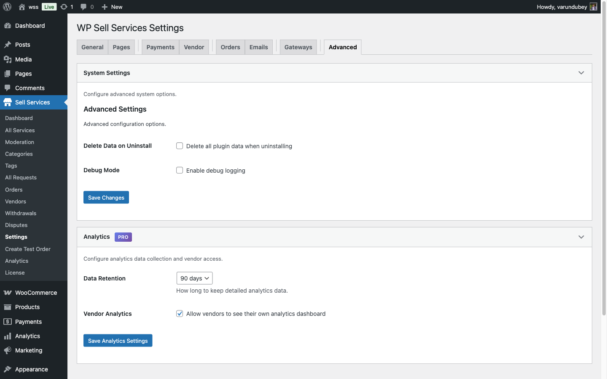

# Advanced Settings

Configure data management, debug mode, and automated background tasks for your marketplace.

## System Settings

WP Sell Services provides two core advanced settings for data management and debugging.



## Delete Data on Uninstall

Control whether plugin data is removed when you uninstall WP Sell Services.

### How It Works

When enabled, uninstalling the plugin will permanently delete:
- All services and custom post types
- Order records and transactions
- Vendor profiles and portfolios
- Buyer requests and proposals
- Reviews and ratings
- Conversations and messages
- Earnings and withdrawal history
- Platform settings and configuration

### Configuration

1. Go to **WP Sell Services → Settings → Advanced**
2. Check **Delete Data on Uninstall**
3. Save changes

**Default:** Disabled (data is preserved)

### When to Enable

**Enable if:**
- You're testing the plugin temporarily
- Moving to a different platform
- Clean slate required for fresh start
- Compliance requires complete data removal

**Keep Disabled if:**
- You might reinstall the plugin later
- Preserving historical data for records
- Regulatory requirements need transaction logs
- Backing up before major updates

### What Remains After Deletion

These items are NOT deleted:
- WordPress user accounts (buyers and vendors remain as WP users)
- Media library files (uploaded images and documents)
- Payment gateway transaction records (stored with payment processor)
- Email logs (if using external email service)

### Important Warning

**This action is irreversible.** Once data is deleted during uninstallation:
- No backups are created automatically
- Data cannot be recovered
- Transaction history is lost
- Vendor earnings records are removed

**Before Uninstalling:**
1. Export all critical data via [Data Export](../analytics-reporting/data-export.md)
2. Download vendor payout reports
3. Back up database manually if needed
4. Inform vendors about platform shutdown

## Debug Mode

Enable detailed logging for troubleshooting plugin issues and monitoring system activity.

### Enable Debug Logging

1. Navigate to **Settings → Advanced**
2. Check **Enable Debug Mode**
3. Save changes
4. View logs at **WP Sell Services → System → Logs** **[PRO]** or check WordPress debug.log

### What Gets Logged

When debug mode is active, the plugin logs:

**Order Events:**
- Order creation and status changes
- Requirements submission
- Delivery uploads
- Revision requests
- Auto-completion triggers

**Payment Processing:**
- Commission calculations
- Vendor earnings credits
- Withdrawal request processing
- Refund transactions

**Email Activity:**
- Email type sent (new order, delivery ready, etc.)
- Recipient addresses
- Send success/failure status
- Template rendering errors

**File Operations:**
- Upload attempts and results
- File validation checks
- Cloud storage sync (if using Pro cloud features)
- Attachment processing

**Background Tasks:**
- Cron job execution
- Auto-complete order checks
- Vendor statistics updates
- Late order detection

**Errors and Warnings:**
- PHP notices and warnings
- Database query failures
- API communication errors
- Permission denied attempts

### Viewing Debug Logs

**With Pro Version:**
Go to **WP Sell Services → System → Logs** for filterable log viewer.

**Free Version:**
Check WordPress debug.log file at:
```
wp-content/debug.log
```

Enable WordPress debugging in `wp-config.php`:
```php
define('WP_DEBUG', true);
define('WP_DEBUG_LOG', true);
define('WP_DEBUG_DISPLAY', false);
```

### Log File Location

Free version logs to:
- WordPress standard debug.log (if WP_DEBUG_LOG enabled)
- PHP error_log (server-specific location)

Pro version stores logs in database for web-based viewing.

### Performance Impact

Debug mode adds minimal overhead:
- Small file write operations
- No impact on page load speed
- Negligible memory usage

**Recommendation:** Enable only when troubleshooting. Disable in production to keep logs clean.

### Log Retention

**Free Version:**
- Managed by WordPress (no automatic cleanup)
- Manually clear debug.log periodically
- Monitor file size to prevent disk space issues

**Pro Version:**
- Automatic cleanup after 30 days
- Configurable retention period
- Size limits prevent excessive database growth

## Automated Background Tasks

WP Sell Services runs several cron jobs to maintain marketplace operations automatically.

### Active Cron Jobs

The plugin registers three scheduled tasks on activation:

#### 1. Auto-Complete Orders

**Schedule:** Runs every hour
**Cron Hook:** `wpss_auto_complete_orders`

**What It Does:**
Automatically marks delivered orders as completed if buyer doesn't respond within the configured auto-complete period (default: 3 days).

**Process:**
1. Finds orders in "Pending Approval" status
2. Checks if delivery was submitted > X days ago
3. Completes order if deadline passed
4. Releases payment to vendor
5. Sends completion notifications
6. Updates vendor statistics

**Configuration:**
Set auto-complete delay in **Settings → Orders → Auto-Complete Days**.

#### 2. Cleanup Expired Requests

**Schedule:** Runs daily
**Cron Hook:** `wpss_cleanup_expired_requests`

**What It Does:**
Closes buyer requests that have passed their expiration deadline.

**Process:**
1. Finds requests with deadline < current date
2. Changes status to "Expired"
3. Prevents new vendor proposals
4. Archives request from active listings

**Configuration:**
Buyer request expiration is set per-request when posting. No global setting.

#### 3. Update Vendor Stats

**Schedule:** Runs twice daily (12 hours apart)
**Cron Hook:** `wpss_update_vendor_stats`

**What It Does:**
Recalculates vendor performance metrics and ratings.

**Metrics Updated:**
- Overall rating (average from reviews)
- Total earnings (all time and last 30 days)
- Order completion rate
- Response time average
- Active orders count
- Service count

**Why Twice Daily:**
Balances data accuracy with database performance. More frequent updates aren't necessary for slowly-changing metrics.

### Verifying Cron Jobs

Check if scheduled tasks are running:

**Method 1: WP Crontrol Plugin**
1. Install free WP Crontrol plugin
2. Go to **Tools → Cron Events**
3. Look for these hooks:
   - `wpss_auto_complete_orders` (hourly)
   - `wpss_cleanup_expired_requests` (daily)
   - `wpss_update_vendor_stats` (twicedaily)
4. Check "Next Run" times to verify scheduling

**Method 2: Debug Logs**
1. Enable debug mode
2. Wait for scheduled run time
3. Check logs for cron execution entries
4. Verify tasks completed without errors

### If Cron Jobs Aren't Running

WordPress cron relies on site traffic to trigger. Low-traffic sites may experience delays.

**Solution 1: Disable WP-Cron**

Add to `wp-config.php`:
```php
define('DISABLE_WP_CRON', true);
```

Then add real cron via hosting control panel:
```bash
*/15 * * * * wget -q -O - https://yoursite.com/wp-cron.php?doing_wp_cron
```

**Solution 2: Use External Cron Service**
- EasyCron.com
- cron-job.org (free)
- SetCronJob.com

Set to ping `https://yoursite.com/wp-cron.php` every 15 minutes.

**Solution 3: Manual Trigger**
Use WP Crontrol plugin to run jobs manually while testing.

### Pro Features: Additional Cron Jobs

**[PRO]** The Pro version adds extra automated tasks:

**Auto-Withdrawals:**
- Cron hook: `wpss_process_auto_withdrawals`
- Schedule: Configurable (weekly/monthly)
- Automatically creates and processes vendor withdrawals when balance thresholds are met
- See [Auto-Payouts](../earnings-wallet/auto-payouts.md) for configuration

**Cloud Storage Sync:**
- Regular sync between local and cloud storage
- Cleanup of orphaned files
- Storage quota monitoring

## Service Moderation

Control whether new vendor services require admin approval before publishing.

**Note:** Service moderation is configured on the **Vendor** settings tab, not Advanced settings.

### Configuration

1. Go to **WP Sell Services → Settings → Vendor**
2. Check **Require Service Moderation**
3. Save changes

When enabled, vendor services are submitted as "Pending" and require approval at **WP Sell Services → Moderation**.

See [Service Moderation](../admin-tools/service-moderation.md) for complete details.

## Troubleshooting

### Cron Jobs Not Executing

**Symptoms:**
- Orders not auto-completing
- Vendor stats outdated
- Expired requests still active

**Solutions:**
1. Verify WP-Cron is working (check with WP Crontrol)
2. Ensure adequate server resources
3. Check for PHP errors in debug log
4. Implement real cron as described above

### Debug Log Not Writing

**Verify:**
1. WP_DEBUG and WP_DEBUG_LOG enabled in wp-config.php
2. wp-content directory is writable
3. No other plugins interfering with error logging
4. Server error logging is enabled

### Data Not Deleted After Uninstall

**Check:**
1. "Delete Data on Uninstall" was enabled before uninstalling
2. Proper WordPress uninstall (via Plugins page, not FTP deletion)
3. Server permissions allow database table deletion

## Related Documentation

- [Vendor Settings](../platform-settings/vendor-settings.md) - Service moderation configuration
- [Order Settings](../platform-settings/order-settings.md) - Auto-complete duration
- [Withdrawal Approvals](../admin-tools/withdrawal-approvals.md) - Manual payout processing
- [Service Moderation](../admin-tools/service-moderation.md) - Approve/reject services

## Next Steps

After configuring advanced settings:

1. Set appropriate auto-complete delay for your market
2. Test cron jobs with WP Crontrol plugin
3. Monitor debug logs during initial setup
4. Consider enabling data deletion for development sites only
