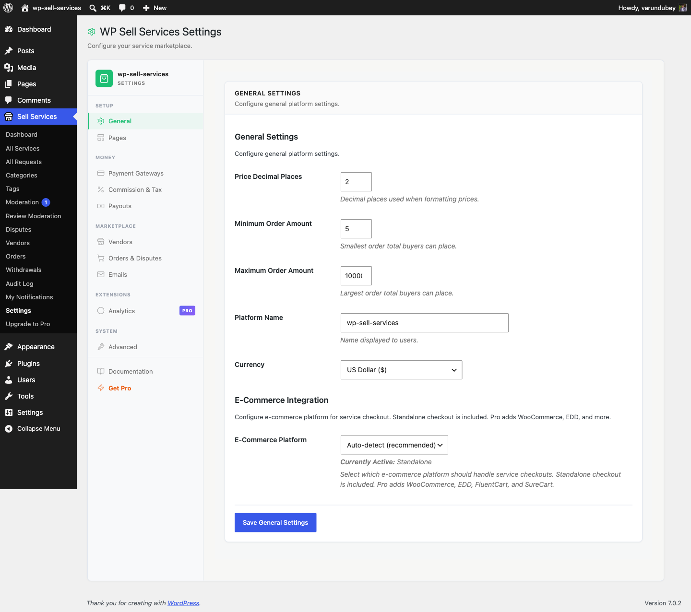

# General Settings

Configure the basics of your marketplace -- your platform name, currency, and which e-commerce system powers your checkout.

---

## Platform Name

Give your marketplace a custom name that appears throughout the platform: in emails, page headers, notifications, and payment receipts.

1. Go to **Sell Services > Settings > General**
2. Enter your marketplace name in the **Platform Name** field
3. Click **Save Changes**

**Default:** Your WordPress site name is used if no custom name is set.

**Examples:** "Creative Hub Marketplace", "Expert Services Network", "DesignPro Market"

---

## Currency

Choose the currency for all transactions on your marketplace. This affects how prices are displayed on services, how orders are totaled, and how vendor earnings are calculated.

### Supported Currencies

| Currency | Symbol | Code |
|----------|--------|------|
| US Dollar | $ | USD |
| Euro | EUR | EUR |
| British Pound | GBP | GBP |
| Canadian Dollar | C$ | CAD |
| Australian Dollar | A$ | AUD |
| Indian Rupee | INR | INR |
| Japanese Yen | JPY | JPY |
| Chinese Yuan | CNY | CNY |
| Brazilian Real | R$ | BRL |
| Mexican Peso | MXN | MXN |

### Setting Your Currency

1. Go to **General Settings**
2. Select your currency from the dropdown
3. Click **Save Changes**

**Default:** USD (US Dollar)

Your entire marketplace operates in one currency. All service prices, order totals, and vendor earnings use the same currency. Payment gateways handle any conversion on their end if a buyer pays from a different region.

**Tip:** Set your currency during initial setup. Changing it later can create confusion since existing service prices stay at their original numbers.

**[PRO]** Multi-currency support is available in the Pro version -- automatic currency detection by buyer location, live exchange rates, and localized price displays.

---

## E-Commerce Platform

Choose which system handles your marketplace checkout and payments.

### Available Options

| Platform | Availability |
|----------|-------------|
| **Standalone** (built-in checkout) | Free -- no extra plugins needed |
| **WooCommerce** | **[PRO]** |
| **Easy Digital Downloads** | **[PRO]** |
| **FluentCart** | **[PRO]** |

### Auto-Detect (Recommended)

The default setting automatically detects which platform is available and uses it. For most sites, this is the best choice.

- If only the free plugin is active, it uses the built-in Standalone checkout
- If Pro is active and WooCommerce (or another supported platform) is installed, it uses that platform

### Standalone Mode (Free)

The free version includes a complete built-in checkout system with Stripe, PayPal, and Offline payment support. No WooCommerce or any other e-commerce plugin is required. This is the simplest setup -- perfect if you want a clean, lightweight marketplace.

### WooCommerce and Other Platforms **[PRO]**

The Pro version lets you plug into WooCommerce, Easy Digital Downloads or FluentCart. This is useful if you already have an online store and want your marketplace orders to flow through the same checkout and payment system.

### Switching Platforms

You can change platforms at any time under **Settings > General**. Keep in mind:

- Existing orders stay with the original platform
- New orders use the new platform
- Payment gateway settings may need reconfiguration
- Test the checkout flow on a staging site before switching on a live marketplace

---

## Site cart link

Only appears when WooCommerce is active, because it only means anything then.

With WooCommerce installed there are genuinely two carts: WooCommerce's `/cart/`
and the marketplace's `/service-cart/`. That split is deliberate -- the
marketplace does not take over WooCommerce's cart page. The question this
setting answers is which one your **theme's cart icon** points at.

**You usually do not need to touch it.** The default is worked out for you:

| Your setup | Where the theme's cart link goes |
|---|---|
| WooCommerce is handling checkout | WooCommerce's cart -- it holds the order |
| Marketplace checkout, and you sell no WooCommerce products | The marketplace cart |
| Marketplace checkout, and you *do* sell WooCommerce products | WooCommerce's cart -- two real shops, so you decide |

Tick or untick it to override that in either direction. The third row is the one
worth knowing about: if you sell both services and WooCommerce products, only
you can say which cart the header should serve, so the plugin leaves it alone.

If buyers report adding a service and then finding an empty cart, this is the
setting -- turn it on.

---

## Troubleshooting

**Platform name not updating everywhere?**
Clear all caches (site, theme, hosting, CDN) after saving. Some email templates may cache the old name.

**Currency symbol not displaying?**
Check that your database uses UTF-8 encoding and your theme supports special characters.

**E-commerce platform not detected?**
Make sure the platform plugin (e.g., WooCommerce) is installed and activated. Refresh the WP Sell Services settings page after activating it.
