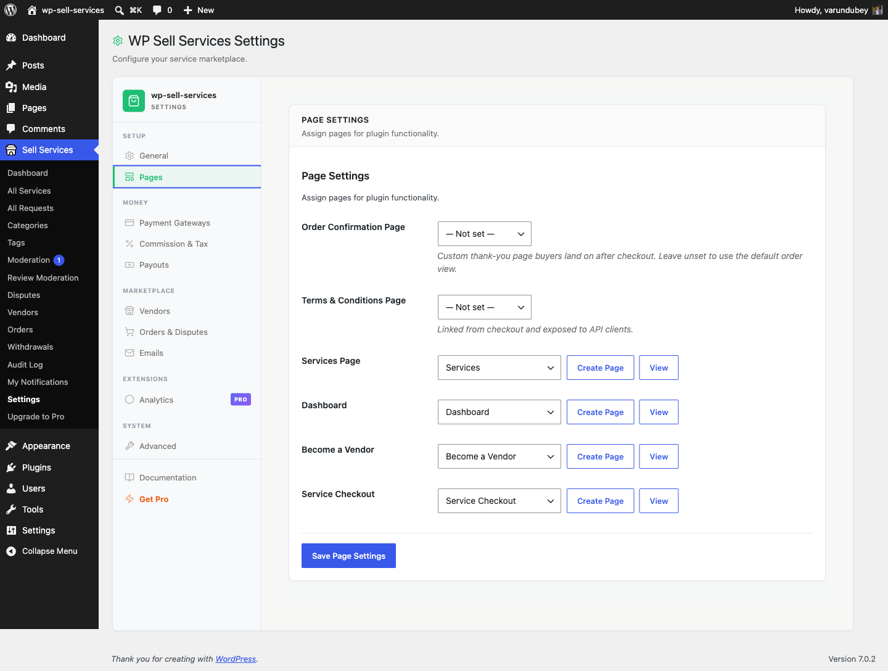

# Pages Setup

WP Sell Services needs a few dedicated pages to run your marketplace. The good news: you can create them all in one click, or set them up manually if you prefer.

---

## The Pages the Installer Creates

Activating the plugin creates six pages and maps each one in **Sell Services >
Settings > Pages**. You do not have to create any of them by hand.

| Page | Slug | What It Does | Required |
|------|------|-------------|----------|
| **Services** | `services` | The main browsing page where visitors find and explore services | Yes |
| **Dashboard** | `dashboard` | The unified account area for buyers and vendors | Yes |
| **Become a Vendor** | `become-vendor` | The registration page for users who want to sell | Yes |
| **Service Checkout** | `service-checkout` | The checkout page for standalone mode purchases | Yes |
| **Vendors** | `vendors` | A directory of every approved seller, sorted by rating | No |
| **Service Cart** | `service-cart` | Where buyers review selected services before checkout | No |

"Required" means the marketplace cannot run without the page mapped, so a
missing one raises a setup notice. The other two are created for you as well;
they are marked optional only because you can unmap or delete them and the rest
of the marketplace still works.

**Why the cart and checkout slugs are prefixed.** They are `service-cart` and
`service-checkout` rather than `cart` and `checkout` because WooCommerce and
most other stores already own those slugs. Before the slugs were made explicit,
WordPress would find `cart` taken and append a number, so sites ended up on
`/cart-2/` and worse while the intended slug was never used.

---

## One-Click Setup (Recommended)

The fastest way to get started:

1. Go to **Sell Services > Settings > Pages**
2. Click **Auto-Create All Pages**
3. Done -- the plugin creates and assigns all six pages automatically

The pages are published immediately with the correct content, SEO-friendly URLs, and everything wired up and ready to go.

---

## Manual Page Setup

Prefer to create pages yourself? Here is how.

### Services Page

1. Go to **Pages > Add New**
2. Give it a title like "Services" or "Browse Services"
3. Add the Services Grid block (or the services page element)
4. Publish the page
5. Go to **Sell Services > Settings > Pages** and select this page in the Services dropdown
6. Save Changes

**Tip:** For a richer catalog page, combine the search bar, category grid, and service grid on the same page.

### Dashboard Page

1. Create a new page titled "Dashboard"
2. Add the Dashboard block (or the dashboard page element)
3. Publish and assign it in **Settings > Pages**

The dashboard automatically shows different content based on who is logged in:

- **Buyers** see their orders, requests, messages, favorites, and profile settings
- **Vendors** see their services, sales, earnings, analytics, messages, and portfolio
- **Users with both roles** see everything

Logged-in buyers who are not yet vendors will see a "Become a Vendor" button in their dashboard.

### Become a Vendor Page

1. Create a new page titled "Become a Vendor" or "Start Selling"
2. Add the Vendor Registration block (or the vendor registration page element)
3. Add some persuasive content above the form -- explain why someone should sell on your marketplace, highlight benefits like no listing fees and flexible pricing
4. Publish and assign it in **Settings > Pages**

### Service Checkout Page

1. Create a new page titled "Checkout"
2. Add the Service Checkout block (or the checkout page element)
3. Publish and assign it in **Settings > Pages**

This page handles the standalone checkout flow -- billing details, order review, payment method selection, and order placement.

### Vendors Page

1. Create a new page titled "Vendors"
2. Add the `[wpss_vendors]` shortcode (or the vendor directory block)
3. Publish and assign it in **Settings > Pages**

This is the public directory of approved sellers, sorted by rating. It gives
buyers a way in through the person rather than the service, which matters on a
marketplace where people come back to a seller they already trust.

### Service Cart Page

1. Create a new page titled "Service Cart"
2. Add the `[wpss_cart]` shortcode (or the cart block)
3. Publish and assign it in **Settings > Pages**

Give it the `service-cart` slug rather than `cart` if you run WooCommerce or any
other store alongside, so the two carts do not fight over the same URL.

---

## Extra Pages You Can Build

The cart and the vendor directory are created for you, so there is nothing to
add for either. These are the surfaces you might compose yourself on top of the
six, using a block or shortcode on any page you like:

| Page | What to Add |
|------|------------|
| **Featured Services** | A curated showcase of your best services |
| **Top Vendors** | Your highest-rated sellers |
| **Buyer Requests** | The request board with a "Post a Request" form |

See [Shortcodes Reference](/docs/marketplace-display/shortcodes-reference/) for
the full list, including `[wpss_vendors]` if you want a second vendor directory
somewhere other than the Vendors page.

---

## Changing Assigned Pages

Already have pages you want to use instead?

1. Go to **Sell Services > Settings > Pages**
2. Each setting shows a dropdown of all your published pages
3. Select the page you want for each function
4. Make sure the page contains the correct block or page element
5. Save Changes

You can also create individual pages one at a time using the **Create Page** button next to each dropdown.

---

## Page Template Tips

For the best results:

- Use a **Full Width** template for the Services catalog and Dashboard pages
- The Dashboard does not need any extra content -- the page element generates the full interface
- For the Become a Vendor page, add marketing content (benefits, testimonials, earnings potential) above the registration form
- Add your marketplace pages to your site's navigation menu so visitors can find them easily

---

## Troubleshooting

**Page shows raw text instead of the marketplace content?**
Make sure the plugin is active, the page is published (not a draft), and clear all caches.

**Dashboard shows wrong content for a user?**
The dashboard adapts to user roles. Buyers see buyer sections, vendors see vendor sections. Verify the user's role at **Users > All Users**. For new vendors, check if admin approval is required.

**Pages return 404 errors?**
Go to **Settings > Permalinks** and click Save Changes to refresh your URL structure. Also verify the page is published and not trashed.

**"Permission denied" when accessing dashboard?**
The dashboard requires users to be logged in. For vendor sections, the user must have an approved vendor account.
