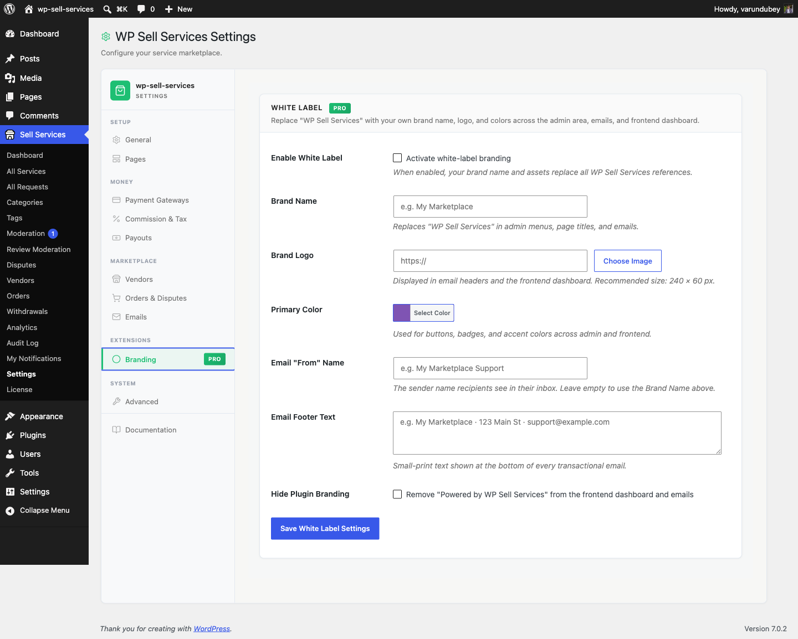

# White Label Branding [PRO]

Make the marketplace yours. White Label replaces WP Sell Services branding with
your own across the admin, the vendor dashboard, and transactional emails.

## Setup

1. Go to **Sell Services > Settings > Branding**.
2. Tick **Enable** -- nothing changes until you do.
3. Fill in the fields below and save.

Branding applies immediately. There are no template edits and no CSS to write.

## What you can brand

| Setting | What it changes | Default |
|---------|----------------|---------|
| **Brand name** | The admin menu label, and the name shown in emails and the dashboard header | *(empty -- uses the plugin name)* |
| **Logo** | Shown in the vendor dashboard header and email headers. Recommended 240 x 60 px | *(empty)* |
| **Primary colour** | Accent colour across admin, dashboard, and email headers | `#7f54b3` |
| **Email footer text** | Small-print line at the bottom of every transactional email | *(empty)* |
| **Email from name** | The sender name on every transactional email | *(empty -- uses your site name)* |
| **Hide branding** | Removes the "powered by" attribution | Off |

### Brand name renames the admin menu

Setting a brand name changes the **Sell Services** entry in your WordPress
sidebar to whatever you choose. Worth knowing before you follow any other page in
these docs: once branded, "Sell Services > Settings" becomes "*Your Brand* >
Settings" on your site.

### Email from name

This changes the *sender name* on transactional emails, not the sending address.
The address still comes from WordPress or your SMTP plugin. If you want mail to
come from `support@yourbrand.com`, configure that in your SMTP plugin -- White
Label does not control it.

See [Email Configuration](../notifications-emails/email-configuration.md).

## What it does not change

Be clear with clients about the boundary:

- **The plugin's entry on the Plugins screen.** WordPress shows the real plugin name, author, and description there. A site administrator can always see what is installed.
- **Your theme.** White Label brands the plugin's own screens. Site-wide colours, fonts, and layout remain your theme's job.
- **The WordPress admin itself.** Only the plugin's menu label and its own screens are affected.

## For agencies

White Label plus an agency license is built for client builds: ship a marketplace
under the client's brand, with nothing to relabel at handover.

A practical order of operations:

1. Build and test with branding **off**, so the docs and screenshots you are following match what you see.
2. Turn branding on near the end, once the marketplace works.
3. Set the brand name **last** -- after it changes, the admin navigation in these docs will no longer match your screen.

## For developers

Branding is applied through filters, so you can extend or override it:

| Filter / action | Purpose |
|-----------------|---------|
| `wpss_admin_menu_label` | The admin menu label |
| `wpss_email_from_name` | Sender name on transactional emails |
| `wpss_email_header_vars` | Logo and colours in email headers |
| `wpss_show_powered_by` | Whether the attribution renders |
| `wpss_dashboard_header` | Inject markup into the branded dashboard header |

Settings are stored in the `wpss_white_label` option. See
[Hooks and Filters](../developer-guide/hooks-filters.md).

## Related

- [General Settings](general-settings.md)
- [Email Configuration](../notifications-emails/email-configuration.md)
- [License Activation](../getting-started/pro-license.md)
