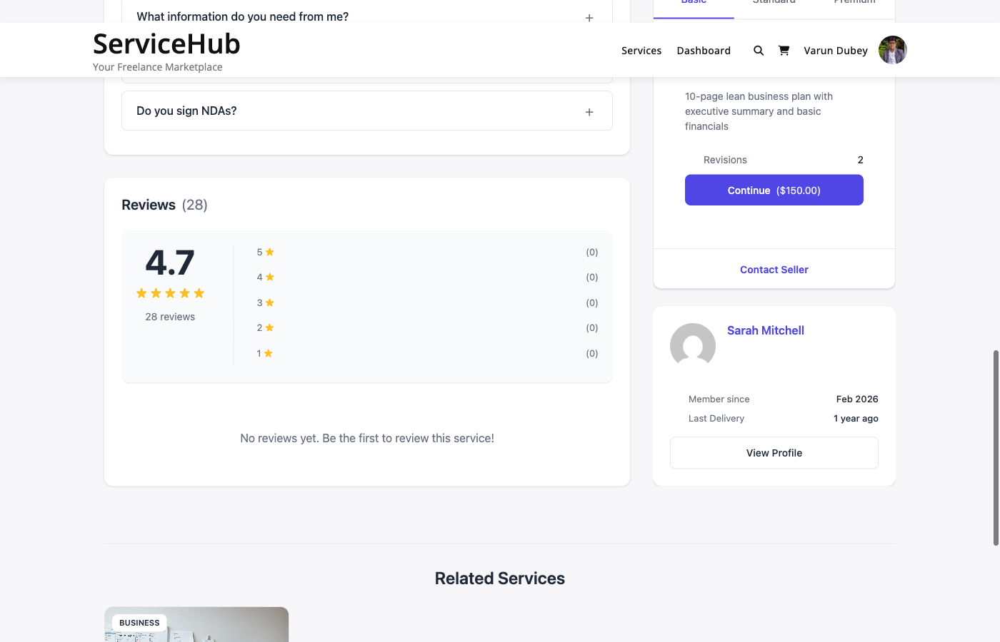

# Reviews & Ratings

Reviews are the backbone of trust on your marketplace. After a buyer completes an order, they can rate the experience and leave feedback. This helps future buyers make informed decisions and motivates vendors to deliver their best work.

## How Reviews Work

- Only buyers can leave reviews, and only on orders they have completed.
- Each order gets one review.
- Reviews include an overall star rating (1-5) plus optional sub-ratings.
- Vendors can reply to reviews publicly.
- Buyers must submit their review within the review window (default: 30 days after completion).

## What Buyers Rate

### Overall Rating (Required)

Every review includes a star rating from 1 to 5:

- **5 stars** -- Excellent, exceeded expectations
- **4 stars** -- Good, met expectations
- **3 stars** -- Satisfactory, acceptable
- **2 stars** -- Below expectations
- **1 star** -- Poor experience

### Sub-Ratings (Optional)

Buyers can also rate three specific areas:

| Category | What It Measures |
|----------|------------------|
| **Communication** | How responsive and clear the vendor was |
| **Quality** | The quality and attention to detail in the delivered work |
| **Value** | Whether the service was worth the price paid |

Sub-ratings are displayed for buyer information but do not change the overall rating calculation. Only the main star rating counts toward the vendor's average.

### Written Review (Required)

Buyers must also write a review (minimum 10 characters). The best reviews are specific and constructive -- mentioning what went well, what could improve, and whether they would hire the vendor again.

## Leaving a Review

After an order is completed, the buyer can leave a review in two ways:

1. **From the order page** -- Go to **Dashboard > My Orders**, open the completed order, and click **Leave Review**.
2. **From the email reminder** -- The system sends a review invitation a few days after completion. Click the link to go directly to the review form.

Once submitted, the review is published immediately (unless the admin has turned on review moderation -- see below).

## Verified Purchase Badge

Every review on the marketplace comes from a real, completed order with confirmed payment. A "Verified Purchase" badge appears next to the reviewer's name, so buyers know the feedback is authentic.

## Vendor Replies

Vendors can respond to any review on their services:

1. Go to **Dashboard > Reviews**.
2. Find the review.
3. Click **Reply**.
4. Write a response and submit.

Replies are public and visible to everyone. Vendors get one reply per review. A professional, gracious reply -- whether the review is positive or negative -- shows future buyers that the vendor cares about their customers.

## "Mark as Helpful" Feature

Buyers browsing reviews can mark a review as helpful. The most helpful reviews surface higher in the list, making it easier for potential buyers to find the most useful feedback.

## Review Moderation

By default, reviews are published immediately after submission. If you want to review them before they go live, you can turn on moderation.

### Enabling Moderation

Go to **Settings > General** and enable **Moderate Reviews**. Once enabled:

- New reviews go into "Pending" status instead of publishing immediately.
- You review them from **WP Admin > WP Sell Services > Reviews**.
- Click **Approve** to publish or **Reject** to hide a review.
- The vendor is notified once an approved review goes live.

### When to Use Moderation

Moderation is useful for new marketplaces where you want to ensure review quality, or if you have had problems with spam or abusive reviews. For established marketplaces with a trusted user base, auto-approval keeps the feedback loop fast.

## How Ratings Are Calculated

**Service rating:** The average of all approved review ratings for that specific service.

**Vendor rating:** The average of all approved review ratings across all of the vendor's services, weighted by the number of reviews per service.

Ratings update automatically whenever a review is added, edited, or its status changes.

## Where Reviews Appear

- **Service pages** -- All approved reviews for that service, sorted by newest first.
- **Vendor profile** -- All reviews across all of the vendor's services.
- **Search results** -- Star rating and review count on each service card.
- **Vendor cards** -- Average rating displayed alongside the vendor's name.

Reviews can be sorted by most recent, highest rated, lowest rated, or most helpful.

## Review Impact on Sellers

Good reviews directly boost a vendor's visibility in search results and contribute to advancing through seller levels. Vendors need minimum ratings and review counts to reach Rising Seller (4.0 stars, 3 reviews) and Top Rated (4.7 stars, 10 reviews).

Consistently low ratings can reduce a vendor's search visibility and may trigger an admin review of their account.

## Tips

**For Buyers:**
- Leave honest, constructive feedback. Specific examples help both the vendor and future buyers.
- Review within the time window so your experience is captured.
- If the vendor fixed an issue, update your review to reflect the resolution.

**For Vendors:**
- Reply to every review -- positive or negative. It shows you care.
- Address negative feedback professionally. Acknowledge the issue, explain what happened, and describe how you will improve.
- Never offer refunds in exchange for review changes or ask buyers to remove reviews.

**For Admins:**
- If moderation is enabled, review pending submissions within 24 hours.
- Do not reject reviews just because they are negative -- only reject spam, personal attacks, or policy violations.
- Watch for sudden rating drops on vendor accounts and reach out to investigate.

## Related Documentation

- [Reputation & Moderation](reputation-moderation.md)
- [Seller Levels](../vendor-system/seller-levels.md)
- [Order Lifecycle](../order-management/order-lifecycle.md)
