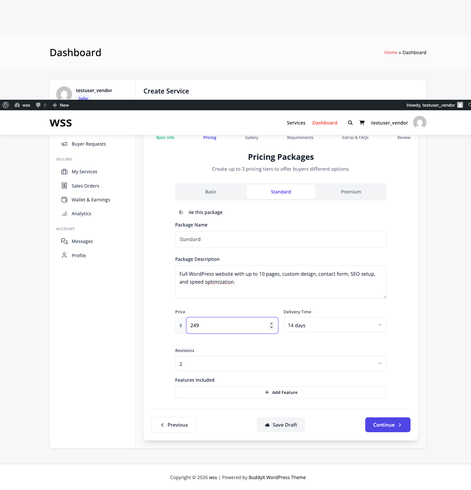
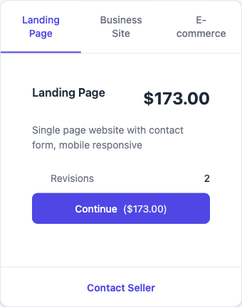

# Pricing & Packages

Configure pricing tiers for your service. Services support up to 3 packages: Basic, Standard, and Premium.

## Package Limits

| Version | Maximum Packages |
|---------|------------------|
| Free | 3 (Basic, Standard, Premium) |
| **[PRO]** | 3 (same limit, no change) |

**Note:** Pro does NOT unlock more packages. The 3-package limit is hardcoded.

## Package Tiers


### Basic Package

**Always Required:**
- Cannot be disabled
- `enabled` field always `true`
- Must have price, delivery time for publishing

**Default Name:** "Basic"

**Typical Use:**
- Entry-level offering
- Core features only
- Lowest price point

### Standard Package

**Optional:**
- Can be enabled/disabled via checkbox
- `enabled` field default: `false`
- Not required for publishing

**Default Name:** "Standard"

**Typical Use:**
- Mid-tier option
- Most popular choice
- Balanced features and price

### Premium Package

**Optional:**
- Can be enabled/disabled via checkbox
- `enabled` field default: `false`
- Not required for publishing

**Default Name:** "Premium"

**Typical Use:**
- Complete solution
- All features included
- Highest price, fastest delivery

## Package Fields



Each package contains these fields:

### Package Name

- Text input
- Defaults: "Basic", "Standard", "Premium"
- Can be renamed to anything
- Required for Basic, optional for Standard/Premium if disabled

### Package Description

- Textarea input
- Describes what's included
- Supports HTML via `wp_kses_post()`
- Required for Basic, optional for others

### Price

- Float number input
- Currency symbol shown as prefix (from `wpss_get_currency_symbol()`)
- Minimum $5 for Basic package (enforced on publish)
- Step: 0.01 (allows cents)
- Required for Basic

**Validation:**
```php
if ( floatval( $data['packages']['basic']['price'] ) < 5 ) {
    $errors[] = 'Basic package price must be at least $5.';
}
```

### Delivery Time

- Dropdown select
- Options: 1, 2, 3, 5, 7, 14, 21, 30 days
- Stored as integer (number of days)
- Required for Basic package

**Dropdown Values:**
```html
<option value="1">1 day</option>
<option value="2">2 days</option>
<option value="3">3 days</option>
<option value="5">5 days</option>
<option value="7">7 days</option>
<option value="14">14 days</option>
<option value="21">21 days</option>
<option value="30">30 days</option>
```

### Revisions

- Dropdown select
- Options: 0, 1, 2, 3, 5, Unlimited (-1)
- Integer value (`-1` for unlimited)
- Defaults: Basic (1), Standard (2), Premium (3)
- Optional field

### Features Included

- Dynamic array of text inputs
- Add/remove individual features
- Each feature is single-line text
- No limit on number of features
- Stored as array in package data

**Example:**
```json
{
  "features": [
    "Responsive design",
    "Contact form",
    "SEO optimization",
    "Social media integration"
  ]
}
```

## Package Data Structure

Packages stored in `_wpss_packages` post meta:

```json
{
  "basic": {
    "enabled": true,
    "name": "Basic",
    "description": "Entry-level package",
    "price": 50.00,
    "delivery_time": 3,
    "revisions": 1,
    "features": ["Feature 1", "Feature 2"]
  },
  "standard": {
    "enabled": true,
    "name": "Standard",
    "description": "Most popular option",
    "price": 100.00,
    "delivery_time": 5,
    "revisions": 2,
    "features": ["All Basic features", "Feature 3", "Feature 4"]
  },
  "premium": {
    "enabled": false,
    "name": "Premium",
    "description": "",
    "price": 0,
    "delivery_time": 0,
    "revisions": 3,
    "features": []
  }
}
```

## Backward Compatibility Meta

For WooCommerce fallback, wizard also saves flat meta:

```php
update_post_meta( $service_id, '_wpss_delivery_days', $basic['delivery_time'] );
update_post_meta( $service_id, '_wpss_revisions', $basic['revisions'] );
update_post_meta( $service_id, '_wpss_starting_price', $basic['price'] );
```

These allow simple queries without parsing package JSON.

## Package Enabling/Disabling

Standard and Premium have enable checkbox:

```html
<input type="checkbox" x-model="data.packages.standard.enabled">
<span>Enable this package</span>
```

**When Disabled:**
- Package not shown to buyers
- Fields remain in data but ignored
- Does not validate on publish

## Pricing Strategy

### Recommended Price Ratios

- Basic: 100% (base)
- Standard: 150-200% of Basic
- Premium: 250-350% of Basic

**Example:**
- Basic: $100
- Standard: $150 (1.5x)
- Premium: $250 (2.5x)

### Value Ladder

Each tier should offer significantly more value:

**Basic:**
- Core deliverable
- Minimum viable service
- Fastest delivery

**Standard:**
- All Basic features
- 2-3 additional features
- Slightly longer delivery
- More revisions

**Premium:**
- All Standard features
- Premium extras
- Longest delivery time (more work)
- Most/unlimited revisions

## Common Pricing Models

### Fixed Deliverable

Same thing, different quantities:

- Basic: 1 logo design
- Standard: 2 logo designs
- Premium: 3 logo designs + brand guidelines

### Tiered Features

Different feature sets:

- Basic: 5 pages, contact form
- Standard: 10 pages, contact form, blog
- Premium: 20 pages, contact form, blog, e-commerce

### Speed-Based

Same service, different delivery:

- Basic: 7 days
- Standard: 3 days
- Premium: 24 hours

## Validation

**Required for Publishing:**

```php
// In ServiceWizard::validate_service_data()

// Must have Basic package title
if ( empty( $data['title'] ) ) {
    $errors[] = 'Service title required';
}

// Must have Basic package price (min $5)
if ( empty( $data['packages']['basic']['price'] )
     || floatval( $data['packages']['basic']['price'] ) < 5 ) {
    $errors[] = 'Basic package price must be at least $5.';
}

// Must have Basic package delivery time
if ( empty( $data['packages']['basic']['delivery_time'] ) ) {
    $errors[] = 'Please set delivery time for Basic package.';
}
```

Standard and Premium validated only if `enabled` is `true`.

## Wizard Display

Packages shown as tabs in pricing step:

```
[Basic] [Standard] [Premium]
```

Click tab to configure that package. Basic tab always shows first.

**Active Package Indicator:**
```javascript
:class="{ 'active': activePackage === 'basic' }"
```

**Required Badge:**
```html
<span class="wpss-required-badge" x-show="!isPackageValid('basic')">!</span>
```

Shows red "!" badge if Basic package incomplete.

## Frontend Display

Packages displayed as comparison table or cards on the service detail page:




**Table View:**
| | Basic | Standard | Premium |
|-|-------|----------|---------|
| Price | $50 | $100 | $200 |
| Delivery | 3 days | 5 days | 7 days |
| Revisions | 1 | 2 | Unlimited |
| Features | ✓ ✓ | ✓ ✓ ✓ | ✓ ✓ ✓ ✓ |

**Card View:**
Three cards side-by-side with feature lists and "Select" button.


## WooCommerce Sync

When service published with WooCommerce active:

```php
// Creates WC product with variations for each enabled package
$wc_provider->sync_service_to_product( $service_id );
```

**Product Structure:**
- Variable product created
- One variation per enabled package
- Variation prices from package prices
- Variation names from package names

## Common Issues

### Cannot Add More Than 3 Packages

**This is by design.** Maximum 3 packages hardcoded in wizard.

Pro version does NOT extend this limit. Both free and Pro support exactly 3 packages.

### Standard/Premium Won't Save

**Cause:** Package disabled (checkbox unchecked)

**Fix:**
1. Enable package checkbox
2. Fill required fields (name, description, price, delivery time)
3. Save again

### Price Validation Failing

**Causes:**
- Price less than $5 for Basic
- Non-numeric value
- Empty price field

**Fix:**
1. Ensure Basic package price ≥ $5
2. Enter numbers only (decimal allowed)
3. Don't leave price empty

## Best Practices

### Package Differentiation

- Make value differences obvious
- Don't make tiers too similar
- Avoid confusing feature lists
- Use clear, simple language

### Pricing Psychology

- Round numbers convert better ($100 vs $99)
- Middle option (Standard) sells most
- Premium should be 2.5-3x Basic
- Test different price points

### Feature Organization

- List features in order of importance
- Use checkmarks for visual clarity
- Highlight unique Premium features
- Keep descriptions concise

## Related Documentation

- **[Service Wizard](./service-wizard.md)** - Creating packages in wizard
- **[Service Add-ons](./service-addons.md)** - Additional pricing options
- **[Publishing & Moderation](./publishing-moderation.md)** - Price validation
