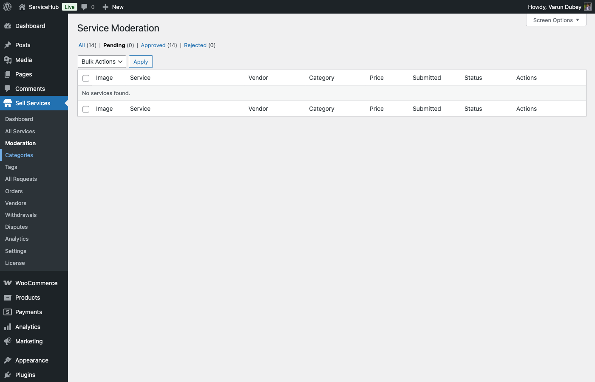

# Publishing & Moderation

After creating your service, it enters the publishing workflow. This guide covers service statuses, moderation, and post-publication management.

## Service Statuses

WordPress and the plugin track service state through post statuses and moderation meta.

### Post Statuses

Only 3 WordPress post statuses are used:

| Status | Visibility | Description |
|--------|-----------|-------------|
| `draft` | Private (author only) | Service saved but not submitted |
| `pending` | Private (author + admins) | Submitted for admin review |
| `publish` | Public (all buyers) | Live on marketplace |

**Note:** "Paused" and "Archived" are NOT registered post statuses. They do not exist in the codebase.

### Moderation Statuses

Stored in `_wpss_moderation_status` meta:

| Status Constant | Meta Value | Description |
|----------------|------------|-------------|
| `ModerationService::STATUS_PENDING` | `pending` | Awaiting admin review |
| `ModerationService::STATUS_APPROVED` | `approved` | Admin approved |
| `ModerationService::STATUS_REJECTED` | `rejected` | Admin rejected |

**Note:** Only these 3 moderation statuses exist. There is no "request changes" or "paused" moderation status.

## Publishing Workflow


### When Moderation is Enabled

Admin setting: `wpss_vendor['require_service_moderation']`

**Flow:**
```
Create Service → Submit → post_status: 'pending'
                       → moderation_status: 'pending'
                       → Admin receives email
                       → Admin reviews
                       → Approve OR Reject
```

**If Approved:**
- `post_status` → `publish`
- `_wpss_moderation_status` → `approved`
- `_wpss_moderated_at` → Current timestamp
- `_wpss_moderator_id` → Admin user ID
- Vendor receives approval email and notification
- Service appears on marketplace
- Syncs to WooCommerce product (if WooCommerce active)

**If Rejected:**
- `post_status` → `draft`
- `_wpss_moderation_status` → `rejected`
- `_wpss_rejection_reason` → Admin's reason text
- `_wpss_moderation_notes` → Same as rejection reason
- Vendor receives rejection email with reason
- Service remains private, can be edited and resubmitted

### When Moderation is Disabled

**Flow:**
```
Create Service → Submit → post_status: 'publish' (immediate)
                       → Service live immediately
                       → Syncs to WooCommerce
```

No moderation meta is set. Service goes live without admin review.

## Moderation Queue



Admins access pending services via **Admin → Services → Moderation**.

### What Admins Review

The `ModerationService` class provides methods:

- `get_pending_services()` - Retrieves services with `post_status='pending'` and `moderation_status='pending'`
- `get_pending_count()` - Count of pending services (used for admin menu badge)
- `approve($service_id, $notes)` - Approve service
- `reject($service_id, $reason)` - Reject service with reason

### Approval Process

**PHP Code Flow:**
```php
$moderation = new ModerationService();
$result = $moderation->approve( $service_id, $admin_notes );
```

**Actions:**
1. Updates `post_status` to `publish`
2. Sets `_wpss_moderation_status` to `approved`
3. Records moderator ID and timestamp
4. Fires `wpss_service_approved` action hook
5. Sends email to vendor if `moderation_approved` email type is enabled
6. Creates platform notification

### Rejection Process

**PHP Code Flow:**
```php
$moderation = new ModerationService();
$result = $moderation->reject( $service_id, $rejection_reason );
```

**Actions:**
1. Updates `post_status` to `draft`
2. Sets `_wpss_moderation_status` to `rejected`
3. Stores reason in both `_wpss_rejection_reason` and `_wpss_moderation_notes`
4. Records moderator ID and timestamp
5. Fires `wpss_service_rejected` action hook
6. Sends rejection email to vendor if `moderation_rejected` email type is enabled
7. Creates platform notification with edit link

### Rejection Reasons

Common reasons (not enforced by code, admin free-text):

- Misleading title or description
- Low-quality images
- Policy violations
- Incomplete information
- Unrealistic delivery times
- Inappropriate content

Vendor can edit and resubmit by clicking "Publish" again in wizard.

## Email Notifications

Three email types handled by `EmailService`:

| Email Type | Trigger | Recipient |
|-----------|---------|-----------|
| `moderation_pending` | Service submitted | Admin email |
| `moderation_approved` | Service approved | Vendor |
| `moderation_rejected` | Service rejected | Vendor |

Each email type can be enabled/disabled in settings.

## Moderation Data Structure

**Meta Keys:**
```php
_wpss_moderation_status    // 'pending', 'approved', or 'rejected'
_wpss_moderation_notes     // Admin notes (approval or rejection)
_wpss_rejection_reason     // Rejection reason (same as notes for rejected)
_wpss_moderated_at         // MySQL datetime of moderation action
_wpss_moderator_id         // User ID of admin who moderated
```

**Retrieval:**
```php
$data = $moderation->get_moderation_data( $service_id );
// Returns array with status, notes, moderated_at, moderator_id
```

## Editing Published Services

Vendors can edit published services via the wizard shortcode:

```
[wpss_service_wizard id="123"]
```

### Edit Restrictions

**Can Edit If:**
- User is service author OR current user has `manage_options` capability
- No specific permission checks on post status

**Cannot Edit:**
- If vendor account status is not "Active" (pending or suspended vendors blocked)
- During active moderation review (post_status='pending')

### Edit Workflow

1. Vendor edits service in wizard
2. Clicks "Save Draft" → Updates `post_status='draft'`, keeps existing data
3. Clicks "Publish Service" → Re-triggers moderation flow (if enabled)

**If moderation enabled:**
- Service goes back to `post_status='pending'`
- Admin must re-approve
- Service temporarily hidden from marketplace during review

**If moderation disabled:**
- Changes go live immediately
- `post_status='publish'` maintained

### What Happens to Active Orders

Active orders continue with original service configuration. Edits only affect new orders.

Package data is stored per-order in `wpss_orders` table, so order details remain unchanged.

## Service Visibility

Services are visible to buyers when:

- `post_status='publish'` AND
- `_wpss_moderation_status='approved'` (if moderation enabled)

Services are hidden if:

- `post_status` is `draft` or `pending`
- `_wpss_moderation_status` is `pending` or `rejected`

There is no "pause" feature in the codebase. To hide a service, vendor must set it to draft.

## Deleting Services

Vendors can delete services using WordPress standard deletion:

**Restrictions:**
- Active orders may prevent deletion (implementation dependent on admin settings)
- WordPress soft-delete (trash) is used
- Complete deletion moves to trash, can be permanently deleted by admin

**What Happens:**
- Service post moved to trash
- Meta data preserved
- Orders remain in database (not deleted)
- Reviews may remain (implementation dependent)

## WooCommerce Sync

If WooCommerce is active, approved services sync to WooCommerce products:

**Sync Trigger:**
```php
// In ServiceWizard::ajax_publish_service()
if ( class_exists( 'WooCommerce' ) && 'publish' === $post_status ) {
    $wc_provider = new \WPSellServices\Integrations\WooCommerce\WCProductProvider();
    $wc_product_id = $wc_provider->sync_service_to_product( $service_id );
}
```

**Sync Behavior:**
- Creates WooCommerce product linked to service
- Syncs title, description, price (from Basic package)
- Updates existing product if already synced
- Logs sync result via `wpss_log()` function

## REST API Endpoints

Services are accessible via REST API for mobile apps:

**Endpoints:**
- `GET /wpss/v1/services` - List services
- `GET /wpss/v1/services/{id}` - Get single service
- `POST /wpss/v1/services` - Create service
- `PUT /wpss/v1/services/{id}` - Update service
- `DELETE /wpss/v1/services/{id}` - Delete service

**Moderation Actions:**
- `POST /wpss/v1/moderation/{service_id}/approve` - Approve service (admin only)
- `POST /wpss/v1/moderation/{service_id}/reject` - Reject service (admin only)

## Common Issues

### Service Stuck in Pending

**Causes:**
- Moderation enabled but admin hasn't reviewed
- Email notifications disabled, admin unaware
- Moderation queue backlog

**Fix:**
- Check admin notification email settings
- Contact site administrator
- Wait for admin review (typically 24-48 hours)

### Changes Not Appearing

**Causes:**
- Clicked "Save Draft" instead of "Publish"
- Moderation enabled, awaiting re-approval
- Browser cache showing old version

**Fix:**
1. Check service status in dashboard
2. Click "Publish Service" to trigger moderation
3. Clear browser cache (Ctrl+F5)
4. Wait for admin re-approval if moderation enabled

### Service Not Syncing to WooCommerce

**Causes:**
- WooCommerce not active
- Service status not `publish`
- WooCommerce sync failed silently

**Fix:**
1. Verify WooCommerce is active
2. Check service post status is `publish`
3. Check error logs at `wp-content/debug.log`
4. Re-save service to trigger sync

## Technical Details

### Moderation Service Class

**Location:** `src/Services/ModerationService.php`

**Key Methods:**
```php
ModerationService::is_enabled()                    // Check if moderation required
ModerationService::get_pending_services()          // Get pending services
ModerationService::get_pending_count()             // Count pending
ModerationService::approve( $id, $notes )          // Approve service
ModerationService::reject( $id, $reason )          // Reject service
ModerationService::set_pending( $id )              // Mark as pending
ModerationService::get_moderation_data( $id )      // Get moderation meta
ModerationService::get_statuses()                  // Get all status labels
```

### Action Hooks

```php
do_action( 'wpss_service_pending_moderation', $service_id );
do_action( 'wpss_service_approved', $service_id, $notes );
do_action( 'wpss_service_rejected', $service_id, $reason );
```

### Filter Hooks

None specific to moderation. Publishing behavior controlled by admin settings.

## Best Practices

### Before Submitting

- Complete all wizard steps fully
- Upload high-quality images (5MB max, WebP supported)
- Write clear, detailed descriptions (5000 char max)
- Set realistic delivery times
- Price competitively

### After Rejection

- Read rejection reason carefully
- Fix ALL mentioned issues
- Don't just resubmit without changes
- Consider improving beyond minimum requirements
- Add note in description explaining improvements

### While Published

- Monitor service performance
- Update content quarterly
- Respond to buyer questions promptly
- Adjust pricing based on demand
- Keep gallery images current

## Related Documentation

- **[Service Creation Wizard](./service-wizard.md)** - Creating services
- **[Pricing & Packages](./pricing-packages.md)** - Package configuration
- **[Service Media](./service-media.md)** - Images and videos
- **[Requirements & FAQs](./service-requirements-faqs.md)** - Buyer requirements
- **[Service Add-ons](./service-addons.md)** - Add-on configuration
