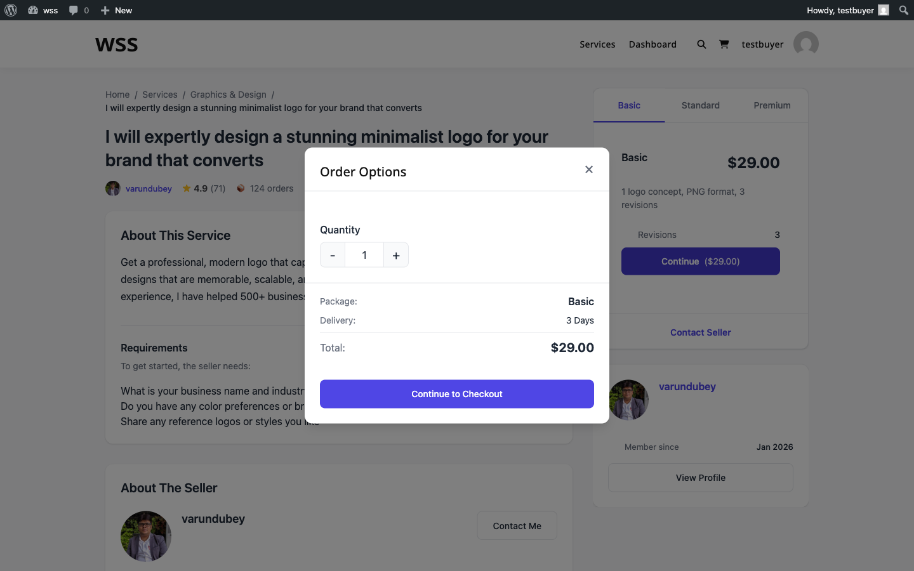

# Service Add-ons (Extras)

Add-ons let vendors offer optional upgrades that buyers can select during checkout. They are a proven way to increase order value while giving buyers flexibility to customize their order.

## What You Can Do with Add-ons

Add-ons are perfect for offering:

- **Rush delivery** -- Pay extra for faster turnaround
- **Source files** -- Get the original design files (PSD, AI, etc.)
- **Extra revisions** -- Add more rounds of changes beyond what the package includes
- **Commercial license** -- Use the work for commercial purposes
- **Additional pages or items** -- Scale up the deliverable
- **Priority support** -- Get faster responses during the project

## Add-on Types

There are four types of add-ons, each suited to different situations:

### Checkbox (Yes/No)

The most common type. Buyers simply check a box to add it.

**Best for:** Rush delivery, source files, commercial license, priority support

**Example:** "Include source files" -- $20 flat fee

### Dropdown (Select One Option)

Buyers pick one option from a list. Great when there are multiple tiers of an upgrade.

**Best for:** Resolution options, format choices, delivery speed tiers

**Example:** "Video resolution" -- 720p (free), 1080p (+$10), 4K (+$25)

### Text Input

Buyers type in custom information. This can be free or carry an additional charge.

**Best for:** Personalization text, business names, custom inscriptions

**Example:** "Business name for the logo" -- no extra charge, just information gathering

### Quantity (Select How Many)

Buyers choose a number, and the price multiplies accordingly.

**Best for:** Extra revisions, additional pages, extra hours, extra items

**Example:** "Additional revisions" -- $10 each, select 1-5

## Limits

| | Free | Pro |
|-|------|-----|
| Add-ons per service | 3 | Unlimited **[PRO]** |

When the free version limit is reached, the wizard lets vendors know they can upgrade to Pro for unlimited add-ons.

## Pricing Options

### Flat Rate
A fixed price added to the order total, regardless of which package the buyer selected.

**Example:** Source files = +$30, whether the buyer chose Basic or Premium.

### Quantity-Based
Price multiplied by the number the buyer selects.

**Example:** Extra pages = $20 each. Buyer selects 3 = $60 total.

## How Add-ons Appear to Buyers

After selecting a package, buyers see the available add-ons listed below. Each add-on shows:

- The add-on name and description
- The price (or "Free" if no charge)
- Any impact on delivery time (e.g., rush delivery subtracts days, extra work adds days)

Selected add-ons are added to the order total at checkout.

## Delivery Time Impact

Add-ons can change the delivery timeline:

- **Add time** -- Extra work like additional pages might add 2 days
- **Reduce time** -- Rush delivery might subtract 3 days from the timeline

This is calculated automatically and shown to the buyer before checkout.

## Tips for Setting Up Add-ons

- **Price add-ons at 20-40% of your base package price** -- This feels like a fair upgrade without being too expensive
- **Keep it to 3-5 add-ons** -- Too many options overwhelm buyers and reduce conversions
- **Lead with your most popular add-on** -- Rush delivery and source files are typically the most selected
- **Use checkboxes for 90% of add-ons** -- They are the simplest and convert best
- **Remove underperforming add-ons** -- If an add-on rarely gets selected, replace it with something more appealing

## Related Guides

- **[Service Creation Wizard](service-wizard.md)** -- How to add extras during service creation
- **[Pricing and Packages](pricing-packages.md)** -- Base package configuration
