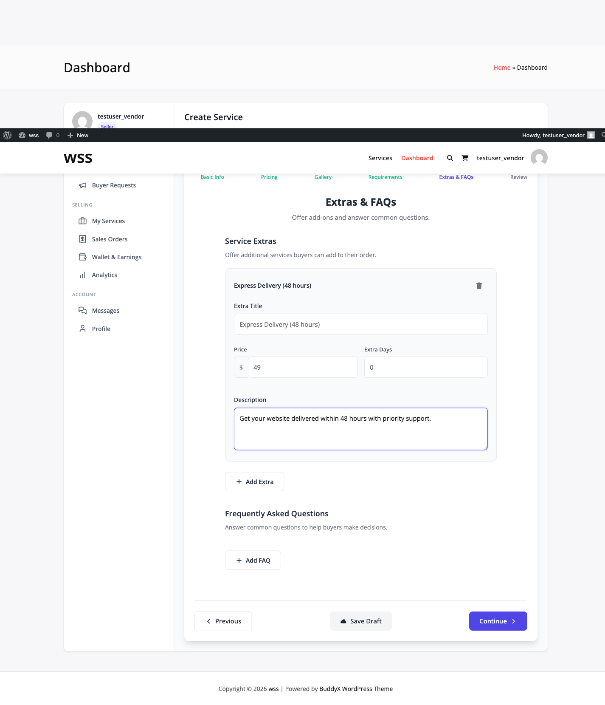
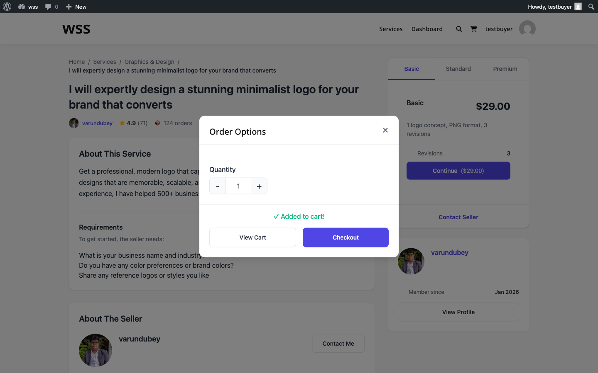

# Service Add-ons

Service add-ons (also called extras) let buyers customize orders with additional features beyond base packages. Add-ons are stored in the `wpss_service_addons` database table and increase average order value.

## Add-on Limits

| Version | Maximum Add-ons |
|---------|-----------------|
| Free | 3 add-ons per service |
| **[PRO]** | Unlimited (filter: `wpss_service_max_extras` returns `-1`) |

## Add-on Field Types


Four field types are supported by `ServiceAddonService`:

### 1. Checkbox

Simple yes/no toggle for binary options.

**Constant:** `ServiceAddonService::TYPE_CHECKBOX`

**Use Cases:**
- Rush delivery
- Source files
- Commercial license
- Priority support

**Example:**
```php
'field_type' => 'checkbox',
'title' => 'Express Delivery',
'price' => 25.00,
'price_type' => 'flat'
```

**Buyer Interface:** Single checkbox (`<input type="checkbox">`)

### 2. Quantity

Select number of units with min/max range.

**Constant:** `ServiceAddonService::TYPE_QUANTITY`

**Use Cases:**
- Extra revisions (1-10)
- Additional pages
- Extra hours
- Product count

**Fields:**
- `min_quantity` - Minimum units (default: 1)
- `max_quantity` - Maximum units (default: 10)

**Example:**
```php
'field_type' => 'quantity',
'title' => 'Additional Revisions',
'price' => 10.00,
'price_type' => 'quantity_based',
'min_quantity' => 1,
'max_quantity' => 5
```

**Buyer Interface:** Number input or quantity selector

**Price Calculation:**
```php
$total = $addon->price * $quantity;
// Example: $10 × 3 revisions = $30
```

### 3. Dropdown

Choose one option from a list.

**Constant:** `ServiceAddonService::TYPE_DROPDOWN`

**Use Cases:**
- Resolution selection (720p, 1080p, 4K)
- Format choice
- Delivery speed tiers

**Options Structure:**
```json
{
  "options": [
    {"label": "HD 720p", "value": "720p", "price": 0},
    {"label": "Full HD 1080p", "value": "1080p", "price": 10},
    {"label": "4K UHD", "value": "4k", "price": 25}
  ]
}
```

**Buyer Interface:** `<select>` dropdown

### 4. Text

Custom text input from buyer.

**Constant:** `ServiceAddonService::TYPE_TEXT`

**Use Cases:**
- Business name
- Custom domain
- Personalization text
- Special instructions

**Validation:**
- Maximum 500 characters
- Free-form text input
- Fixed price (not variable by content)

**Example:**
```php
'field_type' => 'text',
'title' => 'Business Name for Logo',
'price' => 0, // No additional charge, just info gathering
'is_required' => false
```

**Note:** Text inputs do NOT support variable pricing based on content length.

## Field Types That Do NOT Exist

The following types mentioned in old docs are fabricated:

- **Radio buttons** - Not a separate type (use dropdown instead)
- **Multi-select** - Not implemented (only single-select dropdown)

## Pricing Types

Three pricing models defined in `ServiceAddonService`:

### Flat Rate

Fixed price added to order.

**Constant:** `ServiceAddonService::PRICE_FLAT`

**Calculation:**
```php
$addon_cost = $addon->price; // Always fixed amount
```

**Example:**
```
Source Files: $30 (flat)
→ Any package + source files = +$30
```

### Percentage

Percentage of package price.

**Constant:** `ServiceAddonService::PRICE_PERCENTAGE`

**Calculation:**
```php
$addon_cost = ($package_price * $addon->price) / 100;
```

**Example:**
```
Commercial License: 25% of package price
→ Basic ($100) + license = $100 + $25 = $125
→ Premium ($500) + license = $500 + $125 = $625
```

**Note:** Percentage pricing is a **[PRO]** feature.

### Quantity-Based

Price multiplied by quantity selected.

**Constant:** `ServiceAddonService::PRICE_QUANTITY`

**Calculation:**
```php
$addon_cost = $addon->price * $quantity;
```

**Example:**
```
Extra Pages: $20 per page
→ 3 pages selected = $20 × 3 = $60
```

**Note:** Quantity-based pricing is a **[PRO]** feature.

## Add-on Configuration Fields

### Required Fields

- `service_id` - Parent service post ID
- `title` - Add-on name
- `field_type` - One of: checkbox, quantity, dropdown, text
- `price` - Base price amount (float)
- `price_type` - One of: flat, percentage, quantity_based

### Optional Fields

- `description` - What's included (textarea)
- `min_quantity` - Minimum units (for quantity type, default: 1)
- `max_quantity` - Maximum units (for quantity type, default: 10)
- `is_required` - Force selection (boolean, default: false)
- `options` - JSON array of dropdown options
- `delivery_days_extra` - Additional delivery days (integer, default: 0)
- `applies_to` - Package IDs or `["all"]` (JSON array)
- `is_active` - Enable/disable (boolean, default: true)
- `sort_order` - Display order (integer)

## Database Structure

Add-ons are stored in custom table `wpss_service_addons`:

```sql
CREATE TABLE wp_wpss_service_addons (
  id BIGINT UNSIGNED AUTO_INCREMENT PRIMARY KEY,
  service_id BIGINT UNSIGNED NOT NULL,
  title VARCHAR(255) NOT NULL,
  description TEXT,
  field_type VARCHAR(50) NOT NULL,
  price DECIMAL(10,2) NOT NULL DEFAULT 0,
  price_type VARCHAR(50) NOT NULL DEFAULT 'flat',
  min_quantity INT DEFAULT 1,
  max_quantity INT DEFAULT 10,
  is_required TINYINT(1) DEFAULT 0,
  options TEXT, -- JSON
  delivery_days_extra INT DEFAULT 0,
  applies_to TEXT, -- JSON array of package IDs or ["all"]
  sort_order INT DEFAULT 0,
  is_active TINYINT(1) DEFAULT 1,
  created_at DATETIME NOT NULL,
  updated_at DATETIME NOT NULL
)
```

**Note:** NOT stored in post meta - uses dedicated table.

## Package Application

Add-ons can apply to specific packages or all packages.

### Apply to All Packages

```php
'applies_to' => ['all']
```

Add-on available with any package selection.

### Apply to Specific Packages

```php
'applies_to' => [1, 3] // Package IDs from wpss_service_packages table
```

Add-on only shown when buyer selects matching package.

**Validation:**
```php
$addon_service = new ServiceAddonService();
$applies = $addon_service->addon_applies_to_package( $addon, $package_id );
```

## Creating Add-ons



### Via Wizard (Simplified)

The service wizard exposes basic fields:

- Title
- Description
- Price
- Extra Days

Advanced options (field types, pricing types) require admin panel or REST API.

### Via PHP

```php
$addon_service = new ServiceAddonService();

$result = $addon_service->create( $service_id, [
    'title' => 'Express Delivery',
    'description' => 'Receive order in 24 hours',
    'field_type' => 'checkbox',
    'price' => 25.00,
    'price_type' => 'flat',
    'delivery_days_extra' => -2, // Negative = faster
    'is_required' => false,
    'applies_to' => ['all']
] );

if ( $result['success'] ) {
    $addon_id = $result['addon_id'];
}
```

### Via REST API

```
POST /wpss/v1/services/{service_id}/addons

{
  "title": "Source Files",
  "field_type": "checkbox",
  "price": 30.00,
  "price_type": "flat",
  "applies_to": ["all"]
}
```

## Delivery Time Impact

Add-ons can modify delivery time:

**Positive Days (Increase Time):**
```php
'delivery_days_extra' => 2 // Adds 2 days to delivery
```

**Negative Days (Decrease Time):**
```php
'delivery_days_extra' => -3 // Reduces delivery by 3 days (rush)
```

**Calculation:**
```php
$addon_service = new ServiceAddonService();
$extra_days = $addon_service->calculate_delivery_days( $addon, $quantity );

// For quantity type: extra_days * quantity
// For other types: extra_days (fixed)
```

## Validation

Add-ons are validated during order creation:

```php
$addon_service = new ServiceAddonService();
$validation = $addon_service->validate_selection( $addon, $buyer_value, $quantity );

if ( ! $validation['valid'] ) {
    echo $validation['message'];
}
```

**Validation Rules:**

- **Required add-ons:** Must have value if `is_required=true`
- **Quantity limits:** Enforce min/max for quantity type
- **Dropdown options:** Selected value must exist in options array
- **Text length:** Maximum 500 characters for text type

## Frontend Add-on Display

Buyers interact with add-ons during the order process on the frontend:




## Add-on Templates

Common add-on configurations available via `ServiceAddonService::get_addon_templates()`:

### Rush Delivery
```php
'rush_delivery' => [
    'title' => 'Rush Delivery',
    'field_type' => 'checkbox',
    'price_type' => 'percentage',
    'price' => 25, // 25% of package price
    'delivery_days_extra' => -2
]
```

### Extra Revision
```php
'extra_revision' => [
    'title' => 'Extra Revision',
    'field_type' => 'quantity',
    'price_type' => 'quantity_based',
    'price' => 10, // $10 per revision
    'min_quantity' => 1,
    'max_quantity' => 5
]
```

### Source Files
```php
'source_files' => [
    'title' => 'Source Files',
    'field_type' => 'checkbox',
    'price_type' => 'flat',
    'price' => 20
]
```

## Best Practices

### Pricing Strategy

- Price add-ons at 20-40% of base package price
- Rush delivery typically 20-30% premium
- Bundle related add-ons for discount
- Test different price points

### Add-on Limits

- Offer 3-5 add-ons maximum (too many overwhelms buyers)
- Most popular: Rush delivery, Extra revisions, Source files
- Remove add-ons with <5% selection rate
- Update based on buyer requests

### Field Type Selection

- Use checkbox for yes/no decisions (90% of add-ons)
- Use quantity for scalable items (revisions, pages)
- Use dropdown for tier upgrades (resolution, format)
- Use text only when buyer input is required

## Common Issues

### Add-on Not Appearing

**Causes:**
- `is_active` set to `false`
- `applies_to` doesn't include selected package
- Add-on limit reached (3 for free version)

**Fix:**
1. Check `is_active` status in database
2. Verify `applies_to` includes `["all"]` or correct package ID
3. Upgrade to Pro for unlimited add-ons

### Price Not Calculating

**Causes:**
- Invalid `price_type` value
- Percentage/quantity pricing on free version
- Missing price value

**Fix:**
1. Verify `price_type` is `flat`, `percentage`, or `quantity_based`
2. Use flat pricing on free version
3. Ensure `price` field has numeric value

## Related Documentation

- **[Service Wizard](./service-wizard.md)** - Creating services with add-ons
- **[Pricing & Packages](./pricing-packages.md)** - Package configuration
- **[Order Management](../order-management/order-lifecycle.md)** - How add-ons affect orders
