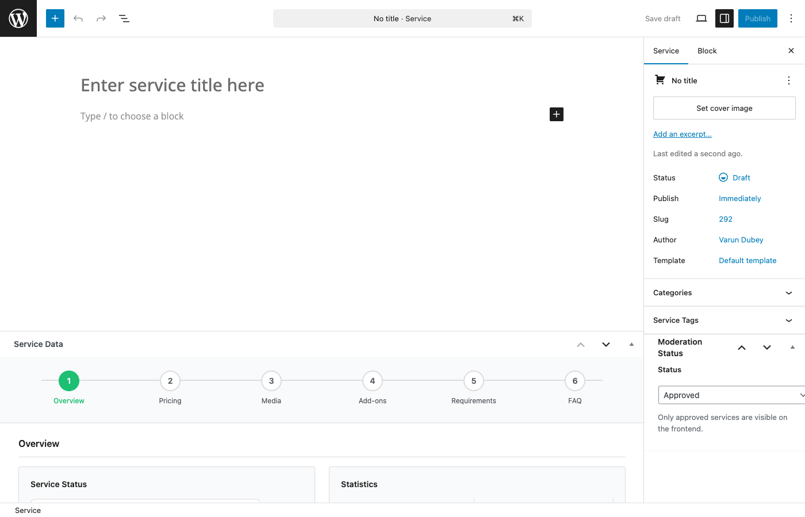
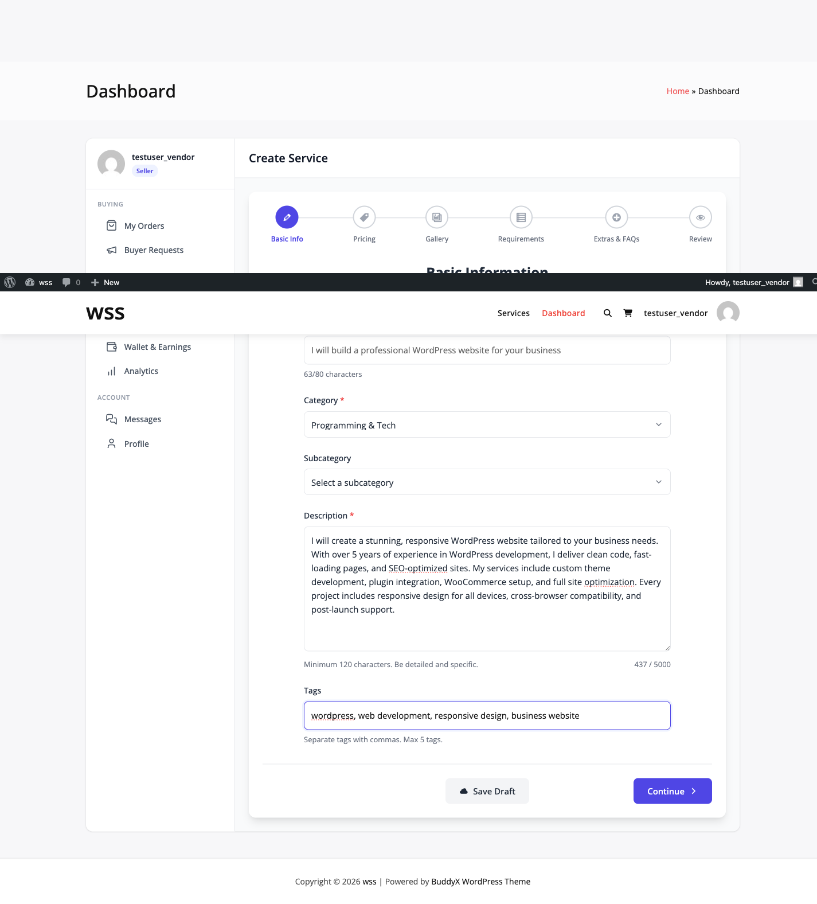
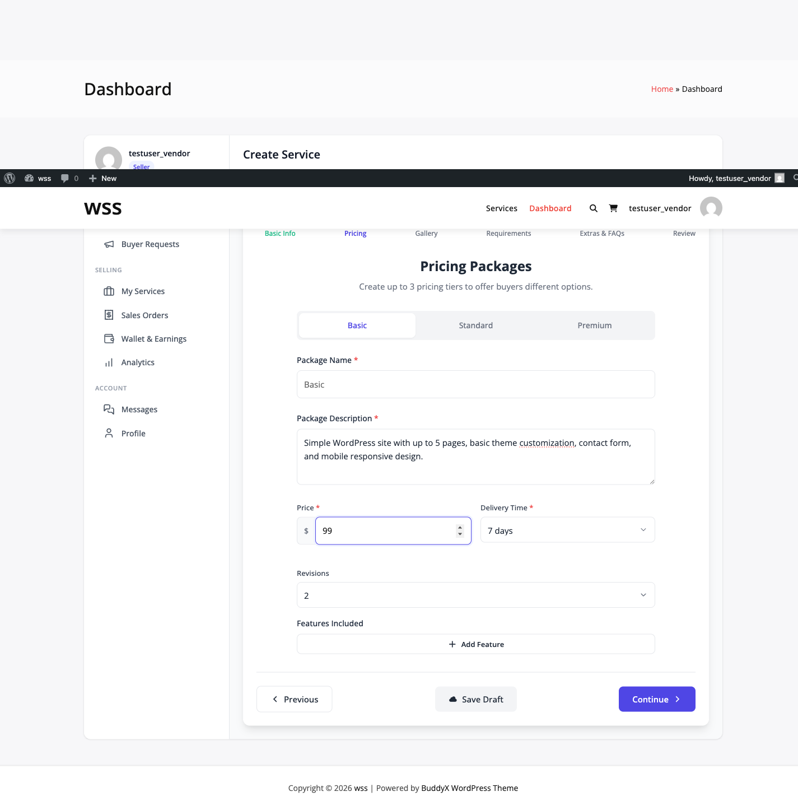
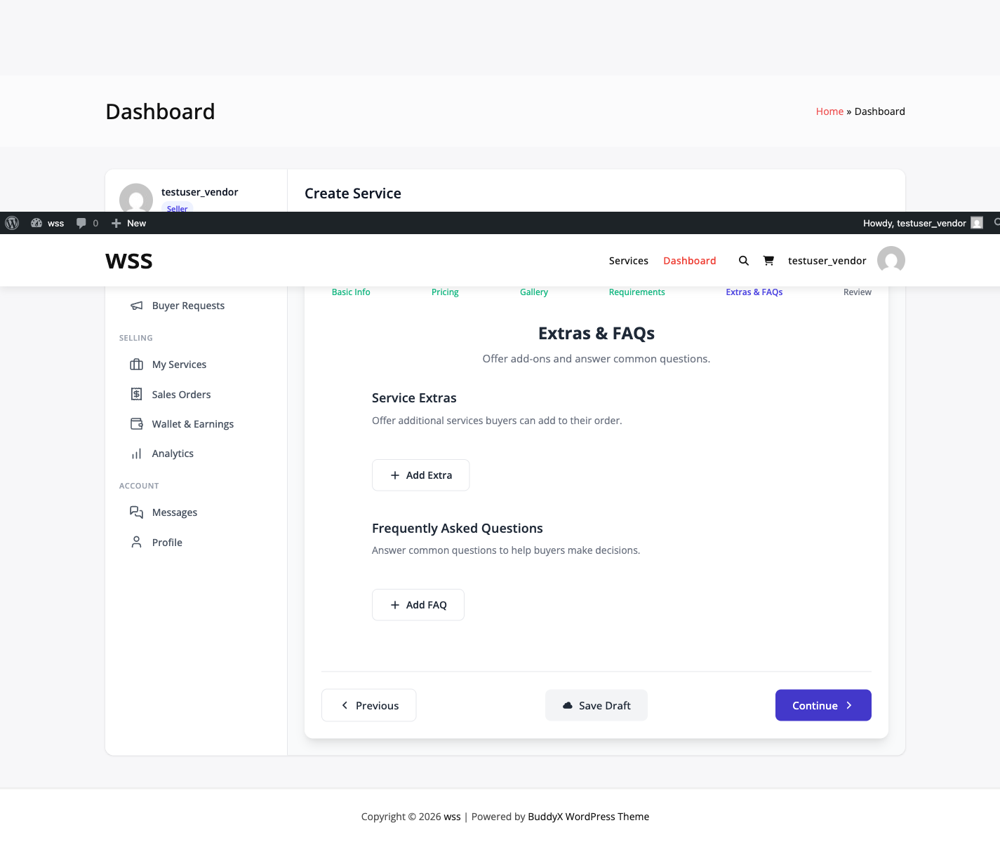
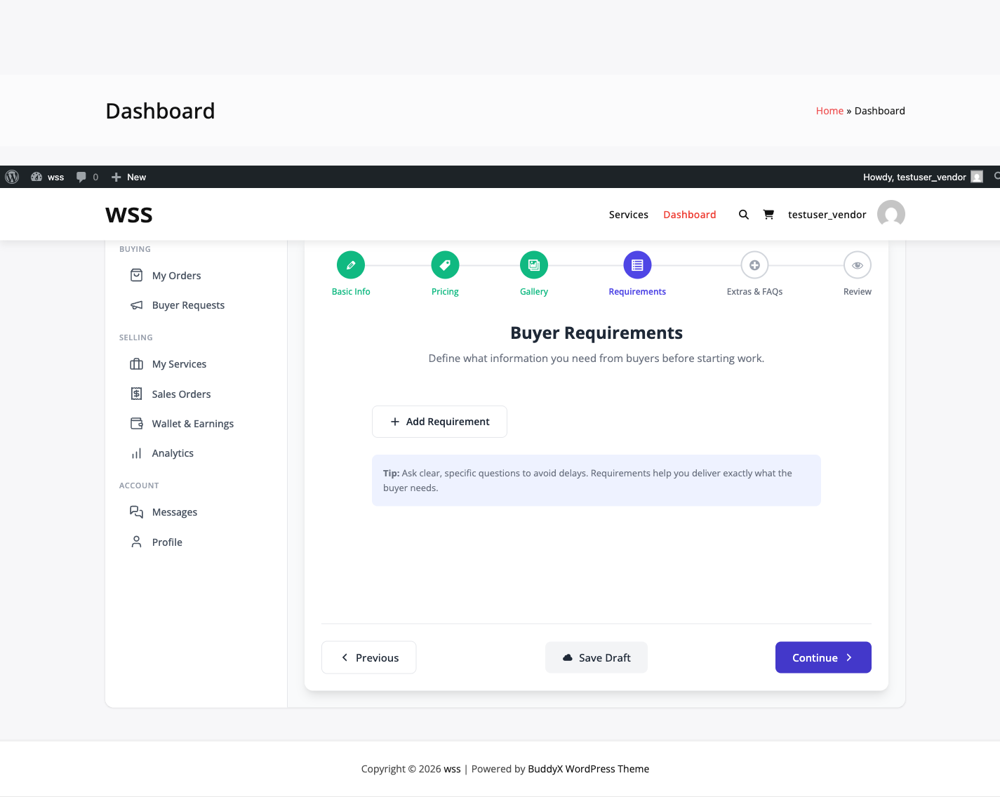
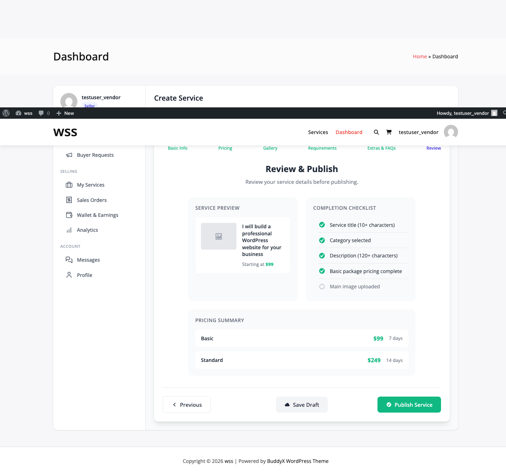

# Creating a Service

Vendors create services that buyers can purchase on your marketplace. This guide walks through the complete service creation process.

## Service Creation Flow

```
Draft → Fill Details → Add Packages → Add Extras → Publish → Moderation → Live
```

## Accessing the Service Creator

Vendors can create services from:

1. **Vendor Dashboard**: Go to **Services → Add New**
2. **Admin (for testing)**: Go to **WP Sell Services → Services → Add New**



## Step 1: Basic Information

### Service Title

Create a clear, descriptive title that explains what you're offering.

**Good Titles:**
- "I will design a professional WordPress website"
- "I will write SEO-optimized blog posts"
- "I will create custom WooCommerce product pages"

**Bad Titles:**
- "WordPress" (too vague)
- "I will do anything WordPress related" (not specific)
- "BEST SERVICE EVER!!!" (unprofessional)

**Character Limit**: 80 characters maximum (enforced by the plugin)

### Service Description

Write a detailed description of what you're offering:

1. **Introduction**: What service you provide and who it's for
2. **What's Included**: Specific deliverables
3. **Process**: How you work with clients
4. **Requirements**: What you need from the buyer
5. **Why Choose You**: Your experience and expertise

**Tips for Great Descriptions:**
- Use bullet points for easy scanning
- Be specific about deliverables
- Include your experience/qualifications
- Set clear expectations
- Avoid overpromising



### Category & Tags

**Categories**: Choose 1-2 relevant categories
- WordPress Development
- Graphic Design
- Content Writing
- Marketing & SEO
- Video & Animation

**Tags**: Add 5-10 specific tags for searchability
- wordpress, theme-customization, responsive-design
- logo-design, branding, illustration
- blog-writing, seo-content, copywriting

Categories and tags help buyers find your service through search and filtering.

### Featured Image

Upload a high-quality featured image (1280x720px recommended):

1. Click **Set featured image**
2. Upload or select from media library
3. Crop to fit aspect ratio

**Image Best Practices:**
- Show your work samples
- Use professional graphics
- Include text overlay with service name
- Avoid stock photos
- JPG or PNG format, under 500KB


## Step 2: Service Packages

Every service must have at least one package. Most services offer 3 tiers: Basic, Standard, and Premium.

### Adding Packages

Click **Add Package** to create each tier:

**Package Fields:**

| Field | Description | Example |
|-------|-------------|---------|
| **Package Name** | Tier name | Basic, Standard, Premium |
| **Price** | Package cost | $50, $100, $200 |
| **Delivery Days** | Days to complete | 3, 5, 7 |
| **Revisions** | Included revisions | 1, 2, Unlimited |
| **Description** | What's included | "3 pages, responsive design, SEO setup" |



### Package Limits

**Free Version**: 3 packages maximum per service

**Pro Version**: **[PRO]** Unlimited packages

### Package Pricing Strategy

**Basic Package** ($25-100):
- Core deliverable only
- Fastest delivery
- Minimal revisions
- Entry-level buyers

**Standard Package** ($100-300):
- Enhanced deliverable
- Moderate delivery time
- More revisions
- Most popular choice

**Premium Package** ($300+):
- Complete solution
- Extended delivery time
- Unlimited revisions
- Professional buyers

**Pro Tip**: Price your Standard package as the best value. Most buyers choose the middle option.

## Step 3: Service Add-ons (Extras)

Add-ons let buyers customize their order with extras like rush delivery, extra pages, or premium features.

### Creating Add-ons

Go to the **Add-ons** tab and click **Add New Add-on**:

**Add-on Fields:**

| Field | Options | Purpose |
|-------|---------|---------|
| **Title** | Text | "Extra Fast Delivery" |
| **Field Type** | checkbox, dropdown, text, radio, multi-select | How buyer selects |
| **Price Type** | Flat rate, Percentage, Quantity-based | How to calculate cost |
| **Price** | Amount | $20, 10%, $5 per unit |
| **Apply To** | All packages, Specific packages | Availability |



### Add-on Field Types

**Checkbox**: Simple yes/no extra
- Example: "Rush delivery (+$25)"
- Price: Flat $25

**Dropdown**: Choose one option from a list
- Example: "Number of extra pages" → 1 page, 2 pages, 3 pages
- Price: $10 per page (quantity-based)

**Text Input**: Custom buyer input
- Example: "Custom domain name"
- Price: Flat $15

**Radio Buttons**: Choose one option (displayed differently than dropdown)
- Example: "Delivery speed" → Standard, Fast (+$20), Express (+$50)
- Price: Variable per option

**Multi-select**: Choose multiple options
- Example: "Additional features" → SSL Setup, Email Setup, Backup Setup
- Price: $10 each

### Add-on Limits

**Free Version**: 3 add-ons maximum per service

**Pro Version**: **[PRO]** Unlimited add-ons

### Effective Add-on Examples

**Rush Delivery**:
- Field: Checkbox
- Price: Flat $25
- Reduces delivery time by 50%

**Extra Revisions**:
- Field: Dropdown (1, 2, 3 revisions)
- Price: $15 per revision (quantity-based)

**Premium Support**:
- Field: Checkbox
- Price: 20% of package price (percentage)
- 30-day priority support

## Step 4: Gallery & Media

Showcase your work with images and videos.

### Gallery Images

Upload portfolio samples or mockups:

1. Go to **Gallery** tab
2. Click **Add Images**
3. Upload images or select from media library
4. Drag to reorder
5. Add captions (optional)

**Image Requirements:**
- Minimum: 800x600px
- Format: JPG, PNG
- Size: Under 2MB each

**Limits:**
- Free: 4 images maximum
- **[PRO]**: Unlimited images


### Service Videos

Add video demonstrations:

1. Go to **Videos** tab
2. Enter YouTube or Vimeo URL
3. Add video title
4. Video embeds on service page

**Limits:**
- Free: 1 video
- **[PRO]**: Unlimited videos

**Video Tips:**
- Keep under 2 minutes
- Show your process
- Include voiceover explanation
- Demonstrate final results

## Step 5: FAQs

Answer common buyer questions before they ask.

### Adding FAQs

1. Go to **FAQs** tab
2. Click **Add FAQ**
3. Enter question and answer
4. Drag to reorder

**Limits:**
- Free: 5 FAQs maximum
- **[PRO]**: Unlimited FAQs

**Effective FAQ Examples:**

**Q: What do you need from me to get started?**
A: I'll need your logo files, brand colors, and content for each page.

**Q: How many revisions are included?**
A: The Basic package includes 1 revision, Standard includes 2, and Premium includes unlimited revisions.

**Q: What happens if I'm not satisfied?**
A: You can request revisions or open a dispute within 7 days of delivery.

**Q: Do you provide ongoing support?**
A: Yes! All packages include 30 days of free support after delivery.


## Step 6: Service Requirements

Define what information you need from buyers before starting work.

### Adding Requirement Fields

1. Go to **Requirements** tab
2. Click **Add Requirement**
3. Choose field type
4. Mark as required or optional

**Available Field Types:**

| Type | Use Case |
|------|----------|
| **Text** | Short answers (name, URL) |
| **Textarea** | Long answers (project description) |
| **Number** | Numeric input (quantity, budget) |
| **Date** | Deadlines, launch dates |
| **Checkbox** | Yes/no questions |
| **Radio** | Choose one option |
| **Select** | Dropdown selection |
| **Multi-select** | Choose multiple options |
| **File Upload** | Documents, images, logos |

**Example Requirements:**

1. "What's your website URL?" (Text, Required)
2. "Describe your project goals" (Textarea, Required)
3. "Upload your logo" (File Upload, Optional)
4. "Preferred color scheme" (Text, Optional)

**File Upload Settings:**
- Allowed types: PDF, JPG, PNG, ZIP, DOC
- Max file size: 10MB (configurable)
- Max files: 5 per field



**When Buyers Fill Requirements:**

After purchasing, buyers must complete the requirements form before the order starts. Vendors receive a notification when requirements are submitted.

## Step 7: SEO Settings

Optimize your service for search engines.

### SEO Fields

**Meta Title**: Custom title for search results (60 characters)
- Default: Uses service title
- Example: "Professional WordPress Website Design | Responsive & SEO-Ready"

**Meta Description**: Summary for search results (160 characters)
- Example: "Get a custom WordPress website designed by an expert with 10+ years experience. Fast delivery, unlimited revisions, and ongoing support."

**Focus Keyword**: Target keyword for SEO
- Example: "wordpress website design"

## Step 8: Publishing

### Service Status Options

**Draft**: Save work without publishing
- Visible only to you
- Can edit freely
- Not searchable

**Pending Review**: Submit for admin approval
- Awaits moderation
- Admin receives notification
- Edit restrictions may apply

**Published**: Live on marketplace
- Visible to all buyers
- Searchable and purchasable
- Can edit (if settings allow)



### Moderation Workflow

If **Manual Service Approval** is enabled:

1. Vendor submits service (status: Pending Review)
2. Admin receives email notification
3. Admin reviews at **WP Sell Services → Services → Pending**
4. Admin approves or rejects with feedback
5. If approved, status changes to Published
6. Vendor receives approval notification

**Auto-Approval**: If enabled in settings, services publish immediately.

### After Publishing

Once live, your service:
- Appears in service listings and search
- Is indexed by search engines
- Can receive orders from buyers
- Shows in your vendor profile

## Best Practices for Service Creation

### Writing Tips
✅ Be specific about deliverables
✅ Use clear, professional language
✅ Set realistic delivery times
✅ Include your qualifications
✅ Answer common objections in description

❌ Don't overpromise results
❌ Avoid vague descriptions
❌ Don't use all caps or excessive punctuation
❌ Skip generic stock images

### Pricing Strategy
- Research competitor services
- Start with competitive pricing
- Increase prices as you gain reviews
- Offer clear value differences between packages

### Portfolio & Gallery
- Show your best work only
- Use before/after comparisons
- Include diverse examples
- Update regularly with recent work

## Editing Published Services

Vendors can edit services after publishing (if enabled):

1. Go to **Vendor Dashboard → Services**
2. Click **Edit** on the service
3. Make changes
4. Click **Update**

**Note**: Some changes may require admin re-approval depending on settings.

## Next Steps

- **[Service Packages Guide](service-packages.md)** - Deep dive into pricing tiers
- **[Service Add-ons](service-addons-extras.md)** - Create effective extras
- **[Managing Services](managing-services.md)** - Edit, pause, and optimize services

Your service is now live and ready to receive orders!
