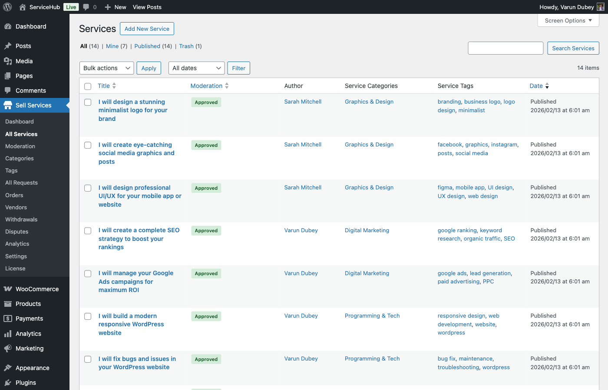

# Managing Services

Learn how to edit, optimize, pause, and manage your services after they're published. This guide covers the complete service management workflow.

## Service Dashboard Overview

Access your services from:

**Vendors:** Dashboard → Services

**Admins:** WP Sell Services → Services



### Services List View

The services table shows:

| Column | Information |
|--------|-------------|
| **Title** | Service name (click to edit) |
| **Category** | Service category/tags |
| **Status** | Draft, Pending Review, Published, Paused |
| **Orders** | Active order count |
| **Views** | Total service views |
| **Revenue** | Total earned from this service |
| **Rating** | Average rating (stars) |
| **Date** | Publication date |

### Filtering Services

**Filter by Status:**
- All (default)
- Published (live services)
- Draft (unpublished)
- Pending Review (awaiting admin approval)
- Paused (temporarily hidden)

**Filter by Category:**
- Dropdown showing all service categories
- Quick category filtering

**Search Services:**
- Search by title, description, or ID
- Real-time search results


## Editing Published Services

### Making Changes

1. Go to **Services** dashboard
2. Click **Edit** on the service
3. Modify any fields:
   - Title, description, category
   - Packages, add-ons, gallery
   - Requirements, FAQs
4. Click **Update Service**

### Moderation on Edit

Depending on settings, edits may require re-approval:

**Auto-Approve Edits (default):**
- Changes go live immediately
- Suitable for trusted vendors

**Require Approval:**
- Edits trigger status change to "Pending Review"
- Admin reviews changes
- Service stays live with old content until approved
- Useful for quality control

**Configure:** WP Sell Services → Settings → Vendor → "Allow Service Editing"

### What Happens to Active Orders

**Important:** Service changes don't affect active orders:

- Orders retain original package pricing
- Add-ons remain as purchased
- Requirements don't change
- Delivery commitments stay the same

**Example:**
- Buyer orders Standard package for $200
- You edit service and change Standard to $250
- Buyer's order stays at $200
- New buyers pay $250

This protects buyers from mid-order changes.

## Pausing Services

Temporarily hide a service without deleting it.

### How to Pause

1. Go to **Services** dashboard
2. Find the service
3. Click **Pause** (or change status to "Paused")
4. Service immediately hidden from marketplace


### What Happens When Paused

**Visible:**
- Active orders continue normally
- You can still access and edit
- Statistics continue tracking

**Hidden:**
- Service removed from marketplace listings
- Not searchable by buyers
- Service page shows "Unavailable" (or redirects)
- Not indexed by search engines (noindex added)

### When to Pause Services

**Temporary Unavailability:**
- Taking a vacation
- Overwhelmed with orders
- Need to update service significantly

**Testing Changes:**
- Pause → Make major changes → Test → Unpause

**Seasonal Services:**
- Holiday-specific services
- Event-based offerings

**Quality Issues:**
- Address negative reviews
- Improve service quality
- Update portfolio

### Unpausing Services

1. Go to **Services** dashboard
2. Filter by **Paused**
3. Click **Unpause** (or change status to "Published")
4. Service immediately visible again

**Note:** Service regains previous position in listings (sorted by date published, not unpaused).

## Duplicating Services

Create a copy of an existing service to save time.

### How to Duplicate

1. Go to **Services** dashboard
2. Hover over service
3. Click **Duplicate**
4. Duplicate created with status "Draft"
5. Edit duplicate and customize
6. Publish when ready

**What Gets Copied:**
- Title (with "Copy" appended)
- Description and content
- Category and tags
- All packages
- All add-ons
- Requirements
- FAQs
- Settings (delivery time, revisions, etc.)

**What Doesn't Copy:**
- Gallery images (add manually)
- Videos (add manually)
- Reviews and ratings
- Statistics (views, orders, revenue)
- Featured image (set new one)


### Use Cases for Duplication

**Variations:**
- Create similar service with different scope
- Example: "Logo Design" → Duplicate → "Logo + Business Card Design"

**Packages with Different Features:**
- Duplicate and adjust packages
- Test different pricing strategies

**Language Versions:**
- Duplicate and translate
- Target different markets

## Deleting Services

Permanently remove a service.

### How to Delete

1. Go to **Services** dashboard
2. Hover over service
3. Click **Delete**
4. Confirm deletion
5. Service permanently removed

**Warning:** This action cannot be undone.

### Deletion Restrictions

**Cannot Delete If:**
- Service has active orders
- Service has orders in progress
- Service has pending requirements

**Must first:**
- Complete or cancel all active orders
- Wait for orders to reach completed or cancelled status
- Then deletion is allowed

**Can Delete If:**
- No orders exist
- All orders are completed/cancelled
- Service is Draft or Paused

### What Happens on Deletion

**Removed:**
- Service post and all data
- Packages and add-ons
- Gallery images (from service, not media library)
- Requirements and FAQs
- Service statistics

**Preserved:**
- Completed order records (for accounting)
- Reviews (archived, not visible)
- Media library files (images/videos)
- Revenue records


## Service Statistics & Analytics

Track service performance to optimize.

### Available Metrics

**Overview Stats:**
- Total views
- Total orders
- Total revenue
- Average rating
- Conversion rate (views → orders)

**Time-Based Analytics:**
- Views per day/week/month
- Orders per day/week/month
- Revenue trends

**Package Performance:**
- Orders per package (Basic vs Standard vs Premium)
- Revenue per package
- Most popular package

**Add-on Performance:**
- Add-on attachment rate
- Revenue from add-ons
- Most popular add-ons

**Traffic Sources:**
- Direct links
- Search (internal marketplace)
- Category pages
- Vendor profile


### Using Analytics to Optimize

**Low Conversion Rate (views but no orders):**
- Improve service description
- Adjust pricing
- Add better gallery images
- Update FAQs to address objections

**High Views, Low Orders on Specific Package:**
- Package not priced competitively
- Features not compelling
- Delivery time too long

**Add-ons Not Selling:**
- Price too high
- Not valuable enough
- Better to include in package

**Seasonal Trends:**
- Identify peak months
- Prepare for high-demand periods
- Adjust pricing based on demand

## Bulk Actions (Admin Only)

Admins can perform bulk operations:

### Available Bulk Actions

1. Select multiple services (checkboxes)
2. Choose action from dropdown:
   - **Approve** (pending services)
   - **Pause** (multiple at once)
   - **Unpause** (reactivate multiple)
   - **Delete** (with restrictions)
   - **Change Category**
   - **Export** (to CSV)

3. Click **Apply**


### Exporting Services

Export service data to CSV:

**Included Data:**
- Service ID, title, status
- Category, tags
- Packages (names, prices)
- Statistics (views, orders, revenue)
- Rating data

**Use Cases:**
- Backup service data
- External analysis
- Reporting
- Migration

## Service Moderation (Admin)

Admins review and approve vendor services.

### Pending Services

1. Go to **WP Sell Services → Services → Pending Review**
2. View all services awaiting approval
3. Click **Review** on a service

### Review Options

**Approve:**
- Service status → Published
- Vendor notified via email
- Service goes live immediately

**Reject:**
- Service status → Draft
- Add rejection reason (required)
- Vendor notified with feedback
- Vendor can edit and resubmit

**Request Changes:**
- Service stays Pending
- Admin adds comments
- Vendor makes changes
- Resubmits for review


### Moderation Best Practices

**Review Checklist:**
- [ ] Title is clear and professional
- [ ] Description is complete and accurate
- [ ] Pricing is reasonable
- [ ] Packages are properly configured
- [ ] Gallery has appropriate images
- [ ] No prohibited content
- [ ] No copyright violations
- [ ] Requirements make sense
- [ ] FAQs are helpful

**Rejection Reasons:**
- Incomplete information
- Inappropriate content
- Pricing violations
- Category mismatch
- Quality concerns
- Terms of service violations

**Pro Tip:** Provide specific, actionable feedback when rejecting services. This helps vendors improve and reduces resubmissions.

## Service SEO Optimization

Optimize services for search engines (Google, Bing).

### On-Page SEO

**Title Optimization:**
- Include target keyword
- Keep under 60 characters
- Make it compelling
- Example: "Professional WordPress Website Design | Custom & Responsive"

**Description (Meta):**
- First 160 characters matter most
- Include primary keyword naturally
- Call to action
- Example: "Get a custom WordPress website designed by an expert developer. Mobile-responsive, SEO-optimized, and delivered in 7 days. Order now!"

**URL Structure:**
- Automatic: `/services/service-name/`
- Editable via slug field
- Use hyphens, not underscores
- Keep concise

### Content Optimization

**Keyword Placement:**
- Title (primary keyword)
- First paragraph
- Package descriptions
- FAQ questions/answers
- Image alt text

**Content Length:**
- Minimum 300 words in description
- Longer is often better (500-1000 words)
- But prioritize quality over length

**Internal Linking:**
- Link to related services
- Link to category pages
- Link to vendor profile

### Schema Markup

WP Sell Services automatically adds structured data:

```json
{
  "@type": "Service",
  "name": "Service Title",
  "description": "...",
  "provider": {
    "@type": "Person",
    "name": "Vendor Name"
  },
  "offers": {
    "@type": "Offer",
    "price": "100",
    "priceCurrency": "USD"
  }
}
```

This helps search engines understand your services.


## Performance Optimization

Keep services loading fast:

**Image Optimization:**
- Compress gallery images before upload
- Use WebP format (if supported)
- Lazy load images
- Recommended: Under 100KB per image

**Video Optimization:**
- Use YouTube/Vimeo embeds (not direct uploads)
- Don't autoplay videos
- Use thumbnail placeholders

**Caching:**
- Use a caching plugin (W3 Total Cache, WP Rocket)
- Service pages are cacheable
- Cache expires on service update

## Troubleshooting Common Issues

### Service Not Appearing in Listings

**Check:**
- Status is "Published" (not Draft or Paused)
- Service is in a valid category
- Permalink settings refreshed (Settings → Permalinks → Save)
- Cache cleared

### Can't Edit Service

**Reasons:**
- Service has active orders (some fields locked)
- Vendor editing disabled in settings
- Service under moderation review

### Orders Not Being Received

**Check:**
- Service is Published and visible
- Packages are properly priced
- Requirements aren't too complex (causing abandonment)
- Checkout process works (test order)

### Low Conversion Rate

**Improve:**
- Add more gallery images
- Create service video
- Improve description clarity
- Adjust pricing
- Add more FAQs
- Update packages

## Best Practices for Service Management

### Regular Maintenance

**Weekly:**
- Review analytics
- Respond to buyer questions
- Update service if needed

**Monthly:**
- Refresh gallery with recent work
- Add new FAQs based on questions
- Adjust pricing based on demand
- Review and improve descriptions

**Quarterly:**
- Major service updates
- Competitive analysis
- Pricing strategy review
- Portfolio refresh

### Quality Control

✅ **Always:**
- Keep services up to date
- Remove outdated information
- Update pricing as you gain experience
- Maintain professional presentation

❌ **Avoid:**
- Neglecting service updates
- Ignoring buyer questions in reviews
- Letting statistics guide all decisions (trust your expertise too)
- Over-editing (constant changes confuse buyers)

## Next Steps

- **[Service Analytics](../analytics/service-performance.md)** - Deep dive into performance tracking
- **[Order Management](../order-management/managing-orders.md)** - Handle incoming orders
- **[Vendor Dashboard](../vendor/vendor-dashboard.md)** - Complete dashboard guide

Effective service management leads to more orders and higher revenue!
