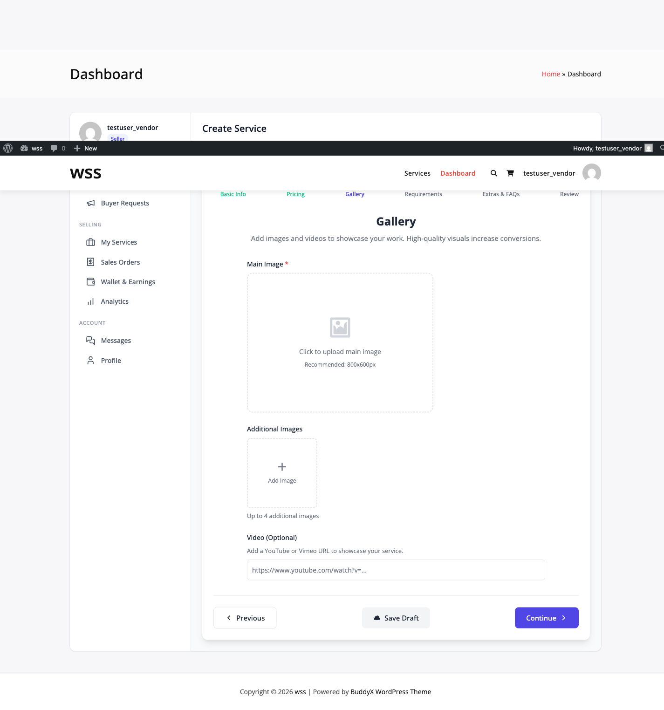
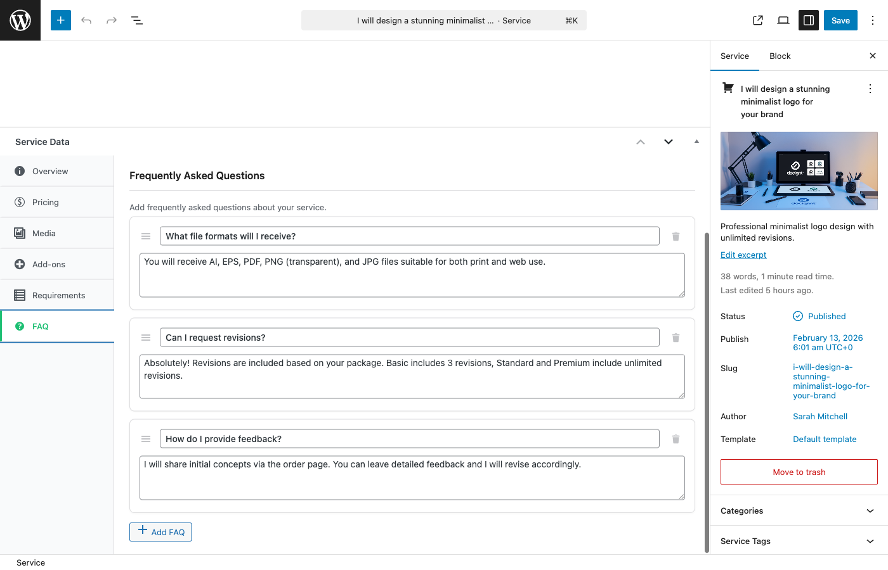
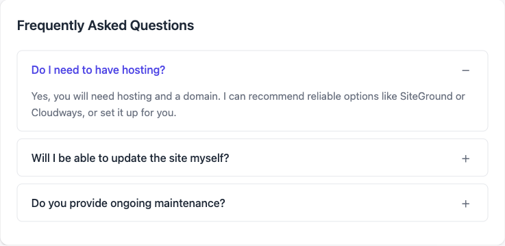

# Service Gallery & FAQs

Showcase your work with images and videos, and answer common questions before buyers ask. This guide covers how to create compelling service galleries and helpful FAQs.

## Service Gallery

The service gallery displays portfolio samples, mockups, and examples of your work. High-quality galleries significantly increase conversion rates.

### Gallery Limits

**Free Version**: Maximum **4 images** per service

**Pro Version**: **[PRO]** **Unlimited images**

### Adding Gallery Images

1. Edit your service
2. Go to **Gallery** tab
3. Click **Add Images** button
4. Upload images or select from media library
5. Select multiple images at once
6. Click **Add to Gallery**



### Image Requirements

**Recommended Specifications:**
- **Resolution**: 1200×800px minimum (higher for detail shots)
- **Aspect Ratio**: 3:2 or 16:9 (consistent across all images)
- **File Format**: JPG (photos), PNG (graphics with transparency)
- **File Size**: Under 500KB per image (compress before uploading)
- **Quality**: High resolution, well-lit, professional

**Technical Limits:**
- Maximum file size: 2MB per image
- Allowed formats: JPG, JPEG, PNG, GIF
- Minimum dimensions: 800×600px

### Gallery Image Types

**Before & After:**
Show transformation or improvement:
- Website redesign (old vs. new)
- Logo evolution
- Performance improvements (before/after speed tests)

**Process Shots:**
Behind-the-scenes of your workflow:
- Wireframes and mockups
- Design iterations
- Development screenshots

**Final Results:**
Completed projects:
- Live website screenshots
- Finished designs
- Published content

**Detail Shots:**
Close-ups of specific features:
- Custom functionality
- Design details
- Code quality examples

**Client Results:**
Demonstrate impact:
- Analytics improvements
- Conversion rate increases
- User testimonials (as images)


### Managing Gallery Images

**Reordering Images:**
1. Go to **Gallery** tab
2. Drag images up or down
3. First image displays as default
4. Changes save automatically

**Adding Captions:**
1. Click **Edit** on an image
2. Enter caption text
3. Captions display on hover or below image

**Deleting Images:**
1. Hover over image
2. Click **Delete** (X icon)
3. Confirm deletion
4. Image removed from gallery only (stays in media library)

### Gallery Best Practices

✅ **Show Your Best Work:**
- Only include top-quality examples
- Remove outdated or lower-quality work
- Update gallery regularly with recent projects

✅ **Variety:**
- Mix different project types
- Show range of styles (if applicable)
- Include diverse industries/niches

✅ **Context:**
- Add captions explaining each image
- Show what package level it represents
- Note any special techniques used

✅ **Professional Presentation:**
- Use consistent image sizes
- Optimize for web (fast loading)
- Avoid watermarks (makes it look unprofessional)

❌ **Avoid:**
- Stock photos (use real work only)
- Blurry or low-resolution images
- Unrelated images
- Copyrighted work you didn't create
- Personal photos unrelated to service

### Gallery SEO

Optimize gallery images for search engines:

**Image File Names:**
- Bad: `IMG_1234.jpg`
- Good: `wordpress-ecommerce-homepage-design.jpg`

**Alt Text:**
1. Edit image in media library
2. Add descriptive alt text
3. Example: "Custom WordPress e-commerce homepage with slider and product grid"

**Captions:**
Include keywords naturally:
- "Responsive WordPress website design for digital agency"
- "Custom WooCommerce product page layout with reviews"

## Service Videos

Videos let you demonstrate your work, explain your process, or showcase results. Videos significantly boost buyer confidence.

### Video Limits

**Free Version**: **1 video** per service

**Pro Version**: **[PRO]** **Unlimited videos**

### Adding Videos

1. Upload your video to YouTube or Vimeo
2. Copy the video URL
3. Edit your service
4. Go to **Videos** tab
5. Click **Add Video**
6. Paste video URL
7. Add video title (optional)
8. Click **Save**


**Supported Platforms:**
- YouTube (youtube.com/watch?v=...)
- Vimeo (vimeo.com/...)

**Note**: Videos are embedded, not uploaded directly. This saves server storage and bandwidth.

### Video Best Practices

**Video Length:**
- Keep under **2 minutes** (ideal: 60-90 seconds)
- Buyers have short attention spans
- Focus on highlights, not comprehensive tutorials

**Video Content Ideas:**

**Service Overview:**
- Explain what you offer
- Show examples of finished work
- Highlight your process

**Portfolio Walkthrough:**
- Demonstrate 2-3 completed projects
- Explain challenges and solutions
- Show before/after results

**Testimonial Compilation:**
- Client video testimonials
- Results achieved for clients
- Success stories

**Process Demonstration:**
- Screen recording of your workflow
- Live design/development session
- Problem-solving walkthrough

**Technical Skills:**
- Code review walkthrough
- Tool demonstrations
- Technique explanations

**Production Quality:**
- Use good lighting (for talking head videos)
- Clear audio (invest in a decent microphone)
- Simple background (minimize distractions)
- Edit out dead space and "ums"
- Add text overlays for key points

**Accessibility:**
- Add captions/subtitles
- Include a summary in the video description
- Ensure good contrast for text overlays


### Managing Videos

**Editing Video Details:**
1. Go to **Videos** tab
2. Click **Edit** on the video
3. Update URL or title
4. Save changes

**Reordering Videos (Pro):**
- Drag videos to reorder
- First video displays by default
- Other videos show below

**Deleting Videos:**
1. Click **Delete** on video
2. Confirm deletion
3. Video removed from service (stays on YouTube/Vimeo)

## Service FAQs

FAQs answer common buyer questions and overcome objections before they arise. Well-written FAQs reduce support questions and increase conversions.

### FAQ Limits

**Free Version**: Maximum **5 FAQs** per service

**Pro Version**: **[PRO]** **Unlimited FAQs**

### Adding FAQs

1. Edit your service
2. Go to **FAQs** tab
3. Click **Add FAQ**
4. Enter question
5. Enter answer
6. Click **Save FAQ**



### Effective FAQ Questions

Address these common buyer concerns:

**Requirements & Process:**
- "What do you need from me to get started?"
- "How does the process work?"
- "When will work begin after I order?"

**Deliverables & Timeline:**
- "What exactly will I receive?"
- "How long will this take?"
- "What if I need it faster?"

**Revisions & Changes:**
- "How many revisions are included?"
- "What counts as a revision?"
- "Can I request changes after delivery?"

**Technical Details:**
- "What platform/tools do you use?"
- "Will this work with my existing setup?"
- "Do you provide documentation?"

**Support & Ongoing:**
- "What support is included?"
- "What happens after the project is complete?"
- "Can you help with future updates?"

**Pricing & Packages:**
- "What's the difference between packages?"
- "Are there any additional costs?"
- "What payment methods do you accept?"

**Communication:**
- "How will we communicate during the project?"
- "What if I'm in a different timezone?"
- "How quickly do you respond to messages?"

**Refunds & Disputes:**
- "What's your refund policy?"
- "What if I'm not satisfied?"
- "How do you handle disputes?"

### Writing Great FAQ Answers

**Be Specific:**

❌ Bad: "I need some information from you."

✅ Good: "I'll need your logo files (AI or PNG), brand colors (hex codes), and content for each page (text and images)."

**Be Reassuring:**

❌ Bad: "It takes as long as it takes."

✅ Good: "Most projects are completed within the delivery timeframe specified in your package. I'll keep you updated every step of the way."

**Be Helpful:**

❌ Bad: "Read the package description."

✅ Good: "The Basic package includes 1 revision, Standard includes 3, and Premium includes unlimited revisions within 30 days of delivery."

**Be Professional:**

❌ Bad: "Maybe, depends on what u want lol"

✅ Good: "Yes, I can accommodate custom requests. Please message me before ordering so we can discuss your specific needs."

### FAQ Examples by Service Type

**Web Development:**

**Q: What platforms do you work with?**
A: I specialize in WordPress, WooCommerce, and custom PHP development. All sites are built with responsive design and SEO best practices.

**Q: Will I be able to update the site myself?**
A: Absolutely! I'll provide video training and written documentation showing you how to add pages, posts, products, and update content.

**Graphic Design:**

**Q: What file formats will I receive?**
A: You'll receive PNG and JPG files for web use. The Premium package includes source files (AI, PSD) for future editing.

**Q: Can I use the design commercially?**
A: Yes! The Basic and Standard packages include personal and commercial use rights. For extended licensing (resale, templates), please select the Commercial License add-on.

**Content Writing:**

**Q: Do you include SEO keyword research?**
A: The Standard and Premium packages include basic keyword research. For comprehensive SEO strategy, add the "Advanced SEO Research" extra.

**Q: How many revisions can I request?**
A: Each package includes revisions (Basic: 1, Standard: 2, Premium: unlimited within 14 days). Revisions cover edits to existing content, not complete rewrites.



### Managing FAQs

**Reordering FAQs:**
1. Go to **FAQs** tab
2. Drag FAQs up or down
3. Order by importance (most critical first)
4. Changes save automatically

**Editing FAQs:**
1. Click **Edit** on an FAQ
2. Update question or answer
3. Save changes

**Deleting FAQs:**
1. Click **Delete** on FAQ
2. Confirm deletion
3. FAQ removed from service

### FAQ Analytics

Track which FAQs buyers find most helpful:

**Metrics (Pro):**
- FAQ views
- Expansion rate (how many click to read)
- Time spent reading
- Most viewed FAQs

Use this data to:
- Prioritize important questions
- Remove unused FAQs
- Add missing questions
- Improve answers

## Combining Gallery, Videos & FAQs

These three elements work together to overcome buyer hesitation:

**1. Gallery** → Shows what you can do (proof)

**2. Videos** → Demonstrates how you work (process & personality)

**3. FAQs** → Addresses concerns and questions (removes friction)

**Conversion Formula:**
```
Compelling Gallery + Engaging Video + Helpful FAQs = Higher Conversions
```

### Optimization Strategy

**Week 1-2:** Add complete gallery and 3-5 essential FAQs

**Week 3-4:** Create and add service overview video

**Month 2:** Analyze buyer messages to identify missing FAQs

**Month 3:** Update gallery with recent work, add new FAQs

**Ongoing:** Continuously improve based on buyer questions and feedback

## Mobile Optimization

Ensure your gallery, videos, and FAQs look great on mobile:

**Gallery:**
- Images automatically resize
- Lightbox for fullscreen viewing
- Swipe gesture support

**Videos:**
- Responsive embed (fits any screen)
- Touch-friendly controls
- Auto-adjusts quality based on connection

**FAQs:**
- Accordion interface (expand/collapse)
- Large touch targets
- Easy to scan on small screens

## Next Steps

- **[Creating a Service](creating-a-service.md)** - Complete service setup guide
- **[Service Packages](service-packages.md)** - Structure your pricing
- **[Service Requirements](service-requirements.md)** - Collect buyer information

Great galleries, videos, and FAQs turn browsers into buyers!
