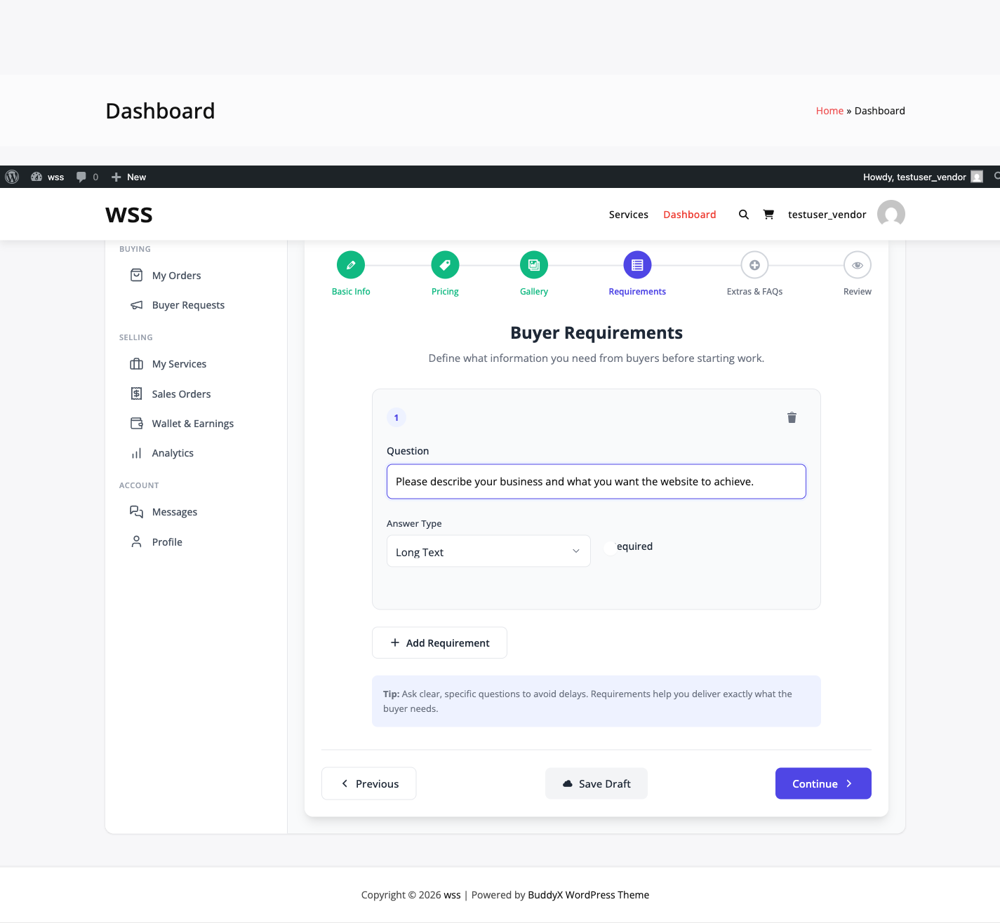
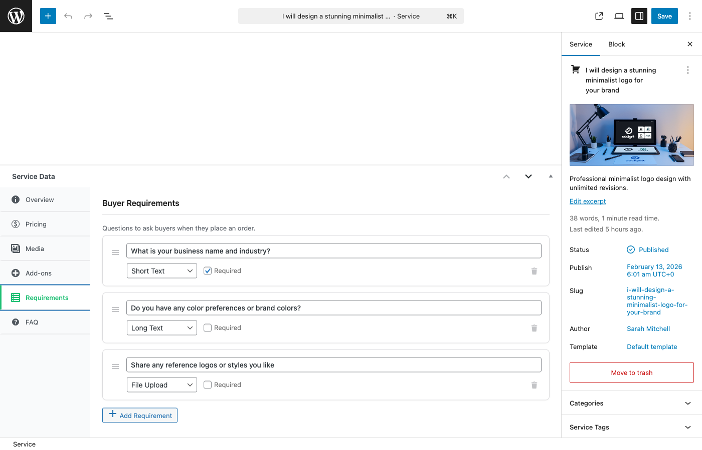

# Service Requirements

Service requirements are custom forms that collect essential information from buyers before work begins. This guide shows you how to create effective requirement forms that get you all the information you need.

## What Are Service Requirements?

Service requirements are questions and fields buyers must complete after purchasing your service. They ensure you have all necessary information (content, files, preferences, etc.) before starting work.

**When Requirements Are Filled:**
1. Buyer completes purchase
2. Order created with status: `pending_requirements`
3. Buyer redirected to requirements form
4. Buyer fills out your custom questions
5. Requirements submitted
6. Order status changes to `pending_acceptance` (if manual approval) or `in_progress`
7. You receive notification with buyer's answers


## Why Use Requirements?

**Benefits for Vendors:**
- Collect all information upfront
- Reduce back-and-forth messages
- Start work immediately with complete info
- Set clear expectations
- Professional workflow

**Benefits for Buyers:**
- Clear understanding of what you need
- Organized information submission
- Faster project start
- Reduced confusion

## Available Field Types

Choose from 9 field types to collect different information:

### Text (Short Answer)

Single-line text input for brief answers.

**Use For:**
- Names, URLs, email addresses
- Short specifications
- Product names, business names
- Account usernames

**Example:**
```
Question: What's your website URL?
Field Type: Text
Required: Yes
```



### Textarea (Long Answer)

Multi-line text area for detailed responses.

**Use For:**
- Project descriptions
- Content to be used
- Detailed instructions
- Background information
- Goals and objectives

**Example:**
```
Question: Describe your project goals and target audience
Field Type: Textarea
Required: Yes
Placeholder: Tell me about your business, who your customers are, and what you want to achieve...
```

### Number

Numeric input only (validates numbers).

**Use For:**
- Quantities
- Budget ranges
- Page counts
- Product counts
- User counts

**Example:**
```
Question: How many products do you want to add?
Field Type: Number
Required: Yes
Min: 1
Max: 100
```

### Date

Date picker for selecting dates.

**Use For:**
- Launch dates
- Deadlines
- Event dates
- Preferred delivery dates
- Timeline milestones

**Example:**
```
Question: When do you need this completed by?
Field Type: Date
Required: No
```


### Checkbox

Single checkbox for yes/no answers.

**Use For:**
- Confirmations
- Opt-in preferences
- Feature toggles
- Agreement checkboxes

**Example:**
```
Question: Do you need mobile app integration?
Field Type: Checkbox
Required: No
Label: Yes, include mobile app integration
```

### Radio Buttons

Choose one option from a list (displayed as radio buttons).

**Use For:**
- Single selections
- Either/or choices
- Style preferences
- Platform selections

**Example:**
```
Question: What style do you prefer?
Field Type: Radio
Required: Yes
Options:
  - Modern and minimal
  - Bold and colorful
  - Professional and corporate
  - Creative and artistic
```

### Select (Dropdown)

Choose one option from a dropdown menu.

**Use For:**
- Long lists of options
- Categories or types
- Platform/tool selections
- Format preferences

**Example:**
```
Question: Which CMS platform are you using?
Field Type: Select
Required: Yes
Options:
  - WordPress
  - Shopify
  - Wix
  - Squarespace
  - Custom/Other
```


### Multi-Select (Choose Multiple)

Select multiple options from a list.

**Use For:**
- Multiple feature selections
- Multiple integrations needed
- Multiple formats required
- Multiple platforms

**Example:**
```
Question: Which social media platforms should be integrated?
Field Type: Multi-select
Required: No
Options:
  - Facebook
  - Instagram
  - Twitter
  - LinkedIn
  - Pinterest
  - TikTok
```

### File Upload

Allow buyers to upload files.

**Use For:**
- Logo files
- Brand assets
- Content documents
- Reference materials
- Existing designs
- Source files

**Example:**
```
Question: Upload your logo and brand assets
Field Type: File Upload
Required: Yes
Allowed Types: PDF, JPG, PNG, AI, EPS
Max Size: 10MB
Max Files: 5
```



**File Upload Settings:**

| Setting | Description | Default |
|---------|-------------|---------|
| **Allowed File Types** | Extensions buyers can upload | PDF, JPG, PNG, ZIP, DOC, DOCX |
| **Max File Size** | Maximum size per file | 10MB |
| **Max Files** | Number of files per field | 5 |

**Customize Allowed File Types:**

Developers can modify allowed types using a filter:

```php
add_filter( 'wpss_requirements_allowed_file_types', function( $types ) {
    $types[] = 'svg';  // Add SVG support
    $types[] = 'psd';  // Add PSD support
    return $types;
}, 10 );
```

## Creating Requirement Fields

### Adding Requirements

1. Edit your service
2. Go to **Requirements** tab
3. Click **Add Requirement**
4. Fill in field details:
   - Question/label
   - Field type
   - Required or optional
   - Field-specific options
5. Click **Save Requirement**


### Field Configuration

**Common Settings (All Fields):**

| Setting | Purpose |
|---------|---------|
| **Label/Question** | The question text buyers see |
| **Field Type** | How buyers input information |
| **Required** | Must be filled to submit form |
| **Help Text** | Additional instructions (optional) |
| **Placeholder** | Example text in field (optional) |

**Field-Specific Settings:**

**Number Fields:**
- Minimum value
- Maximum value
- Step increment

**Text/Textarea:**
- Character limit
- Placeholder text
- Validation pattern (email, URL)

**Select/Radio/Multi-select:**
- Options list (one per line)
- Default selection

**File Upload:**
- Allowed file types
- Max file size
- Max number of files

## Requirement Examples by Service Type

### Web Design/Development

```
1. Website URL (if redesign)
   Type: Text
   Required: No

2. What pages do you need?
   Type: Textarea
   Required: Yes
   Placeholder: Home, About, Services, Blog, Contact...

3. Do you have content ready?
   Type: Radio
   Required: Yes
   Options: Yes, I have all content | No, I need help with content | Partially ready

4. Upload your logo and brand assets
   Type: File Upload
   Required: Yes
   Types: PDF, JPG, PNG, AI, ZIP

5. Preferred color scheme
   Type: Text
   Required: No
   Placeholder: Blue and gray, or "use brand colors"

6. Do you need e-commerce functionality?
   Type: Checkbox
   Required: No

7. Expected launch date
   Type: Date
   Required: No
```

### Content Writing

```
1. What is your business/website about?
   Type: Textarea
   Required: Yes

2. Who is your target audience?
   Type: Textarea
   Required: Yes

3. How many articles do you need?
   Type: Number
   Required: Yes
   Min: 1, Max: 10

4. Preferred word count per article
   Type: Select
   Required: Yes
   Options: 500 words | 1000 words | 1500 words | 2000+ words

5. Do you have keywords to target?
   Type: Textarea
   Required: No
   Placeholder: Enter keywords separated by commas

6. Tone and style preference
   Type: Radio
   Required: Yes
   Options: Professional | Casual | Technical | Conversational

7. Upload reference materials (optional)
   Type: File Upload
   Required: No
   Types: PDF, DOC, DOCX
```

### Graphic Design

```
1. What type of design do you need?
   Type: Select
   Required: Yes
   Options: Logo | Business Card | Flyer | Social Media Graphics | Other

2. Company/Project Name
   Type: Text
   Required: Yes

3. Describe your vision for the design
   Type: Textarea
   Required: Yes

4. Industry or niche
   Type: Text
   Required: Yes

5. Preferred colors
   Type: Text
   Required: No
   Placeholder: Red and black, or "use brand colors"

6. Do you have examples of styles you like?
   Type: Textarea
   Required: No
   Placeholder: Paste URLs or describe designs you admire

7. Upload existing brand assets
   Type: File Upload
   Required: No
   Types: PDF, JPG, PNG, AI, EPS
```

### Video Editing

```
1. Upload your raw footage
   Type: File Upload
   Required: Yes
   Types: MP4, MOV, AVI
   Max Size: 500MB

2. Desired final video length
   Type: Number
   Required: Yes
   Placeholder: Minutes

3. Video purpose
   Type: Select
   Required: Yes
   Options: Marketing/Promo | Tutorial | Vlog | Social Media | Presentation

4. Music preference
   Type: Radio
   Required: Yes
   Options: No music | Upbeat | Calm | Dramatic | I'll provide music

5. Text/captions needed?
   Type: Checkbox
   Required: No

6. Specific instructions or notes
   Type: Textarea
   Required: No
```


## Managing Requirements

### Reordering Requirements

1. Go to **Requirements** tab
2. Drag requirements up or down
3. Order by importance or logical flow
4. Changes save automatically

**Best Practice:** Order from essential to optional, general to specific.

### Editing Requirements

1. Click **Edit** on the requirement
2. Update any fields
3. Save changes

**Note:** Editing requirements on published services may affect active orders. Changes apply to new orders only.

### Deleting Requirements

1. Click **Delete** on requirement
2. Confirm deletion
3. Requirement removed

**Warning:** Cannot delete requirements if there are active orders with pending requirements.

## Viewing Submitted Requirements

After buyers submit requirements:

### As Vendor

1. Go to **Vendor Dashboard → Orders**
2. Click on the order
3. View **Requirements** tab
4. See all submitted answers
5. Download uploaded files


### Downloading Files

1. Open order details
2. Go to **Requirements** section
3. Click file names to download
4. Files stored securely in WordPress uploads

**File Storage:**
- Files stored in: `/wp-content/uploads/wpss-requirements/`
- Organized by order ID
- Secure (not publicly accessible)
- Automatic cleanup after order completion (configurable)

## Requirements Best Practices

### Question Writing Tips

✅ **Be Specific:**
- Bad: "Tell me about your project"
- Good: "Describe your project goals, target audience, and desired outcomes"

✅ **Provide Examples:**
- Use placeholder text showing format
- Add help text with examples
- Include sample answers

✅ **Use Appropriate Field Types:**
- Text for short answers (not textarea)
- Textarea for long answers (not text)
- Select for many options (not radio)
- Radio for few options (not select)

✅ **Group Related Questions:**
- Order logically (contact info together, design preferences together)
- Use clear section headers in help text
- Don't jump between topics

❌ **Avoid:**
- Asking for information you don't need
- Too many required fields (causes abandonment)
- Vague or confusing questions
- Technical jargon buyers won't understand

### Optimal Number of Requirements

**Minimum:** 3-5 essential questions
- Prevents scope creep
- Ensures you have basics to start

**Sweet Spot:** 5-8 questions
- Balances information collection with buyer patience
- Covers most scenarios

**Maximum:** 10-12 questions
- Only for complex services
- Risk of buyer abandonment increases

**Pro Tip:** Mark only truly essential fields as "Required." Optional fields let buyers skip questions they can't answer yet.

### Conditional Logic (Pro Feature)

**[PRO]** Show/hide fields based on previous answers:

```
Question 1: Do you have an existing website?
  - Yes → Show "What's your URL?"
  - No → Show "What platform do you prefer?"
```

This reduces form length and improves buyer experience.

## Requirements and Order Status

Requirements affect order workflow:

```
Order Created → pending_requirements
↓
Buyer Submits Requirements → pending_acceptance (if manual) or in_progress (if auto)
↓
Vendor Reviews & Accepts → in_progress
↓
Work Begins
```

### If Requirements Aren't Submitted

**Reminders:**
- Automatic email reminder after 24 hours
- Second reminder after 48 hours
- Vendor can send manual reminders

**Order Cancellation:**
- After 7 days without requirements (configurable)
- Order auto-cancels
- Buyer receives full refund
- Vendor notified

## Requirements in Disputes

Submitted requirements are used as evidence if disputes arise:

- Proves what information was provided
- Shows agreed-upon scope
- Protects both vendor and buyer
- Available to dispute mediators

**Best Practice:** Always review requirements carefully before starting work. If requirements are unclear, message the buyer for clarification before beginning.

## Developer Customization

### Add Custom Field Types

```php
add_filter( 'wpss_requirement_field_types', function( $types ) {
    $types['url'] = 'URL Field';
    return $types;
}, 10 );
```

### Validate Requirements

```php
add_filter( 'wpss_validate_requirement', function( $valid, $value, $field ) {
    if ( $field['type'] === 'email' && ! is_email( $value ) ) {
        return new WP_Error( 'invalid_email', 'Please enter a valid email' );
    }
    return $valid;
}, 10, 3 );
```

### Customize File Upload Types

```php
add_filter( 'wpss_requirements_allowed_file_types', function( $types ) {
    // Add PSD support
    $types[] = 'psd';
    // Add video formats
    $types[] = 'mp4';
    $types[] = 'mov';
    return $types;
}, 10 );
```

## Next Steps

- **[Creating a Service](creating-a-service.md)** - Complete service creation
- **[Order Workflow](../order-management/order-workflow.md)** - How requirements fit in order process
- **[Order Messaging](../order-management/order-messaging.md)** - Communicate with buyers about requirements

Well-designed requirements forms save time and prevent misunderstandings!
