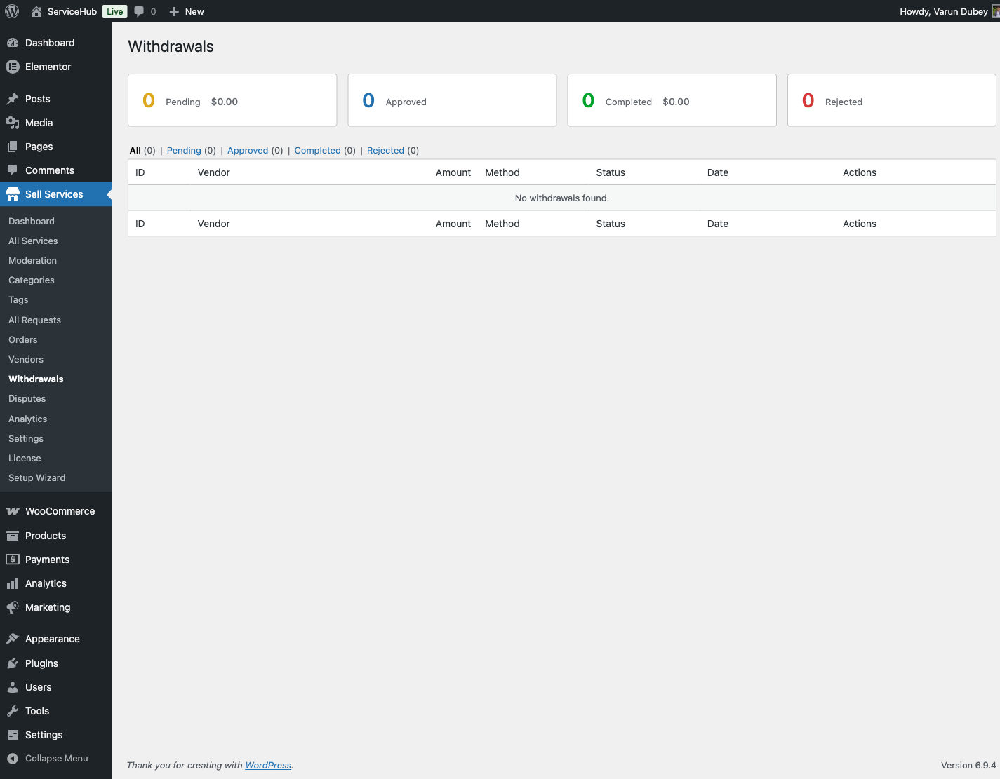

# Earnings & Payouts

Learn how to track your income, understand commission structure, and request withdrawals from your marketplace earnings.

## Understanding Your Earnings

### Earnings Overview

Access your earnings at **Dashboard → Earnings**.


Your earnings dashboard displays:

| Metric | Description |
|--------|-------------|
| **Total Earnings** | All-time gross revenue (before commission) |
| **Pending Earnings** | Money from orders in progress or pending approval |
| **Available Balance** | Cleared funds ready for withdrawal |
| **Withdrawn** | Total amount already paid out to you |
| **This Month** | Current month's earnings |

## Commission Structure

Every order includes a platform commission fee.

### How Commission Works

When a buyer purchases your service:

1. **Order Total**: Full amount buyer paid
2. **Commission Deducted**: Platform fee (set by admin)
3. **Your Net Earnings**: What you receive

**Example**:
```
Order Total:        $100.00
Commission (20%):   -$20.00
Your Earnings:      $80.00
```

### Commission Types

The marketplace may use:

- **Percentage Commission**: Fixed % of order value (e.g., 20%)
- **Flat Commission**: Fixed amount per order (e.g., $5)
- **Hybrid**: Combination of both

Commission rate is set by the site administrator.

### Viewing Commission Details

Each order shows:

- Gross amount (buyer paid)
- Commission amount
- Net earnings (you receive)

View this in **Dashboard → Orders → [Order Details]**.


### Per-Vendor Commission Rates **[PRO]**

Pro marketplaces may offer custom commission rates:

- Negotiated rates for high-volume vendors
- Reduced commission for Pro-level vendors
- Promotional rates for new vendors
- Category-specific commission rates

Contact site admin to inquire about custom rates.

## Earnings Lifecycle

### When You Earn Money

Earnings are added to your account when:

1. **Order Placed**: Earnings become "Pending"
2. **Work Delivered**: Buyer receives your deliverable
3. **Order Approved**: Buyer accepts the work
4. **Clearing Period**: Optional holding period (0-14 days, set by admin)
5. **Available**: Funds ready for withdrawal

### Pending Earnings

Money is "Pending" when:

- Order is in progress
- Deliverable submitted, awaiting buyer approval
- Buyer revision requested
- Clearing period active

Pending earnings cannot be withdrawn yet.

### Available Earnings

Money becomes "Available" when:

- Buyer approved the delivery
- Clearing period completed (if any)
- No disputes or issues with order

You can withdraw available earnings.

### Clearing Period

Some marketplaces hold funds temporarily:

- **Purpose**: Buyer protection, dispute prevention
- **Duration**: Typically 7-14 days after delivery approval
- **Automatic Release**: Funds auto-release after period
- **Dispute Impact**: Clearing period pauses if dispute opened

Check your marketplace's clearing period policy.

## Withdrawal Methods

Request payouts when you have available balance.

### Minimum Withdrawal Amount

Most marketplaces set a minimum:

- Typical minimum: $50-$100
- Prevents excessive small transactions
- Reduces processing fees
- Check your dashboard for specific amount

### Available Withdrawal Methods

Common payout methods:

| Method | Processing Time | Fees | Notes |
|--------|----------------|------|-------|
| **Bank Transfer** | 3-7 business days | Low/None | Requires banking details |
| **PayPal** | 1-3 business days | 2-3% | Requires PayPal account |
| **Wire Transfer** | 1-3 business days | $15-$25 | For large amounts |
| **Check/Mail** | 7-14 business days | $5-$10 | Physical check |

Specific methods vary by marketplace configuration.

### Withdrawal Processing Time

Typical timeline:

1. **Request Submitted**: You request withdrawal
2. **Admin Review**: 1-3 business days
3. **Processing**: Admin approves and processes
4. **Transfer**: Payment sent via chosen method
5. **Receipt**: Funds arrive in your account

Total time: 3-10 business days typically.

## How to Request a Withdrawal

### Step-by-Step Withdrawal

1. Navigate to **Dashboard → Earnings → Withdraw**
2. Verify your available balance
3. Enter withdrawal amount (≥ minimum threshold)
4. Select withdrawal method
5. Enter payment details (if first time)
6. Review withdrawal fee (if any)
7. Confirm request


### Payment Details Required

Depending on method:

**Bank Transfer**:
- Bank name
- Account number
- Routing number
- Account holder name

**PayPal**:
- PayPal email address

**Wire Transfer**:
- Bank name
- SWIFT/BIC code
- IBAN or account number
- Bank address

**Check**:
- Mailing address

### Withdrawal Confirmation

After submission:

- Request appears in **Earnings → Withdrawal History**
- Status shows "Pending"
- Email confirmation sent
- Admin notification triggered

## Tracking Withdrawals

### Withdrawal History

View all withdrawal requests at **Dashboard → Earnings → Withdrawals**.


### Withdrawal Statuses

| Status | Meaning |
|--------|---------|
| **Pending** | Awaiting admin review |
| **Processing** | Approved, payment being sent |
| **Completed** | Payment sent successfully |
| **Rejected** | Request denied (with reason) |
| **Cancelled** | You cancelled the request |

### Cancelling a Withdrawal

Cancel pending withdrawals before admin processes:

1. Go to **Withdrawal History**
2. Find pending withdrawal
3. Click **Cancel**
4. Funds return to available balance

Cannot cancel once status is "Processing".

## Earnings Reports

### Viewing Earnings History

Access detailed earnings at **Dashboard → Earnings → History**.

Filter earnings by:

- Date range
- Order status
- Service
- Amount range

Export options:

- CSV export
- PDF report
- Print view


### Transaction Details

Each transaction shows:

- Date
- Order ID
- Service name
- Buyer name
- Gross amount
- Commission
- Net earnings
- Status

## Wallet Integration **[PRO]**

Pro marketplaces may offer wallet systems.

### Internal Wallet

Built-in wallet feature:

- Store available earnings in wallet
- Use wallet balance to purchase services
- Transfer between wallet and bank
- Instant wallet-to-wallet transfers

### Third-Party Wallet Plugins

Integration with popular wallet plugins:

**TeraWallet**:
- WooCommerce wallet integration
- Cashback and refunds to wallet
- Partial payments with wallet

**WooWallet**:
- Similar to TeraWallet
- Additional payment gateway support

**MyCred**:
- Points-based system
- Gamification features
- Multi-currency support

### Wallet Benefits

Using wallet systems:

- Instant fund availability
- No withdrawal fees for wallet-to-wallet
- Purchase services without external payment
- Buyer refunds to wallet (faster)

## Tax Considerations

### Tax Responsibility

**Important**: You are responsible for reporting marketplace income to tax authorities.

The marketplace:

- Does NOT automatically withhold taxes
- May provide earnings reports for tax purposes
- Is NOT responsible for your tax compliance

### Tax Documents

Some marketplaces provide:

- Annual earnings statements
- Transaction history exports
- 1099 forms (US vendors earning $600+)

Check with your marketplace admin about available tax documents.

### Record Keeping

Maintain records of:

- All earnings and withdrawals
- Commission paid
- Business expenses
- Receipts and invoices

Consult a tax professional for advice specific to your location.

## Fees and Charges

### Platform Commission

- Primary fee: Commission on each order
- Set by marketplace admin
- Disclosed before order acceptance

### Withdrawal Fees

May apply depending on method:

- Bank transfer: Usually free or minimal
- PayPal: 2-3% of withdrawal amount
- Wire transfer: $15-$25 flat fee
- Check: $5-$10 processing fee

### Currency Conversion

If marketplace uses different currency:

- Conversion fees may apply
- Exchange rate at time of withdrawal
- Disclosed before withdrawal confirmation

## Earnings Best Practices

### Maximize Your Income

1. **Complete Orders Promptly**: Faster clearing of earnings
2. **Maintain High Quality**: Reduce refunds and disputes
3. **Avoid Cancellations**: Don't lose committed earnings
4. **Upsell Extras**: Increase average order value
5. **Multiple Services**: Diversify income streams

### Withdrawal Strategies

1. **Batch Withdrawals**: Withdraw larger amounts less frequently
2. **Consider Fees**: Factor in withdrawal fees
3. **Regular Schedule**: Monthly or bi-weekly withdrawals
4. **Emergency Reserve**: Keep some balance available
5. **Tax Planning**: Time withdrawals for tax purposes

### Avoid Earning Issues

1. **Deliver Quality Work**: Prevent refunds
2. **Meet Deadlines**: Avoid late delivery penalties
3. **Clear Communication**: Reduce misunderstandings
4. **Document Everything**: Protect against disputes
5. **Follow Platform Rules**: Avoid account penalties

## Troubleshooting

### Earnings Not Showing

- Check if order is completed/approved
- Verify clearing period hasn't expired yet
- Ensure order wasn't refunded or cancelled
- Contact support with order number

### Withdrawal Request Rejected

Common reasons:

- Below minimum withdrawal amount
- Invalid payment details
- Account verification incomplete
- Pending disputes on account
- Policy violations

Check rejection reason and correct the issue.

### Payment Not Received

If payment seems delayed:

1. Check withdrawal status (may still be processing)
2. Verify payment details are correct
3. Check processing timeframe for your method
4. Contact payment provider (bank, PayPal)
5. Reach out to marketplace support

### Incorrect Earnings Amount

If earnings seem wrong:

- Review order details for commission breakdown
- Check for refunds or cancellations
- Verify clearing period deductions
- Look for admin adjustments (with notes)
- Contact support to investigate

## Advanced Features **[PRO]**

### Earnings Analytics

Pro marketplaces may offer:

- **Revenue Trends**: Visual charts of income over time
- **Service Performance**: Earnings by service comparison
- **Buyer Insights**: Top buyers and spending patterns
- **Forecasting**: Projected future earnings
- **Benchmark Data**: Compare to marketplace averages

### Automated Withdrawals

Set automatic withdrawals:

- Schedule: Weekly, bi-weekly, monthly
- Minimum threshold trigger
- Default payment method
- Automatic processing without manual request

### Multi-Currency Support

Some marketplaces support:

- Multiple payout currencies
- Currency conversion options
- Multi-currency earnings tracking

### Instant Payouts

Premium feature for select vendors:

- Instant withdrawal to linked account
- Higher fees but immediate access
- Requires verification and good standing

## Admin: Processing Withdrawals

This section is for marketplace administrators managing vendor payouts.

### Accessing the Withdrawals Dashboard

Navigate to **WP Sell Services → Withdrawals** in admin panel.



**Dashboard Overview Shows:**

| Metric | Description |
|--------|-------------|
| **Pending** | Requests awaiting review (with total amount) |
| **Approved** | Approved, ready for payment processing |
| **Completed** | Successfully paid withdrawals (with total paid) |
| **Rejected** | Declined requests |

### Viewing Withdrawal Requests

The withdrawal list displays all requests with details:

**Information Shown:**
- Withdrawal ID and date
- Vendor name and email
- Amount requested
- Withdrawal method (Bank, PayPal, Wire, Check)
- Payment details (account info)
- Status (Pending, Approved, Processing, Completed, Rejected)
- Request date
- Action buttons

**Filter Withdrawals:**
- Click status tabs (All, Pending, Approved, Completed, Rejected)
- Sort by date, amount, vendor, or status
- Search by vendor name or withdrawal ID

### Reviewing a Withdrawal Request

Click **View Details** on any withdrawal to see complete information:

1. **Vendor Information:**
   - Vendor name, email, profile link
   - Total available balance
   - Previous withdrawal history
   - Account standing

2. **Withdrawal Details:**
   - Amount requested
   - Withdrawal method selected
   - Payment details (bank account, PayPal email, etc.)
   - Request date
   - Any vendor notes

3. **Earnings Breakdown:**
   - Total earnings (all-time)
   - Available balance
   - Pending balance
   - Already withdrawn amount
   - This withdrawal amount

4. **Validation Checks:**
   - ✓ Meets minimum threshold
   - ✓ Sufficient available balance
   - ✓ Payment details provided
   - ✓ No pending disputes
   - ✓ Account in good standing

### Approving Withdrawals

Process valid withdrawal requests:

1. Click withdrawal to view details
2. Review all information carefully
3. Verify payment details are correct
4. Click **Approve Withdrawal**
5. Confirm approval
6. Status changes to **Approved**
7. Vendor receives approval email

**What Happens After Approval:**
- Withdrawal marked as approved
- Amount deducted from vendor's available balance
- Status changes to **Processing** (or **Approved** until you process payment)
- Ready for payment processing

**Before Approving, Verify:**
- Payment details are complete and accurate
- Amount doesn't exceed available balance
- No active disputes on vendor's account
- Vendor account in good standing
- Withdrawal method is supported

### Rejecting Withdrawals

Decline invalid or problematic requests:

1. Click withdrawal to view details
2. Click **Reject Withdrawal**
3. Select rejection reason:
   - Insufficient balance
   - Invalid payment details
   - Account under review
   - Pending disputes
   - Policy violation
   - Other (specify)
4. Add detailed explanation
5. Click **Confirm Rejection**
6. Status changes to **Rejected**
7. Vendor receives rejection email with reason

**What Happens After Rejection:**
- Amount remains in vendor's available balance
- Vendor can correct issues and resubmit
- Rejection reason recorded in withdrawal history

**Common Rejection Reasons:**
- Bank account number incomplete or invalid
- PayPal email doesn't match vendor email
- Active disputes on account
- Vendor suspended or under investigation
- Below minimum withdrawal amount (shouldn't happen, but verify)

### Processing Payments

After approving, send payment to vendor:

#### For Bank Transfer:

1. Log into your business bank account
2. Initiate transfer using vendor's banking details
3. Complete payment
4. Return to WP Sell Services → Withdrawals
5. Click withdrawal → **Mark as Completed**
6. Enter transaction reference ID
7. (Optional) Upload payment receipt
8. Click **Complete Withdrawal**

#### For PayPal:

1. Log into PayPal business account
2. Send money to vendor's PayPal email
3. Copy PayPal transaction ID
4. Return to admin withdrawals page
5. Click withdrawal → **Mark as Completed**
6. Paste PayPal transaction ID
7. Click **Complete Withdrawal**

#### For Wire Transfer:

1. Contact your bank for international wire
2. Provide vendor's SWIFT/BIC and IBAN
3. Complete wire transfer
4. Note wire reference number
5. Return to admin panel
6. Mark withdrawal as completed with reference

#### For Check/Mail:

1. Write check for withdrawal amount
2. Mail to vendor's registered address
3. Note check number and mail date
4. Mark withdrawal as **Processing**
5. After vendor confirms receipt
6. Mark as **Completed**

### Marking as Completed

After you've sent payment outside WordPress:

1. Go to **WP Sell Services → Withdrawals**
2. Find the approved withdrawal
3. Click **Mark as Completed**
4. Fill in payment confirmation:
   - Transaction/Reference ID
   - Payment date
   - Payment method used
   - (Optional) Upload receipt/screenshot
   - (Optional) Add admin note
5. Click **Complete Withdrawal**
6. Status changes to **Completed**
7. Vendor receives payment confirmation email

**Details to Record:**
- Exact date payment sent
- Transaction ID from bank/PayPal/wire
- Any fees deducted
- Expected arrival date
- Notes for future reference

### Auto-Withdrawals (Automated Schedule)

Set up automatic withdrawal processing for trusted vendors.

**How Auto-Withdrawals Work:**

1. **Vendor Enables Auto-Withdrawal** (in their dashboard)
2. **Sets Schedule:** Weekly, Bi-weekly, or Monthly
3. **Sets Minimum Threshold:** Only withdraw if balance ≥ amount
4. **Sets Payment Method:** Default method for auto-withdrawals
5. **System Checks Schedule:** Runs on configured day/time
6. **Creates Withdrawal:** If threshold met, auto-creates request
7. **Admin Reviews:** You still approve/process manually (or approve automatically if configured)

**Admin Configuration:**

1. Go to **Settings → Earnings → Auto-Withdrawals**
2. Enable feature (disabled by default)
3. Choose approval method:
   - **Manual Approval Required** (safer, you review each)
   - **Auto-Approve for Trusted Vendors** (requires criteria)
4. Set trust criteria for auto-approval:
   - Minimum orders completed (e.g., 50+)
   - Minimum rating (e.g., 4.5+)
   - Account age (e.g., 6+ months)
   - No disputes in last 90 days
5. Configure schedule:
   - Weekly: Choose day of week
   - Bi-weekly: Choose two days per month
   - Monthly: Choose day of month
6. Set processing day (when you'll batch-process payments)

**Benefits:**
- Reduces manual withdrawal requests
- Vendors get predictable payout schedule
- Easier to batch-process payments
- Less admin time managing withdrawals

**Viewing Auto-Withdrawal Schedule:**
- See all vendors with auto-withdrawals enabled
- View next scheduled withdrawal date
- Preview upcoming auto-withdrawals
- Disable for individual vendors if needed

### Withdrawal Reports and History

Track all withdrawal activity and generate reports.

**Withdrawal History:**

View complete history with filters:
- Date range (this week, month, quarter, year, custom)
- Status (all, pending, completed, etc.)
- Vendor (specific vendor or all)
- Method (bank, PayPal, wire, check)
- Amount range

**Export Reports:**

1. Go to **Withdrawals → Reports**
2. Choose report type:
   - All withdrawals summary
   - Completed withdrawals (for accounting)
   - Pending/approved (need processing)
   - By vendor (individual vendor report)
3. Select date range
4. Click **Export**
5. Choose format (CSV, PDF, Excel)
6. Download report

**Report Includes:**
- Withdrawal ID and date
- Vendor name and email
- Amount withdrawn
- Method and payment details
- Transaction reference
- Processing date
- Status
- Admin who processed
- Notes

**Accounting Integration:**

Export withdrawal data for bookkeeping:
- Monthly payout summary
- Vendor 1099 reporting (US)
- Tax documentation
- Cash flow reports
- Vendor payment ledger

### Withdrawal Settings

Configure withdrawal policies and limits.

**Configure in Settings → Earnings:**

| Setting | Description | Recommended |
|---------|-------------|-------------|
| **Minimum Withdrawal** | Minimum amount vendors can request | $50-$100 |
| **Maximum Withdrawal** | Maximum per request (security) | $10,000 or unlimited |
| **Processing Days** | How long admin takes to review | 1-3 business days |
| **Available Methods** | Enable/disable withdrawal methods | Enable what you can process |
| **Auto-Approval Threshold** | Auto-approve under this amount | $500 or disabled |
| **Withdrawal Fees** | Charge vendors for processing | 0-3% or flat fee |
| **Monthly Limit** | Max withdrawals per vendor per month | 2-4 or unlimited |

**Method-Specific Settings:**

**Bank Transfer:**
- Required fields (bank name, account, routing)
- Supported countries
- Processing time (3-7 days)
- Fees (if any)

**PayPal:**
- Require verified PayPal account
- Fee structure (2-3%)
- Processing time (1-3 days)
- Currency conversion

**Wire Transfer:**
- Minimum amount (due to high fees)
- Required fields (SWIFT, IBAN)
- Processing time
- Fixed fee ($15-$25)

**Check/Mail:**
- Enable/disable
- Processing time (7-14 days)
- Check fee ($5-$10)
- Address verification required

### Troubleshooting Withdrawal Issues

#### Withdrawal Request Won't Process

**Check:**
- Vendor has sufficient available balance
- Payment details are complete
- No active disputes on vendor account
- Withdrawal method is enabled
- No pending payment holds

**Solution:**
- Review vendor's earnings tab
- Verify balance calculations
- Clear any disputes first
- Request updated payment info

#### Vendor Says Payment Not Received

**Steps:**
1. Check withdrawal status (should be "Completed")
2. Verify transaction ID in withdrawal details
3. Check payment date (may still be in transit)
4. Confirm payment method used
5. Provide transaction reference to vendor
6. Contact payment provider if necessary

**Bank Transfer:**
- 3-7 days typical
- Check for bank holidays
- Verify account details match

**PayPal:**
- Usually instant to 24 hours
- Check for PayPal account issues
- Verify email is correct

#### Duplicate Withdrawal Requests

**Cause:** Vendor submitted twice

**Solution:**
1. Review both requests
2. Approve only one
3. Reject duplicate with note
4. Merge if accidentally processed both

#### Vendor Disputes Rejection

**Steps:**
1. Review rejection reason
2. Check if issue is now resolved
3. If valid, ask vendor to resubmit
4. If error, reverse rejection:
   - Create new manual withdrawal entry
   - Approve immediately
   - Add note explaining correction

### Best Practices for Processing Withdrawals

**Daily Tasks:**
1. Check pending withdrawals
2. Review new requests (approve/reject within 24 hours)
3. Respond to vendor inquiries

**Weekly Tasks:**
1. Process approved withdrawals (batch payments)
2. Mark completed withdrawals
3. Follow up on delayed payments

**Monthly Tasks:**
1. Generate withdrawal reports
2. Reconcile with accounting
3. Review withdrawal policies
4. Analyze withdrawal patterns

**Tips for Efficiency:**
- Set specific days for processing (e.g., Tuesdays and Fridays)
- Batch process same payment methods together
- Use templates for common rejection reasons
- Keep transaction references organized
- Maintain payment confirmation documentation

**Security Practices:**
- Verify large withdrawals carefully
- Watch for unusual patterns (sudden large requests)
- Require two-factor authentication for approvals
- Keep audit trail of all actions
- Regular vendor account reviews

## Related Resources

- [Understanding commission rates](../getting-started/pricing-commission.md)
- [Managing your orders](../orders/order-management.md)
- [Vendor dashboard overview](vendor-dashboard.md)
- [Preventing disputes](../disputes-resolution/opening-a-dispute.md)
